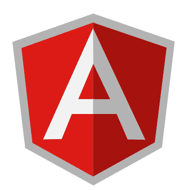

# Angular 组件:Angular 的积木是什么？

> 原文：<https://www.edureka.co/blog/angular-components/>

Angular 带来了一场开发者如何看待前端开发的革命。它成功地模块化了单个页面应用程序的整个构建过程。由于使用了角形部件，这成为可能。在本文中，我们将通过例子*来了解 angular 的构建模块。*本文将讨论以下主题:

*   [什么是棱角分明？](#what-is-angular)
*   [什么是角分量？](#what-is-an-angular-component)
*   [如何创建组件？](#how-to-create-a-component)
*   [一种成分的组成](#constituents-of-a-component)

## **什么是角度？**

 Angular 是一个前端开发框架。它最初以 *AngularJS* 的名字发行，但很快就更名为 just*“Angular”。* Angular 是一个基于 [TypeScript](https://www.edureka.co/blog/typescript-vs-javascript/#whatistypescript) 的框架。它用于创建单页 web 应用程序。如果你不知道什么是单页 web 应用，你可以看看我们的，[什么是有角的？](https://www.edureka.co/blog/what-is-angular-getting-started-with-angular/#webapplicationvssinglepageapplication)‘博客。Angular 是由谷歌的一组开发人员开发的。在公开发布之后，谷歌也一直负责推出定期更新。Angular 目前是第八个版本，主要发布了关于 *HTTP 模块*以及 *BAZEL* 和 *IVY* 将如何集成到 Angular 中的变化。

关于 [Angular](https://www.edureka.co/blog/angular-tutorial/) 已经说得够多了，让我们来解决房间里的大象，即角形组件。

## **什么是角分量？**

简单地说，组件是任何角度应用程序的构建块。

 Gmail 是用 Angular 制作的，所以这是展示组件的一个很好的例子。想一想我作为一个单独的组件标记出来的每个部分。每个组件只是它自己的 [* HTML *](https://www.edureka.co/blog/what-is-html/) 、 *[ CSS ](https://www.edureka.co/blog/what-is-css/)* 和 *TypeScript* 的捆绑。通过使用组件，可以将整个页面分解成更简单的部分，这些部分可以单独编码，以后再集成。

有了组件的使用，开发者也更接近于 *DRY* 协议。组件一旦创建，就可以根据需要多次使用，因此减少了编码时间，也不需要编写重复的代码。现在你对角度组件有了一个大致的概念，让我们学习如何创建它们。

## **如何创建组件？**

有两种方法可以创建组件

*   [**使用 CLI**](#CLI)
*   **[手动](#manually)**

### **使用 CLI 创建组件**

使用 CLI 创建组件非常简单明了。这是你大部分时间都会用到的方法。要创建名为 server 的组件，可以使用以下命令:

```

ng generate component server

```

上述命令也可以写成:

```

ng g c server

```

您还可以指定要在以下位置创建的组件的路径:

```

ng g c server-folder/server

```

上面的任何命令都会创建一个名为 server 的组件。因为它是通过 angular CLI 创建的，所以导入和声明都是自动完成的。如果您出于某种原因希望手动创建组件，情况会有所不同。让我们看看如何手动创建这些文件。

### **手动创建组件**

在本节中，我们将手动创建服务器组件。

**第一步:**在 *app/src 下的项目中创建一个名为 *server* 的文件夹。*

第二步:在这个文件夹里新建一个名为【server.component.html 的文件。我们以这种方式命名它，以便我们非常清楚我们正在创建的文件。

第三步:用适当的代码填写你的 [HTML 文件](https://www.edureka.co/blog/what-is-html/)。对于本例，我们只需粘贴以下内容:

```

<h3>You are currently viewing the server component</h3>

```

**第四步:**现在创建一个[的打字稿文件](https://www.edureka.co/blog/typescript-vs-javascript/#howtousetypescript)。右键单击文件夹并创建一个新文件。命名它—*服务器.组件. ts.*

步骤 5: 为你的组件创建 CSS 文件。命名它—*server . component . CSS*

步骤 6: 在您的 TypeScript 文件中，您将定义组件的业务逻辑。除此之外，组件的元数据也在这里定义。

```

import { Component } from '@angular/core';

@Component ({

selector: 'app-server',

templateUrl: './server.component.html',

styleUrl: [ './server.component.css' ]
})

export class ServerComponent {}

```

在第一行代码中，我们从*核心角度库*导入组件。然后，我们使用组件装饰器定义组件的元数据。在元数据中，我们首先定义选择器，这里是*应用服务器。*要使用这个组件，我们必须在 HTML 文件中使用*<app-server></app-server>*标签。templateUrl 告诉 Angular 在哪里寻找 app-server 的内容，类似地，stylesUrl 告诉我们特定组件的样式。

最后，我们导出了类 ServerComponent，这样我们就可以在项目的其他部分使用该组件。在类中，您可以定义您认为适合您的组件的逻辑。 **第 7 步:**我们已经完成了组件的创建，但是我们仍然需要通知 TypeScript 和 Angular 我们已经创建的这个新组件。转到应用程序模块文件。文件名应该是 *app.module.ts.* 在这个文件中你会发现一个*声明*数组。向声明中添加 ServerComponent。之后，导入组件。

```

import { ServerComponent } from './server.component'

```

## **一种成分的组成**

一个组件有 3 个主文件。

*   在你的 HTML 文件中，你定义了组件的视图结构。
*   在你的 CSS 文件中，你定义了属于你的组件的样式。
*   **TypeScript**–在您的 TypeScript 文件中，您为您的组件定义元数据和业务逻辑。

这三个锉刀在一起工作时，组成了一个有角度的部分。

这就把我们带到了“**角形组件**篇”的结尾。我希望这篇文章是信息丰富的，并增加了你的价值。现在，您必须清楚角度组件的基础知识以及如何创建它们。我会推荐你通过这个 *Angular 教程* [*Edureka 视频播放列表*](https://www.youtube.com/playlist?list=PL9ooVrP1hQOFyAdwmvyPgFlbiBKiDoTa_) 观看视频，学习如何创建一个 Angular 应用。

*如果您希望了解更多关于 Angular framework 的知识，请查看我们的 **[Angular 课程](https://www.edureka.co/angular-training)** ，该课程包含讲师指导的现场培训和真实项目体验。这个训练将帮助你深入了解 Angular，并帮助你掌握这个主题。*

有问题要问我们吗？请在“**角部件**的评论区提及，我会回复你。