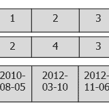

# 阿帕奇卡桑德拉优势

> 原文：<https://www.edureka.co/blog/apache-cassandra-advantages/>

随着 NoSQL 数据库的急剧增长，一些组织正在从传统数据库过渡到开源、分布式和高性能的数据库，如“**卡珊德拉**”。自从 2008 年由 Prashant Malik 和 Avinash Lakshman 在脸书 T4 发起以来，Cassandra 已经成为 Apache 最受欢迎的项目之一。为什么不呢？凭借提供近乎实时性能的独特能力，Cassandra 使 Web 开发人员、软件工程师和数据分析师的生活比在传统 RDBMS 公司中轻松得多。Cassandra 在大数据行业创造的奇迹是惊人的！

让我们看看 Cassandra 的一些优势，以及为什么像脸书、易贝、Reddit、Twitter、网飞、IBM 和其他一些公司都在使用 Cassandra？

## **阿帕奇卡珊德拉优点:**

**1。开源**

Cassandra 是 Apache 的开源项目，这意味着它是免费的！是的，您可以下载该应用程序并以您想要的方式使用。事实上，它的开源性质已经催生了一个巨大的 Cassandra 社区，志同道合的人可以在这里分享他们关于大数据的观点、疑问和建议。此外，Cassandra 可以与其他 Apache 开源项目集成，如 Hadoop(借助 MapReduce)、Apache Pig 和 Apache Hive。

**2。** **点对点架构:**

Cassandra 遵循点对点架构，而不是主从架构。因此，在《卡桑德拉》中没有单一的失败点。此外，可以向任何数据中心的任何 Cassandra 集群添加任意数量的服务器/节点。由于所有的机器都处于同等水平，任何服务器都可以处理任何客户端的请求。毫无疑问，凭借其健壮的体系结构和卓越的特性，Cassandra 将标准提高到了其他数据库之上。

**3。** **弹性伸缩:**

使用 Cassandra 的最大优势之一就是它的弹性伸缩性。Cassandra 集群可以很容易地放大或缩小。有趣的是，在 Cassandra 集群中可以添加或删除任意数量的节点，而不会造成太大的干扰。在扩展或缩减时，您不必重启集群或更改与 Cassandra 应用程序相关的查询。这就是 Cassandra 因拥有最高数量节点的高吞吐量而广受欢迎的原因。随着扩展的进行，读取和写入吞吐量同时增加，应用程序不会停机或暂停。

#### **4。高可用性和容错:**

Cassandra 的另一个显著特点是数据复制，这使得 Cassandra 具有高可用性和容错性。复制意味着每个数据存储在多个位置。这是因为，即使一个节点出现故障，用户也应该能够轻松地从另一个位置检索数据。在 Cassandra 集群中，每一行都基于行键进行复制。您可以设置想要创建的副本数量。就像扩展一样，数据复制也可以跨多个数据中心进行。这进一步提高了 Cassandra 的备份和恢复能力。

#### **5。高性能:**

开发 Cassandra 背后的基本想法是利用几个多核机器的隐藏功能。卡珊德拉实现了这个梦想！Cassandra 在大量数据下展现了出色的表现。因此，Cassandra 深受那些每天处理大量数据，同时又不能丢失这些数据的组织的喜爱。

#### **6。列导向:**

Cassandra 有一个非常高级的数据模型，这是面向列的。这意味着，Cassandra 基于列名存储列，从而导致非常快速的切片。与传统数据库不同，在传统数据库中，列名只包含元数据，而在 Cassandra 中，列名也可以包含实际数据。因此，Cassandra 行可以包含大量的列，而关系数据库只包含少量的列。Cassandra 拥有丰富的数据模型。

#### **7。可调一致性:**

可调一致性等特性使 Cassandra 成为无与伦比的数据库。在 Cassandra 中，一致性有两种类型——最终一致性和强一致性。根据您的需求，您可以采用其中的任何一种。最终一致性可确保群集接受写入后，客户端立即获得批准。然而，强一致性意味着任何更新都被广播到特定数据所在的所有机器或所有节点。你也有混合最终一致性和强烈一致性的自由。例如，如果远程数据中心的延迟很高，您可以选择最终一致性，如果本地数据中心的延迟很低，您可以选择强一致性。

**8。无模式:**

自创建以来，Cassandra 就以其列家族中的无模式/无模式数据库而闻名。在 Cassandra 中，可以在行内随意创建列。Cassandra 数据模型也以可选模式数据模型而闻名。与传统数据库相比，在 Cassandra 中，不需要在表面上显示应用程序所需的所有列，因为每一行都不需要有相同的列集。要了解更多，今天就获得你的 [Apache Cassandra 认证](https://www.edureka.co/cassandra)。

正是由于上述原因，Cassandra 在几家公司中需求量很大，MySQL 正在被 NoSQL 数据库取代。最初为解决脸书收件箱搜索问题而创建的数据库，在解决大数据问题方面取得了长足的进步。如今，Cassandra 广泛应用于各种应用中，无论是流式视频还是支持各种业务部门或生产应用。

Cassandra 是当今的大数据解决方案！

**相关帖子:**

[选择合适的 NoSQL 数据库](https://www.edureka.co/blog/choosing-the-right-nosql-database/ "Choosing the Right NoSQL Database")

[为什么要用 Hadoop 学习 Cassandra？](https://www.edureka.co/blog/why-learn-cassandra-with-hadoop/ "Why Learn Cassandra with Hadoop??")