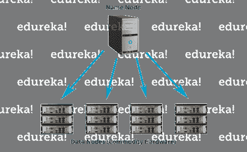
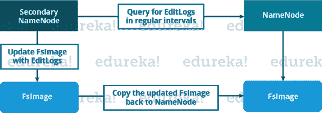
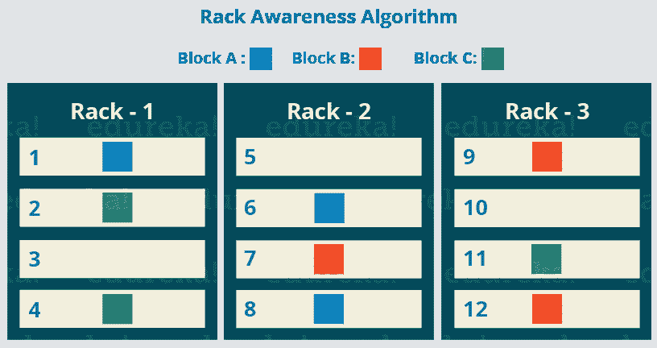
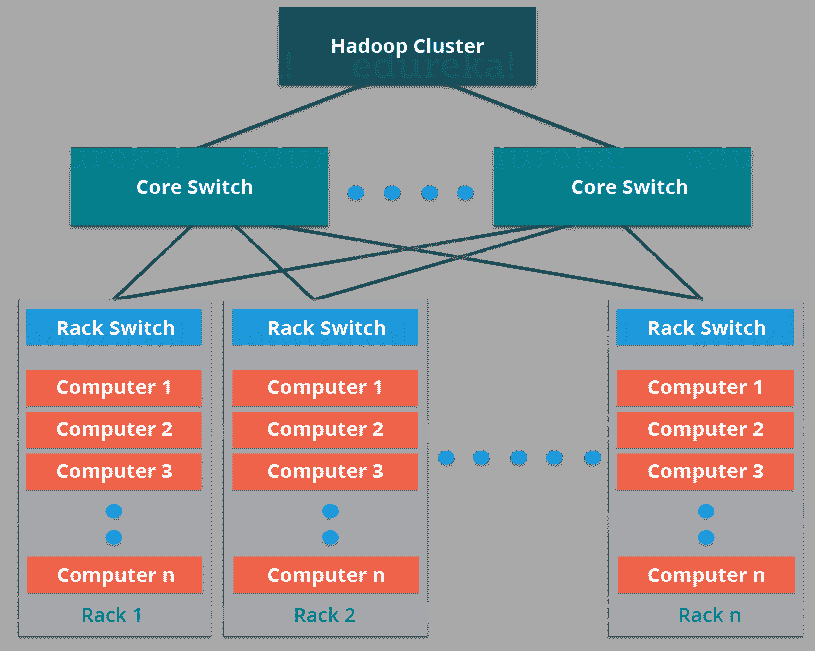
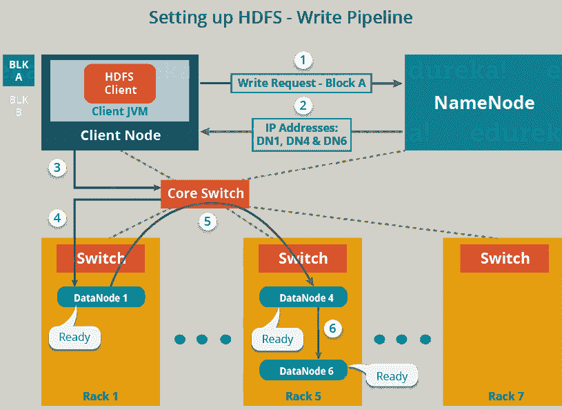
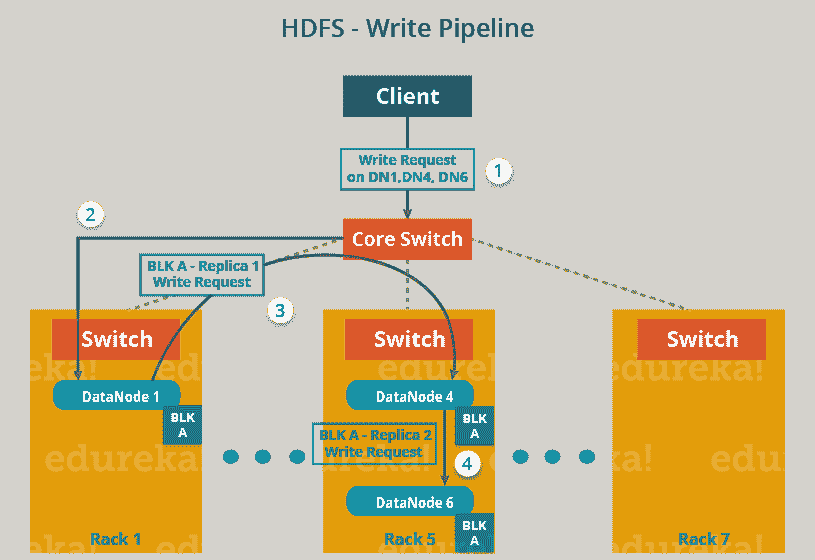
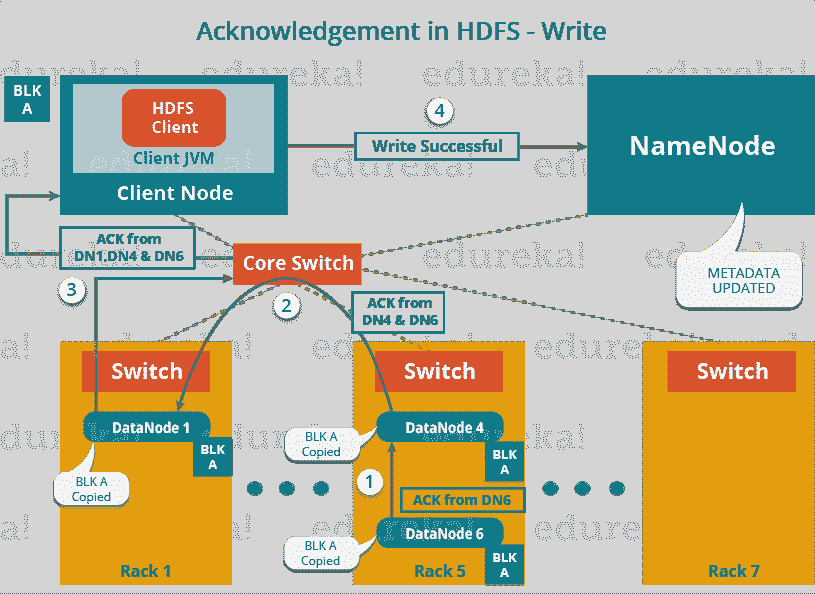
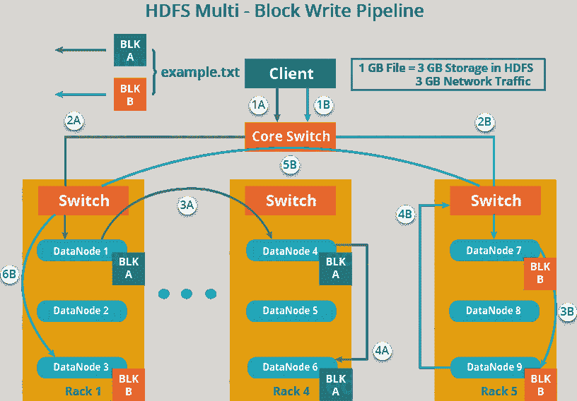

# Apache Hadoop HDFS 架构

> 原文：<https://www.edureka.co/blog/apache-hadoop-hdfs-architecture/>

## **阿帕奇 Hadoop HDFS**T5**架构**

## **简介:**

在这篇博客中，我将谈论 Apache Hadoop HDFS 架构。 HDFS &纱是 [***Hadoop 认证***](https://www.edureka.co/big-data-hadoop-training-certification) 需要掌握的两个重要概念。Y 您知道 HDFS 是一个部署在低成本商用硬件上的分布式文件系统。因此， 是时候让我们深入了解 Apache Hadoop HDFS 架构并释放其魅力了。

本博客中关于 Apache Hadoop HDFS 架构的主题如下:

*   [**HDFS 主/从拓扑**](#hdfs_architecture)
*   **[NameNode](#namenode)[DataNode](#datanode)和[次要 NameNode](#secondary_namenode)**
*   [**什么是积木？**](#hdfs_block)
*   **[复制管理](#replication_management)T5**
*   [**架觉**](#rack_awareness)
*   [**HDFS 读/写——幕后**](#hdfs_read_or_write_architecture)

## **HDFS 建筑:**

**阿帕奇 HDFS** 或 **Hadoop 分布式文件系统**是一个块结构的文件系统，其中每个文件都被分成预定大小的块。这些块存储在一个或几个机器的集群中。Apache Hadoop HDFS 架构遵循*主/从架构*，其中一个集群由一个 NameNode(主节点)组成，所有其他节点都是 DataNodes(从节点)。HDFS 可以部署在支持 Java 的各种机器上。虽然可以在一台机器上运行多个 datanode，但是在现实世界中，这些 datanode 分布在不同的机器上。

## **NameNode:**

NameNode 是 Apache Hadoop HDFS 架构中的主节点，负责维护和管理 DataNodes(从节点)上的数据块。 NameNode 是一个高度可用的服务器，它管理文件系统命名空间并控制客户端对文件的访问。我将在下一篇博客中讨论 Apache Hadoop HDFS 的高可用性特性。HDFS 架构的构建方式使得用户数据永远不会驻留在 NameNode 上。数据仅驻留在 DataNodes 上。

### *NameNode 的功能:*

*   主守护进程维护和管理数据节点(从节点)
*   记录集群中存储的所有文件的元数据，如存储块的位置、 文件的大小、权限、层次等。有两个文件与元数据相关:
    *   **FsImage:** 它包含了从 NameNode 开始的文件系统命名空间的完整状态。
    *   **EditLogs:** 它包含所有最近对文件系统进行的修改，这些修改与最近的 FsImage 有关。
*   它记录了文件系统元数据发生的每一次变化。例如，如果在 HDFS 删除了一个文件，NameNode 会立即在编辑日志中记录下来。
*   它定期从集群中的所有数据节点接收心跳和数据块报告，以确保数据节点处于活动状态。
*   它记录了 HDFS 的所有数据块以及这些数据块所在的节点。
*   NameNode 还负责管理的**因子** 所有模块的【】复制，我们将在后面的 HDFS 教程博客中详细讨论。
*   在**DataNode 故障**的情况下，NameNode 为新副本选择新的 DataNode， 平衡 磁盘使用并管理到 DataNode 的通信流量。

从 [Hadoop 管理课程](https://www.edureka.co/hadoop-administration-training-certification)中了解 Namenode、Datanode 和 Secondary Namenode 的各种属性。

## **DataNode:**

数据节点是 HDFS 中的从节点。与 NameNode 不同，DataNode 是一种商用硬件，也就是说，它不是一个高质量或高可用性的廉价系统。DataNode 是一个块服务器，它将数据存储在本地文件 ext3 或 ext4 中。

### *DataNode 的功能:*

*   这些是运行在每个从属机器上的从属守护进程或进程。
*   实际数据存储在 DataNodes 上。
*   数据节点执行来自文件系统客户端的低级读写请求。
*   他们定期向 NameNode 发送心跳，以报告 HDFS 的整体健康状况，默认情况下，此频率设置为 3 秒。

到目前为止，你一定已经意识到 NameNode 对我们非常重要。如果失败了，我们就完了。但是不要担心，我们将在下一篇 Apache Hadoop HDFS 架构博客中讨论 Hadoop 如何解决这个单点故障问题。所以，现在放松一下，让我们一步一步来。

从 [数据工程师认证](https://www.edureka.co/microsoft-azure-data-engineering-certification-course) 了解更多大数据及其应用。

## **次要命名节点:**

除了这两个守护进程之外，还有第三个守护进程，称为辅助 NameNode。辅助 NameNode 作为**助手守护进程与主 NameNode 同时工作。**不要混淆了第二个 NameNode 是**备份 NameNode，因为它不是。**

### *次 NameNode 的功能:*

*   次 NameNode 是一个不断从 NameNode 的 RAM 中读取所有文件系统和元数据并将其写入硬盘或文件系统的节点。
*   它负责将编辑日志与来自 NameNode 的 FsImage 组合在一起。
*   它定期从 NameNode 下载编辑日志并应用于 FsImage。新的 FsImage 被复制回 NameNode，下次启动 NameNode 时会用到它。

因此，二级名称节点在 HDFS 执行定期检查。因此，它也被称为 CheckpointNode。

## **街区:**

现在， 作为 我们知道，HDFS 的数据是以块的形式分散在 DataNodes 中的。**我们来看看什么是拦网，它是如何形成的？**

块是硬盘上存储数据的最小连续位置。一般来说，在任何文件系统中，数据都是作为块的集合来存储的。类似地，HDFS 将每个文件存储为分散在 Apache Hadoop 集群中的块。Apache Hadoop 2 中每个块的默认大小是 128 MB。x(Apache Hadoop 1中的 64 MB。x ，您可以根据自己的需求进行配置。

![HDFS ARCHITECTURE – HDFS TUTORIAL Introduction In this blog, we are going to talk about HDFS Architecture. From my previous blog, we already know that HDFS is a distributed file system which is deployed on low cost commodity hardware. I discussed many of its features too. So, its high time that we take a deep dive into Apache Hadoop HDFS Architecture and unlock its beauty. The topics that will be covered in this blog are as follows: • HDFS Master/Slave Topology • NameNode and DataNode • What is a block • Replication Management • Rack Awareness • HDFS Read/Write – Behind the scenes HDFS Architecture HDFS or Hadoop Distributed File System is a block-structured file system where each file is divided into blocks of a pre-determined size. These blocks are stored across a cluster of one or several machines. Apache Hadoop HDFS Architecture follows a Master/Slave Architecture, where a cluster comprises of a single NameNode (Master node) and all the other nodes are DataNodes (Slave nodes). HDFS is based on Java programming language, due to which HDFS can be deployed on broad spectrum of machines that support Java. Though one can run several DataNodes on a single machine, but in practical world, these DataNodes are spread across various machines. NameNode and DataNode NameNode: NameNode is the master of HDFS that maintains and manages the blocks present on the DataNodes (slave nodes). Think of the NameNode as a Lamborghini in midst of various other cars. Thus, like a Lamborghini, NameNode is a very highly available server that manages the File System Namespace and controls access to files by clients. I will be discussing this High Availability feature of Apache Hadoop HDFS in my next blog. The HDFS architecture is built in such a way that the user data is never stored in the NameNode. The data resides on DataNodes only. Functions of NameNode: • It is the master daemon that maintains and manages the DataNodes (slave nodes) • It records the metadata of all the files stored in the cluster, e.g. location of blocks stored, size of the files, permissions, hierarchy, etc. There are two files associated with metadata: o FsImage: An image of the file system on starting the NameNode. o EditLogs: A series of modifications done to the file system after starting the NameNode. • It records each change that takes place to the file system metadata. For example, if a file is deleted in HDFS, the NameNode will immediately record this in the EditLog. • It regularly receives a Heartbeat and a block report from all the DataNodes in the cluster to ensure that the DataNodes are live. • It keeps a record of all the blocks in HDFS and in which nodes these blocks are located. • The NameNode is also responsible to take care of the replication factor of all the blocks which we will discuss in detail later in this HDFS tutorial blog. • In case of a DataNode failure, the NameNode chooses new DataNodes for new replicas, balances disk usage and manages the communication traffic to the DataNodes. DataNode: DataNodes are the slave nodes in HDFS, just like any average car in front of a Lamborghini! Unlike NameNode, DataNode is a commodity hardware, that is, a non-expensive system which is not of high quality or high-availability. DataNode is a block server that stores the data in the local file ext3 or ext4\. Functions of DataNode: • These are slave daemons or process which runs on each slave machine. • The actual data is stored on DataNodes. • DataNodes perform the low-level read and write requests from the file system’s clients. • They send heartbeats to the NameNode periodically to report the overall health of HDFS, by default, this frequency is set to 3 seconds. So, till now, you folks must have realized that the NameNode is pretty much important to us. If it fails, we are doomed. But don’t worry, we will be talking about how Hadoop solved this single point of failure problem in the next HDFS tutorial blog. So, just relax for now and let’s take one step at a time. Secondary NameNode Apart from these two daemons there is a third daemon or process called Secondary NameNode. The Secondary NameNode works concurrently with the primary NameNode as a helper daemon. And don’t confuse Secondary NameNode as a backup NameNode because it is not. Functions of Secondary NameNode: • The Secondary NameNode is one which constantly reads all the file systems and metadata from the RAM of the NameNode and writes it into the hard disk or the file system. • It is responsible for combining the EditLogs with FsImage from the NameNode. • It downloads the EditLogs from the NameNode at regular intervals and applies to FsImage. The new FsImage is copied back to the NameNode, which is used whenever the NameNode is started the next time. Hence, Secondary NameNode just performs regular checkpoints in HDFS. Therefore, it is also called CheckpointNode. Blocks Now as we know that the data in HDFS is scattered across the DataNodes as blocks. Let’s have a look on what is a block and how is it formed? Blocks are the nothing but smallest continuous location in your hard drive where data is stored. In general, in any of the File System the data are stored as collection of blocks. Similarly, HDFS stores each file as blocks which is scattered throughout the Apache Hadoop cluster. The default size of each block is 128MB in Apache Hadoop 2.x (64 MB in Apache Hadoop 1.x) which you can configure as per your requirement. It is not necessary that in HDFS, each file is stored in exact multiple of the configured block size (128MB, 256MB etc.). Let’s take an example where I have a file “example.txt” of size 514MB as shown in above figure. Suppose, we are using the default block size configuration which is 128Mb. So, how many blocks will be created? 5, Right. First four blocks will be of 128 MB. But, the last block will be of 2 MB size only. Now you must be thinking why we need to have such a huge blocks size i.e. 128MB? Well, whenever we talk about HDFS, we talk about huge data sets i.e. terabytes and petabytes of data. So, if we had a block size of let’s say 4KB as in Linux file system, we would be having too many of blocks and therefore too much of metadata. So, managing these no. of blocks and metadata will create huge overhead which is something, we don’t want. As you understood what a block is, lets understand how these blocks are places in the next section. Replication Management and Rack Awareness Replication Management: HDFS provides a reliable way to store huge data in a distributed environment as data blocks. The blocks are also replicated to provide fault tolerance. The default replication factor is 3 which is again configurable. So, if you want to store a file of 1GB in your HDFS, you will be consuming a space of 3GB (replication factor src=](img/75ac6050a8ab142d6ad7690ae8a5fa50.png)

在 HDFS，每个文件不必存储为配置块大小的整数倍(128 MB、256 MB 等)。).让我们举一个例子，我有一个大小为 514 MB 的文件“example.txt ”,如上图所示。假设我们使用块大小的默认配置，其中 是 128 MB。然后，将创建多少个块？5，对。第 f 前四个块将是的128 MB。但是，最后一个块的大小只有 2 MB。

**现在，你一定在想为什么我们需要这么大的块，比如 128 MB？**

嗯，每当我们谈到 HDFS 时，我们都会谈到巨大的数据集，即万亿字节和千兆字节的数据。因此，如果我们的块大小为 4 KB，就像在 Linux 文件系统中一样，我们将拥有太多的块，因此也就拥有太多的元数据。所以，管理这些块的号和元数据会产生巨大的开销、，这是我们不想要的。

*正如您所理解的**什么是数据块**，让我们了解这些数据块的复制如何在 HDFS 架构的下一部分中发生。同时 ，你可以看看这个关于 HDFS 建筑的视频教程，里面详细讨论了所有的 HDFS 建筑概念:*

## **HDFS 建筑教程视频|爱德华卡**

[//www.youtube.com/embed/m9v9lky3zcE?rel=0&showinfo=0](//www.youtube.com/embed/m9v9lky3zcE?rel=0&showinfo=0)

## **复制管理:**

HDFS 提供了一种可靠的方法来将分布式环境中的大量数据存储为数据块。这些数据块也被复制以提供容错能力。默认的复制因子是 3，这也是可配置的。因此，如下图所示，每个数据块被复制三次，并存储在不同的数据节点上(考虑默认的复制因子):

因此，如果您使用默认配置在 HDFS 存储一个 128 MB 的文件，您将最终占用 384 MB (3*128 MB)的空间，因为这些块将被复制三次，并且每个副本将驻留在不同的 DataNode 上。

***注:***NameNode 定期从 DataNode 收集块报告，以维护复制因子。因此，每当数据块被过度复制或复制不足时，NameNode 会根据需要删除或添加副本。

## **架觉:**

不管怎样，接下来，让我们更多地讨论 HDFS 如何放置复制品以及什么是机架感知？同样，NameNode 还确保所有副本不会存储在同一个机架或单个机架上。它遵循内置的机架感知算法，以减少延迟并提供容错能力。考虑到复制因子为 3，机架感知算法认为数据块的第一个副本将存储在本地机架上，接下来的两个副本将存储在不同的(远程)机架上，但存储在该(远程)机架内的不同 DataNode 上，如上图所示。如果您有多个副本，其余的副本将放置在随机的 DataNodes 上，前提是如果可能的话，同一机架上的副本不超过两个。你甚至可以通过新加坡 [Azure 数据工程课程](https://www.edureka.co/microsoft-azure-data-engineering-certification-course-singapore) 了解大数据的细节。

这是实际的 Hadoop 生产集群的样子。这里，您有多个装有 DataNodes 的机架:

### 机架感知的优势:

所以，现在你会想为什么我们需要一个机架感知算法？原因是:

*   **为了提高网络性能:**位于不同机架上的节点之间的通信通过交换机进行定向。一般来说，您会发现同一个机架中的机器之间的网络带宽比不同机架中的机器之间的带宽*更大。因此，机架感知有助于减少不同机架之间的写入流量，从而提供更好的写入性能。此外，您将获得更高的读取性能，因为您使用了多个机架的带宽。*

*   **防止数据丢失:**即使由于交换机故障或电源故障导致整个机架出现故障，我们也不必担心数据丢失。而且你想想也有道理，就像是说*永远不要把所有的鸡蛋放在同一个篮子里。*

## **HDFS 读/写建筑:**

现在我们来谈谈如何在 HDFS 上执行数据读/写操作。HDFS 遵循一写多读的哲学。因此，你不能编辑已经存储在 HDFS 的文件。但是，您可以通过重新打开文件来追加新数据。从钦奈的 [Hadoop 管理培训中更好地了解 Hadoop 集群、节点和架构。](https://www.edureka.co/hadoop-administration-training-certification-chennai)

## **HDFS 写建筑:**

假设一个 HDFS 客户想要写一个名为“example.txt”的大小为 248 MB 的文件。

假设系统块大小配置为 128 MB(默认)。因此，客户端会将文件“example.txt”分成两个块，一个 128 MB(块 A ),另一个 120 MB(块 B)。

现在，每当数据被写入 HDFS 时，将遵循以下协议:

*   首先，HDFS 客户端将向 NameNode 发出针对两个数据块的写请求，比如数据块 A &数据块 b。
*   然后，NameNode 将授予客户端写权限，并提供数据节点的 IP 地址，文件块最终将被复制到这些数据节点。
*   数据节点 IP 地址的选择完全是随机的，基于我们之前讨论过的可用性、复制因素和机架意识。
*   假设复制因子设置为默认值，即 3。因此，对于每个数据块，NameNode 将向客户端提供一个数据节点的 IP 地址列表。每个块的列表都是唯一的。
*   假设 NameNode 向客户端提供了以下 IP 地址列表:
    *   对于块 A，list A = { DataNode 1 的 IP，DataNode 4 的 IP，DataNode 6 的 IP }
    *   对于块 B，设置 B = {数据节点 3 的 IP，数据节点 7 的 IP，数据节点 9 的 IP }
*   每个数据块将被复制到三个不同的数据节点中，以保持复制因子在整个集群中的一致性。
*   现在，整个数据复制过程将分三个阶段进行:

1.  建立管道
2.  数据流和复制
3.  管道关闭(确认阶段)

### **1。管道设置:**

在写入块之前，客户端确认存在于每个 IP 列表中的数据节点是否准备好接收数据。 这样做的时候，客户端通过连接各个块列表中的各个 DataNodes 为每个块创建一个管道。让我们考虑块 NameNode 提供的 DataNodes 列表是 :

**对于块 A，list A = { DataNode 1 的 IP，DataNode 4 的 IP，DataNode 6 的 IP }。**

因此，对于块 A，客户端将执行以下步骤来创建管道:

*   客户端将选择列表中的第一个数据节点(数据块 A 的数据节点 IP ),即数据节点 1，并将建立 TCP/IP 连接。
*   客户端将通知 DataNode 1 准备接收数据块。它还会将接下来的两个数据节点(4 和 6)的 IP 提供给数据节点 1，数据块应该复制到该数据节点。
*   数据节点 1 将连接到数据节点 4。DataNode 1 将通知 DataNode 4 准备好接收数据块，并为其提供 DataNode 6 的 IP。然后，DataNode 4 将告诉 DataNode 6 准备好接收数据。
*   接下来，就绪确认将遵循相反的顺序，即从数据节点 6 到 4，然后到 1。
*   最后，DataNode 1 将通知客户端所有的 DataNode 都准备好了，并且将在客户端、DataNode 1、4 和 6 之间形成一个管道。
*   现在，管道设置完成，客户端将最终开始数据复制或流式传输过程。

### **2。**数据流:

管道创建完成后，客户端会将数据推入管道。现在，不要忘记在 HDFS，数据是基于复制因子进行复制的。因此，这里数据块 A 将存储到三个 DataNodes，因为假设复制系数为 3。接下来，客户端将仅将数据块(A)复制到 DataNode 1。复制始终由 DataNodes 按顺序完成。

因此，在复制期间将发生以下步骤:

*   一旦客户端将数据块写入 DataNode 1，DataNode 1 将连接到 DataNode 4。
*   然后，DataNode 1 将推送流水线中的块，数据将被复制到 DataNode 4。
*   同样，DataNode 4 将连接到 DataNode 6，并将复制数据块的最后一个副本。

### **3。管道关闭或确认阶段:**

一旦数据块被复制到所有三个 DataNodes 中，将发生一系列确认，以确保客户端和 NameNode 数据已成功写入。然后，客户端将最终关闭管道以结束 TCP 会话。

如下图所示，确认以相反的顺序发生，即从 DataNode 6 到 4，然后到 1。最后，DataNode 1 将把三个确认(包括它自己的)推送到管道中，并发送给客户机。客户端将通知 NameNode 数据已成功写入。NameNode 将更新其元数据，客户端将关闭管道。

同样，块 B 也将与块 a 并行复制到 DataNodes 中。因此，这里需要注意以下几点:

*   客户端会将块 A 和块 B 同时复制到第一个数据节点。
*   因此，在我们的例子中，每个区块将形成两条管道，上述所有过程将在这两条管道中并行发生。
*   客户端将数据块写入第一个数据节点，然后数据节点将依次复制该数据块。

从上图中可以看出，每个模块(A 和 B)都有两条管道。以下是各个模块在各自管道中的操作流程:

*   A 区:1A->->3A->4A
*   B 区:1B->->3B->4B->5B->6B

## **HDFS 读建筑:**

HDFS 读建筑比较容易理解。让我们再看一下上面的例子，HDFS 客户端现在想要读取文件“example.txt”。

现在，在读取文件时将发生以下步骤:

*   客户端将向 NameNode 请求文件“example.txt”的块元数据。
*   NameNode 将返回存储每个块(块 A 和块 B)的 DataNodes 列表。
*   在此之后，客户端将连接到存储数据块的数据节点。
*   客户端开始从数据节点并行读取数据(从数据节点 1 读取数据块 A，从数据节点 3 读取数据块 B)。
*   一旦客户端获得所有需要的文件块，它会将这些块组合成一个文件。

在服务客户端的读取请求时，HDFS 选择离客户端最近的副本。这减少了读取延迟和带宽消耗。因此，如果可能的话，选择与读取器节点位于同一机架上的副本。

现在，你应该对 Apache Hadoop HDFS 架构有了很好的了解。我知道这里有很多信息，一次获取可能不容易。我建议你再复习一遍，我相信这次你会觉得容易些。现在，在我的下一篇博客中，我将谈论 Apache Hadoop HDFS 联盟和高可用性架构。

*现在您已经了解了 Hadoop 架构，请查看 Edureka 在钦奈举办的 **[Hadoop 培训](https://www.edureka.co/big-data-and-hadoop-training-chennai)** ，edu reka 是一家值得信赖的在线学习公司，拥有遍布全球的 250，000 多名满意的学习者。Edureka [大数据工程师课程](https://www.edureka.co/masters-program/big-data-architect-training)使用零售、社交媒体、航空、旅游、金融领域的实时用例，帮助学习者成为 HDFS、Yarn、MapReduce、Pig、Hive、HBase、Oozie、Flume 和 Sqoop 领域的专家。*

*有问题吗？请在评论区提到它，我们会给你回复。*