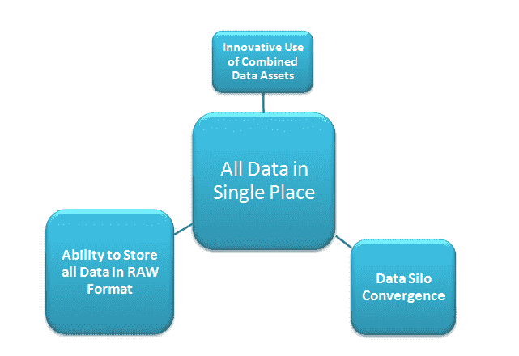
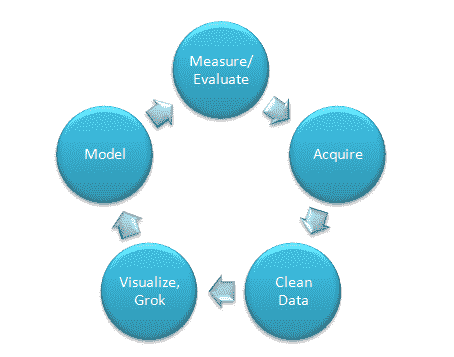
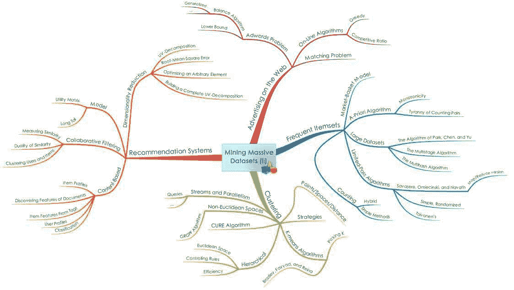
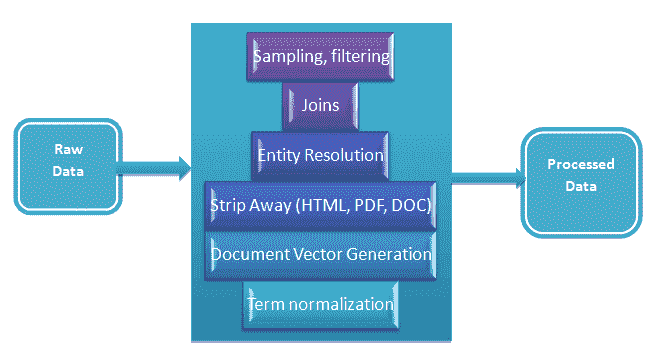
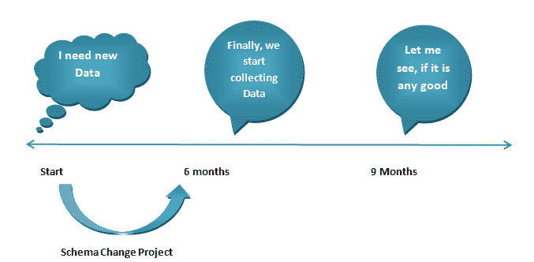

# 将 Hadoop 与数据科学结合使用

> 原文：<https://www.edureka.co/blog/applying-hadoop-with-data-science/>

Apache Hadoop 正迅速成为投资大数据的组织的首选技术，为他们的下一代数据架构提供支持。随着 Hadoop 成为可扩展的数据平台和计算引擎，数据科学正重新成为企业创新的核心，其应用数据解决方案包括在线产品推荐、自动化欺诈检测和客户情绪分析。

在本文中，我们概述了数据科学，以及如何利用 Hadoop 进行大规模数据科学项目。

## **Hadoop 对数据科学家有什么用？**

Hadoop 是数据科学家的福音。让我们看看 Hadoop 如何帮助提高数据科学家的工作效率。Hadoop 有一个独特的功能，可以从一个地方存储和检索所有数据。通过这种方式，可以实现以下目的:

*   能够以原始格式存储所有数据
*   数据仓汇聚
*   数据科学家将发现组合数据资产的创新用途。

## **Hadoop 强大的关键:**

*   **减少时间和成本—**Hadoop 有助于大幅减少构建大规模数据产品的时间和成本。
*   **计算与数据共处一地—**数据和计算系统被共同设计为协同工作。
*   **规模经济—**可以使用‘商品化’硬件节点，具有自我修复能力，擅长批量处理大型数据集。
*   **专为一次写入和多次读取而设计—**没有随机写入，并且 针对硬盘上的最小寻道进行了优化

## **为什么要用数据科学的 Hadoop？**

**理由#1:** **探索大型数据集**

第一个也是最重要的原因是，通过在**数据分析流程**中**集成 Hadoop** ，人们可以**直接使用 Hadoop 探索大型数据集**。

这是通过利用简单的统计数据实现的，例如:

*   平均
*   中位数
*   分位点
*   预处理:grep，regex

还可以使用特别的采样/过滤来实现  随机:有或没有替换、通过唯一键采样和 K 重交叉验证。

**原因 2:挖掘大型数据集的能力**

用大型数据集学习算法有其自身的挑战。挑战是:

*   数据放不进内存。
*   学习需要更长的时间。

使用 Hadoop 时，用户可以在 Hadoop 集群中的节点间分配数据，并实施分布式/并行算法。对于推荐，可以替换最小二乘算法，对于聚类，可以使用 K 均值。

 

**原因#3:大规模数据准备**

我们都知道 80%的数据科学工作涉及“数据准备”。Hadoop 非常适合批量准备和清理大型数据集。

**原因 4:加速数据驱动的创新:**

传统的数据架构存在速度障碍。RDBMS 在写入时使用**模式，因此更改成本很高。这也是数据驱动创新的**高壁垒**。**

Hadoop 使用**“读取模式”**，这意味着**更快的创新时间**，从而为数据驱动的创新增加了一个**低壁垒**。

因此，总结一下我们需要 Hadoop 和数据科学的四个主要原因:

1.  挖掘大型数据集
2.  完整数据集的数据探索
3.  大规模预处理
4.  更快的数据驱动周期

因此，我们看到组织可以利用 Hadoop 来挖掘数据并从中收集有用的结果。

Edureka 有一个专门策划的[数据科学培训](https://www.edureka.co/masters-program/data-scientist-certification)课程，可以帮助你获得机器学习算法方面的专业知识，如 K-Means 聚类、决策树、随机森林和朴素贝叶斯。您将学习统计学、时间序列、文本挖掘的概念，以及深度学习的介绍。您将解决媒体、医疗保健、社交媒体、航空、人力资源方面的真实案例研究。本课程的新批次即将开始！！

有问题要问我们吗？？请在评论区提及它们，我们将会回复您。