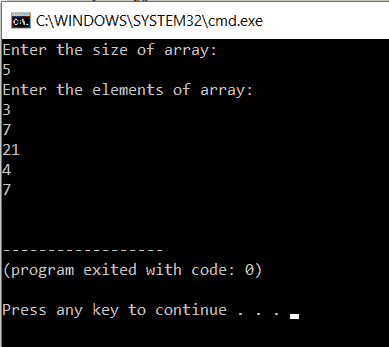
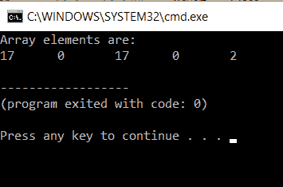
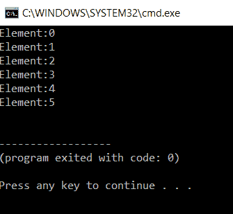

# 如何在 C++中实现数组？

> 原文：<https://www.edureka.co/blog/arrays-in-cpp/>

[数组](https://www.edureka.co/blog/java-array/)是数据类型相同的元素的有序集合。它们按顺序存储在内存中。数组是保存相似类型元素的数据结构。在 c++中，数组元素不像在 java 中那样被视为对象。在这篇文章中，我们将讨论 C++中的数组。

## **c++中的数组**

想象一下，你在一家唱片店，我让你把所有 XYZ 唱片公司的唱片一张一张地放在一起。这种连续的记录集合可以称为数组。数组是相同数据类型的元素的有序集合。在上面的例子中，XYZ 记录是数据类型，您收集的所有记录都有相同的出版商。数组中的所有元素都有一个共同的名称。

这篇关于 C++中数组的文章将关注这些基本指针，

*   [一维数组](#SingleDimensionalArray)
*   [申报期间的初始化](#InitializationDuringDeclaration)
*   [用户初始化](#InitializationByAUser)
*   [在任一点访问数组](#AccessingArrayAtAnyPoint)
*   [多维数组](#MultiDimensionalArray)

让我们从理解什么是一维数组开始，

## **一维数组**

**声明一个** ***一维数组的语法:***

我们有一种数据类型，可以是任何基本数据类型，如 int、float 或 double。数组名是数组的名称，我们声明数组的大小。 在我们上面的例子中，数组将为，

```
XYZ Record recordArray[100];
```

让我们考虑另一个例子:

```
int test[20];
```

数组测试将保存 int 类型的元素，大小为 20。

#### **c++中的数组:数组大小**

数组大小是在声明数组时给定的。一旦给定了数组的大小，就不能更改。 编译器然后给数组分配那么多的内存空间。

考虑例子

```
int test[20];
```

在上面的例子中，我们有一个 int 类型的数组测试。我们将数组大小设为 20。这意味着将为存储器中的阵列留出 20 个连续的存储位置。

## **数组索引和初始化**

一个与数组中每个位置相关联的数字，这个数字称为 *数组索引* 。它从 0 开始，到最后一个元素，也就是数组的大小减 1。负一是因为我们从零开始计数，而不是从一开始计数。数组索引总是从零开始。

考虑这个例子，这是年龄数组。

| ***数组值*** | Twelve | Forty-one | 03 | Thirteen | 07 |
| ***数组索引*** | Zero | one | Two | three | four |

这里，数组包含值 12，41，3，13，7，索引为 0，1，2，3，4，5。如果我们想要表示索引为 4 的元素，它将被表示为 age[4]并且将显示值 7。

默认情况下，数组包含所有零值。 数组初始化是在声明的时候完成的。如果用户在需要时输入数组值，这也可以在以后执行。

让我们看看在声明期间初始化是如何工作的，

## **申报期间的初始化**

数组可以在声明期间初始化。这是通过在声明时指定数组元素来实现的。这里数组的大小也是固定的，由我们决定。

考虑代码，

```
#include<iostream>
using namespace std;
int main()
{
int arr[] = { 10, 20, 30, 40 } ;
return 0;
}

```

**解释**

在上面的例子中，我们创建了一个 int 类型的名为 arr 的数组。我们直接指定数组元素。数组的大小是通过计算数组中元素的数量来决定的。在这种情况下，大小是 4。

在这篇关于 C++中数组的文章中，接下来让我们看看用户初始化是如何工作的

## **用户初始化**

在这个方法中，我们让用户决定数组的大小。在这种情况下，我们需要一个变量来保存数组的大小，并需要一个 for 循环来接受数组的元素。我们在声明的时候分配一个随机的大小，只在需要的时候使用。开始时的尺寸通常偏高。我们有一个变量 I 来控制 for 循环。

举个例子，

```
#include<iostream>
using namespace std;
int main()
{
int arr[50],n,i ;
cout<<"Enter the size of array:"<<endl;
cin>>n;
cout<<"Enter the elements of array:"<<endl;
for(i=0;i<n;i++)
{
cin>>arr[i];
}
return 0;
}

```

**输出**

****

**解释**

在上面的程序中，我们声明了一个大小为 50 的数组。然后我们要求用户输入他希望在这个数组中输入的元素数量。然后，我们接受用户输入的数组元素。

#### **c++中的数组:显示数组**

显示数组也需要 for 循环。我们遍历整个数组并显示数组的元素。

这里有一个例子，

```
#include<iostream>
using namespace std;
int main()
{
int arr[50],n,i ;
cout<<"Enter the size of array:"<<endl;
cin>>n;
cout<<"Enter the elements of array:"<<endl;
for(i=0;i<n;i++)
{
cin>>arr[i];
}
cout<<"Array elements are:"<<endl;
for(i=0;i<n;i++)
{
cout<<arr[i]<<"t";
}
return 0;
}

```

**输出**

****

**解释**

在上面的程序中，我们声明了一个大小为 50 的数组。然后我们要求用户输入他希望在这个数组中输入的元素数量。然后，我们接受用户输入的数组元素。然后我们再次使用 for 循环来显示数组元素。

继续 C++文章中的数组，

## **在任一点访问数组**

访问数组元素很简单，通过使用数组索引来完成。看看下面的代码。

```
#include<iostream>
using namespace std;
int main()
{
int arr[5],i ;
arr[4]=2;
arr[2]=17;
arr[0]=17;
cout<<"Array elements are:"<<endl;
for(i=0;i<5;i++)
{
cout<<arr[i]<<"t";
}
return 0;
}

```

**输出**

****

**解释**

在上面的程序中，我们有一个大小为 5 的数组。我们使用数组索引在不同的位置输入元素。我们打印数组以获得上面的输出。

**默认情况下，所有的数组元素都是零。**

**如果我们跨越数组大小会发生什么？**

在 c++中，如果我们试图访问越界的元素，编译器可能不会显示错误，但我们不会得到正确的输出。

这就把我们带到了 C++文章中数组的最后一点，

## **多维数组**

数组的数组是多维数组。这是因为多维数组中的每个元素都有自己的数组。我们需要 n for 循环来根据维度遍历多维数组。

**声明多维数组的语法**

```
Datatype arrayname[size1][size2]…..[size n]
```

```
int a[10][20];
```

考虑这个例子，

上述数组的大小将是 10*20，即 200 个元素。 同样，我们可以拥有二维、三维甚至更多维的数组。 每个维度需要一个 for 循环。所以，二维数组需要两个，三维数组需要三个。

**考虑代码**

```
#include<iostream>
using namespace std;
int main()
{
int arr[3][2] = {{0,1}, {2,3}, {4,5}};
for (int i = 0; i < 3; i++)
{
for (int j = 0; j < 2; j++)
{
cout << "Element:";
cout <<arr[i][j]<<endl;
}
}
return 0;
}t

```

**输出**

****

**解释**

在上面的代码中，我们显示了一个 3*2 的矩阵。该数组有 3 行 2 列。我们有两个循环。每个负责数组的一个维度。外部 for 循环负责行，内部负责列。

类似地，我们可以写一个三维数组的代码，有三个 for 循环，每个维度由一个 for 循环控制。

这样，我们就结束了这篇关于“C++中的数组”的文章。如果你想了解更多，请查看由 Edureka(一家值得信赖的在线学习公司)提供的  [Java 培训](https://www.edureka.co/java-j2ee-soa-training)。Edureka 的 Java J2EE 和 SOA 培训和认证课程旨在培训您掌握核心和高级 Java 概念以及各种 Java 框架，如 Hibernate & Spring。

有问题要问我们吗？请在本博客的评论部分提及此事，我们将尽快回复您