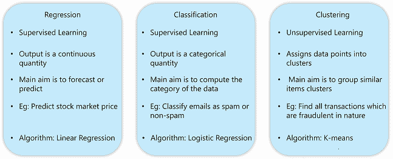
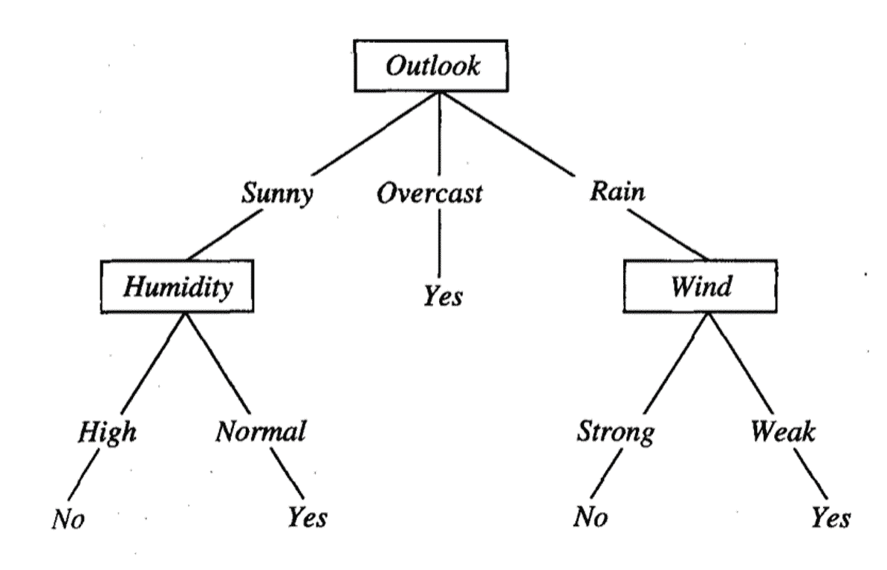
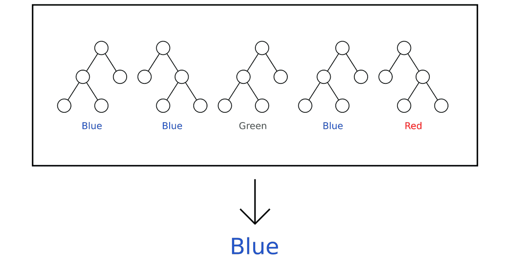
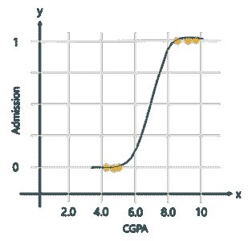
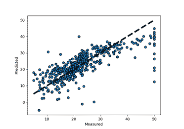
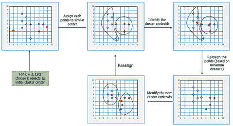
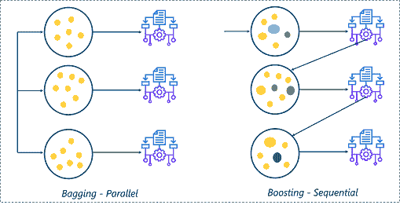

# 人工智能算法:你需要知道的一切

> 原文：<https://www.edureka.co/blog/artificial-intelligence-algorithms/>

我们都同意[人工智能](https://www.edureka.co/blog/what-is-artificial-intelligence)已经对世界经济产生了巨大影响，并将继续如此，因为我们正在通过产生不可估量的数据来帮助它的增长。由于人工智能算法的进步，我们可以处理如此海量的数据。在这篇博文中，你将了解不同的人工智能算法，以及它们如何被用来解决现实世界的问题。

要获得人工智能和机器学习的深入知识，可以报名参加 Edureka 提供的全天候支持和终身访问的直播 *[**机器学习工程师硕士项目**](https://www.edureka.co/masters-program/machine-learning-engineer-training)* 。

以下是这篇文章将涉及的主题列表:

1.  [什么是人工智能？](#What%20Is%20Artificial%20Intelligence)
2.  [什么是机器学习？](#What%20Is%20Machine%20Learning)
3.  [机器学习的类型](#Types%20Of%20Machine%20Learning)
4.  [使用人工智能算法解决的问题类型](#Types%20Of%20Problems%20Solved%20Using%20Artificial%20Intelligence%20Algorithms)
5.  [人工智能算法](#Artificial%20Intelligence%20Algorithms)
    1.  [分类算法](#Classification%C2%A0%20Algorithms)
    2.  [回归算法](#Regression%20Algorithms)
    3.  [聚类算法](#Clustering%20Algorithms)
    4.  [集成学习算法](#Ensemble%20Learning%20Algorithms)

## **什么是人工智能？**

简单来说，人工智能是让机器像人类一样思考和决策的科学。

自从复杂的[人工智能](https://www.edureka.co/blog/artificial-intelligence-tutorial/)算法开发以来，它已经能够通过创造应用于农业、医疗保健、机器人、营销、商业分析等广泛领域的机器和机器人来实现这一目标。

在我们进一步讨论之前，让我们试着理解什么是机器学习，以及它与人工智能有什么关系。

## **什么是机器学习？**

一般来说，算法需要一些输入，并使用数学和逻辑来产生输出。与此形成鲜明对比的是，*人工智能算法同时采用输入和输出的组合，以便“学习”数据，并在获得新输入时产生输出。*

这个让机器从数据中学习的过程就是我们所说的**机器学习。**

**

*人工智能算法–人工智能算法–edu reka*

机器学习是人工智能的一个子领域，我们试图通过学习输入数据将人工智能带入等式。

如果你想了解更多关于机器学习的知识，可以看看下面的博客:

1.  [机器学习简介:关于机器学习你需要知道的一切](https://www.edureka.co/blog/introduction-to-machine-learning/)
2.  [初学者机器学习教程](https://www.edureka.co/blog/machine-learning-tutorial/)
3.  [机器学习算法](https://www.edureka.co/blog/machine-learning-algorithms/)

根据数据集和正在解决的问题，机器可以遵循不同的方法进行学习。在下一节中，我们将了解机器学习的不同方式。

## **机器学习的类型**

机器学习可以通过以下方式完成:

1.  监督学习
2.  无监督学习
3.  强化学习
4.  集成学习

让我们简单了解一下每种机器学习背后的思想。

### 什么是监督学习？

在**监督学习中，**顾名思义，它涉及到让算法学习数据，同时为数据提供正确的答案或标签。这实质上意味着要预测的类或值是已知的，并且从一开始就为算法很好地定义了。

### **什么是无监督学习？**

另一类属于**非监督学习**，与监督方法不同，该算法没有正确的答案或根本没有任何答案，这取决于算法的判断力，将类似的数据收集在一起并理解它。

### **什么是强化学习？**

除了这两个突出的课程，我们还有第三个课程，叫做**强化学习**。正如孩子们通常通过做正确的事情时奖励他们或做错误的事情时惩罚他们来“强化”某些想法和原则一样，在强化学习中，每一次正确的预测都会奖励算法，从而提高准确性。

看看这个由 Edureka 提供的 [NLP 培训](https://www.edureka.co/python-natural-language-processing-course)，将你的人工智能技能提升到下一个水平

这里有一个由我们的机器学习专家录制的短视频。这将有助于你理解监督学习、非监督学习和强化学习之间的区别。

### **监督 vs 非监督 vs 强化学习**

[//www.youtube.com/embed/xtOg44r6dsE?rel=0&showinfo=0](//www.youtube.com/embed/xtOg44r6dsE?rel=0&showinfo=0)

本视频讨论了监督学习、非监督学习和强化学习之间的区别。

### **什么是集成学习？**

虽然以上三个类全面涵盖了大多数领域，但我们有时仍然会遇到必须提升模型性能的问题。在这种情况下，使用**集合方法**(稍后解释)来获得更高的精确度可能是有意义的。

现在我们来了解一下人工智能算法如何被用来解决不同类型的问题。

*还有，报读 [AI 和 ML 课程](https://www.edureka.co/executive-programs/machine-learning-and-ai)精通这个人工智能和 ML。*

## **使用人工智能算法解决的问题类型**

本质上，每个类别中的算法都执行相同的任务，即在给定未知输入的情况下预测输出，然而，在这里，数据是选择正确算法的关键驱动因素。

以下是机器学习问题类别的概述，并对其进行简要概述:

1.  分类
2.  回归
3.  使聚集

这里有一个表格，有效地区分了每一类问题。

*使用人工智能解决的问题类型——人工智能算法——edu reka*

对于每一类任务，我们可以使用特定的算法。在下一节中，你将理解一类算法如何被用作复杂问题的解决方案。

## **人工智能算法**

如上所述，不同的人工智能算法可以用来解决一类问题。在下一节中，我们将看到分类、回归和聚类问题中不同类型的算法。

*另外，报名参加 [AI ML 课程](https://www.edureka.co/executive-programs/machine-learning-and-ai)，精通人工智能和机器学习。*

### **分类算法**

分类，顾名思义就是把因变量(我们试图预测的那个)分成类，然后对给定的输入预测一个类的行为。它属于监督机器学习的范畴，数据集首先需要有类别。因此，在我们需要从一组固定的、预先定义的结果中预测结果的任何地方，分类都发挥了作用。

分类使用一系列的算法，下面列出了其中的一些

1.  [朴素贝叶斯](#Naive%20Bayes)
2.  [决策树](#Decision%20Tree)
3.  [随机森林](#Random%20Forest)
4.  [逻辑回归](#Logistic%20Regression)
5.  [支持向量机](#Support%20Vector%20Machines)
6.  [K 个最近邻居](#K%20Nearest%20Neighbours)

让我们把它们分解一下，看看它们在应用中的位置。

### **朴素贝叶斯**

朴素贝叶斯算法遵循贝叶斯定理，与此列表中的所有其他算法不同，它遵循一种概率方法。这实质上意味着，算法不是直接跳到数据中，而是为你的目标的每个类别设置一组先验概率。

一旦你输入数据，算法就会更新这些先验概率，形成所谓的后验概率。因此，在你需要预测你的输入是属于一个给定的 n 个类的列表还是不属于其中任何一个的情况下，这是非常有用的。使用概率方法这是可能的，主要是因为所有 n 个类的概率都很低。

让我们试着用一个例子来理解这一点，一个人打高尔夫球，取决于像外面的天气这样的因素。

*   我们首先尝试生成特定事件发生的频率，在这种情况下，如果外面是晴天、雨天等，我们尝试找到打高尔夫球的人的频率。

*朴素贝叶斯——人工智能算法——edu reka*

*   使用这些频率，我们生成我们的先验或初始概率(例如，阴的概率是 0.29，而玩的一般概率是 0.64)

*   接下来，我们生成后验概率，在这里我们试图回答这样的问题“如果外面阳光明媚，这个人会打高尔夫球的概率是多少？”

我们在这里使用贝叶斯公式，

*P(Yes | Sunny)= P(Sunny | Yes)* P(Yes)/P(Sunny)**这里我们有 P (Sunny |Yes) = 3/9 = 0.33，P(Sunny) = 5/14 = 0.36，P( Yes)= 9/14 = 0.64*

你可以浏览这篇[朴素贝叶斯](https://www.edureka.co/blog/naive-bayes-in-r/) 综合指南博客，帮助你理解朴素贝叶斯背后的数学原理。

### **决策树**

决策树本质上可以概括为类似流程图的树结构，其中每个外部节点表示对属性的测试，每个分支表示该测试的结果。叶节点包含实际预测的标签。我们从树根开始，不断比较属性值，直到到达一个叶节点。

*决策树–人工智能算法–edu reka*

当处理高维数据时，以及在数据准备后花费很少时间时，我们使用这个分类器。然而，需要注意的是，它们往往会过度拟合，并且即使训练数据中有细微的差别，也容易发生剧烈的变化。

你可以通过这些博客来了解更多关于决策树的知识:

1.  [决策树算法完全指南](https://www.edureka.co/blog/decision-tree-algorithm/)
2.  [决策树:如何创建一个完美的决策树？](https://www.edureka.co/blog/decision-trees/)

### **随机森林**

可以把它想象成一个决策树委员会，每个决策树都被输入了数据属性的一个子集，并在这个子集的基础上进行预测。所有决策树投票的平均值都考虑在内，给出答案。

使用随机森林的一个优点是，它减轻了在独立决策树中存在的过拟合问题，从而导致更加健壮和准确的分类器。

*随机森林——人工智能算法——edu reka*

正如我们在上面的图片中看到的，我们有 5 个决策树试图对一种颜色进行分类。这里，这 5 个决策树中的 3 个预测蓝色，两个具有不同的输出，即绿色和红色。在这种情况下，我们取所有输出的平均值，这给出了蓝色的最高权重。

这里有一个关于[随机森林分类器](https://www.edureka.co/blog/random-forest-classifier/) 的博客，它将帮助你理解随机森林算法的工作原理，以及如何用它来解决现实世界的问题。

### **逻辑回归**

这是一种主要用于二进制分类任务的方法。术语“逻辑”来自这种分类方法中使用的 logit 函数。逻辑函数，也称为 sigmoid 函数，是一种 S 形曲线，可以采用任何实数值，并将其映射到 0 和 1 之间，但永远不会精确到这些极限。

*逻辑回归–人工智能算法–edu reka*

让我们假设你的弟弟正在努力进入研究生院，你想预测他是否会被他梦想中的学校录取。所以，根据他的 CGPA 和过去的数据，你可以使用逻辑回归来预见结果。

[逻辑回归](https://www.edureka.co/blog/logistic-regression-in-r/)允许您分析一组变量并预测分类结果。因为这里我们需要预测他是否会让进入学校，这是一个分类问题，逻辑回归将是理想的。

逻辑回归用于预测房屋价值、保险行业的客户终身价值等。

### **支持向量机**

SVM 是独一无二的，因为它试图对数据进行排序，使两个类之间的间隔尽可能远。这被称为最大边距分离。

这里需要注意的另一件事是，SVM 在绘制超平面时只考虑支持向量，不像线性回归那样使用整个数据集。这使得 SVM 在高维数据的情况下非常有用。

我们试着用一个例子来理解这一点。在下图中，我们必须将数据点分为两类(正方形和三角形)。

*支持向量机-人工智能算法-edu reka*

因此，首先绘制一个随机超平面，然后检查该超平面与每个类中最近的数据点之间的距离。这些最接近超平面的数据点被称为**支持向量**。这就是支持向量机这个名字的由来。

基于这些支持向量绘制超平面，并且*最优超平面将具有与每个支持向量*的最大距离。超平面和支持向量之间的距离被称为**裕度**。

综上所述，使用 SVM 通过使用超平面来分类数据，使得超平面和支持向量之间的距离最大。

想了解更多关于 SVM 的信息，你可以浏览这个，[用 SVM 预测心脏病](https://www.edureka.co/blog/support-vector-machine-in-r/)的博客。

### **K 个最近邻居**

KNN 是一种非参数(这里非参数只是一个花哨的术语，本质上意味着 KNN 不对底层数据分布做任何假设)，懒惰学习算法(这里懒惰意味着“训练”阶段相当短)。

它的目的是使用分成几类的一整串数据点来预测新样本点的分类。

以下几点作为算法一般工作的概述:

*   指定一个正整数 N 和一个新样本
*   我们在数据库中选择最接近新样本的 N 个条目
*   我们找到了这些条目最常见的分类
*   这是我们给新样品的分类

然而，使用 KNN 也有一些缺点。这些缺点主要围绕这样一个事实，即 KNN 致力于存储整个数据集，并将新点与现有点进行比较。这意味着存储空间随着我们训练集的增加而增加。这也意味着估计时间与训练点的数量成比例地增加。

以下博客将帮助你深入了解 KNN 算法是如何工作的:

1.  R 中 KNN 算法的一个实际实现
2.  [使用 Python 的 K-最近邻算法](https://www.edureka.co/blog/k-nearest-neighbors-algorithm/)

现在让我们来理解如何使用回归算法解决回归问题。

### **回归算法**

在回归问题的情况下，输出是一个*连续量*。这意味着我们可以在目标变量是连续变量的情况下使用回归算法。它属于监督机器学习的范畴，数据集首先需要有标签。

### **线性回归**

[线性回归](https://www.edureka.co/blog/linear-regression-in-r/)是最简单有效的回归算法。它被用来衡量真正的质量(房价、通话次数、所有交易等等)。)鉴于变量一致。在这里，我们通过拟合最佳直线在自由因子和病房因子之间建立联系。这条最佳拟合线被称为回归线，用直接条件 Y= a *X + b 表示。

*线性回归–人工智能算法–edu reka*

这里让我们举一个简单的例子来理解线性回归。

假设你面临一个挑战，仅仅通过看一个不认识的人来估计他们的体重。在没有其他数据的情况下，这可能看起来是一个相当困难的任务，但是根据你过去的经验，你知道一般来说，一个人越高，与同样身材的矮个子相比，他就越重。实际上，这是线性回归！

然而，线性回归最适用于涉及少量维度的方法。还有，不是每个问题都是线性可分的。

线性回归的一些最受欢迎的应用是在金融投资组合预测，工资预测，房地产预测和交通到达 eta

现在让我们讨论如何使用 K-means 算法来解决聚类问题。在此之前，我们先了解一下什么是集群。

### **聚类算法**

聚类背后的基本思想是基于特征相似性将输入分配到两个或更多个聚类中。它属于无监督机器学习的范畴，算法在没有任何指导的情况下从数据(标记的数据集)中学习模式和有用的见解。

例如，可以通过使用无监督学习算法(如 K-Means 聚类)来根据观众的兴趣、年龄、地理位置等将观众聚类成相似的组。

### **K-均值聚类**

K-means 可能是最简单的无监督学习方法。这里的想法是将相似的数据点收集在一起，并以集群的形式将它们绑定在一起。这是通过计算数据点组的质心来实现的。

为了执行有效的聚类，k-means 评估每个点到聚类质心的距离。根据数据点和质心之间的距离，数据被分配给最近的聚类。聚类的目标是确定一组未标记数据中的内在分组。

*K-means–人工智能算法–edu reka*

K-means 中的“K”代表形成的簇的数量。聚类的数量(基本上是数据的新实例可以归入的类的数量)由用户决定。

K-means 主要用于这样的情况，即数据集具有明显的且彼此分离的点，否则，聚类不会相距很远，从而使它们不准确。此外，在数据集包含大量异常值或数据集是非线性的情况下，应避免使用 K 均值。

这就是关于 K-means 算法的简要介绍，要了解更多信息，您可以浏览我们的机器学习专家录制的内容。

### **K 表示聚类算法| edu reka**

[//www.youtube.com/embed/1XqG0kaJVHY?rel=0&showinfo=0](//www.youtube.com/embed/1XqG0kaJVHY?rel=0&showinfo=0)

在本视频中，您将学习 K-Means 聚类的概念及其使用 python 的实现。

### **集成学习算法**

在数据丰富且预测精度很高的情况下，boosting 算法就派上了用场。

考虑这种情况，您有一个在数据集上训练的决策树，并且已经执行了一大堆超参数调整，但是，最终的准确性仍然比您想要的稍微差一些。在这种情况下，虽然看起来你已经用尽了所有可能的尝试，但是集成学习来拯救你了。

*集成学习–人工智能算法–edu reka*

在这种情况下，有两种不同的方法可以使用集成学习来提高准确度。假设您的决策树在一组输入测试值上失败了，您现在要做的是训练一个新的决策树模型，并对您之前的模型难以处理的那些输入测试值给予更高的权重。这也叫做 **Boosting** ，我们的初始树可以正式表述为弱学习者，那个模型造成的错误为更好更强的模型铺路。

另一种方法是简单地一次训练一大堆树(这可以以并行的方式快速完成)，然后从每棵树中提取输出并平均。所以这样，如果在训练了 10 棵树之后，假设 6 棵树对输入的回复是肯定的，4 棵树回复是否定的，那么你考虑的输出就是肯定的。这正式称为**装袋。**

它们用于减少监督学习技术中的偏差和变化。有许多可用的升压算法，下面讨论其中的一些:

### **梯度推进**

梯度增强是一种增强算法，当我们处理大量数据以进行具有高预测能力的预测时使用。它将多个弱预测值或平均预测值组合起来，构建强预测值。这些助推算法被大量用于在数据科学竞赛中完善模型。

在这里，我们考虑一个“最优”或最佳模型，所以本质上我们的模型离那个“最优”模型有一段距离。我们现在做的是，使用梯度数学，并试图让我们的模型更接近最佳空间。

### **XGBoost**

由于其极高的预测能力，XGBoost 是提高准确性的首选算法之一，因为它包含线性和树学习算法，比大多数 boosting 技术快 10 倍。

当谈到黑客马拉松时，这是圣杯算法，难怪 CERN 在大型强子对撞机的信号分类模型中使用它。

如果你想了解更多关于增强机器学习的知识，你可以通过这个，[增强机器学习算法综合指南博客](https://www.edureka.co/blog/boosting-machine-learning/)。

就这样，我们结束了这个人工智能算法博客。如果你想了解更多关于人工智能的知识，你可以看看这些博客:

1.  人工智能——它是什么，有什么用处？
2.  [Python 人工智能综合指南](https://www.edureka.co/blog/artificial-intelligence-with-python/)
3.  [人工智能教程:关于 AI 你需要知道的一切](https://www.edureka.co/blog/artificial-intelligence-tutorial/)
4.  [AI vs 机器学习 vs 深度学习](https://www.edureka.co/blog/ai-vs-machine-learning-vs-deep-learning/)
5.  [人工智能应用:10 大现实世界人工智能应用](https://www.edureka.co/blog/artificial-intelligence-applications/)

*如果你希望报名参加人工智能和机器学习的完整课程，Edureka 有一个专门策划的  [**机器学习工程师硕士项目**](https://www.edureka.co/masters-program/machine-learning-engineer-training) ，它将使你精通监督学习、非监督学习和自然语言处理等技术。查看 Edureka 的这个 [NLP 培训](https://www.edureka.co/python-natural-language-processing-course)将你的人工智能技能提升到下一个水平它包括人工智能&机器学习方面的最新进展和技术方法的培训，如深度学习、图形模型和强化学习。*