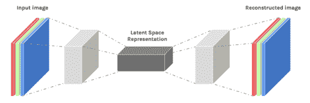
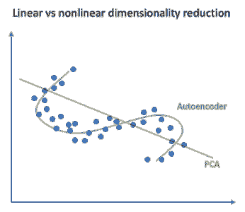

# 自动编码器教程:自动编码器初学者指南

> 原文：<https://www.edureka.co/blog/autoencoders-tutorial/>

[人工智能](https://www.edureka.co/ai-deep-learning-with-tensorflow)涵盖了广泛的技术和技巧，使计算机系统能够解决数据压缩等问题，这些问题被用于计算机视觉、计算机网络、计算机架构和许多其他领域。**自动编码器**是*无监督的神经网络*，它使用机器学习来为我们进行压缩。本**自动编码器教程**将按以下顺序为您提供对自动编码器的全面了解:

*   **[什么是自动编码器？](#what-are-autoencoders)**
*   ****需要自动编码器
*   **[自动编码器的应用](#applications)**
*   **[自动编码器架构](#architecture)**
*   **[属性&超参数](#properties-hyperparameters)**
*   **[自动编码器的类型](#types)**
*   **[【使用自动编码器压缩数据(演示)](#demo)**

让我们从最基本的问题开始，什么是自动编码器？

## **什么是自动编码器？**

自动编码器 [**神经网络**](https://www.edureka.co/blog/neural-network-tutorial/) 是一种 [**无监督机器学习**](https://www.edureka.co/blog/what-is-machine-learning/) 算法，应用反向传播，将目标值设置为等于输入。自动编码器用于将我们的输入缩减为更小的表示形式。如果有人需要原始数据，他们可以从压缩数据中重建它。

我们有类似的机器学习算法 ie。完成相同任务的 PCA。所以你可能会想为什么我们需要自动编码器呢？让我们继续这个自动编码器教程，并找出使用自动编码器背后的原因。

## **自动编码器教程:其出现**

自动编码器优于 PCA，因为:

*   自动编码器可以通过**非线性激活函数**和多层来学习**非线性** **变换**。
*   它不一定要学密密麻麻的层。它可以使用**卷积层**来了解视频、图像和系列数据哪个更好。
*   用自动编码器学习几个层比用 PCA 学习一个巨大的变换更有效。
*   自动编码器提供每一层的表示作为输出。
*   它可以利用来自另一个模型的**预训练层**来应用迁移学习以增强编码器/解码器。

现在让我们来看看自动编码器的一些工业应用。

#### 订阅我们的 youtube 频道以获取新的更新..！