# 自动化随处安装分步指南

> 原文：<https://www.edureka.co/blog/automation-anywhere-installation>

Automation Anywhere 是最受欢迎的 RPA 工具之一，被初创公司和跨国公司用来自动化不同类型的任务。这篇文章将是一个关于 ***自动化随处安装*** 的简要指南，在这里我将向你展示设置和安装以下内容的步骤:

*   [先决条件](#prerequisites)
*   [安装模式](#installationmodes)
*   [微软 SQL Server 安装](#microsoftsqlserversetup)
*   [自动化随处控制室安装](#automationanywherecontrolroominstallation)
*   [Automation Anywhere 企业客户端设置](#automationanywhereenterpriseclientsetup)

因此，如果你遵循下面的步骤，你应该能够在你的操作系统上下载并安装 [Automation Anywhere](https://www.edureka.co/blog/rpa-automation-anywhere/) ，完全没有麻烦。让我们开始吧。

在我告诉您如何进行 Automation Anywhere 安装之前，让我提一下安装的先决条件。

**先决条件**

以下是在您的系统上安装自动化的先决条件。现在，系统中可能不存在 SQL Server。在这种情况下，您必须在设置控制室之前安装和设置 MS SQL Server。

下一件事，你必须知道，在任何地方安装自动化之前，有两种安装模式。

如果您想要一个关于 Automation Anywhere 分步安装的视频讲座，可以参考下面的视频:

## **Automation Anywhere Installation | Install and Setup Automation Anywhere Control Room | edu reka**

[https://www.youtube.com/embed/NBbvUj-uow0?rel=0&showinfo=0](https://www.youtube.com/embed/NBbvUj-uow0?rel=0&showinfo=0)

这段关于 Automation Anywhere 安装的 Edureka 视频将向您逐步演示如何在您的系统中安装 Automation Anywhere。

**安装模式**

有以下两种安装模式:

**快速模式**

*   此模式用于默认设置配置的快速安装。
*   当您只想在设备上的任意位置安装自动化时，建议使用快速模式。
*   这种模式主要推荐用于内部使用、概念验证、培训和评估。

**自定义模式**

*   此模式用于配置自定义设置和手动配置各种配置。
*   对于希望在多个系统上的任意位置安装自动化的企业环境设置，最推荐使用自定义模式。
*   当您需要高可用性、灾难恢复和高生产率时，可以使用这种模式。

在这篇关于 Automation Anywhere 安装的文章中，我将使用**快速模式。现在，要安装[自动化无处不在企业版](https://www.automationanywhere.com/in/products/enterprise)，你必须首先购买他们的许可证。一旦你拿到他们的许可证，你会得到一个链接，你可以从那里下载如下的 ZIP 文件夹。**

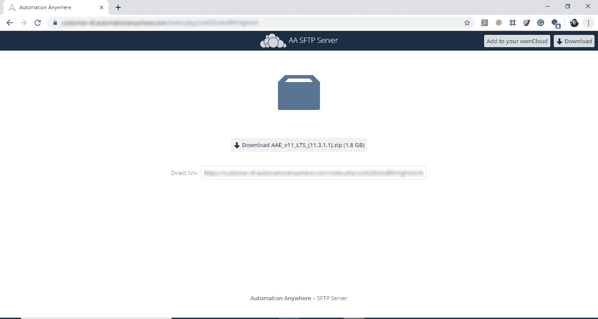

一旦你下载了上面的文件夹，解压文件夹，提取所有文件，然后你就可以开始在任何地方设置自动化了。参考下文。

## **自动化随处安装**

现在，在我向您展示如何配置控制室和客户端之前，让我向您展示如何设置 Microsoft SQL Server。

**微软 SQL Server 安装**

要设置 SQL Server，您必须遵循以下步骤:

**第一步:**双击 **SQL Server 应用文件**初始化安装。

****

**第二步:**双击应用文件后，会看到下面的对话框让**选择解压文件的目录**。选择文件的目录，然后点击**确定**。在这里，我就顺其自然吧。

**第三步:**现在，一旦文件被解压缩，您将看到下面的 **SQL Server 安装设置向导**。在此，在此向导中，您会看到两个选项，如新 SQL Server 单机安装和从 SQL Server 升级。

**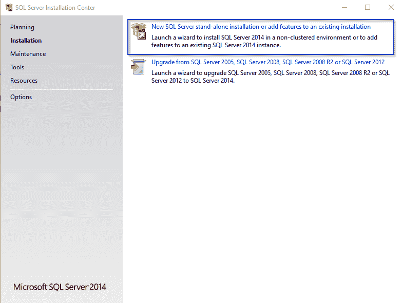**

**第四步:**在上面的向导中，选择第一个选项，即**新建 SQL Server 单机安装**。一旦你点击第一个选项，你会看到向导**接受许可协议**。

**第 5 步:**因此，请继续，**通过选中单选按钮阅读并接受许可协议**，然后单击**下一步。**

**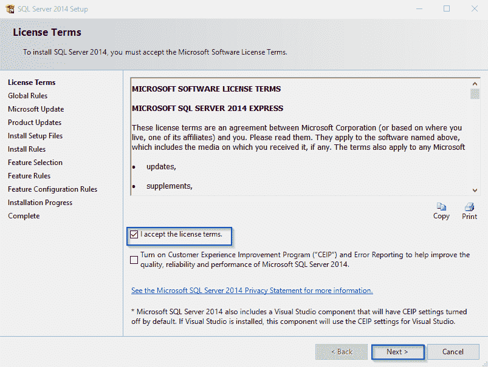**

**第六步:**之后在**全局规则部分**，如果所有参数都成功，那么会自动前进到**微软更新**。

***注意:**在全局规则部分，如果重启失败，那么你必须在安装 SQL Server 之前重启你的系统。*

**第七步:**然后，在**微软更新向导**中点击**下一步**。参考下文。

一旦点击下一步，安装将自动继续，直到**功能选择**部分。

**步骤 8:** 然后，在**功能选择部分**中，确保所有复选框都被选中。然后检查实例根目录、共享功能目录和共享功能目录(x86)。之后，点击**下一个**。参考下文。

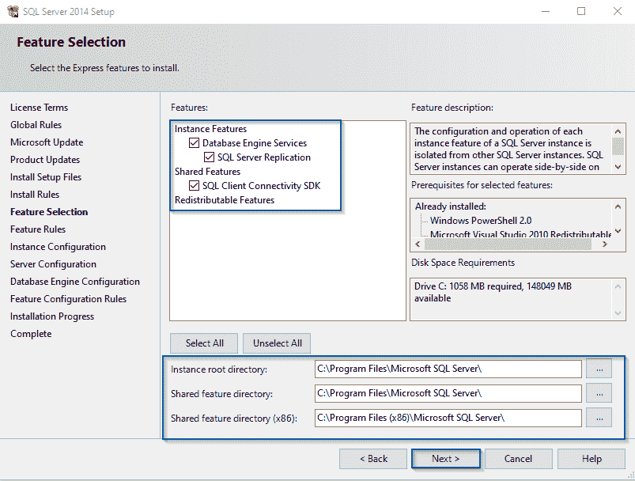

一旦您点击 Next，安装将继续，直到**实例配置部分**。

**第 9 步:**在这个部分中，您需要**选择实例名称**和**实例 ID** 。这里我就顺其自然了，也就是 SQLExpress。然后，点击下一个的**。**

**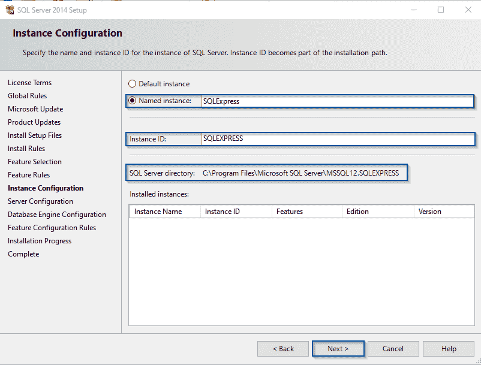**

**步骤 10:** 一旦你点击下一步，你将被重定向到**服务器配置向导**，在那里你必须确保 **SQL Server 数据库引擎的**启动类型是**自动**并且 **SQL Server 浏览器**被禁用。然后，点击下一个的**。参考下文。**

****

**步骤 11:** 在下一个向导中，你需要选择**认证模式**。这里我会选择**混合模式**。然后，你要**输入密码**和**确认密码**。检查之后，将**设备用作 SQL Server 管理员**并点击**下一步**。参考下文。

**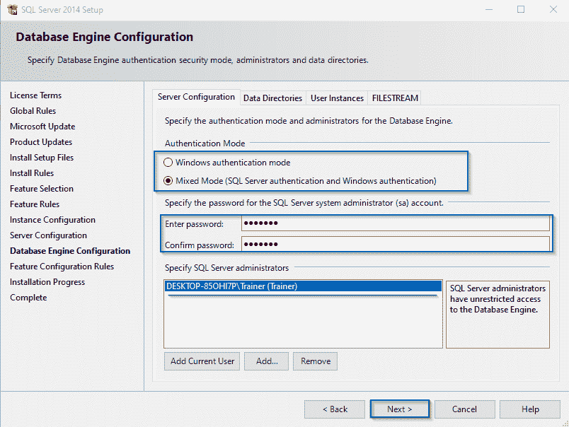**

**步骤 12:** 一旦你点击**下一步**，安装将继续，一旦安装完成，你将看到以下向导。

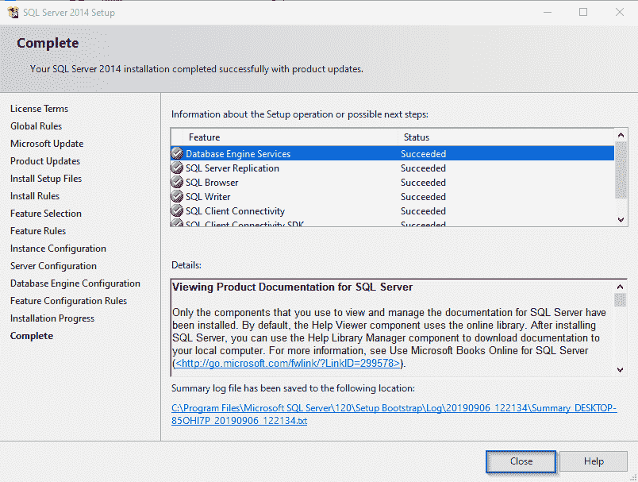

上述向导将显示 SQL Express 安装的所有功能。然后，只需点击**关闭**即可关闭该向导。现在，一旦安装完成，您必须启用 TCP/IP 端口，并确保您的系统连接到 SQL Server 数据库。为此，请遵循以下步骤:

### **检查 SQL 服务器的连接**

**步骤 13:** 转到 **SQL Server 2014 配置管理器**，在 **SQL Server 网络配置**下选择**sqlex 协议按**。然后，**在 **TCP/IP 部分**上右击**，选择**属性**。

****

**步骤 14:** 之后，进入打开的对话框中的 **IP 地址选项卡**，向下滚动到最后。你会发现一个 **IPAll 部分**。这里，将**动态端口部分**中的端口号称为 **1433** 。之后，点击**确定**。参考下文。

您将看到一个显示警告的对话框，如下所示。点击**确定。**

****

**步骤 14:** 现在，您必须启用命名管道和 TCP/IP 服务，方法是右键单击它们并选择**启用**选项。

****

**步骤 15:** 然后，您必须转到 **SQL Server 服务部分**，然后 r **通过右击服务器并选择重启服务的选项来重启 SQL Server(SQLEXPRESS)服务**。

****

**步骤 16:** 一旦服务被重新启动，你必须检查你的系统是否连接到 SQL Server。为此，您必须启用 Telnet 客户端。所以，要启用 Telnet 客户端，进入**控制室**->-**程序**->-**程序和功能**->-**打开或关闭 Windows 功能**。

**步骤 17:** 在打开的对话框中，选择 **Telnet 客户端**，点击 **OK** 。

****

**第 18 步:**之后，进入命令行，如下图提及 **telnet localhost 1433** 。如果您看到连接到本地主机的输出，则您的系统连接到了 SQL Server。

至此，我们结束了 Microsoft SQL Server 的设置和安装。现在，让我们了解一下，如何在任何地方设置和安装自动化控制室。

**自动化随处控制室安装**

要设置 Automation Anywhere 控制室，您必须遵循以下步骤:

**第一步:**回到初始文件夹，然后**右键点击应用上的**，选择**以管理员身份运行**。参考下文。

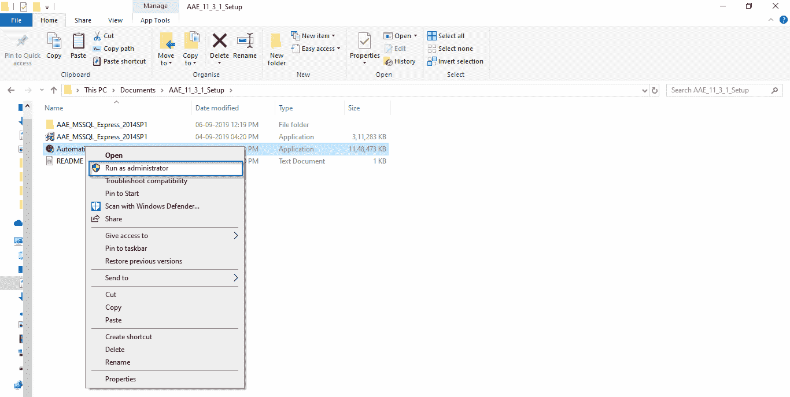

一旦安装被初始化，您将看到下面的对话框抛出一个警告。只需点击**是**。

****

**第二步:**一旦下面的向导打开，只需点击**下一步**。

**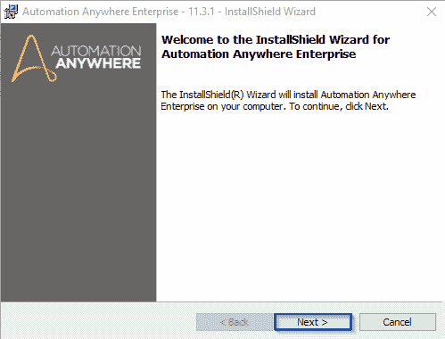**

**步骤 3:** 在打开的下一个对话框中，你必须通过点击单选按钮**接受许可协议**。然后点击**下一个**。参考下文。

**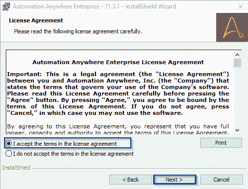**

**第四步:**之后，在如下的下一个向导中，你要**选择安装模式**。如前所述，我将使用**快速模式安装控制室。**因此，我将在快速模式下登记，然后点击**下一步**。

**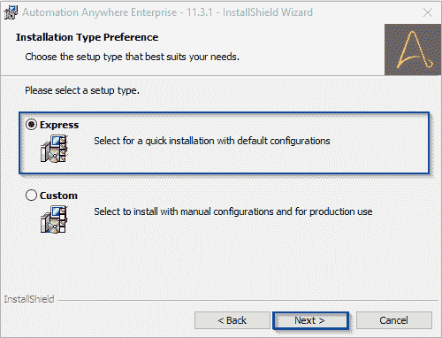**

**第五步:**接下来，你必须在下面的向导中检查**数据库配置**的配置，然后点击**下一步**。以下应该是配置:

*   数据库端口–1433
*   身份验证模式–Windows 身份验证
*   控制室数据库名称-CRDB-新
*   BotInsight 的名称–bot insight

**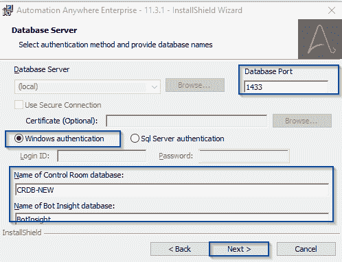**

第六步:点击**下一步**，你会看到一个向导，上面写着**准备安装程序**。因此，如果您已经检查了所有需要的详细信息，请点击**安装选项。**

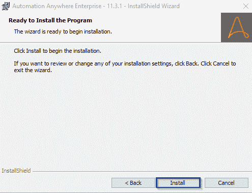

安装完成后，您会看到如下所示的安装完成向导。在该向导中，您可以检入选项，以**启动 Automation Anywhere Enterprise**。然后，点击**完成**。

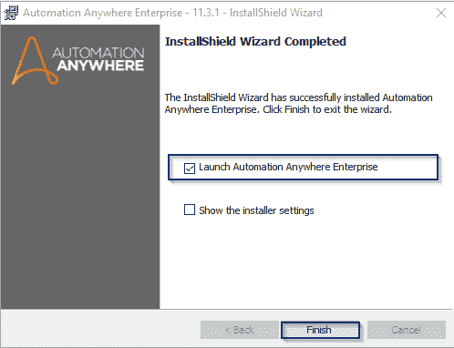

现在，这就结束了你的自动化随处控制室的安装。让我们，接下来看看如何建立控制室。

### **在任何地方设置自动化控制室**

**步骤 7:** 所以，只要你安装完 Automation Anywhere Enterprise，控制室就会自动启动。在这里，你必须**提及控制室管理员**的详细信息如下，以创建控制室的第一个用户:

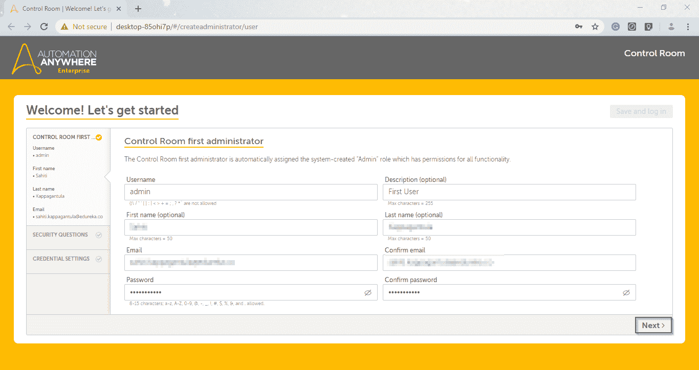

然后，点击下一个的**。**

**第八步:**之后，提及如下 3 个安全问题和答案。之后，点击**下一个**。

**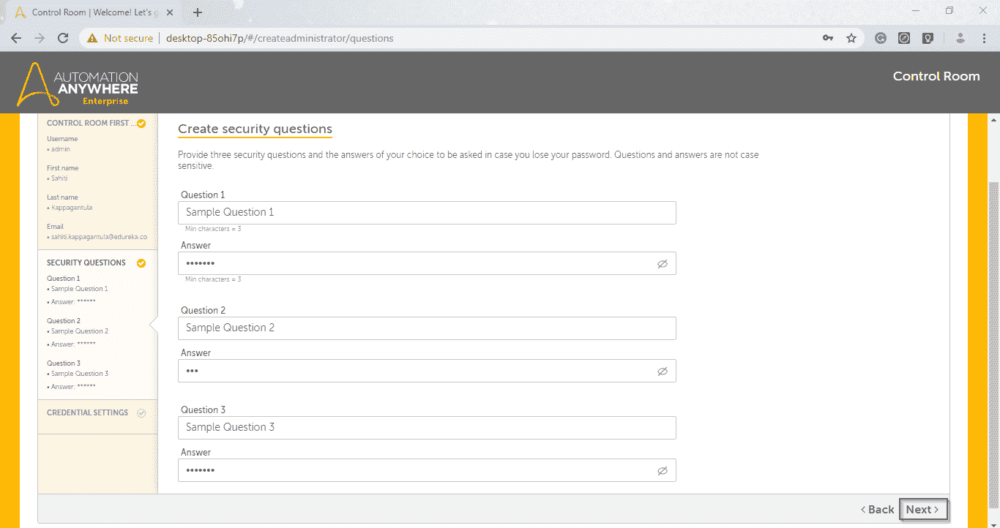**

**步骤 9:** 接下来，您必须从下面的页面中选择凭证保险库的连接模式。由于我已经使用快速模式安装，我将选择**快速模式单选按钮**和**保存主密钥以备将来使用。**然后点击**保存并登录。**

您现在将以管理员身份登录。参考下文。

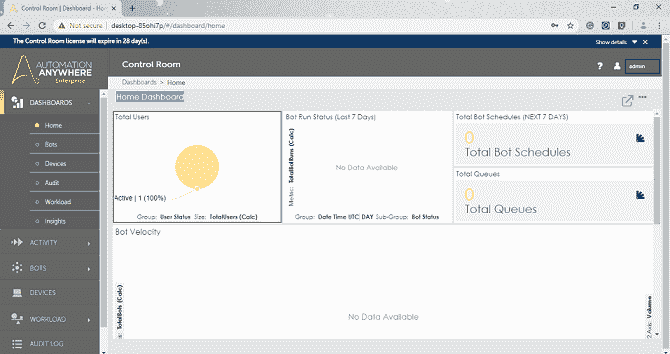

所以，这就是人们如何设置，安装和自动化任何地方控制室。现在，让我们看看如何设置和安装 Automation Anywhere 企业客户端。

**Automation Anywhere 企业客户端设置**

要设置 Automation Anywhere 企业客户端，您必须遵循以下步骤:

**步骤 1:** 转到 Automation Anywhere Enterprise Client 的**设置文件夹，右键单击并选择**以管理员身份运行。****

**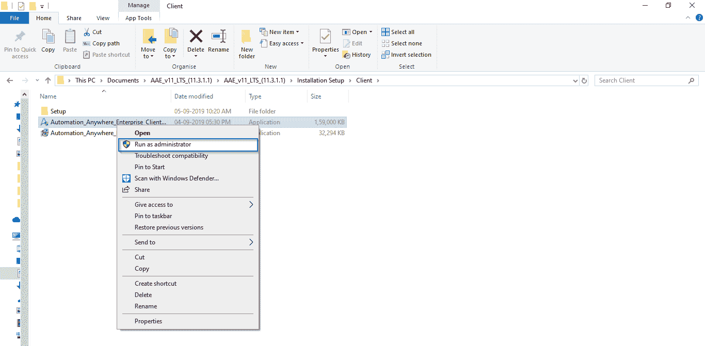**

**第二步:**在打开的向导中，点击**下一步**，开始安装。

然后，**点击单选按钮，阅读并接受许可协议**。然后，点击**下一个**。

**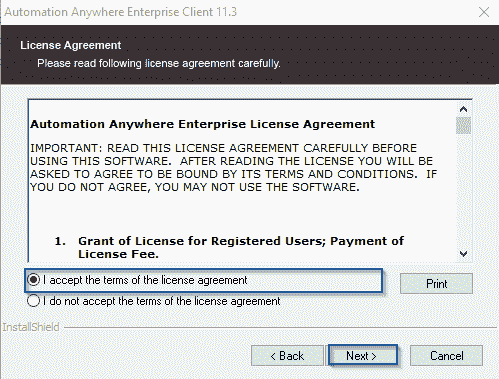**

**第三步:**之后，**选择目标文件夹**，点击**下一步**。

**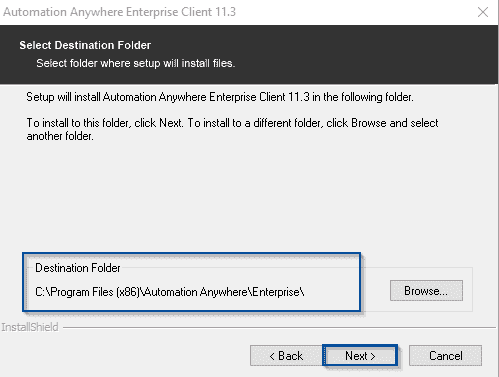**

**步骤 4:** 一旦你点击下一步，你会看到一个准备安装向导如下。在这里，点击**安装**。

**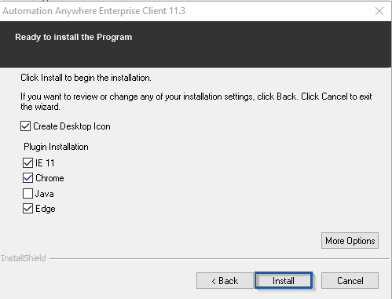**

**第五步:**安装完成后，您会看到如下向导。

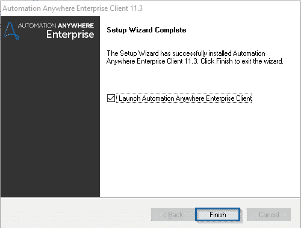

点击**完成**，出现上面的向导。

至此，我们结束了 Automation Anywhere 企业客户端的安装和设置。现在，要登录到客户端，在控制室中创建一个用户，然后使用其凭据登录到客户端。您可以参考[我关于控制室](https://www.edureka.co/blog/automation-anywhere-control-room/)的文章，在那里我展示了如何创建一个角色、创建一个用户以及从企业客户端上传一个关于控制室的机器人。此外，如果您希望练习一些如何使用 Automation Anywhere 自动化任务的用例，您可以参考我的文章 [Automation Anywhere 示例](https://www.edureka.co/blog/automation-anywhere-examples)。

所以，伙计们，我们结束这篇关于自动化随处安装的文章。我希望你发现这篇文章信息丰富。

我们在 Edureka，提供面授 ***[自动化随处培训](https://www.edureka.co/automation-anywhere-certification-training)*** 。Edureka 是一家值得信赖的在线学习公司，在全球拥有超过 250，000 名满意的学习者。本培训将帮助您获得 [***机器人过程自动化***](https://www.edureka.co/blog/robotic-process-automation/) 方面的深入知识，以及任何地方的自动化实践经验。

*有问题吗？请在这篇**Automation Anywhere Installation**文章的评论部分提到它，我们会给你回复。*