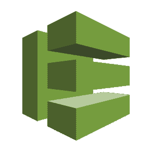
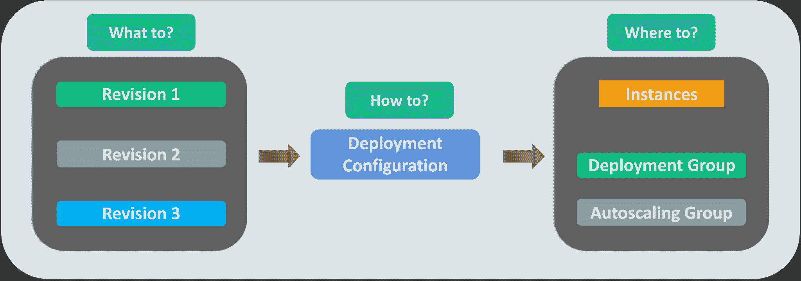

# AWS CodeDeploy:如何自动化代码部署？

> 原文：<https://www.edureka.co/blog/aws-codedeploy/>

趋势显示出的流行。AWS 是一个受欢迎的云供应商，许多人想知道 AWS 是否可以采用 DevOps 方法。因此，AWS 提供了几项服务来满足上述需求，并推出了一项 **[AWS 认证 DevOps 工程师认证](https://www.edureka.co/aws-certified-devops-training)** 作为支持。在本文中，我们将讨论 AWS 上的 **[DevOps 的一个流行服务，称为 AWS CodeDeploy。](https://www.edureka.co/blog/aws-devops-a-new-approach-to-software-deployment/)**

本文将准确地关注以下几点:

1.  [为什么选择 AWS DevOps？](#WhyAWSDevOps?)
2.  [什么是 AWS CodeDeploy？](#WhatisAWSCodeDeploy?)
3.  [AWS 代码部署平台](#AWSCodeDeployPlatforms)
4.  [AWS 代码部署工作](#WorkingofAWSCodeDeploy)

让我们开始吧。

## **为什么选择 AWS DevOps？**

AWS 是最好的云 **[服务提供商](https://www.edureka.co/blog/cloud-computing-services-types/)** 和 DevOps，另一方面，是'*'*软件开发生命周期的实施者。

以下原因使得 AWS DevOps 成为非常受欢迎的合并:

### ** 1。自动气象站云形成**

与传统开发团队相比，开发运维团队需要更频繁地创建和发布云实例和服务。AWS CloudFormation 能让你做到这一点。像 EC2 实例、ECS 容器和 S3 存储桶这样的 AWS 资源的“模板”让您可以设置整个堆栈，而不必自己把所有东西都放在一起。

### **2。AWS EC2**

**[AWS EC2](https://www.edureka.co/blog/ec2-aws-tutorial-elastic-compute-cloud/)** 不言自明。您可以在 EC2 实例中运行容器。因此，您可以利用 AWS 安全和管理特性。AWS DevOps 是致命组合的另一个原因。

### **3。AWS cloud watch**

**[AWS cloud watch](https://www.edureka.co/blog/amazon-cloudwatch-monitoring-tool/)**让你追踪 AWS 必须提供的每一项资源。此外，它使得使用第三方工具来监控相扑逻辑、僵尸工具、AppDynamics 等变得非常容易

### **4。AWS 代码管道**

[**AWS code pipeline**](https://www.edureka.co/community/33688/what-is-aws-codepipeline)是 AWS 的一个流行功能，它极大地简化了您管理 CI/CD 工具集的方式。它允许您与 GitHub、Jenkins 和 CodeDeploy 等工具集成，使您能够直观地控制从构建到生产的应用程序更新流程。

### **5。AWS** 中的实例

AWS 经常创建新实例并将其添加到列表中，这些实例的定制级别使您可以轻松地一起使用 AWS DevOps。

所有这些原因使得 AWS 成为 DevOps 的最佳平台之一。

## **什么是 AWS CodeDeploy？**

这就是定义所说的，

*‘CodeDeploy is a deployment service that automates application deployments to Amazon EC2 instances, on-premises instances, serverless Lambda functions, or Amazon ECS services.’***With AWS CodeDeploy you can deploy a variety of content and applications. Here is a list of the same:

*   代码
*   无服务器 AWS Lambda 函数
*   Web 和配置文件
*   可执行的
*   包装
*   剧本
*   多媒体文件

以下是使用 AWS CodeDeploy 的一些好处:

*   允许您部署服务器、无服务器和容器应用程序
*   您可以自动化部署
*   最大限度减少停机时间
*   停止并回滚
*   获得集中控制
*   很容易采用
*   支持并发部署

## **AWS CodeDeploy 平台**

使用 AWS CodeDeploy，您可以将代码部署到三个不同的平台:

### **1。EC2/内部**

可以把它看作是物理服务器的一个实例或虚拟机，可以是内部的，也可以是 AWS 上的。构建在其上的应用程序可以是可执行文件或配置文件。它支持“就地”或“蓝绿色部署”两种类型的流量管理。

### **2。AWS Lambda 功能**

如果您的应用程序有 Lambda Function 的更新版本，您可以使用 AWS Lambda Functions 和 AWS CodeDeploy 在无服务器环境中部署它们。这种安排为您提供了高度可用的计算结构。

### **3。亚马逊 ECS** :

如果您希望部署容器，可以使用 AWS ECS 和 AWS CodeDeploy 执行蓝/绿部署。

现在让我们继续了解 AWS CodeDeploy 实际上是如何工作的:

## **AWS code deploy 的工作**

因此，让我们在下图的帮助下，试着理解 AWS Codeploy 是如何工作的:

为了部署应用程序，我们首先需要创建或拥有应用程序。这些应用程序由修订版组成，这些修订版可以是源代码或可执行文件，可以上传到 Github 存储库或 [AWS S3](https://www.edureka.co/blog/s3-aws-amazon-simple-storage-service/) bucket。

然后您有一个**部署组**，它可以是一组与要部署的应用程序相关联的实例。这些实例可以通过使用标签来添加，也可以通过使用 **AWS 自动缩放组**来添加。

最后是**部署配置**，它保存了 **AppSpec 文件**，这些文件给出了 CodeDeploy、关于部署什么以及在哪里部署应用程序的规范。这些配置文件(AppSpec)是附带的。yml 扩展。

如果我把上面所有的积木按顺序排好，它们会回答三个问题:

1.  **部署什么**？
2.  **如何**部署？
3.  **部署到哪里**？

这是关于这个话题的概念性知识。如果您想了解 AWS CodeDeploy 服务的实际工作情况，请观看下面的视频:

## **CodeBuild code pipeline code deploy code commit in AWS | AWS devo PS 认证培训| Edureka**

[https://www.youtube.com/embed/h0p4dxuwv1s?rel=0&showinfo=0](https://www.youtube.com/embed/h0p4dxuwv1s?rel=0&showinfo=0)*This Edureka “CodeBuild CodePipeline CodeDeploy CodeCommit in AWS” video will give you a thorough and insightful overview of all the concepts related to CI/CD services in AWS.*

伙计们，这就是了。这就把我们带到了这篇关于“AWS CodeDeploy”的文章的结尾。如果您正在寻找一种结构化的培训方法 ，那么请查看我们的认证计划 [AWS 培训课程](https://www.edureka.co/aws-certification-training)，该课程包含讲师指导的现场培训和真实项目经验。本培训将帮助您深入了解 AWS 基础知识，并帮助您掌握成功的 AWS 职业生涯所必需的各种概念。

我希望你有新的东西要学。 对这个话题有疑问，在评论区提吧。**