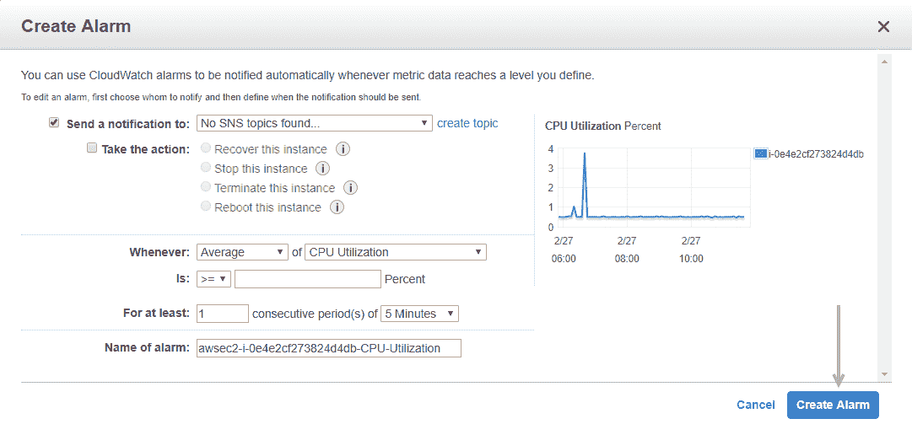
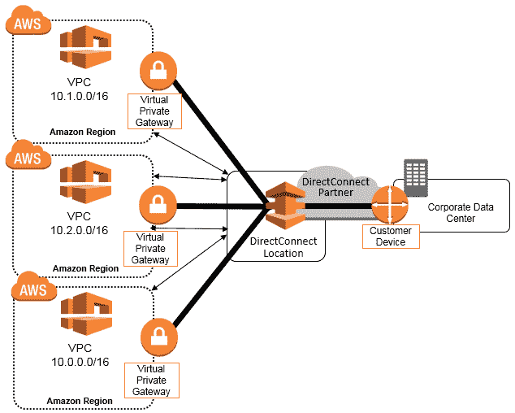
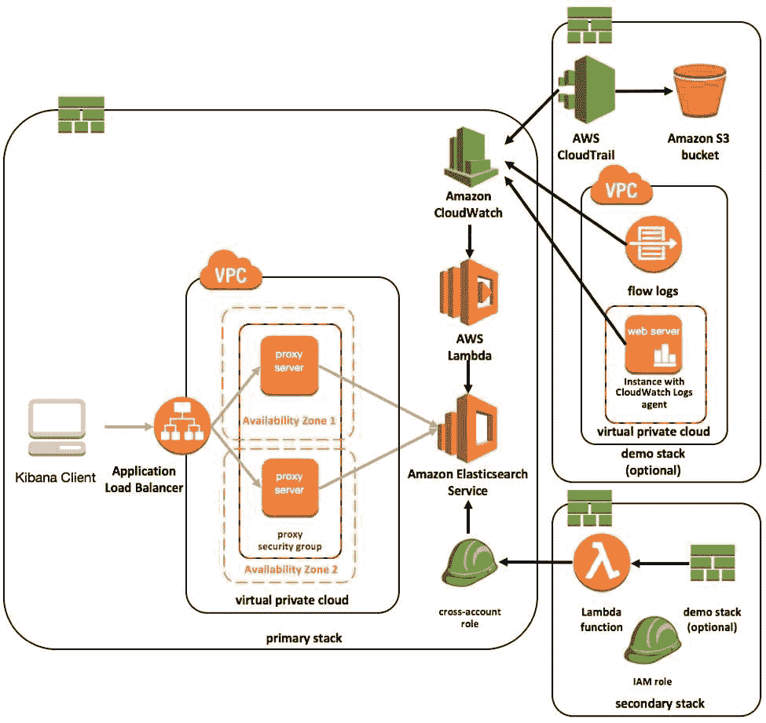
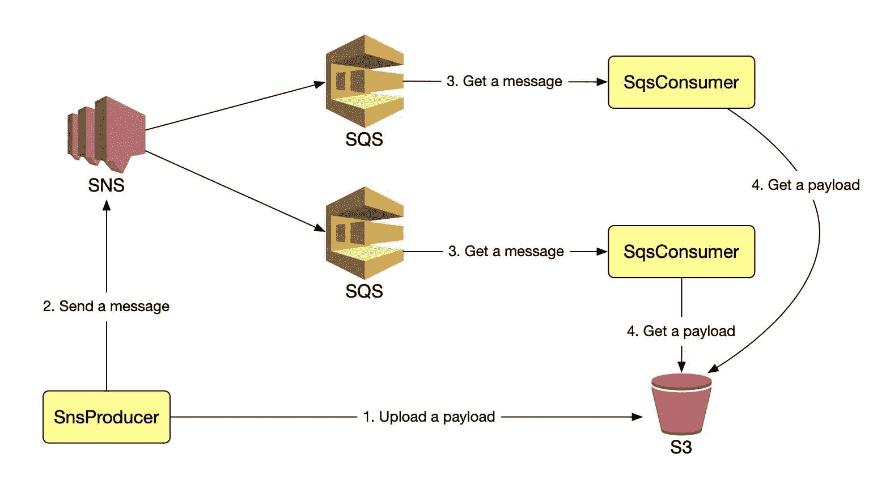

# 2023 年 100+ AWS 面试问答

> 原文：<https://www.edureka.co/blog/interview-questions/aws-interview-questions/>

AWS 连续第十二次被评为 2022 年云基础设施和平台服务幻方图的领导者(CIPS)。根据 Gartner 的数据，AWS 是 CIPS 魔力象限运行时间最长的领导者。根据 IDC 研究 的数据，48%的企业计划保持稳定的云支出。毫无疑问，AWS 解决方案架构师职位是 IT 工作中最受欢迎的职位之一。通过参加 Edureka 的 ***[AWS 认证培训](https://www.edureka.co/aws-certification-training)*** ，您也可以最大限度地利用云计算职业机会。在这篇博客中，我们将通过 AWS 面试问答为你的下一次面试做准备

****

**为什么 AWS 面试 Questi** **ons？**

**AWS 解决方案架构师角色:**关于 AWS，解决方案架构师将为现有系统设计和定义 AWS 架构，将它们迁移到云架构，并为未来的 AWS 云实施制定技术路线图。所以，通过这篇 AWS 面试问答文章，我将为大家带来最常见的 AWS 面试问题。通过 [AWS 硕士项目](https://www.edureka.co/masters-program/aws-cloud-certification-training)，精通云实施的设计、规划和扩展。

以下是这篇文章的提纲:

*   [**第一节:基础知识 AWS 面试题**](#cloudcomputing)
*   [**第二节:亚马逊 EC2 面试问题**](#ec2)
*   [**第三节:亚马逊仓储面试问题**](#amazonstorage)
*   [**第四节:AWS VPC 面试试题**](#aws-vpc)
*   [**第五节:亚马逊数据库面试问题**](#amazon-db)
*   [**第六节:AWS 自动伸缩、AWS 负载均衡器面试题**](#autoscaling)
*   [**第七节:CloudTrail，53 路面试问题**](#route53)
*   [**第八节:AWS SQS、AWS SNS、AWS SES、AWS ElasticBeanstalk 面试题**](#aws-sqs)
*   [**第九节:AWS OpsWorks，AWS KMS 面试题**](#opsworks)

现在在每一部分中，我们将从 AWS 基本面试问题开始，然后转向 AWS 有经验的人的面试问题和答案，这在技术上更具挑战性，

## **AWS 面试问答 2023 | AWS 解决方案架构师培训| edu reka**

[https://www.youtube.com/embed/d9siPwxzEVI?rel=0&showinfo=0](https://www.youtube.com/embed/d9siPwxzEVI?rel=0&showinfo=0)*In this Edureka AWS Interview Questions video, you will get to know the questions which you may face in the interview, the concepts explained here are essential for any Solution Architect in the making.*Let us begin by looking into the basic AWS interview questions and answers.

## **第一节:基础 AWS 面试问题**

### **1。什么是云计算？你能谈论和比较任何两个受欢迎的云服务提供商吗？**

关于这个话题的详细讨论，请参考我们的 [**云计算**](https://www.edureka.co/blog/what-is-cloud-computing/) 博客。以下是两个最受欢迎的云服务提供商的对比:

**亚马逊网络服务 Vs 微软 Azure**

| **参数** | **AWS** | **蔚蓝** |
| **入会** | 2006 年 | 2010 年 |
| **市场份额** | 4x | x |
| **实现** | 选项少 | 更多可能的实验 |
| **特征** | 最广泛的选择 | 良好的选择范围 |
| **App 托管** | AWS 不如 Azure | 天蓝色更好 |
| **发展** | 千姿百态&大特色 | 千姿百态&大特色 |
| **IaaS 产品** | 良好的市场占有率 | 比 AWS 更好的产品 |

### **2..** **试试这个 AWS **情景基础面试题。**** **我有一些私有服务器，我也将一些工作负载分布在公共云上，这种架构叫什么？**

1.  虚拟专用网
2.  私有云
3.  虚拟私有云
4.  混合云

**答 D.**

**解释:** 这种类型的架构会是混合云。为什么？因为我们同时使用公共云和您的本地服务器，即私有云。为了使这种混合架构易于使用，如果您的私有云和公共云都在同一个网络上(虚拟地)不是更好吗？这是通过将您的公共云服务器包含在虚拟私有云中，并使用 VPN(虚拟专用网络)将该虚拟云与您的本地服务器连接起来而实现的。

通过[谷歌云平台课程](https://www.edureka.co/google-cloud-architect-certification-training)，学习设计、开发和管理一个健壮、安全、高度可用的基于云的解决方案，以满足您组织的需求。

### **3。定义并解释所有服务的三个初始订单以及基于这些订单的 AWS 产品。**

云服务主要有三种类型:计算、存储和网络。

然后是基于所有服务的三个订单构建的 AWS 产品。EC2、Elastic Beanstalk、Lambda、Auto-Scaling 和 Lightsail 等计算服务就是例证。S3、冰川、弹性块存储和弹性文件系统就是存储的例子。VPC、亚马逊 CloudFront 和 Route53 是网络服务的范例。

### **4。云计算的主要特点是什么？**

云计算具有以下关键特征:

1.  可以快速供应大量计算资源。
2.  由于资源的位置独立性，可以从任何有互联网连接的位置访问资源。
3.  与物理设备不同，云存储没有容量限制，这使得它的存储效率非常高。
4.  多租户允许大量用户共享资源。
5.  有了云计算，数据备份和灾难恢复变得越来越容易，成本也越来越低。
6.  它的可扩展性使企业能够根据云计算的需要进行扩展和缩减。

### **5。解释 AWS。**

AWS 是 Amazon Web Services 的缩写，是一个远程计算服务的集合，也称为云计算。 这项技术也被称为 IaaS，即基础设施即服务。

### **6。列举一些非地区性的 AWS 服务。**

一些非地区性的 AWS 服务。

1.  云锋
2.  我是
3.  53 号公路
4.  Web 应用防火墙

### **7。定义云架构的不同层是什么？**

以下是云架构运行的各个层:

*   CLC 或云控制器。
*   集群控制器
*   SC 或存储控制器
*   NC，或节点控制器
*   海象

### **8。云计算的各个层次是什么？解释他们的工作。**

云计算类别有不同的层次，包括

1.  基础设施即服务(IaaS)是按需提供服务，如服务器、存储、网络和操作系统。
2.  平台即服务(PaaS)将 IaaS 与中间件服务、软件开发和部署工具的抽象集合相结合。
3.  PaaS 还使开发者能够在云中快速创建 web 或移动应用。
4.  软件即服务(SaaS)是一种在多租户模式下按需交付的软件应用
5.  功能即服务(FaaS)支持最终用户在无服务器架构上构建和执行应用功能。

### **9。各种云版本有哪些？**

部署云服务有几种模式:

1.  公共云是由第三方云提供商拥有和运营的计算机资源(如硬件、软件、服务器、存储等)的集合，供企业或个人使用。
2.  私有云是由组织拥有和管理的资源集合，供其员工、合作伙伴或客户使用。
3.  混合云是一种结合了公共云服务和私有云服务的云。

### **10。** **列举无服务器计算的利弊。**

**优点:**

1.  性价比
2.  操作已经简化。
3.  提高生产率
4.  可扩展

**缺点:**

1.  这会导致响应延迟
2.  由于资源限制，不适合高计算运算。
3.  不太安全。
4.  调试可能会很困难。

### **11。云架构有哪些区别于传统云架构的特征？**

特征如下:

*   在云中，基于云架构产生的需求来满足硬件需求。
*   当对资源有需求时，云架构可以对其进行扩展。
*   云架构可以管理和处理动态工作负载，不会出现单点故障。

### **12。AWS 有哪些特色服务？**

AWS 的关键组件如下:

*   **弹性计算云(EC2):** 它是一种计算资源，可按需用于托管应用程序。 在工作量不确定的时候，EC2 就派上了用场。
*   **路由 53:** 它是一种基于 web 的 DNS 服务。
*   **简单存储设备 S3** :这是一个广泛应用于 AWS 身份和访问管理的存储设备服务。
*   **弹性块存储:**可以存储恒定量的数据，与 EC2 集成。它还允许您持久化数据。
*   **云手表:**它可以让你监控 AWS 的关键区域，甚至可以设置故障排除提醒。
*   **简单的电子邮件服务:**它允许你使用常规的 SMTP 或 restful API 调用发送电子邮件。

## **第二节:亚马逊 EC2**AWS 面试问答

关于这个话题的详细讨论，请参考我们的 [**EC2 AWS**](https://www.edureka.co/blog/ec2-aws-tutorial-elastic-compute-cloud/) 博客。

### **13。以下命令对 Amazon EC2 安全组有什么作用？**

**ec2-create-group 创建安全组**

1.  将用户创建的安全组分组到一个新的组中，以便于访问。
2.  为您的帐户创建一个新的安全组。
3.  在安全组内创建一个新组。
4.  在安全组 内创建新规则。

**答案 B.**

**解释:**安全组就像一个防火墙，它控制进出你的实例的流量。在 AWS 术语中，入站和出站流量。提到的命令非常简单，它说创建安全组，并做同样的事情。接下来，一旦创建了安全组，就可以在其中添加不同的规则。例如，您有一个 RDS 实例，要访问它，您必须在其安全组中添加您要从中访问该实例的机器的公共 IP 地址。

### **14。下面是基于 **aws 场景的面试问题。** 你有一个视频转码应用。根据队列处理视频。如果视频的处理在一个实例中被中断，则在另一个实例中继续。目前有大量积压的视频需要处理，为此你需要添加更多的实例，但你只需要这些实例，直到你的积压减少。以下哪一个是有效的方法？**

你应该按需使用一个实例进行同样的操作。为什么？首先，现在必须处理工作量，这意味着它是紧急的，其次，一旦您的积压被清除，您就不需要它们了，因此保留的实例是不可能的，并且由于工作是紧急的，您不能仅仅因为现货价格飙升就停止您的实例上的工作，因此也不应使用现货实例。因此，在这种情况下，按需实例应该是正确的选择。

### **15。您有一个跨多个 Amazon EC2 实例定期处理大量数据的分布式应用程序。该应用程序旨在从 Amazon EC2 实例故障中正常恢复。你需要以最具成本效益的方式完成这项任务。**

**以下哪一项会符合你的要求？**

1.  斑点实例
2.  保留实例
3.  专用实例
4.  按需实例

**答:答**

**解释:** 由于我们在这里处理的工作不是连续的，所以保留的实例有时会空闲，按需实例也是如此。此外，每当工作开始时就启动一个随需应变的实例是没有意义的，因为它是昂贵的。因此，现货实例将是合适的，因为它们的低利率和没有长期承诺。

**查看我们在顶级城市的 AWS 认证培训**

| 印度 | 美国 | 其他国家 |
| [在海德拉巴的 AWS 培训](https://www.edureka.co/aws-certification-training-hyderabad) | [亚特兰大 AWS 培训](https://www.edureka.co/aws-certification-training-atlanta) | [AWS 伦敦培训](https://www.edureka.co/aws-certification-training-london) |
| [班加罗尔的 AWS 培训](https://www.edureka.co/aws-certification-training-bangalore) | [波士顿 AWS 培训](https://www.edureka.co/aws-certification-training-boston) | [阿德莱德的 AWS 培训](https://www.edureka.co/aws-certification-training-adelaide) |
| [钦奈的 AWS 培训](https://www.edureka.co/aws-certification-training-chennai) | [纽约市的 AWS 培训](https://www.edureka.co/aws-certification-training-new-york-city) | [新加坡 AWS 培训](https://www.edureka.co/aws-certification-training-singapore) |

详细的，你甚至可以通过 [AWS 云迁移培训](https://www.edureka.co/migrating-to-aws)了解迁移到 AWS 的细节。

### **16。停止和终止实例有何不同？**

开始、停止和终止是 EC2 实例中的三种状态，我们来详细讨论一下:

*   **停止和启动** 一个实例:当一个实例被停止时，该实例执行正常关机，然后转换到停止状态。它的所有 Amazon EBS 卷都保持连接状态，您可以在以后再次启动该实例。当实例处于停止状态时，不会对额外的实例小时数收费。
*   **终止** 实例:当一个实例被终止时，该实例执行正常关闭，然后附加的 Amazon EBS 卷被删除，除非卷的*deleteonttermination*属性被设置为 false。实例本身也会被删除，以后您不能再次启动该实例。

### **17。如果我希望我的实例在单租户硬件上运行，我必须将实例的租户属性设置为哪个值？**

1.  专用
2.  孤立的
3.  一个
4.  保留

**答一.**

**说明:** 实例租用属性应该设置为专用实例。其余值无效。

### **18。弹性 IP 地址(EIP)何时会产生成本？**

1.  分配 EIP 时。
2.  当它被分配并与正在运行的实例相关联时。
3.  当它被分配并与一个停止的实例相关联时。
4.  无论 EIP 是否与正在运行的实例相关联，都会产生成本。

**答 C.**

**说明:** 如果你的运行实例只附带一个弹性 IP 地址，你是不收费的。但是在下列情况下你会被充电:

*   当您在实例中使用多个弹性 IPs 时。
*   当您的弹性 IP 附加到已停止的实例时。
*   当您的弹性 IP 未附加到任何实例时。

### **19。Spot 实例与按需实例或保留实例有何不同？**

首先我们要明白，现货实例、按需实例、预约实例都是定价的模型。随着时间的推移，spot 实例使客户能够购买计算能力，而无需预先承诺，每小时的费用通常低于每个地区的按需费用。现货就像投标一样，投标价叫做现货价。举例来说，现货价格会根据供给和需求而波动，但客户永远不会支付超过他们指定的最高价格。如果现货价格高于客户的最高价格，客户的 EC2 实例将自动关闭。但是反过来是不正确的，如果现货价格再次下降，您的 EC2 实例将不会自动启动，必须手动启动。在即时和按需的情况下，用户方对持续时间没有承诺，但是在预约的情况下，用户必须坚持他所选择的时间段。

### **20。保留的实例可用于多 AZ 部署吗？**

1.  多 AZ 部署仅适用于集群计算实例类型
2.  适用于所有实例类型
3.  仅适用于 M3 实例类型
4.  D .不可用于保留实例

**答案 B.**

**解释:** 预留实例是一种定价模型，适用于 EC2 中的所有实例类型。

### **21。如何使用 c4.8xlarge 实例上可用的处理器状态控制功能？**

处理器状态控制包括两种状态:

*   C 状态–睡眠状态从 c0 变化到 c6。C6 是处理器的最深睡眠状态
*   P 状态-性能状态 p0 为最高频率，p15 为最低频率。

现在，为什么是 C 态和 P 态。处理器有内核，这些内核需要散热空间来提升性能。现在，由于所有内核都在处理器上，温度应该保持在最佳状态，以便所有内核都能以最高性能运行。

现在，这些州将如何对此有所帮助呢？如果一个内核进入睡眠状态，它将降低处理器的整体温度，因此其他内核可以执行得更好。现在，它可以与其他内核同步，因此处理器可以通过及时让其他内核休眠来提升尽可能多的内核，从而获得整体性能提升。

最后，C 和 P 状态可以在一些 EC2 实例中定制，如 c4.8xlarge 实例，因此您可以根据您的工作负载定制处理器。

### **22。当您在集群放置组中启动实例时，您可以预期哪种网络性能参数？**

网络性能取决于实例类型和网络性能规格，如果在放置组中启动，您最多可以预期

*   单流中 10 Gbps，
*   20 Gbps 多流模式，即全双工模式
*   放置组外的网络流量将被限制在 5 Gbps(全双工)。

### **23。要在 AWS 中部署 4 节点 Hadoop 集群，可以使用哪种实例类型？**

首先让我们了解 Hadoop 集群中的实际情况，Hadoop 集群遵循主从概念。主机处理所有数据，从机存储数据并充当数据节点。因为所有的存储都发生在从设备上，所以推荐使用更高容量的硬盘，因为主设备完成所有的处理，所以需要更高的 RAM 和更好的 CPU。因此，您可以根据您的工作负载选择机器的配置。例如，在这种情况下，c4.8xlarge 将是主机的首选，而对于从机，我们可以选择 i2.large 实例。 如果您不想手动配置实例和安装 hadoop 集群，您可以直接启动 Amazon EMR (Elastic Map Reduce)实例，它会自动为您配置服务器。您将数据转储到 S3 进行处理，EMR 从那里提取数据，进行处理，然后转储回 S3。

### **24。当你为一个解决方案设计一个架构时，你认为 AMI 适合哪里？**

AMI(Amazon 机器映像)就像虚拟机的模板，一个实例来自 AMI。AWS 提供预烘焙的 ami，您可以在启动实例时选择，有些 ami 不是免费的，因此可以从 AWS 市场购买。您还可以选择创建自己的自定义 AMI，这将有助于您节省 AWS 上的空间。例如，如果您的安装不需要一套软件，您可以定制您的 AMI 来完成这项工作。这使得成本效益，因为你是删除不需要的东西。

### **25。您如何选择可用性区域？**

让我们通过一个例子来理解这一点，假设有一家公司在印度和美国都有用户群。

让我们看看我们将如何为这个用例选择地区:

所以，参照上图可以选择的地区是，孟买和北弗吉尼亚。现在让我们先比较一下价格，你有每小时的价格，可以转换成你每月的数字。在这里，北弗吉尼亚成为了赢家。但是，定价不能是唯一要考虑的参数。性能也应该牢记在心，因此，让我们看看延迟。延迟基本上是服务器响应你的请求的时间，即响应时间。北弗吉尼亚又赢了！

综上所述，北弗吉尼亚应该被选作这个用例。

### **26。对于我正在运行的每个实例，一个弹性 IP 地址是否足够？**

看情况！每个实例都有自己的私有和公有地址。私有地址只与实例相关联，并且只有在实例停止或终止时才返回给 Amazon EC2。类似地，公共地址只与实例相关联，直到它被停止或终止。然而，这可以由弹性 IP 地址来代替，只要用户没有手动分离它，它就和实例在一起。但是，如果您在 EC2 服务器上托管多个网站，在这种情况下，您可能需要不止一个弹性 IP 地址。

### **27。Amazon EC2 中的安全最佳实践是什么？**

有几个保护 Amazon EC2 的最佳实践。下面给出几个:

*   使用 AWS 身份和访问管理(IAM)来控制对 AWS 资源的访问。
*   通过仅允许可信主机或网络访问实例上的端口来限制访问。
*   定期检查您的安全组中的规则，确保您应用最少原则
*   Privilege–只开放您需要的权限。
*   对从 AMI 启动的实例禁用基于密码的登录。密码可以被发现或破解，这是一个安全风险。

### **28。如何在几乎不停机的情况下升级或降级系统？**

以下步骤可用于更新或降级接近零停机时间的系统:

首先，您必须启动 EC2 控制台，然后选择 AMI 操作系统。下一步是使用新的实例类型创建一个实例；你需要安装更新并转到设置应用程序。然后检查实例是否可操作，如果一切正常，您将部署新的实例并替换所有旧的实例。现在，一旦安装的一切准备就绪，您就可以升级或降级系统，几乎不停机

### **29。亚马逊 EC2 根设备体积是多少？**

用于引导 EC2 实例的映像保存在根设备片上，这发生在 Amazon AMI 启动新的 EC2 案例时。EBS 或实例存储支持该根设备卷。一般来说，EC2 实例的生命周期不会影响存储在 Amazon EBS 上的根设备数据。

### 三十岁。提及并解释 Amazon EC2 实例的多种类型。

亚马逊 EC2 通用实例上可用的各种实例:

1.  它们用于计算各种任务，并帮助分配处理器、内存和网络资源。
2.  针对计算优化的实例:这些实例适用于计算密集型工作负载。它们可以处理批处理工作负载、高性能 web 服务器、机器学习推理和各种其他任务。
3.  内存优化:它们处理并提供管理内存中大量数据集的任务。
4.  计算速度:加速浮点数计算、数据模式匹配和图形处理的执行。
5.  优化存储:他们在需要对大数据集进行顺序读写访问的本地存储上执行操作。

### 31。亚马逊 EC2 中的‘改变’到底是什么意思？

Amazon EC2 现在为客户提供了从当前的“基于实例数量的限制”转移到新的“基于 vCPU 的限制”的选项因此，在启动需求驱动的混合实例类型时，会根据 vCPUs 的数量来评估使用情况。

### 32。您的应用程序正在 EC2 实例上运行。当您的实例的 CPU 消耗达到 80%时，您必须降低它的负载。你用什么方法完成这项任务？

当 EC2 实例的 CPU 消耗超过 80%时，设置一个自动扩展组来部署新实例，并通过部署应用程序负载平衡器和将 EC2 实例指定为目标实例来在实例之间分配流量，可以做到这一点。

### 33。如何设置 CloudWatch 来恢复 EC2 实例？

下面是你如何设置它们:

1.  使用亚马逊 CloudWatch，创建一个警报。
2.  导航至警报的定义警报- >动作选项卡。
3.  选择恢复此实例的选项

###  **34。如何恢复/登录到丢失了密钥的 EC2 实例？** 

如果您丢失了密钥，请按照以下步骤恢复 EC2 实例:

**第一步。** 验证 EC2Config 服务正在运行。

**第二步。** 分离实例的根卷。

**第三步。** 将卷连接到临时实例

**第四步。** 改变配置文件

**第五步。** 重启原实例。

## **第三节:亚马逊存储的 AWS 面试问题**

### 35。亚马逊 S3 到底是什么？

### 解释 S3 代表简单存储服务，亚马逊 S3 是使用最广泛的仓库平台。S3 是一个对象仓库服务，可以从任何位置存储和回收任何数量的数据。尽管它很僵硬，但它基本上是不可测量的，也是有成本效益的，因为它是一个需求仓库。远离这些优势，它提供了新的情况下的连续性和真空。亚马逊 S3 在降低成本、访问控制和合规性的数据操作方面提供帮助。

### 36。亚马逊 S3 有哪些存储类别？

解释:使用亚马逊 S3 可以访问以下存储类别:

1.  存储类亚马逊 S3 冰川即时检索
2.  亚马逊 S3 冰川灵活检索存储类(原 S3 冰川)
3.  亚马逊 S3 上的冰川深层档案(S3 冰川深层档案)
4.  储藏类 S3 前哨
5.  亚马逊 S3 标准-偶尔访问(S3 标准-IA)
6.  亚马逊 S3 One Zone-Only 偶尔访问(S3 One Zone-IA)
7.  亚马逊 S3 基础版(S3 标准版)
8.  冗余减少的亚马逊 S3 存储
9.  亚马逊 S3 智能分层(S3 智能分层)

37。如何自动删除旧快照？

说明:下面是自动删除过期照片的方法:

1.  根据流程和最佳实践拍摄亚马逊 S3 上的 EBS 卷的快照。
2.  要自动管理所有快照，请使用 AWS Ops Automator。
3.  您可以使用它来生成、复制和删除 Amazon EBS 快照。

### **38。** **另一个**基于场景的面试问题。**** **您需要配置一个亚马逊 S3 存储桶来为面向公众的 web 应用程序提供静态资产。哪种方法可以确保上传到 bucket 的所有对象都设置为公共读取？**

1.  在上传期间将对象的权限设置为公共读取。
2.  配置存储桶策略，将所有对象设置为公共读取。
3.  使用 AWS 身份和访问管理角色将存储桶设置为公共读取。
4.  亚马逊 S3 对象默认为公共读取，因此不需要任何操作。

**答案 B.**

**解释:** 与其对每个对象进行更改，不如为整个桶设置策略。IAM 用于提供更细粒度的权限，因为这是一个网站，所有对象在默认情况下都是公开的。

### **39。一个客户希望利用亚马逊简单存储服务(S3)和亚马逊冰川作为其备份和归档基础架构的一部分。客户计划使用第三方软件来支持这种集成。哪种方法会将第三方软件的访问仅限于名为“公司备份”的亚马逊 S3 存储桶？**

1.  一个自定义桶策略仅限于亚马逊 S3 API 中的三个亚马逊冰川档案“公司-备份”
2.  仅限于“公司-备份”中的亚马逊 S3 API 的自定义存储桶策略
3.  自定义 IAM 用户策略，仅限于亚马逊冰川档案“公司备份”的亚马逊 S3 API。
4.  自定义 IAM 用户策略，仅限于“公司-备份”中的亚马逊 S3 API。

**答 D.**

**解释:** 从前面的问题中提取队列，这个用例涉及更细粒度的权限，因此这里将使用 IAM。

### **40。S3 可以与 EC2 实例一起使用吗？如果可以，如何使用？**

是的，它可以用于具有由本地实例存储支持的根设备的实例。通过使用亚马逊 S3，开发人员可以访问亚马逊用来运行其全球网站网络的高度可扩展、可靠、快速、廉价的数据存储基础设施。为了在亚马逊 EC2 环境中执行系统，开发人员使用提供的工具将他们的亚马逊机器映像(AMIs)加载到亚马逊 S3，并在亚马逊 S3 和亚马逊 EC2 之间移动它们。

另一个用例是 EC2 上托管的网站从 S3 加载静态内容。

关于 S3 的详细论述，请参考我们的 [**S3 AWS**](https://www.edureka.co/blog/s3-aws-amazon-simple-storage-service/) 博客。

### **41。一家客户在其主办公室实施了 AWS 存储网关，其中包含网关缓存卷。一个事件使主办公室和分支办公室之间的链接脱机。哪种方法可以让分支机构访问他们的数据？**

1.  通过在亚马逊 S3 存储桶上实施生命周期策略进行恢复。
2.  调用 Amazon Glacier Restore API，在 4 到 6 个小时内将文件加载到另一个 Amazon S3 存储桶中。
3.  在 Amazon EC2 中启动一个新的 AWS 存储网关实例 AMI，并从网关快照中恢复。
4.  从网关快照创建一个 Amazon EBS 卷，并将其挂载到 Amazon EC2 实例。

**答 C.**

**解释:** 最快的方法是启动一个新的存储网关实例。为什么？由于时间是推动每项业务的关键因素，因此解决此问题需要更多时间。而不是仅仅在新的实例上恢复存储网关以前的工作状态。

### **42。当您需要使用互联网远距离移动数据时，例如跨越国家或大陆将数据移动到您的亚马逊 S3 存储桶，您会使用哪种方法或服务？**

1.  亚马逊冰川
2.  亚马逊 CloudFront
3.  亚马逊转账加速
4.  亚马逊雪球

**答 C.**

**解释:** 您不会使用雪球，因为目前雪球服务不支持跨地区数据传输，而且由于我们是跨国传输，雪球无法使用。传输加速应该是正确的选择，因为它通过使用优化的网络路径和亚马逊的内容交付网络，将您的数据传输速度提高到正常数据传输速度的 300%。

### **43。如何在雪球中加快数据传输速度？**

数据传输可以通过以下方式增加:

*   通过一次执行多个复制操作，即如果工作站足够强大，您可以在同一雪球设备上从不同的终端启动多个 cp 命令。
*   从多个工作站复制到同一个雪球。
*   传输大文件或通过创建一批小文件，这将减少加密开销。
*   消除不必要的跳跃，即设置源机器和雪球是正在使用的交换机上唯一活动的机器，这可以极大地提高性能。

### **44。EBS 和实例存储有什么区别？**

EBS 是一种永久性存储，允许在以后恢复数据。当您将数据保存到 EBS 时，它会在 EC2 实例终止后保留很长时间。另一方面，实例存储是物理上绑定到主机系统的临时存储。不能使用实例存储删除一个实例并将其附加到另一个实例。与 EBS 不同，如果任何实例停止或终止，实例存储中的数据都会丢失。

### **45。如何使用 EBS 来自动化 EC2 备份？**

要使用 EBS 自动执行 EC2 备份，请执行以下步骤:

**第一步。** 获取实例列表，通过 API 连接 AWS，获取本地与实例关联的 Amazon EBS 卷列表。

**第二步。** 列出每个卷的快照，并给每个快照一个保留时间。之后创建每个卷的快照。

**第三步。** 删除任何超过保留期限的快照。

## **第四节:AWS VPC**AWS 面试问题

### **46。什么是亚马逊虚拟私有云(VPC)，它是如何工作的？**

VPC 是从您自己的数据中心连接到云服务的最有效方式。当您将数据中心链接到包含实例的 VPC 时，会为每个实例分配一个可以从数据中心访问的私有 IP 地址。因此，您可以像在自己的私有网络上一样使用公共云服务。

### **47。如果您想要启动 Amazon 弹性计算云(EC2)实例，并为每个实例分配一个预先确定的私有 IP 地址，您应该:**

1.  从私有 Amazon 机器映像(AMI)启动实例。
2.  给实例分配一组连续的弹性 IP 地址。
3.  在亚马逊虚拟私有云(VPC)中启动实例。
4.  启动放置组中的实例。

**答 C.**

**解释:** 从您自己的数据中心(例如私有云)连接到您的云资源(例如 ex- ec2 实例)的最佳方式是 VPC。将数据中心连接到实例所在的 VPC 后，每个实例都会被分配一个私有 IP 地址，您可以从数据中心访问该地址。因此，您可以访问您的公共云资源，就像它们在您自己的网络上一样。

### **48。如何将多个站点连接到 VPC？**

如果您有许多 VPN 连接，您可以使用 AWS VPN CloudHub 来加密跨位置的通信。以下是如何将不同网站链接到 VPC 的示例:

### ****

### 49。VPC 提供哪些安全产品和功能？

以下是一些安全产品和特性:

安全组——充当 EC2 实例的防火墙，允许您在实例级别管理入站和出站流量。

网络访问控制列表–它作为子网级防火墙运行，管理入站和出站流量。

流量日志–捕获来自 VPC 网络接口的入站和出站流量。

### 50。VPC 中允许有多少个子网？

每个亚马逊虚拟私有云可以支持多达 200 个子网(VPC)。

### **51。我可以将我的企业数据中心连接到亚马逊云吗？**

是的，您可以通过在您公司的网络和您的 VPC(虚拟专用云)之间建立 VPN(虚拟专用网络)连接来做到这一点，这将允许您与您的 EC2 实例进行交互，就像它们在您现有的网络中一样。

### **52。当 EC2 在 VPC 中运行/停止时，可以更改它的私有 IP 地址吗？**

主私有 IP 地址在实例的整个生命周期中都与实例相关联，并且不能更改，但是辅助私有地址可以在任何时候在接口或实例之间取消分配、指派或移动。

### **53。为什么要做子网？**

1.  因为网络短缺
2.  为了有效地利用拥有大量主机的网络。
3.  因为缺少宿主。
4.  为了有效地利用主机数量较少的网络。

**答案 B.**

**解释:** 如果一个网络有大量的主机，管理所有这些主机可能是一项繁琐的工作。因此，我们将该网络划分为子网，以便管理这些主机变得更加简单。

### **54。以下哪一项是正确的？**

1.  您可以将多个路由表连接到一个子网
2.  您可以将多个子网连接到路由表
3.  A 和 B 双方
4.  这些都不是。

**答案 B.**

**解释:** 路由表是用来路由网络数据包的，因此在一个子网中有多个路由表会导致混淆数据包的去向。因此，一个子网中只有一个路由表，而且由于路由表可以包含任意数量的记录或信息，因此可以将多个子网连接到路由表。

### **55。在 CloudFront 中，当内容不在边缘位置时会发生什么？**

1.  返回错误“404 未找到”
2.  CloudFront 直接从源服务器交付内容，并将其存储在边缘位置的缓存中
3.  请求被保持，直到内容被传送到边缘位置
4.  请求被路由到下一个最近的边缘位置

**答案 B.**

**解释:** CloudFront 是一个内容交付系统，将数据缓存到离用户最近的边缘位置，以减少延迟 cy。

### **56。如果我正在使用 Amazon CloudFront，我可以使用 Direct Connect 从我自己的数据中心传输对象吗？**

是的。Amazon CloudFront 支持自定义来源，包括来自 AWS 之外的来源。使用 AWS Direct Connect，您将支付各自的数据传输速率 。

### **57。如果我的 AWS 直连失败，我会失去连接吗？**

如果配置了备用 AWS 直连，在出现故障时，它将切换到第二个。建议在配置连接时启用双向转发检测(BFD ),以确保更快的检测和故障转移。另一方面，如果您配置了备用 IPsec VPN 连接，所有 VPC 流量将自动故障转移到备用 VPN 连接。来往于亚马逊 S3 等公共资源的流量将通过互联网路由。如果您没有备用的 AWS Direct Connect 链接或 IPsec VPN 链接，那么亚马逊 VPC 流量将在出现故障时被丢弃。

我们现在来看看 AWS 面试问答的下一部分，亚马逊数据库。

## **第五节:亚马逊数据库**AWS 面试问答

### **58。如果我启动一个备用 RDS 实例，它会和我的主实例在同一个可用性区域吗？**

1.  仅适用于 Oracle RDS 类型
2.  是
3.  仅在启动时配置
4.  否

**答 D.**

**解释:** 不，由于拥有备用实例的目的是避免基础设施故障(如果发生的话)，因此备用实例存储在不同的可用性区域中，这是物理上不同的独立基础设施。

### **59。什么时候我会更喜欢调配的 IOPS 存储而不是标准 RDS 存储？**

1.  **如果您有面向批处理的工作负载**
2.  如果您使用生产在线事务处理(OLTP)工作负载。
3.  如果您的工作负载对一致的性能不敏感
4.  以上所有

**答一.**

**解释:** 调配的 IOPS 提供高 IO 率，但另一方面也很昂贵。批处理工作负载不需要手动干预，它们可以充分利用系统，因此对于面向批处理的工作负载，首选 配置的 IOPS 。

### 60。假设 RDS 实例副本没有提升为主实例，那么当 RDS 实例的流量增加时，关系数据库引擎经常崩溃，您将如何处理这种情况？

为了管理大量流量，以及在 RDS 实例出现故障时创建手动或自动快照来恢复数据，需要更大的 RDS 实例类型。

### 61。您会为 RDS 推荐哪种扩展方法，为什么？

垂直缩放和水平缩放是缩放的两种形式。垂直缩放允许您通过单击一个按钮来垂直缩放 master 数据库。数据库只能垂直缩放，RDS 可以用 18 种不同的方式调整大小。另一方面，水平缩放有利于拷贝。这些是只读副本，只能用 Amazon Aurora 执行。

### **62。亚马逊 RDS，DynamoDB，Redshift 有什么不同？**

*   Amazon RDS 是一个针对关系数据库的数据库管理服务，它管理数据的修补、升级和备份等。在没有你干预的情况下。RDS 是仅用于结构化数据的数据库管理服务。
*   另一方面，DynamoDB 是 NoSQL 的数据库服务，NoSQL 处理非结构化数据。
*   红移是一种完全不同的服务，它是一种数据仓库产品，用于数据分析。

### **63。如果我将数据库实例作为多 AZ 部署运行，我可以将备用数据库实例与主数据库实例一起用于读或写操作吗？**

1.  是
2.  仅适用于基于 MySQL 的 RDS
3.  仅适用于 Oracle RDS 实例
4.  否

**答 D.**

**说明:**否，备用数据库实例不能与主数据库实例并行使用，因为前者是 专用于备用目的，除非主实例关闭，否则不能使用。

### **64。贵公司的分支机构遍布全球，他们在 AWS 上使用一个多区域部署的软件，他们使用 MySQL 5.6 进行数据持久化。**

**任务是每小时运行一次批处理，从每个区域读取数据，计算出跨区域报告，分发给所有分支机构。这项工作应该在尽可能短的时间内完成。为了满足需求，您将如何构建数据库架构？**

1.  对于每个区域部署，使用 RDS MySQL，主服务器在该区域，读取副本在 HQ 区域
2.  对于每个区域部署，在 EC2 上使用 MySQL，该区域有一个主服务器，每小时向总部区域发送 EBS 快照
3.  对于每个区域部署，在该区域的主服务器上使用 RDS MySQL，并每小时向总部区域发送 RDS 快照
4.  对于每个区域部署，使用 EC2 上的 MySQL 和该区域的主服务器，并使用 S3 每小时将数据文件复制到总部区域

**答一.**

**解释:** 为此，我们将 RDS 实例作为主实例，因为它将为我们管理我们的数据库，并且由于我们必须从每个区域读取数据，我们将在必须读取数据的每个区域中放置该实例的读取副本。选项 C 不正确，因为放置读取复制副本比放置快照更有效，如果需要，可以将读取复制副本提升到独立的数据库实例，但是对于数据库快照，必须启动单独的数据库实例。

### **65。我可以免费为 Amazon RDS 运行多个 DB 实例吗？**

是的。您可以运行多个单 AZ 微数据库实例，这也是免费的！但是，任何超过 750 个实例小时的使用，在所有亚马逊 RDS Single-AZ Micro DB 实例中，在所有合格的数据库引擎和地区中，将按照标准亚马逊 RDS 价格计费。例如:如果您在一个月内运行两个单 AZ 微型数据库实例，每个实例运行 400 小时，那么您将累积 800 个实例使用小时，其中 750 个小时是免费的。剩下的 50 个小时将按照标准的亚马逊 RDS 价格向您收费。

关于这个话题的详细讨论，请参考我们的 [**RDS AWS**](https://www.edureka.co/blog/rds-aws-tutorial/) 博客。

### **66。您将使用哪些 AWS 服务来收集和处理电子商务数据以进行近乎实时的分析？**

1.  亚马逊 elastic cache
2.  亚马逊 DynamoDB
3.  亚马逊红移
4.  亚马逊弹性 MapReduce

**答案 B c**

**解释:** DynamoDB 是一个完全托管的 NoSQL 数据库服务。因此，DynamoDB 可以接收任何类型的非结构化数据，也可以是来自电子商务网站的数据，稍后，可以使用 Amazon Redshift 对这些数据进行分析。我们没有使用弹性 MapReduce，因为需要近实时的分析。

### **67。如果我在 DynamoDB 中有一个嵌套的 JSON 数据，我可以只检索数据的特定元素吗？**

是的。使用 GetItem、BatchGetItem、Query 或 Scan APIs 时，可以定义一个投影表达式来确定应该从表中检索哪些属性。这些属性可以包括标量、集合或 JSON 文档的元素。

### **68。一家公司正在 AWS 中部署一个新的双层 web 应用程序。该公司人员有限，需要高可用性，应用程序需要复杂的查询和表连接。哪种配置为公司的需求提供了解决方案？**

1.  MySQL 安装在单个可用性区域中的两个 Amazon EC2 实例上
2.  Amazon RDS for MySQL with Multi-AZ
3.  亚马逊 elastic cache
4.  亚马逊 DynamoDB

**答 D.**

**解释:** DynamoDB 比 RDS 或任何其他关系数据库服务具有更大的伸缩能力，因此 DynamoDB 将是合适的选择。

### **69。如果删除我的数据库实例，我的备份和数据库快照会怎么样？**

删除数据库实例时，可以选择创建最终数据库快照，如果这样做，可以从该快照恢复数据库。删除 实例 后，RDS 会保留此用户创建的数据库快照以及所有其他手动创建的数据库快照，自动备份也会删除，仅保留手动创建的数据库快照。

### **70。以下哪些用例适合 Amazon DynamoDB？选择 2 个答案**

1.  管理网络会话。
2.  存储 JSON 文档。
3.  存储亚马逊 S3 对象的元数据。
4.  运行关系连接和复杂更新。

**答案 C，D.**

**解释:** 如果所有的 JSON 数据都有相同的字段，例如[id，name，age],那么最好将其存储在关系数据库中，另一方面，元数据是非结构化的，运行关系连接或复杂更新也可以在 DynamoDB 上运行。

### **71。如何将我的数据从 Amazon RDS、Amazon DynamoDB 和 Amazon EC2 等不同数据源加载到 Amazon Redshift？**

您可以通过以下两种方式加载数据:

*   您可以使用 COPY 命令将数据从 Amazon EMR、Amazon DynamoDB 或任何支持 SSH 的主机直接并行加载到 Amazon Redshift。
*   AWS 数据管道提供高性能、可靠、容错的解决方案，从各种 AWS 数据源加载数据。您可以使用 AWS 数据管道来指定数据源、所需的数据转换，然后执行预先编写的导入脚本，将数据加载到 Amazon Redshift 中。

### 72。什么是亚马逊 RDS 维护窗口？您的数据库实例在维护期间可用吗？

您可以使用 RDS 维护窗口计划数据库实例更新、数据库引擎版本升级和软件修补。只有针对安全性和耐用性的升级会自动安排。默认情况下，维护窗口设置为 30 分钟，DB 实例将在这些事件中保持活动状态，但性能会有所下降。

### **73。您的应用程序必须每隔 5 分钟从用户的手机中检索数据，并将数据存储在 DynamoDB 中，之后在每天的特定时间，将数据提取到每个用户的 S3 中，然后您的应用程序将用于向用户显示数据。您被要求优化后端系统的架构以降低成本，您会有什么建议？**

1.  创建一个新的 Amazon DynamoDB(每天都可以，当它的数据在亚马逊 S3 上之后，删除前一天的数据。
2.  引入 Amazon SQS 队列来缓冲对 Amazon DynamoDB 表的写入，并降低配置的写入吞吐量。
3.  引入 Amazon Elasticache 来缓存从 Amazon DynamoDB 表中读取的数据，并降低供应的读取吞吐量。
4.  将数据直接写入亚马逊红移集群，取代亚马逊 DynamoDB 和亚马逊 S3。

**答 C.**

**解释:** 由于我们的工作需要提取和分析数据，为了优化这一过程，人们会使用 调配的 IO，但由于它很昂贵，使用 ElastiCache 内存线程在内存中缓存结果可以减少调配的读取吞吐量，从而降低成本而不影响性能。

### **74。您正在运行一个基于 EC2 实例的网站，这些实例通过一个多 AZ RDS MySQL 特大数据库实例跨多个可用性区域部署。该站点每秒执行大量的小型读写操作，并依赖于最终的一致性模型。经过全面的测试后，您发现 RDS MySQL 上存在读取争用。满足这些要求的最佳方法是什么？**(选择 2 个答案)

1.  部署在每个可用性区域运行的 ElastiCache 内存缓存
2.  实现分片，将负载分配给多个 RDS MySQL 实例
3.  增加 RDS MySQL 实例的大小并实施调配的 IOPS
4.  在每个可用性分区中添加一个 RDS MySQL 读取副本

**答 A，C.**

**解释:** 由于它执行大量的读写操作，因此调配的 IO 可能会变得非常昂贵。但是我们也需要高性能，因此可以使用 ElastiCache 来缓存数据，ElastiCache 可用于频繁读取数据。至于 RDS，由于正在发生读取争用，因此应该增加实例大小，并且应该引入调配的 IO 来提高性能。

### **75。一家初创公司正在对大约 100 个传感器进行为期 3 个月的试点部署，以测量城市地区的街道噪音和空气质量。我们注意到，每个月都会产生大约 4GB 的传感器数据。该公司使用 EC2 实例的负载平衡自动扩展层和具有 500 GB 标准存储的 RDS 数据库。试点取得了成功，现在他们希望部署至少 10 万个需要后端支持的传感器。你需要存储数据至少 2 年才能进行分析。您更喜欢以下哪种设置？**

1.  向摄取层添加 SQS 队列，以缓冲对 RDS 实例的写入
2.  将数据导入 DynamoDB 表，并将旧数据移动到红移集群
3.  将 RDS 实例替换为具有 96TB 存储的 6 节点红移集群
4.  保留当前架构，但将 RDS 存储升级到 3TB，并且 10K 配置了 IOPS

**回答 C.** **解释:** 红移集群是首选，因为它易于扩展，而且工作将通过节点并行完成，因此非常适合像我们的用例这样的较大工作负载。 由于每个月生成 4 GB 的数据，因此在 2 年内，它应该在 96 GB 左右。由于服务器数量将增加到 100K，96 GB 将大约变成 96TB。因此，选项 C 是正确的答案。

## **第六节:AWS 自动伸缩、AWS 负载均衡** 的 AWS 面试问答

### **76。假设您有一个应用程序，其中您必须渲染图像并进行一些常规计算。从以下服务中，哪项服务最符合您的需求？**

1.  经典负载平衡器
2.  应用负载平衡器
3.  他们俩
4.  这些都没有

**答案 B.**

**解释:** 您将选择一个应用程序负载平衡器，因为它支持基于路径的路由，这意味着它可以根据 URL 做出决定，因此如果您的任务需要图像渲染，它会将其路由到不同的实例，对于一般计算，它会将其路由到不同的实例。

### **77。可伸缩性和弹性有什么区别？**

可扩展性是系统增加其硬件资源以应对需求增长的能力。这可以通过增加硬件规格或增加处理节点来实现。

弹性是系统通过在需求增加时增加额外的硬件资源(与扩展相同)以及在不再需要资源时回滚扩展的资源来应对工作负载增加的能力。这在遵循按使用付费模式的云环境中尤其有用。

### 78。如何将现有实例添加到新的自动缩放组中？

要将现有实例添加到新的自动缩放组，请遵循以下步骤:

第一步。 启动 EC2 控制台。

第二步。 从实例列表中选择您的实例。

第三步。 导航到动作- >实例设置- >加入自动缩放组

第四步。 选择一个新的自动缩放组。

第五步。 将该组加入到实例中。

第六步。 如有必要，修改实例。

第七步。 一旦完成，该实例可能被成功地添加到一个新的自动缩放组中。

### **79。您将如何为在您的应用程序层中运行并使用自动伸缩的实例更改实例类型。你会从以下哪些方面改变它？**

1.  自动缩放策略配置
2.  自动缩放组
3.  自动缩放标签配置
4.  自动缩放启动配置

**答 D.**

**解释:** 自动缩放标签配置，用于给你的实例附加元数据，要改变实例类型你必须使用自动缩放启动配置。

### **80。您有一个运行在 Amazon EC2 实例上的内容管理系统，它的 CPU 利用率接近 100%。哪个选项将减少 Amazon EC2 实例的负载？**

1.  创建一个负载均衡器，并用它注册 Amazon EC2 实例
2.  创建一个 CloudFront 发行版，并将 Amazon EC2 实例配置为原点
3.  使用 CreateAutoScalingGroup 动作从实例创建自动缩放组
4.  使用 CreateLaunchConfiguration动作从实例创建一个启动配置

**答一.**

**解释:** 单独创建一个自动扩展组并不能解决问题，除非您给它附加一个负载平衡器。一旦将负载平衡器附加到自动扩展组，它将在所有实例之间有效地分配负载。选项 B——CloudFront 是一个 CDN，它是一个数据传输工具，因此不会帮助减少 EC2 实例的负载。类似地，另一个选项——启动配置是一个配置模板，与减少负载无关。

### **81。什么时候应该使用传统负载平衡器，什么时候应该使用应用程序负载平衡器？**

传统负载均衡器非常适合在多个 EC2 实例之间进行简单的流量负载均衡，而应用负载均衡器非常适合需要将流量路由到多个服务或在同一 EC2 实例的多个端口之间进行负载均衡的微服务或基于容器的架构。

关于自动伸缩和负载均衡器的详细讨论，请参考我们的 [**EC2 AWS**](https://www.edureka.co/blog/ec2-aws-tutorial-elastic-compute-cloud/) 博客。

### **82。连接排水有什么作用？**

1.  终止不使用的实例。
2.  **重新路由来自要更新或健康检查失败的实例的流量。**
3.  将流量从工作量较大的实例重新路由到工作量较小的实例。
4.  点击一下，从一个实例中清空所有连接。

**答案 B.**

**解释:** 连接引流是 ELB 下的一项服务，它持续监控实例的健康状况。如果任何实例未能通过健康检查，或者任何实例必须使用软件更新进行修补，它会从该实例中提取所有流量，并将它们重新路由到其他实例。

### **83。** **当一个实例不正常时，它会被终止并替换为一个新的实例，以下哪个服务会这样做？**

1.  粘性会话
2.  容错
3.  连接排水
4.  监控

**答案 B.**

**解释:** 当 ELB 检测到一个实例不正常时，它开始将传入流量路由到该区域中其他正常的实例。如果一个区域中的所有实例都变得不健康，并且如果您在其他可用性区域/区域中有实例，您的流量将被定向到这些实例。一旦实例恢复正常，它们将被重新路由回原始实例。

### **84。生命周期挂钩在自动缩放中有什么用？**

1.  它们用于对实例进行健康检查
2.  它们用于为一个放大或缩小事件增加一个额外的等待时间。
3.  它们用于缩短放大或缩小事件的等待时间
4.  这些都没有

**答案 B.**

**解释:** 生命周期挂钩用于在任何生命周期动作(即启动或终止实例)发生之前设置等待时间。等待时间的目的可以是在终止实例之前提取日志文件，或者在启动实例之前在实例中安装必要的软件。

### **85。用户设置了自动缩放组。由于某些问题，该组已有超过 24 小时未能启动单个实例。在这种情况下，自动缩放会发生什么情况？【T2**

1.  自动缩放将持续 72 小时尝试启动实例
2.  自动缩放将暂停缩放过程
3.  自动缩放将在单独的区域启动一个实例
4.  自动缩放组将自动终止

**答案 B.**

**说明:** 自动缩放允许您暂停然后恢复您的自动缩放组中的一个或多个自动缩放过程。当您想要调查 web 应用程序的配置问题或其他问题，然后在不触发自动缩放过程的情况下对应用程序进行更改时，这非常有用。

## **第七节:53 路**cloud trail 的 AWS 面试问题

### 86。什么是 Cloudtrail，它如何与 53 号公路交互？

CloudTrail 是一项记录 AWS 帐户向 Amazon Route 53 API 发出的每个请求的服务，包括 IAM 用户发出的请求。CloudTrail 将这些请求的日志文件存储到亚马逊 S3 存储桶中。CloudTrail 收集所有请求的数据。CloudTrail 日志文件包含的信息可以用来发现哪些请求被提交给了 Amazon Route 53、发送请求的 IP 地址、发出请求的人、发送时间等等。

### 87。AWS 配置如何与 AWS CloudTrail 交互？

AWS CloudTrail 记录您帐户上的用户 API 活动，并为您提供对数据的访问。CloudTrail 提供了关于 API 活动的详细信息，比如调用者的身份、调用时间、请求参数和响应元素。另一方面，AWS Config 将 AWS 资源的时间点配置参数保存为配置项(ci)。

CI 可用于确定您的 AWS 资源在任何给定时间的情况。另一方面，使用 CloudTrail，您可以立即确定是谁发出了 API 请求来更改资源。云轨迹也可以用于确定安全组是否被错误地设置。

### **88。您有一个 EC2 安全组，其中有几个正在运行的 EC2 实例。您更改了安全组规则，允许新端口和协议上的入站流量，然后在同一个安全组中启动了几个新实例。**新规则适用:

1.  立即发送到安全组中的所有实例。
2.  只立即到新实例。
3.  立即应用到新实例，但在新规则应用之前，必须停止并重新启动旧实例。
4.  所有实例，但旧实例可能需要几分钟才能看到变化。

**答一.**

**说明:**EC2 安全组中指定的任何规则都将立即应用于所有实例，无论它们是在添加规则之前还是之后启动的。

### **89。要在另一个区域创建您的环境的镜像以用于灾难恢复，下列哪些 AWS 资源不需要在第二个区域重新创建？**(选择 2 个答案)

1.  53 号公路记录集
2.  弹性 IP 地址(EIP)
3.  EC2 密钥对
4.  启动配置
5.  安全组

**答一.**

**解释:** 路线 53 记录集是公共资产，因此不需要复制它们，因为路线 53 跨地区有效

### **90。一位客户希望以 5 分钟的间隔从其负载平衡器捕获所有客户端连接信息，他应该为其应用程序选择以下哪个选项？**

1.  为负载平衡器启用 AWS CloudTrail。
2.  在负载平衡器上启用访问日志。
3.  在负载均衡器上安装 Amazon CloudWatch 日志代理。
4.  在负载均衡器上启用 Amazon CloudWatch 指标。

**答一.**

**解释:** AWS CloudTrail 为负载平衡器和其他 AWS 资源提供廉价的日志记录信息。这些日志记录信息可用于分析和其他管理工作，因此非常适合这个用例。

### **91。一位客户希望跟踪对其亚马逊简单存储服务(S3)存储桶的访问，并使用此信息进行内部安全和访问审计。以下哪一项将满足客户要求？**

1.  启用 AWS CloudTrail 审计所有亚马逊 S3 存储桶访问。
2.  为所有必需的亚马逊 S3 存储桶启用服务器访问日志记录。
3.  启用请求者付费选项，通过 AWS 计费跟踪访问
4.  为上传和发布启用亚马逊 S3 事件通知。

**答一.**

**解释:** AWS CloudTrail 已经被设计用于记录和跟踪 API 调用。此外，此服务可用于存储，因此应该在此使用案例中使用。

### **92。关于 AWS CloudTrail，以下哪些说法是正确的？**(选择 2 个答案)

1.  全局启用 cloud trail
2.  CloudTrail 基于每个地区和服务启用
3.  日志可以交付到一个亚马逊 S3 桶进行聚合。
4.  一个地区内的所有可用服务都启用了 CloudTrail。

**答案 B c**

**说明:** Cloudtrail 并非所有服务都启用，也并非所有地区都可用。因此，选项 B 是正确的，日志也可以交付到您的 S3 时段，因此 C 也是正确的。

### **93。如果我的帐户启用了 CloudTrail，但我的亚马逊 S3 桶没有配置正确的策略，会发生什么情况？**

CloudTrail 文件根据 S3 存储桶政策交付。如果 bucket 没有配置或者配置错误，CloudTrail 可能无法交付日志文件。

### **94。如何在不中断现有网络流量的情况下，将现有域名注册转移到 Amazon Route 53？**

首先，您需要获得您域名的 DNS 记录数据列表，它通常以“区域文件”的形式提供，您可以从您现有的 DNS 提供商那里获得。一旦您收到 DNS 记录数据，您可以使用 Route 53 的管理控制台或简单的 web 服务界面来创建一个托管区域，该区域将存储您的域名的 DNS 记录并跟踪其传输过程。它还包括将您的域名的名称服务器更新为与您的托管区域相关联的名称服务器等步骤。为了完成这一过程，您必须联系注册您的域名的注册商，并遵循转让过程。一旦您的注册服务商传播了新的域名服务器授权，您的 DNS 查询将开始得到答复。

### **95。有哪些服务可用于实施集中日志记录解决方案？**

你可以利用的最重要的服务是亚马逊 CloudWatch 日志，你可以将它存储在亚马逊 S3，然后使用亚马逊弹性搜索显示出来。要将数据从亚马逊 S3 转移到亚马逊 ElasticSearch，您可以使用亚马逊 Kinesis Firehose。

## ****

## **第八节:AWS SQS、AWS SNS、AWS SES、AWS ElasticBeanstalk** 的 AWS 面试问题

### **96。SNS 和 SQS 到底是什么？**

Ans:亚马逊简单通知服务(SNS)是一种管理从任何云平台发送的用户通知的 web 服务。从任何云平台，管理并向用户和消费者分发消息或通知。

亚马逊简单队列服务(SQS)管理队列服务，该服务允许用户移动数据，无论它是正在运行还是活动的。

### ** 97。您不会使用以下哪些服务来部署应用程序？**

1.  弹性豆茎
2.  λ
3.  Opsworks
4.  云的形成

**答案 B.**

**解释:** Lambda 用于运行无服务器应用。它可用于部署由事件触发的功能。当我们说无服务器时，我们的意思是您不用担心后台运行的计算资源。它不是为创建公开访问的应用程序而设计的。

### **98。AWS CludFormation 和 AWS Elastic Beanstalk 的区别是什么？**

以下是 AWS CloudFormation 和 AWS Elastic Beanstalk 之间的一些区别:

AWS CloudFormation 帮助您配置和描述云环境中的所有基础设施资源。另一方面，AWS Elastic Beanstalk 提供了一个简化安装和执行云应用程序的环境。

AWS CloudFormation 满足各种应用程序的基础设施要求，包括传统应用程序和现有的企业应用程序。另一方面，AWS Elastic Beanstalk 与开发人员工具集成在一起，帮助您管理应用程序的生命周期。

### **99。Elastic Beanstalk 如何应用更新？**

1.  通过在交换之前准备好带有更新的副本。
2.  通过在实例运行时对其进行更新
3.  通过在维护窗口中关闭实例
4.  应手动安装更新

**答一.**

**解释:** 在更新原始实例之前，Elastic Beanstalk 会准备实例的副本，并将您的流量路由到副本实例，这样，如果您更新的应用程序失败，它会切换回原始实例，并且使用您的应用程序的用户不会经历停机。

### **100。如果我在 Beanstalk 中的应用程序停止响应请求会发生什么？**

AWS Beanstalk 应用程序提供了一种防止基础设施问题的内置方法。如果一个 Amazon EC2 实例由于某种原因而死亡，Beanstalk 将立即使用自动缩放启动一个新的实例。Beanstalk 可以检测您的应用程序是否没有响应自定义链接。

### **101。AWS 弹性豆茎和 AWS OpsWorks 有什么不同？**

AWS Elastic Beanstalk 是一个应用管理平台，而 OpsWorks 是一个配置管理平台。BeanStalk 是一个易于使用的服务，用于部署和扩展用 Java 开发的 web 应用程序。Net，PHP，Node.js，Python，Ruby，Go 和 Docker。客户上传他们的代码，Elastic Beanstalk 自动处理部署。该应用程序无需任何基础设施或资源配置即可使用。

相比之下，AWS Opsworks 是一个集成的配置管理平台，面向希望高度定制和控制运营的 IT 管理员或 DevOps 工程师。

### **102。如果我的应用程序停止响应 beanstalk 中的请求，会发生什么？**

AWS Beanstalk 应用程序有一个用于避免底层基础设施故障的系统。如果 Amazon EC2 实例由于任何原因失败，Beanstalk 将使用自动缩放来自动启动一个新实例。Beanstalk 还可以检测您的应用程序是否在自定义链接上没有响应，即使基础架构看起来很健康，它也会被记录为环境事件(例如部署了错误的版本)，以便您可以采取适当的措施。

关于这个话题的详细讨论，请参考[**Lambda AWS**](https://www.edureka.co/blog/aws-lambda-tutorial)博客。

## **第九节:AWS OpsWorks 的 AWS 面试问答，AWS KMS**

### **103。AWS OpsWorks 与 AWS CloudFormation 有何不同？**

OpsWorks 和 CloudFormation 都支持应用程序建模、部署、配置、管理和相关活动。两者都支持各种各样的架构模式，从简单的 web 应用程序到高度复杂的应用程序。AWS OpsWorks 和 AWS CloudFormation 在抽象层次和关注领域上有所不同。

AWS CloudFormation 是一项构建模块服务，它使客户能够通过基于 JSON 的领域特定语言管理几乎任何 AWS 资源。它为 AWS 的所有方面提供了基础功能，而没有为开发和运营指定特定的模型。客户定义模板，并使用它们来供应和管理 AWS 资源、操作系统和应用程序代码。

相比之下，AWS OpsWorks 是一项更高级别的服务，致力于为 IT 管理员和注重运营的开发人员提供高效、可靠的开发运维体验。为此，AWS OpsWorks 采用了基于堆栈和层等概念的配置管理模型，并为部署、监控、自动扩展和自动化等关键活动提供了集成体验。与 AWS CloudFormation 相比，AWS OpsWorks 支持的面向应用的 AWS 资源类型范围更窄，包括 Amazon EC2 实例、Amazon EBS 卷、Elastic IPs 和 Amazon CloudWatch 指标。

### **104。一家寻求迁移到 AWS 云的公司希望使用其现有的 Chef 配方进行基础架构配置管理。哪种 AWS 服务最适合这种需求？**

1.  AWS 弹性负载平衡器
2.  AWS 弹性豆茎
3.  AWS op works
4.  AWS 检查员

**答 C.**

**解释:** AWS OpsWorks 是一个配置管理解决方案，允许您使用 Puppet 或 Chef 在云组织中设置和运行应用程序。AWS OpsWorks Stacks 和 AWS OpsWorks for Chef Automate 允许您利用 Chef book 和解决方案进行配置管理，而 AWS OpsWorks for Puppet Enterprise 允许您设置 AWS Puppet Enterprise 主服务器。Puppet 提供了一套工具，用于强制执行所需的基础设施状态和自动化按需操作。

### **105。** **为了安全起见，我在俄勒冈州创建了一个密钥来加密我在北弗吉尼亚州的数据。我向密钥添加了两个用户和一个外部 AWS 帐户。我想在 S3 加密一个对象，所以当我尝试时，我刚刚创建的密钥不在列表中。原因可能是什么？**

1.  不支持外部 aws 帐户。
2.  AWS S3 不能整合 KMS。
3.  键应该在同一个区域。
4.  新键需要一段时间才能反映在列表中。

**答 C.**

**解释:** 创建的密钥和要加密的数据应该在同一个区域。因此，这里采取的保护数据的方法是不正确的。

### **106。一家公司对 AWS 的需求是为其金库提供一个基于土堆的范例。开发和产品环境需要不同的堆。以下哪种风格可以满足这一需求？**

1.  A. EC2 标记为你的金库定义不同的土堆层。
2.  在 DynamoD 中，定义不同级别的元数据。
3.  使用 AWS OpsWorks 为您的操作定义不同的层级。
4.  使用 AWS 配置为您的业务定义不同的级别。

**答 C.**

**说明:**ops works 服务可以满足需要。下面列出的 AWS 证明支持这一需求。AWS OpsWorks 堆栈允许您管理 AWS 和私有应用程序以及等待程序。您可以使用 OpsWorks 堆栈将您的操作表示为一个具有几个层的土堆，类似于货物平衡、数据库和操作 garon。在每个联盟中，你可以放置和配置亚马逊 EC2 箱子或链接类似亚马逊 RDS 数据库的新保险箱。

### **107。一家公司需要监控其 AWS MySQL RDS 实例的读写 IOPS，并向其运营团队发送实时警报。哪些 AWS 服务可以做到这一点？**

1.  亚马逊简单电子邮件服务
2.  亚马逊云观察
3.  亚马逊简单队列服务
4.  亚马逊 53 号公路

**答案 B.**

**解释:** Amazon CloudWatch 是一款云监控工具，因此这是上述用例的正确服务。这里列出的其他选项用于其他目的，例如 route 53 用于 DNS 服务，因此 CloudWatch 将是合适的选择。

### **108。当在 AWS OpsWorks 中无法成功创建堆栈中的某个资源时，会发生什么情况？**

当类似这样的事件发生时，启用“出错时自动回滚”功能，这将导致在错误发生之前成功创建的所有 AWS 资源被删除。这是很有帮助的，因为它不会留下任何错误的数据，它确保堆栈要么完全创建，要么根本不创建。这在您可能意外超出弹性 IP 地址数量的限制，或者您可能无法访问您正在尝试运行的 EC2 AMI 等情况下非常有用。

### **109。您可以使用哪些自动化工具来启动服务器？**

可以使用以下任何工具:

*   开发自己的脚本，并使用 AWS API 工具。这种脚本可以用 bash、perl 或您选择的其他语言编写。
*   使用类似 puppet 或其继任者 Opscode Chef 的配置管理和供应工具。也可以使用 Scalr 这样的工具。
*   使用 Rightscale 等托管解决方案。

*被这些问题搞得不知所措？*

我们 Edureka 随时准备帮助您成为 AWS 解决方案架构师；因此，除了 AWS 面试问题和答案之外，我们还提供了一个课程，涵盖了您通过解决方案架构师考试所需的全部内容！你可以看看钦奈的 [AWS 培训的课程详情。](https://www.edureka.co/aws-certification-training-chennai)

我希望你能从这些 AWS 面试问题中受益。您在本博客中学习的主题是招聘人员在 AWS 解决方案架构师专业人员中寻找的最受欢迎的技能。我尝试过修改 AWS 的面试问题和答案，这些问题和答案适用于大一新生和有 3-5 年工作经验的人。然而，要更详细地研究 AWS，你可以参考我们的 [AWS 教程](https://www.edureka.co/blog/amazon-aws-tutorial/)。

*有问题吗？请在 AWS 面试问题的评论部分提到它，我们会回复您。*

**相关帖子:**

[AWS 架构师认证入门培训](https://www.edureka.co/aws-certification-training "Get started with AWS Architect Certification training")

[云计算搭配 AWS](https://www.edureka.co/blog/amazon-aws-tutorial/ "Cloud computing with AWS")