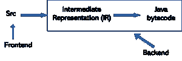
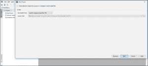

# 如何与 Kotlin Native 合作？

> 原文：<https://www.edureka.co/blog/basic-kotlin-native-app/>

Kotlin/Native 是一种将 Kotlin 代码编译成原生二进制的技术，可以在没有虚拟机的情况下运行。对于刚接触 *[【科特林】](https://www.edureka.co/blog/kotlin-programming-language/)* 的人来说，这是一件令人着迷的事情。因此，在本文中，我将更多地关注 Kotlin 原生平台。

我将按以下顺序讨论这些主题:

*   [什么是科特林土著？](#What_is_Kotlin_Native?)
*   [如何为 Kotlin Native 配置环境？](#How_to_configure_the_environment_for_Kotlin_Native?)
*   科特林本地的毕业生
*   [优势](#Advantages)

让我们开始吧！

**什么是科特林土著？**

Kotlin Native 是 JetBrains 的一款令人震惊的新产品，它允许开发人员为 Linux、macOS、Windows 和其他平台编写本机应用程序。这意味着 w e 被允许编译 [*Kotlin*](https://www.edureka.co/blog/what-is-kotlin/) 用于不需要或不可能使用虚拟机的平台，比如嵌入式设备或 iOS。



它由基于 LLVM ( 低级虚拟机)的 Kotlin 编译器后端和 Kotlin 运行时库的本地实现组成。

现在你可能会问，它支持哪些不同的平台。这个问题的答案是:

*   Windows(目前仅限 x86 _ 64)
*   Linux (x86_64，arm32，MIPS，MIPS little-endian)
*   macOS (x86_64)
*   iOS(仅限 arm64】
*   安卓(arm32 和 arm64)
*   WebAssembly(仅限 was m32)
*   树莓派

既然您已经理解了这一点，那么让我们继续前进，了解您如何获得这个编译器。

## **如何为 Kotlin Native 配置环境？**

如果你从 Kotlin 开始，你会发现开始时非常容易，然后当你升级到 Kotlin Native 时，你会发现它并不容易，因为没有多少专门的 ide 可以在开发过程中提供帮助。

JetBrains 家族中目前唯一支持它的 IDE 是 CLion，这对于希望使用 JVM、JS 或 iOS 实现多平台的项目来说是个问题。而最大的问题，在我看来，就是 CLion 不支持 Gradle。这是我不使用 CLion 实现的主要原因。

*   Kotlin 本机编译器将 Kotlin 代码转换为 LLVM 中间表示(IR)。
*   LLVM 编译器理解 IR，然后为期望的平台创建二进制文件。

可以用 JetBrains 的另一个产品，IntelliJ 平台。

让我们看看如何选择选项 Kotlin Native。


选择自动导入选项。



然后提供一个项目名称，并单击 Finish。

万岁！你已经清楚如何选择科特林·格拉德。

现在让我们向前看，了解如何用 Kotlin Native 编写一个简单的程序。

让我们看一个简单的 Hello World 程序。

我们可以打开我们最喜欢的 IDE 或编辑器，在一个名为 **hello.kt** 的文件中编写下面的代码。

```
fun main() {
println("Hello Kotlin/Native!")
}
```

现在，在编译过程中有一点变化。要手动编译应用程序，调用下载的编译器并生成一个 **hello。kexe** (Linux 和 macOS)或【hello.exe】T2(Windows)二进制文件:

```
kotlinc-native hello.kt -o hello
```

虽然从控制台进行编译看起来简单明了，但是您应该注意到，对于包含数百个文件和库的大型项目来说，这种方法并不适用。除此之外，命令行方法没有向 IDE 解释如何打开这样的项目、源代码位于何处、使用了什么依赖项、或者如何下载依赖项等等。

## 科特林本地的毕业生

IntelliJ IDEA 中的  新项目  向导可以用来只需点击一下就可以启动一个新的 Kotlin/Native 项目。只需选择*Native | grad le*选项即可生成项目。

我将首先创建一个项目文件夹。所有路径都将相对于该文件夹。有时，必须在添加新文件之前创建缺失的目录。

现在谈谈对 Gradle 的语言支持，为了构建脚本，Gradle 支持 Groovy 和 Kotlin。

Groovy 是 Gradle 支持的最古老的脚本语言。它利用了动态类型和运行时特性的强大功能。有时候，维护 Groovy 构建脚本会更加困难。

现在为了运行脚本和编译基本的*hello world*应用程序，你需要做两件事:

*   首先，你需要创建一个 Gradle 脚本来编译应用程序。
*   其次，把程序移到 src/main/kotlin 包中

从根目录开始，在那里 *构建。gradle* 文件所在，现在可以运行以下命令:

*   *grad le build*——将构建应用

*   *grad le run*——将执行我们的应用

现在，让我们进入本文的最后一个主题。

## **优势**

*   Kotlin/Native 的主要优势之一是 GUI、传感器、通知和每台设备特有的所有东西，这些都将以本地语言和运行时无限制地开发。
*   与其他编程语言相比，它减少了障碍。
*   它有助于跨平台应用程序开发。
*   与其他跨平台工具相比，专注于共享执行所需的尽可能多的代码。

这就把我们带到了这篇关于科特林土著T2 的文章的结尾。希望你清楚这篇文章中与你分享的所有内容。

*现在您已经浏览了我们的 Kotlin 原生博客，您可以查看一下 Edureka 的  [Android App 开发认证培训](https://www.edureka.co/android-development-certification-course)* *有问题吗？请在“Kotlin 本地人”博客部分的评论中提到它，我们将会回复您。*