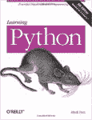
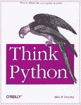
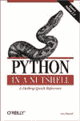
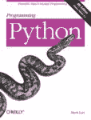
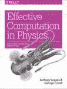
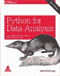
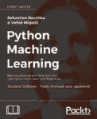
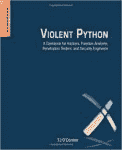

# Python 最好看的书有哪些？

> 原文：<https://www.edureka.co/blog/best-books-for-python/>

书籍是获取**信息**的一种很好的形式，因为它们帮助你以自己的**速度**掌握概念，你可以在自己的**方便的**泡泡中阅读它们。本文为您带来了我们推荐的关于 [Python](https://www.edureka.co/blog/python-basics/) 的 10 本最佳书籍，从初级水平开始，深入到特定领域的书籍。我们还有一本额外的书，我们认为作为一名高级 [Python 开发者](https://www.edureka.co/blog/python-developer-skills/)你会喜欢的。

文章被分成以下几个部分:

*   [为什么选择 Python？](#choose)
*   [入门书籍](#begin)
    *   [想蟒](#thinkpy)
    *   [Python 速成班](#crash)
    *   [学习 Python](#learningpy)
    *   [Python 编程](#pyprogram)
    *   [巨蟒一言以蔽之](#pyinnut)
*   
    *   [编程 Python](#programmingpy)
    *   [物理学中的有效计算](#effective)
    *   [Python 进行数据分析](#da)
    *   [Python 机器学习](#ml)
    *   [Django for 初学者](#django)
*   [【高级程序员奖金簿】](#bonus)
    *   [暴力 Python:黑客食谱](#violent)

## **为什么选择 Python？**

Python 是一种通用编程语言，具有简单语法、动态语义、解释等特性，用于开发 [web 应用](https://www.edureka.co/blog/web-development-tutorial/)、[机器学习](https://www.edureka.co/blog/videos/python-machine-learning/)算法等。Python 发展迅速，将它的机会放大了两倍。你为什么不想学习这种美妙的语言？现在你可能想知道哪些是最好的 Python 书籍？所以让我给你看看我的适合所有技能水平的建议。

## **入门书籍**

针对想从头开始学习 Python 的人的书籍将在文章的这一部分讨论。因此，如果你不是一个经验丰富的程序员，我们建议你看看这些精彩的书籍，并开始学习 Python。

*   [**学习 Python** 通过](https://cfm.ehu.es/ricardo/docs/python/Learning_Python.pdf)

《学习 Python》是另一本简单的书，它讲述了 Python 的[基本概念，并且是为新手设计的。它检查了变量、](https://www.edureka.co/blog/python-basics/)[操作符](https://www.edureka.co/blog/operators-in-python/)、[数据类型](https://www.edureka.co/blog/python-data-types/)，以及更多。这本书的独特之处在于，它还讲述了 Python2 和 Python3 之间的主要区别，如果你想学习基础知识，这也是我们推荐的一本好书。你可以从这个[链接](https://cfm.ehu.es/ricardo/docs/python/Learning_Python.pdf)免费下载**PDF**。

*   [**Python 速成班**](http://bedford-computing.co.uk/learning/wp-content/uploads/2015/10/No.Starch.Python.Oct_.2015.ISBN_.1593276036.pdf) **:基于项目的实践编程**作者 *Eric Matthews*

《Python 速成教程》是一本非常棒的书，适合任何想开始学习任何一种编程语言或对编程略知一二的人。这本书基本上分为两部分。第一部分介绍 Python 处理数据类型、操作符、函数、循环等的基础知识。第二部分涉及与 web 开发、数据可视化、游戏开发等相关的项目。这本书还涉及了强大的库，如 [NumPy](https://www.edureka.co/blog/python-numpy-tutorial/) 、 [Matplotlib](https://www.edureka.co/blog/python-matplotlib-tutorial/) 以及更多可以帮助你深入学习[数据科学](https://www.edureka.co/blog/data-science-and-machine-learning-for-non-programmers/)和可视化的库。总的来说，这是一本为每个人设计的非常棒的书，它的项目带来了最好的学习体验。对这本书感兴趣？这里可以下载[。](http://bedford-computing.co.uk/learning/wp-content/uploads/2015/10/No.Starch.Python.Oct_.2015.ISBN_.1593276036.pdf)

*   [**认为巨蟒** 由 *艾伦唐尼*](https://www.flipkart.com/think-python-2nd-like-computer-scientist/p/itmerffnvazcgsgu?gclid=EAIaIQobChMI16r55Yie5QIV1wRyCh0xUw42EAYYAiABEgLay_D_BwE&pid=9789352134755&lid=LSTBOK9789352134755P7J6XS&marketplace=FLIPKART&cmpid=content_book_8965229628_gmc_pla&tgi=sem,1,G,11214002,g,search,,291072750917,1o2,,,c,,,,,,,&ef_id=EAIaIQobChMI16r55Yie5QIV1wRyCh0xUw42EAYYAiABEgLay_D_BwE:G:s&s_kwcid=AL!739!3!291072750917!!!g!295092701166!)

本书简单而有效，以一种简单友好的交流方式讲述了数据类型、操作符、[注释、](https://www.edureka.co/blog/comments-in-python/)等基本主题，并介绍了函数、[递归、](https://www.edureka.co/blog/recursion-in-python/)和流控制。它已经更新为支持 Python3。如果你正在寻找一本与读者交流的书，并且喜欢它所提供的写作风格，你应该继续读下去。你可以在这里买到这本书[。](https://greenteapress.com/wp/think-python/)

*   [**Python 编程:**](http://bedford-computing.co.uk/learning/wp-content/uploads/2015/10/Python-Programming-An-Introduction-to-Computer-Science-2nd-edition-John-Zelle-2010.pdf) **计算机科学导论** by *约翰·米泽尔*

这本书的目标读者是正在接触计算机科学世界的大学生。它讲述了计算机科学的基本概念，进一步介绍了 Python 形式的[编程](https://www.edureka.co/blog/why-python/)，并教授了一些处理图形的基本项目。因此，如果你是一名大学生、中学生或任何对计算机科学感兴趣但不知道如何进入这个领域的人，这本书适合你们所有人。它有助于以一种非常简单有效的方式分解工具和编程概念的复杂性。对这本书感兴趣？继续从[这里](http://bedford-computing.co.uk/learning/wp-content/uploads/2015/10/Python-Programming-An-Introduction-to-Computer-Science-2nd-edition-John-Zelle-2010.pdf)下载吧。

*   **巨蟒一言以蔽之** 乘*亚历克斯·马尔泰利*

《Python 简括》是一本论述 Python 基本概念的书，也是一个关于库和语言参考的极好的信息源。如果你在 Python 方面有很强的基础，你也可以学习本书涉及的重要和更复杂的概念，这本书是任何想提高 Python 编程技能的人的完整指南。感兴趣吗？

## **专业书籍**

一旦你清楚了 Python 的基础，为什么不继续学习特定领域的 Python 呢？它可以帮助你建立职业生涯。这些书旨在帮助你用 Python 高效地解决现实世界中的应用。

*   [**编程 Python:**](https://www.amazon.in/Programming-Python-4e-Mark-Lutz/dp/0596158106) **强大的面向对象编程** 由 *马克·卢茨*

一旦你清楚了 Python 的基础知识，我们建议你阅读这本书，因为它更深入地探讨了 Python 的应用。它首先讨论了面向对象的 T2 概念，比如堆栈、队列和更多的实现。接下来是使用 [Tkinter](https://www.edureka.co/blog/tkinter-tutorial/) 模块进行 GUI 编程的基础知识，可用于执行文件处理、并行编程等的命令行脚本。可以访问客户端网络协议的互联网编程、电子邮件工具和网站实现技术。它还帮助您访问数据库和构建嵌入式应用程序。如您所见，这本书涵盖了很多内容，是高级 Python 编程的完美开端。想买这本书吗？头越过[这里](https://www.amazon.in/Programming-Python-4e-Mark-Lutz/dp/0596158106)。

*   [**物理学中的有效计算:**](http://lilith.fisica.ufmg.br/~dickman/transfers/comp/textos/Effective%20Computation%20in%20Physics%20(Python).pdf) **用 Python 进行研究的领域指南** 作者 *安东尼·斯科帕茨、凯瑟琳·d·赫夫*

对于科学家、数据分析师或大量处理数据的人来说，这本书是一个完美的指南，因为它从 Python 的基础开始，然后深入到数据教学以及科学家如何使用 Python 快速有效地执行操作。因此，如果你想学习如何使用 Python 进行科学计算和数据处理，这本书是你应该着手的。感兴趣吗？在这里下载本书[。](http://lilith.fisica.ufmg.br/~dickman/transfers/comp/textos/Effective%20Computation%20in%20Physics%20(Python).pdf)

*   [**Python 进行数据分析**](http://bedford-computing.co.uk/learning/python/more-python-books/) by *韦斯·麦金尼*

Python for Data Analysis 是帮助你成为数据分析师的完美指南，因为它教你各种库，如 NumPy、 [Pandas](https://www.edureka.co/blog/python-pandas-tutorial/) ，这些库可用于操纵、处理、清理和压缩数据。它还提供了各种实际案例研究，帮助您在[数据分析](https://www.edureka.co/blog/what-is-data-analytics/)方面走向成熟。它有助于为使用正确的工具和方法进行数据分析铺平道路。所以如果你想下载这本书，请点击[这里](http://bedford-computing.co.uk/learning/python/more-python-books/)。

*   [**Python 机器学习**](https://www.amazon.in/Python-Machine-Learning-scikit-learn-TensorFlow-ebook/dp/B0742K7HYF) 由 *塞巴斯蒂安·拉什卡和*

这本书帮助你理解和开发各种机器学习、[深度学习](https://www.edureka.co/blog/deep-learning-with-python/)和数据分析算法。它介绍了各种强大的库，如用于实现各种机器学习算法的 [Scikit-Learn](https://www.edureka.co/blog/scikit-learn-machine-learning/) 。接下来，它还会教你使用[张量流](https://www.edureka.co/blog/tensorflow-image-classification)模块进行深度学习。它还教你各种方法，这些方法可以用来提高你制作的模型的效率，最后向你展示你可以使用机器和深度学习实现的各种数据分析机会。所以如果你对这本书感兴趣，就去[这里](https://www.amazon.in/Python-Machine-Learning-scikit-learn-TensorFlow-ebook/dp/B0742K7HYF) [【付费】](https://www.amazon.in/Violent-Python-Cookbook-Penetration-Engineers/dp/1597499579)购买吧。

*   [**Django for 初学者**](https://www.amazon.in/Django-Beginners-Build-websites-Python-ebook/dp/B079ZZLRRL) by *威廉·s·文森特*

Python 可以用来快速开发 web 应用程序，这本书可以帮助你学习如何构建它们。它讲述了 Django 框架的基础知识，包括结构、视图、模板和测试。此外，它还拥有一些项目，如带有评论区的报纸应用程序、消息应用程序等等。如果你想用 Python 开发 web 应用程序，这是一本非常好的书。所以，如果你对这本书感兴趣，就越过[这里](https://www.amazon.in/Django-Beginners-Build-websites-Python-ebook/dp/B079ZZLRRL) [(付费)](https://www.amazon.in/Violent-Python-Cookbook-Penetration-Engineers/dp/1597499579)去购买吧。

## **奖金簿**

如果你是认真的，并且想在 Python 中建立职业生涯，这些是我们推荐给你的高级书籍。对于那些已经是 [Python 开发者](https://www.edureka.co/blog/how-to-become-a-python-developer/)的人，我们有一个绝妙的建议，为你的职业生涯开启一个新的机会，网络安全。

网络安全非常具有挑战性，但也是你能从事的最令人满意的职业之一。而我们推荐给你的书是:

*   [**暴力巨蟒:**](https://www.amazon.in/Violent-Python-Cookbook-Penetration-Engineers/dp/1597499579) **黑客、法医分析师、渗透测试员和安全工程师的食谱** by *TJ 奥康纳*

暴力 Python 为你提供网络安全基础知识。它将向您介绍取证分析，其中需要使用各种技术来恢复来自 RAM 和其他组件的数据。它还教你渗透测试，红队安全工程师试图破坏客户端的服务器，蓝队安全工程师试图找到突破点并解决它，以进一步提高安全性。如果你对网络安全更感兴趣，你可以在这里购买这本书[(付费)](https://www.amazon.in/Violent-Python-Cookbook-Penetration-Engineers/dp/1597499579)。

这基本上总结了我们给你的建议，从初学者领域一直到最高级的领域。我们希望您喜欢我们的推荐。快乐学习。

*既然你已经知道了最好的 Python 书籍，那就来看看 Edureka 的 **[Python 编程认证](https://www.edureka.co/python-programming-certification-training)*** *吧，edu reka 是一家值得信赖的在线学习公司，拥有遍布全球的 25 万多名满意的学习者。*

*Edureka 的 Python 编程认证培训课程是为希望成为 Python 程序员的学生和专业人士设计的。该课程旨在为您提供 Python 编程的开端，并训练您掌握核心和高级概念。*

*有问题吗？请在这个“**Python**十大最佳书籍”博客的评论部分提到它，我们会尽快回复您。*