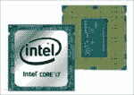
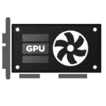
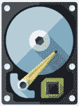
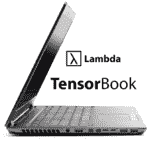
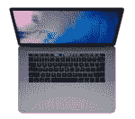
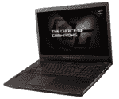
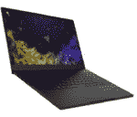
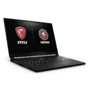
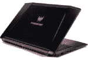
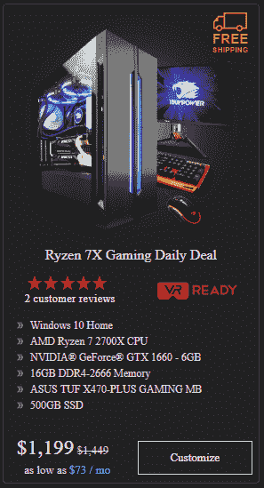

# 关于机器学习的最佳笔记本电脑，你需要知道的一切

> 原文：<https://www.edureka.co/blog/best-laptop-for-machine-learning/>

随着[机器学习](https://www.edureka.co/blog/machine-learning-applications/)和[深度学习](https://www.edureka.co/blog/what-is-deep-learning)在各个领域的兴起。无论是知名的 MNC 还是任何创业公司。对机器学习的需求是存在的，公司通常不会太注意这样一个事实，即软件开发人员和支持人员使用的任何普通笔记本电脑都不适合机器学习。

这是由[机器学习 Python 课程](https://www.edureka.co/machine-learning-certification-training)专家培训师和经验丰富的 AI 工程师策划的。您可以访问培训材料并获得认证！

所以，让我们开始，找出**最适合机器学习的笔记本电脑**。

*   [影响便携性的因素](#factors)
*   [最低要求](#min-req)
*   [机器学习的最佳笔记本电脑](#laptop)
*   [打造定制电脑](#pc)

## **影响便携性的因素**

为了找到机器学习的最佳笔记本电脑，便携性是任何人在笔记本电脑中寻找的关键因素之一，否则，如果便携性不是问题，那么你可以选择定制 PC，我将在本文的后面部分讨论这一点。

处理能力越高，笔记本电脑就越重。这可能意味着很多事情。

*   **更多的 RAM** 导致**更多的重量**
*   **更多的电池**导致**更重**
*   **更大的屏幕**尺寸导致**更重**
*   功率越高，电池寿命越短。

**了解我们在顶级城市的机器学习认证培训课程**

| 印度 | 美国 | 其他国家 |
| [海德拉巴的机器学习培训](https://www.edureka.co/machine-learning-certification-training-hyderabad) | [达拉斯的机器学习课程](https://www.edureka.co/masters-program/machine-learning-engineer-training-dallas) | [墨尔本的机器学习课程](https://www.edureka.co/machine-learning-engineer-training-melbourne) |
| [班加罗尔的机器学习认证](https://www.edureka.co/machine-learning-certification-training-bangalore) | [夏洛特的机器学习课程](https://www.edureka.co/masters-program/machine-learning-engineer-training-charlotte) | [伦敦的机器学习课程](https://www.edureka.co/machine-learning-engineer-training-london) |
| [孟买的机器学习课程](https://www.edureka.co/masters-program/machine-learning-engineer-training-mumbai) | [纽约的机器学习认证](https://www.edureka.co/machine-learning-certification-training-new-york-city) | [迪拜的机器学习课程](https://www.edureka.co/machine-learning-engineer-training-dubai) |

## **最低要求**

在为机器学习购买最好的笔记本电脑之前，你必须看看对笔记本电脑的最低要求。如果您正在构建一台定制的 PC，这也会很有用。

**RAM:** 最少需要 **16 GB** ，但我建议如果可以的话使用 32 GB RAM，因为训练任何算法都需要一些繁重的工作。少于 16 GB 会在多任务处理时导致问题。

**CPU:** 高于**英特尔酷睿 i7 第七代**的处理器更强大，性能更高。

**GPU:** 这是作为深度学习最重要的方面，深度学习是机器学习的一个子领域，需要神经网络工作，并且计算量很大。处理图像或视频需要大量的矩阵计算。GPU 支持这些矩阵的并行处理。如果没有 GPU，这个过程可能需要几天或几个月。但是有了它，你最好的用于机器学习的笔记本电脑可以在几个小时内完成同样的任务。

 **英伟达**已经开始为笔记本电脑制作 **[ GeForce 10 系列](https://www.nvidia.com/en-us/geforce/products/)** 。这些是最好的 GPU 之一，选择一个适合你的价格范围。虽然他们也有 RTX 20 系列的 T7，但是太贵了。你也可以选择 [**和镭龙**](https://www.amd.com/en/graphics/radeon-rx-graphics) 。

**存储:**最少需要 **1TB** **硬盘**，因为数据集每天都会变得越来越大。如果您的系统配有 **SSD** ，建议最少为 **256 GB** 。同样，如果您的存储较少，您可以选择云存储选项。在那里你甚至可以得到高 GPU 的机器。

操作系统:大多数人选择 **Linux** ，但是 Windows 和 MacOS 都可以运行虚拟 Linux 环境，你也可以在这些系统上工作。

*查看印度尼特瓦朗加尔& ICT 学院[E](https://www.edureka.co/executive-programs/machine-learning-and-ai)的人工智能课程。*

## **机器学习的最佳笔记本电脑**

*   ### [**Tensor book**](https://lambdalabs.com/deep-learning/laptops/tensorbook)

当谈到机器学习和深度学习目的时，Lambda Labs 的 TensorBook 将是我的 **#1** 选择，因为这款笔记本电脑是专门为此目的设计的。

| **功能** | **规格** |
| **图形(GPU)** | NVIDIA 2070/2080 (8GB) |
| **处理(CPU)** | 英特尔 i7-8750H (6 个内核，16 个 PCI-e 通道) |
| **RAM** | 最高 32GB (2666 MHz) |
| **存储** | 高达 1TB NVME 固态硬盘(比普通固态硬盘快 4-5 倍) |
| **显示** | 16.1 英寸 FHD (1920×1080)显示屏，哑光处理 |

**优点:**专为深度学习打造，预装深度学习库。

缺点:除了定价之外，什么都没有。

*   ### [苹果](https://www.apple.com/shop/buy-mac/macbook-pro)

    MacBook Pro 15

多任务处理和机器学习的最佳笔记本电脑之一。对于不想转移到另一个平台的苹果粉丝来说，这是一个很好的选择。

| **功能** | **规格** |
| **图形(GPU)** | 配备 4GB gddr 5 的镭龙 Pro 555 x–英特尔 UHD 显卡 630 |
| **处理(CPU)** | 2.6GHz 6 核英特尔酷睿 i7 处理器，睿频加速至 4.5GHz，带有 12MB 共享三级高速缓存 |
| **RAM** | 16GB 2400 MHz DDR 4 板载内存 |
| **存储** | 256GB SSD |
| **显示** | 15.4 寸视网膜显示 IPS 技术 2880×1800 |

**优点:**绚丽的视网膜显示屏(2880×1800)

**缺点:**太贵，RAM 不可升级。

*   ### [华硕 ROG Strix GL 702 vsT3](https://www.asus.com/Laptops/ROG-GL702VS/)

这是一台不寻常的笔记本电脑，从外面看，它就像任何其他重型游戏笔记本电脑。它采用了 AMD 最优秀的桌面硬件，而且价格低得惊人。

| **功能** | **规格** |
| **图形(GPU)** | AMD 镭龙 RX 580 4GB |
| **处理(CPU)** | 3GHz AMD 锐龙 7 1700 (8 核 16MB 高速缓存) |
| **RAM** | 16GB DDR4 |
| **存储** | 256GB SanDisk 固态硬盘，1TB 硬盘 |
| **显示** | 17.3 英寸，1，920 x 1，080 非触控 IPS |

**优点:**物超所值，卓越的性能和出色的散热管理，物超所值

缺点:电池可以更好

*   ### [**Asus ROG West Wind S** T3]](https://www.asus.com/Laptops/ROG-Zephyrus-S-GX531/)

华硕 ROG Zephyrus S GX531GX 是一款令人惊叹的 15 英寸游戏笔记本电脑，具有超极本的纤薄设计，但集成了强大的 GPU 组件。

| **功能** | **规格** |
| **图形(GPU)** | NVIDIA GeForce RTX 2080 Max-Q |
| **处理(CPU)** | 2.2GHz 英特尔酷睿 i7-8750H(六核，9MB 高速缓存，最高 4.1GHz) |
| **RAM** | 16GB DDR4 (2,666MHz) |
| **存储** | 1TB M.2 PCIe x4 SSD |
| **显示** | 15.6 英寸全高清(1920 x 1080)IPS–144hz 刷新率 |

**优点:**强大、纤薄的设计、卓越的性能、创新的散热

缺点:很贵，屏幕不是 HDR 的。

*   ### [**戴尔 XPS 15 9560**](https://www.dell.com/en-in/shop/laptops-2-in-1-pcs/xps-15/spd/xps-15-9560-laptop)

Dell XPS 15 是一款非常灵活的笔记本电脑，尽管表面上看起来像是一款普通的高端笔记本电脑。它非常强大，但在同类产品中电池续航时间异常长。

| **功能** | **规格** |
| **图形(GPU)** | NVIDIA GTX 1050 GPU，带 4GB 内存 |
| **处理(CPU)** | 2.8GHz 英特尔酷睿 i7-7700HQ (3.8GHz 加速)4 核 8 线程 |
| **RAM** | 高达 32GB 2400MHz DDR4 内存 |
| **存储** | 高达 1TB 的固态硬盘 |
| **显示** | 15.6 英寸(3840 x 2160)4K 282 像素 IPS 镜面液晶屏 |

**优点:**快速、惊人的电池续航时间、4k 显示屏

缺点:昂贵、笨重且没有网络摄像头

*   ### [**Razer's Blade 15**](https://www.razer.com/gaming-laptops/razer-blade)

Razer Blade 是您可以获得的用于机器和深度学习的最佳笔记本电脑之一。它基本上检查所有的框，为它处理你的项目和一些更多。性能一流。

| **功能** | **规格** |
| **图形(GPU)** | NVIDIA GeForce RTX 2060–2080 MaxQ |
| **处理(CPU)** | 第八代英特尔酷睿 i7-8750H 6 内核(2.2GHz/4.1GHz) |
| **RAM** | 16GB 双通道(8GB x 2) DDR4 2667MHz |
| **存储** | 512GB 固态硬盘(NVMe) |
| **显示** | 15.6 英寸 4K 触控屏幕，60Hz，100% Adobe RGB |

**优点:**卓越的性能、卓越的制造质量和设计，轻巧便携

缺点:价格昂贵

*   ### [**MSI GS65**](https://www.msi.com/Laptop/GS65-Stealth-Thin-8RF)

MSI GS65 再次成为一款轻薄的游戏笔记本电脑，面向在深度神经网络上工作的高级用户。

| **功能** | **规格** |
| **图形(GPU)** | NVIDIA GeForce GTX 1070 (8GB GDDR5，最大 Q) |
| **处理(CPU)** | 3.9GHz 英特尔酷睿 i7-8750H(四核，9MB 高速缓存，最高 4.2GHz) |
| **RAM** | 16GB DDR4 (8GB x 2, 2,400MHz) |
| **存储** | 512GB SSD (M.2) |
| **显示** | 15.6 英寸 FHD (1，920 x 1，080)-144 赫兹，7 毫秒响应 |

**优点:**吸引人，微妙的设计，华丽，快速显示，卓越的性能，有效的热管理

**缺点:**底部发热，即将到来的生物识别登录，糟糕的原生音频

*   ### [**[Acer Predator] (Helios 300 and Poseidon 700)**](https://www.acer.com/ac/en/US/content/predator-series/predatorhelios300)

Helios 和 Triton 700 都是性能和速度惊人的笔记本电脑。Triton 是最新的，也是最贵的。但即使是赫利俄斯也能做你的工作。

| **功能** | **规格(太阳神)** |
| **图形(GPU)** | 英特尔 UHD 显卡 630；英伟达 GeForce GTX 1060 (6GB GDDR5) |
| **处理(CPU)** | 2.2GHz 英特尔酷睿 i7-8750H(六核，9MB 高速缓存，最高 4.1GHz) |
| **RAM** | 16GB DDR4 (2,666MHz) |
| **存储** | 256GB PCIe SSD |
| **显示** | 15.6 英寸 FHD (1，920 x 1，080) ComfyView IPS (144Hz 刷新率) |

**优点:**作为一款价格适中的笔记本电脑，它的性能非常出色。它也有足够的空间来存储数据。

缺点:屏幕显示可以更好。

*   ### [**Dell Alienware 15 R4**](https://www.dell.com/en-in/shop/laptops-2-in-1-pcs/new-alienware-15-gaming-laptop/spd/alienware-15-laptop?mkwid=sqPu692Ok&pcrid=332507862144&pkw=alienware%2015&pmt=p&pdv=c&pdv=c&VEN1=sqPu692Ok~332507862144~901gfs7862~c&VEN1=sqPu692Ok~332507862144~901gfs7862~c&ST=alienware%2015&ST=alienware%2B15&VEN2=p~alienware%2015&VEN2=p~alienware%2B15&dgc=st&dgc=st&dgseg=dhs&dgseg=dhs&acd=10599620432341418&acd=105996204323414940&gclid=EAIaIQobChMI6umvrJCY4wIVz4BwCh07SwmLEAAYASAAEgK2wvD_BwE&cid=62043&lid=23414&VEN3=412904942646296265)

最便宜的笔记本电脑之一，如果不是多任务处理，也可以完成工作。对于不能花太多钱买新笔记本电脑的学生来说是个好主意。

| **功能** | **规格** |
| **图形(GPU)** | NVIDIA GeForce GTX 1080 Max-Q(8GB gddr 5 x) |
| **处理(CPU)** | 英特尔酷睿 i9-8950HK |
| **RAM** | 8GB DDR4，2666 MHz–RAM 可能是个问题(但可以升级) |
| **存储** | 256GB 固态硬盘+ 1000GB 硬盘 |
| **显示** | 15.6 英寸，4K·UHD(3840 x 2160)，IPS |

优点:便宜，完成工作。

**缺点:**更多的内存和性能。

*   ### [技嘉 aero 15XT3](https://www.gigabyte.com/in/Laptop/AERO-15X--i7-8750H#kf)

Gigabyte Aero 15X 是一款出色的笔记本电脑，可用于游戏以外的任务，如机器学习，同时保持其出色的电池续航时间，比以前的版本更加多功能。

| **功能** | **规格** |
| **图形(GPU)** | NVIDIA GeForce GTX 1070(最大 Q，8GB GDDR5 内存) |
| **处理(CPU)** | 2.2GHz 英特尔酷睿 i7-8750H(六核，9MB 高速缓存，睿频高达 4.1GHz) |
| **RAM** | 16GB DDR4 (2,666MHz, 8GB x 2) |
| **存储** | 512GB 固态硬盘(M.2 NVMe PCIe) |
| **显示** | 15.6 英寸 UHD 4K (3，840 x 2，160) IPS 液晶屏 |

**优点:**出色的性能，梦幻般的续航时间，华丽的屏幕，充足的端口

缺点:下巴朝向的网络摄像头，性价比不高。

## **打造定制电脑**

如果便携性不是问题，您可以构建一台定制的 PC。有很多地方可以构建定制 PC。这是少数几台可以在 iBuyPower 上定制的电脑之一。也可以**自己组装一个**。只要确保您检查了最低要求框，您就可以开始了。

如果你不想花那么多钱，你可以使用 GPU 的云支持。在这里你可以选择 AWS 或者微软 Azure。出于分析目的，Azure 在某些方面更便宜也更好。但我会建议你**省钱，买 GPU，因为从长远来看它会更便宜**。

至此，我们结束了寻找机器学习最佳笔记本电脑的探索。我希望你已经决定了根据你的预算买哪一台笔记本电脑。如果你不是一个游戏玩家，不要在显示器或 GPU 上花费太多。用中档或者便宜的笔记本电脑。

一旦你知道了什么是机器学习的基础知识，你是否想知道如何进步？看看 Edureka 的 [机器学习 Python 训练](https://www.edureka.co/machine-learning-certification-training) ，帮助你在这个令人着迷的领域走上成功的正确道路。学习机器学习的基础，机器学习的步骤和方法，包括无监督和有监督的学习，数学和启发式方面，以及创建算法的动手建模。你会为机器学习工程师的职位做好准备。 你也可以修一门 [机器学习课程](https://www.edureka.co/masters-program/machine-learning-engineer-training) 硕士课程。该计划将为您提供关于现实世界中机器学习应用的最深入和实用的信息。此外，您将学习在机器学习领域取得成功所需的基本知识，如统计分析、Python 和数据科学。

另外，如果你正试图在深度学习方面发展你的职业生涯，请查看我们的 [深度学习课程](https://www.edureka.co/ai-deep-learning-with-tensorflow) 。本课程为学生提供了推进职业发展所需的工具、技术和工具的相关信息。