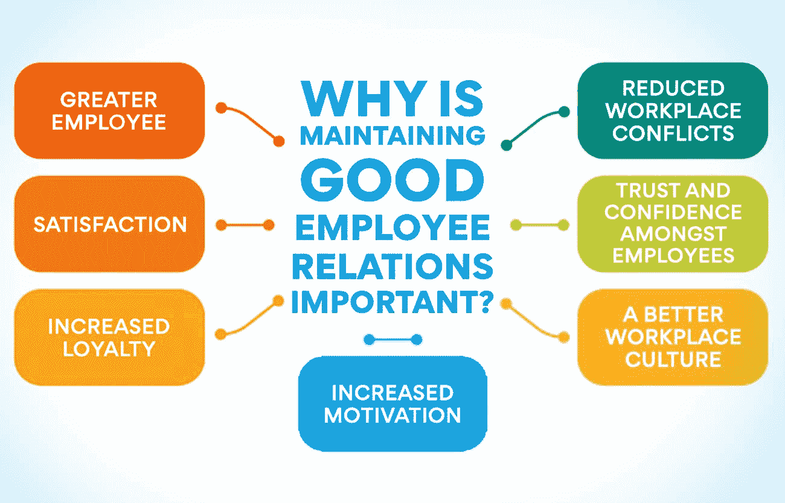
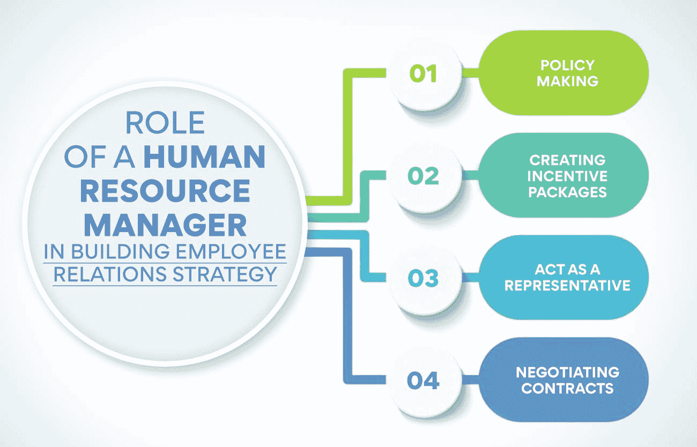

# 更好的员工关系可以带来快速的业务扩张:知道 11 个技巧

> 原文：<https://www.edureka.co/blog/better-employee-relation-can-lead-to/>

## 什么是员工关系？

快乐的员工反映了组织的成长。事实证明，能够管理好员工关系的企业能够创造出令人满意的工作环境。员工关系是一个被广泛使用但从未被完全理解的术语。它不仅象征着雇主和雇员之间的关系，也象征着组织为保持积极的工作环境所做的努力。保持员工的满意、参与和重视是一个组织发展的关键。秘诀是知道把你的员工视为公司的利益相关者 T2，增加利润，而不是仅仅把他们视为领工资的工人。

为了提高员工的工作效率，营造一个能够发挥他们技能和创造力的环境是必不可少的。一个组织可以通过牢记三个 c 来确保这一点:

*   **沟通**——我们在工作场所有很多沟通方式，比如电子邮件、休息室聊天或通过短信。定期有效的沟通对组织的顺利运作至关重要。它提高效率，推动进步，并提供一个友好和积极的工作环境。
*   **协作**——建立一个朝着共同目标努力的团队的最佳方式是通过协作。组织团队协作会议提高员工士气，为他们提供一个共同的目标，提高解决问题的能力，并激励员工实现组织目标。
*   **合作**–员工参与决策、解决问题和共同努力实现共同目标都是工作场所合作的一部分。接受和重视意见是建立更好的员工关系的重要组成部分**。**

## 为什么保持更好的员工关系很重要？

保持平衡的雇主-雇员关系过于低调。它需要有意识和持续的努力，才能给组织带来多重利益。一些最成功的企业将员工关系作为其商业战略的核心。更好的员工关系会导致如下:

1.  *更高的员工满意度*——对自己的工作、工作场所和雇主满意的员工总是会工作得更好，提供更好的结果。因此，员工参与度越全面、越个性化，员工满意度就越高。
2.  *增加忠诚度*——一个组织最大的成功因素是忠诚的员工。更好的员工关系带来积极的工作环境。从长远来看，积极的工作环境可以确保忠诚的员工队伍，减少员工流动，培养熟练劳动力。
3.  *增强动力—*在工作场所对出色完成工作的认可对于鼓舞士气和保持员工继续工作的动力至关重要。赏识对于营造积极的成长环境，让员工保持积极性并提高绩效至关重要。
4.  *减少职场冲突——*雇主和雇员之间的差异会导致经常性的冲突。因此，必须有公正的冲突解决系统来有效地管理和分散情况。
5.  *员工之间的信任和信心——*建立信任不仅是雇主的责任，也需要员工的努力。然而，健康和信任的沟通必须从高层开始，以建立相互信任和理解。
6.  *更好的工作场所文化—*一个组织通过有效的员工参与、津贴和公平的实践为其员工建立更好的工作场所的努力构成了建设性的工作场所文化。这不仅有助于员工的成长，也有助于组织的成长。

## 更好的员工关系可以导致一个有效的工作场所:知道怎么做吗？

绩效管理是一个双向过程，需要精心构建。如上所述，当员工以正确的方式受到激励时，一个组织就能从可见性中获益。在这篇博客中，我们汇集了来自专家 的 11 条改善员工关系的建议。更好的员工关系可以带来:

**1。建立信任的纽带**

在工作场所建立信任的第一步是与员工建立积极融洽的关系。没有良好的关系，员工很难与雇主和组织建立信任。为了理解如何在工作场所建立信任，理解工作场所的信任意味着什么是很重要的:

*   有安全感
*   发展相互依赖性
*   随着时间的推移建立信誉

通过在组织内优先建立信任，你可以确保一种强烈的归属感和一个联系紧密、协调一致的团队。信任促成了健康的交流，推动组织走向合作增长。在组织内部建立信任有多种方式:

*   实现沟通透明
*   完全诚实
*   向你关心的人展示
*   坚持自己认为正确的事情
*   永远信守承诺
*   建立并重视长期关系

**也可理解为:[人力资源管理在组织中的作用](https://www.edureka.co/blog/human-resource-management/)**

**2。增加正 v/s 负反馈的比率**

提供反馈对员工在工作场所的表现至关重要。虽然提供健康和建设性的批评是有益的，但欣赏好的工作同样重要。认可员工的优势、成功和成就会激励个人磨练自己的技能，关注自我提升，并乐意参与组织成长。我们的专家 推荐以下提供正面反馈的方式:

*   说谢谢。两个词能产生比你意识到的更大的不同。
*   让员工知道他们是你组织中有价值的一部分。
*   公开认可员工的成就。

**3。建立奖励系统**

月度最佳员工的免费停车位、额外几天的带薪休假或免费俱乐部会员资格是确保员工高度积极性的额外激励因素。建立战略奖励系统允许:

*   生产率提高
*   减少员工流动
*   动力增强

雇主必须明白，佣金、奖金和奖励是不同的。奖励是员工因工作出色而获得的额外福利。

**4。定期进行绩效评估**

创造一种促进绩效评估的文化是一种有效的商业策略。绩效评估通常每年进行一次，通常意味着加薪，有时也可以被视为一项活动，不是每个员工都喜欢参与。我们的专家进行定期审查允许:

*   持续反馈带来的绩效提升
*   员工的自我反思和成长
*   误差容限的减少

**5。促进健康的工作生活平衡**

今天，每个人都重视健康的工作生活平衡。创造一个让员工能够灵活地追求工作之外的其他兴趣的环境，可能会产生比我们意识到的更大的影响。尽管保持这种平衡并不仅仅是雇主的责任，但是一个组织可以采取一些措施来确保这种平衡得到很好的保持:

*   提供远程和灵活的工作选项。
*   关注生产力，而不是在办公室呆的时间。
*   鼓励有规律的休息。
*   珍惜他们的休息时间。
*   为你的员工及其家人提供额外津贴。

**6。创造一个自主的工作场所**

塑造工作环境以适应雇主和雇员的最佳表现，这创造了一个自主的工作环境。经理们不应该像保姆一样照看孩子，员工们也不应该每一步都被牵着手。更好的员工关系可以带来平衡的环境，以下是实现这一目标的方法:

*   雇佣那些独立自主、能够负责的人。
*   当出现错误时，提供指导，而不是通过负面反应引发恐惧。
*   在设定的范围内提供选择的自由。
*   相信你的员工会做出正确的决定。
*   将所有权交给员工。

**7。减轻工作压力**

压力是现代工作场所面临的最大障碍之一。由于缺乏工作保障或高工作量等原因而在工作场所产生的压力会严重影响生产力。我们 教授处理压力的最有效方法和缓解苛刻工作环境的步骤，使组织和员工都受益。以下是一些有效管理压力的方法:

*   提供现场或远程咨询。
*   鼓励充分休息。
*   通过不同的活动关注工作场所的健康，例如提供瑜伽或健身房会员资格。
*   通过聚会、郊游、团队建设活动等方式鼓励工作场所的社交关系。不要试图将挑战强加于人；让员工自己接受挑战。

**也读作:[目标&人力资源管理的性质](https://www.edureka.co/blog/nature-of-human-resource-management/)**

**8。提供职业成长和发展**

对于任何员工来说，在当前工作场所看到职业发展轨迹是至关重要的，这是由他们的员工关系经理指导和引导的。必须为组织中的每一个职位规划一条职业发展道路。提供指导和培训计划，拓宽[的发展范围](https://www.edureka.co/blog/scope-of-human-resource-management/)，并看到你的员工在组织中蓬勃发展。如果员工觉得自己被困在你的组织中，他们的不满会促使他们寻找更好的机会。

**9。避免微观管理**

微观管理员工表明对员工严重缺乏信任。虽然提供指导和反馈可以推动员工参与组织并保持动力以做得更好，但微观管理可能会适得其反。不要试图将挑战强加于人；让员工自己接受挑战。

通过我们的 [人力资源管理研究生证书](https://www.edureka.co/highered/human-resourse-management-course-iim-shillong) 课程，你可以学到成为一名优秀人力资源经理的最佳方法。

10。适应性强，寻求员工意见

“老板永远是对的”不应该从字面上理解。身处管理岗位，更需要保持开放的心态，接受错误并快速适应变化。虚心听取员工对项目的意见，甚至是如何改善工作场所或你的表现。这些人是因为他们的经验和专业知识而被聘用的，提供一个开放的对话平台让他们有机会觉得自己对组织是不可或缺的。

**11。拥抱工作场所的多样性**

工作场所的多样性是一种资产，必须通过所有人的平等权利和机会来维护，无论性别、种族、肤色、性取向、身体能力、宗教信仰等等。更好的员工关系可以带来一个开放的工作环境。承认个性和重视差异有助于创造一个开放的工作环境，让每个人都感到被接受和被欣赏。营造这样的职场环境，对公司的认可度超级有利。

## 更好的员工关系可以带来快速的业务增长:人力资源的作用

我们有效地证明了员工是组织最大的资产。因此，建立一个明智的员工关系战略来满足组织和员工是至关重要的。维护员工关系可能属于[人力资源经理](https://www.edureka.co/blog/optimising-people-management-to-achieve-company-goals/)的职责范围，或者也可能是组织中关系经理的单独职责。下面提到的是人力资源/员工关系经理在建立长期员工关系中的角色和职责:

 ** 1。决策**

有效的员工关系计划始于明确的书面政策。公司政策决定了个人在工作场所的行为。这些政策是由人力资源经理制定的，他还必须确保公司的每个人都遵守这些政策。这些政策在塑造员工关系方面起着至关重要的作用。

**2。创建奖励套餐**

假期、病假、产假、健康保险等等都是工作场所的激励措施。人力资源经理创造的理想激励方案是与员工合作建立的。

**3。充当代表**

作为一名人力资源经理，你不仅代表你的公司，也代表员工。保持良好的员工关系可以避免冲突，延长工作满意度。

**4。谈判合同**

雇员签订的合同应该对雇主和雇员双方都有利。为了确保积极的员工关系，与任何一方协商合同以获得有利的结果是必不可少的。

总之，建立一个团队需要的不仅仅是设计好一个结构。一个组织必须超越并确保其最大的资产，即员工，得到一个积极的成长和发展环境。一个组织拥有精心策划和周到的政策，为所有员工提供公平和平等的待遇，有助于建立牢固的员工关系。它帮助团队成员真诚忠诚地投入到工作中，减少冲突，创造一个相互信任和欣赏的环境。凭借我们的人力资源管理研究生证书，你可以详细了解如何改善雇主和雇员的关系。我们与行业相关的模块和实用的学习模型让个人对行业有一个批判性的深入了解。两年的课程提供 IIM·西隆和 SHRM·印度的双证。点击 [此处](https://www.edureka.co/highered/human-resourse-management-course-iim-shillong?qId=9e090b348d8d2e45e9b368644373ddcf&objId=1909&objPos=1) 了解课程详情。

## **更多信息:**

[人力资源管理的演变:过去和未来](https://www.edureka.co/blog/evolution-of-human-resource-management)

[了解人才管理及其重要性](https://www.edureka.co/blog/talent-management-and-its-importance/)

[什么是利益相关者参与？重要性、规划和实施](https://www.edureka.co/blog/stakeholder-engagement)

[什么是人力资源管理中的薪酬？你需要知道的一切](https://www.edureka.co/blog/compensation-in-hrm)