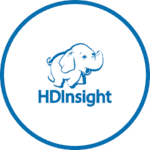
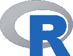
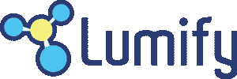

# 具有关键功能的大数据分析工具和技术

> 原文：<https://www.edureka.co/blog/bigdata-analytics-tools-and-features/>

随着大数据量的上升和云计算的巨大增长，前沿的大数据分析工具已经成为实现对数据进行有意义分析的关键。在本文中，我们将讨论顶级大数据分析工具及其关键特性。

*   [阿帕奇风暴](#storm)
*   [演讲](#talend)
*   [CouchDB](#couch)
*   [阿帕奇火花](#spark)
*   [拼接机](#splice)
*   [阴谋地](#plot)
*   [Azure HDInsight](#azure)
*   [R](#r)
*   [Skytree](#skytree)
*   [Lumify](#lumify)
*   [Apache Hadoop](#hadoop)
*   [【qubole】](#qubole)

## **大数据分析工具列表**

**Apache Storm:** Apache Storm 是一个开源免费的大数据计算系统。Apache Storm 也是一个 Apache 产品，它具有用于数据流处理的实时框架，支持任何编程语言。它提供分布式实时容错处理系统。具有实时计算能力。Storm scheduler 根据拓扑配置管理多个节点的工作负载，并与 Hadoop 分布式文件系统(HDFS)配合使用。

**功能:**

*   基准测试为每个节点每秒处理一百万条 100 字节的消息
*   数据单元的 Storm assure 将至少处理一次。
*   出色的横向可扩展性
*   内置容错
*   崩溃时自动重启
*   clo jure-writed
*   使用有向无环图(DAG)拓扑
*   输出文件为 JSON 格式
*   它有多个用例——实时分析、日志处理、ETL、连续计算、分布式 RPC、机器学习。

**Talend:** Talend 是一个大数据工具，可以简化和自动化大数据集成。它的图形向导生成本机代码。它还允许大数据集成、主数据管理和检查数据质量。

**功能:**

*   简化大数据的 ETL 和 ELT。
*   完成火花的速度和规模。
*   加速您的实时行动。
*   处理多个数据源。
*   在同一个平台下提供多种连接器，让您可以根据自己的需求定制解决方案。
*   Talend 大数据平台通过生成原生代码简化了 MapReduce 和 Spark 的使用
*   通过机器学习和自然语言处理提高数据质量
*   敏捷开发加速大数据项目
*   精简所有 DevOps 流程

Apache CouchDB: 这是一个开源的、跨平台的、面向文档的 NoSQL 数据库，旨在易于使用并拥有可伸缩的架构。它是用面向并发的语言 Erlang 编写的。Couch DB 将数据存储在 JSON 文档中，可以使用 JavaScript 通过 web 访问或查询。它通过容错存储提供分布式扩展。它允许通过定义治疗床复制协议来访问数据。

**功能:**

*   CouchDB 是一个单节点数据库，其工作方式类似于任何其他数据库
*   它允许在任意数量的服务器上运行单个逻辑数据库服务器
*   它利用了无处不在的 HTTP 协议和 JSON 数据格式
*   文档插入、更新、检索和删除相当容易
*   JavaScript 对象符号(JSON)格式可以跨不同语言翻译

**Apache Spark:** Spark 也是一款非常流行的开源大数据软件工具。Spark 拥有 80 多名高级操作员，可以轻松构建并行应用。它在许多组织中用于处理大型数据集。

**功能:**

*   它有助于在 Hadoop 集群中运行应用，内存速度快 100 倍，磁盘速度快 10 倍
*   提供照明快速处理
*   支持复杂的分析
*   能够与 Hadoop 和现有 Hadoop 数据集成
*   它提供了 Java、Scala 或 Python 的内置 APIs】
*   Spark 提供了内存中的数据处理能力，这比 MapReduce 所利用的磁盘处理要快得多。
*   此外，Spark 与 HDFS、OpenStack 和 Apache Cassandra 合作，无论是在云中还是在本地，都为您的企业增加了大数据运营的另一层多功能性。

**拼接机:**是大数据分析工具。他们的架构可以跨公共云移植，比如 AWS、Azure 和谷歌**。**

**功能:**

*   它可以从几个节点动态扩展到几千个节点，以支持各种规模的应用
*   拼接机优化器自动评估对分布式 HBase 区域的每个查询
*   减少管理，加快部署，降低风险
*   消费快速流数据，开发、测试和部署机器学习模型

Plotly: Plotly 是一款分析工具，用户可以创建图表和仪表盘，并在线分享。

**功能:**

*   轻松将任何数据转化为引人注目的信息图形
*   它为被审计行业提供了关于数据来源的细粒度信息
*   Plotly 通过其免费社区计划提供无限的公共文件托管服务

**Azure HDInsight:** 是云端的 Spark 和 Hadoop 服务。它提供两类大数据云产品，标准和高级。它为组织运行大数据工作负载提供了企业级集群。有了 [蔚蓝数据工程认证](https://www.edureka.co/microsoft-azure-data-engineering-certification-course) 可以更好的理解。

**功能:**

*   利用行业领先的 SLA 进行可靠的分析
*   它提供企业级安全和监控
*   保护数据资产并将内部安全和治理控制扩展到云
*   开发人员和科学家的高生产力平台
*   与领先的生产力应用集成
*   在云中部署 Hadoop，无需购买新硬件或支付其他前期成本

R 是一种编程语言和自由软件，它是计算机统计和图形。R 语言在统计学家和数据挖掘者之间流行，用于开发统计软件和数据分析。r 语言提供了大量的统计测试。

**功能:**

*   R 通常与 JupyteR stack (Julia，Python，R)一起使用，以实现大规模的统计分析和数据可视化。在 4 种广泛使用的大数据可视化工具中，JupyteR 是其中之一，9，000 多种 CRAN(Comprehensive R Archive Network)算法和模块允许在方便的环境中构建任何分析模型，在旅途中调整它并立即检查分析结果。r 语言有如下几种:
    *   R 可以在 SQL server 内部运行
    *   R 在 Windows 和 Linux 服务器上都可以运行
    *   R 支持 Apache Hadoop 和 Spark
    *   R 高度便携
    *   R 可以轻松地从单台测试机扩展到庞大的 Hadoop 数据湖
*   有效的数据处理和存储设施，
*   它提供了一套用于数组计算的操作符，特别是矩阵，
*   它为数据分析提供了一致、集成的大数据工具集合
*   它为数据分析提供了图形工具，可以在屏幕上显示，也可以在硬拷贝上显示

**Skytree:** Skytree 是一个大数据工具，它使数据科学家能够更快地建立更准确的模型。它提供了易于使用的准确预测的机器学习模型。

**功能:**

*   高度可扩展的算法
*   数据科学家的人工智能
*   它允许数据科学家可视化并理解 ML 决策背后的逻辑
*   易于采用 GUI 或以编程方式在 Java 中通过。晴空塔
*   模型可解释性
*   它旨在利用数据准备能力解决稳健的预测问题
*   程序化和 GUI 访问

**Lumify:** Lumify 被认为是一个可视化平台，大数据融合和分析工具。它通过一套分析选项帮助用户发现数据中的联系和探索关系。

**功能:**

*   它为 2D 和 3D 图形可视化提供了多种自动布局
*   图形实体之间的链接分析、与制图系统的集成、地理空间分析、多媒体分析、通过一组项目或工作区的实时协作。
*   它配备了针对文本内容、图像和视频的特定摄取处理和界面元素
*   It 空间功能允许您将工作组织到一组项目或工作空间中
*   它建立在成熟、可扩展的大数据技术之上
*   支持基于云的环境。与亚马逊的 AWS 配合良好。

**Hadoop:** 大数据处理领域的长期冠军，以其大规模数据处理能力而闻名。由于开源的大数据框架可以在本地或云中运行，因此它对硬件的要求很低。Hadoop 的主要[优势和特性如下:](https://hadoop.apache.org/docs/stable/)

*   面向大规模带宽工作的 Hadoop 分布式文件系统——(HDFS)
*   高度可配置的大数据处理模型——(MapReduce)
*   一个用于 Hadoop 资源管理的资源调度器——(YARN)
*   支持第三方模块与 Hadoop 协同工作所需的粘合剂—(Hadoop 库)

它旨在从 Apache 中纵向扩展。Hadoop 是一种用于集群文件系统和处理大数据的软件框架。它利用 MapReduce 编程模型处理大数据的数据集。Hadoop 是一个用 Java 编写的开源框架，它提供跨平台支持。毫无疑问，这是最顶端的大数据工具。超过一半的财富 50 强公司使用 Hadoop。一些大公司包括亚马逊网络服务、Hortonworks、IBM、英特尔、微软、脸书等。单台服务器到数千台机器。你可以通过印度 [ 数据工程课程 ](https://www.edureka.co/microsoft-azure-data-engineering-certification-course-india) 更好的了解。

**特点:。**

*   使用 HTTP 代理服务器时的认证改进
*   Hadoop 兼容文件系统工作规范
*   支持 POSIX 风格的文件系统扩展属性
*   它提供了一个强大的生态系统，非常适合满足开发人员的分析需求
*   它带来了数据处理的灵活性
*   它允许更快的数据处理

**Qubole:** Qubole 数据服务是一个独立的、包罗万象的大数据平台，可以根据您的使用情况自行管理、学习和优化。这让数据团队专注于业务成果，而不是管理平台。在众多使用 Qubole 的知名公司中，包括华纳音乐集团、Adobe 和 Gannett。与 Qubole 最接近的竞争对手是 Revulytics。

到此，我们来结束这篇文章**。** 我希望我已经为您提供了一些关于  **大数据工具和技术的知识。**

*现在，您已经了解了大数据分析工具和它们的主要特性，请查看 Edureka 的 [**大数据课程**](https://www.edureka.co/big-data-hadoop-training-certification)* *，edu reka 是一家值得信赖的在线学习公司，拥有遍布全球的 250，000 多名满意的学习者。Edureka 大数据 Hadoop 认证培训课程使用零售、社交媒体、航空、旅游和金融领域的实时用例，帮助学员成为 HDFS、Yarn、MapReduce、Pig、Hive、HBase、Oozie、Flume 和 Sqoop 领域的专家。*