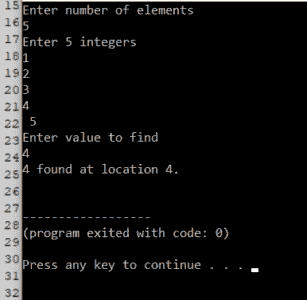
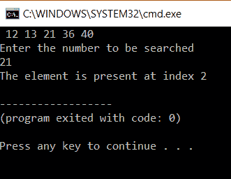

# 二分搜索法在 C:你需要知道二分搜索法的一切

> 原文：<https://www.edureka.co/blog/binary-search-in-c/>

搜索算法非常重要，因为它们有助于在模式中搜索数据，否则这是非常困难的。在这篇文章中，我们将看看二分搜索法在 C 语言中的实际实现。本文将涵盖以下[指针](https://www.edureka.co/blog/pointers-in-c/):

*   [二分搜索法在 C](#BinarySearchInC)
*   [例 1](#Example1)
*   [例 2](#Example2)

让我们从 C 语言中关于二分搜索法的文章开始，

## **二分搜索法在 C**

二分搜索法是一种排序算法，用于在排序后的数组中搜索元素。二分搜索法技术仅适用于排序后的数组，因此必须对数组进行排序才能对数组应用二分搜索法。 这是一种随着二分搜索法中迭代次数的减少而优于线性搜索技术的搜索技术。

二分搜索法背后的逻辑是有一把钥匙。该键保存要搜索的值。最高值和最低值相加，然后除以 2。最高和最低以及数组中的第一个和最后一个元素。然后将中间值与密钥进行比较。如果 mid 等于 key，那么我们直接得到输出。否则，如果密钥大于 mid，则 mid+1 变成最低值，并且在缩短的数组上重复该过程。否则，如果键值小于 mid，则 mid-1 成为最高值，并且在缩短的数组上重复该过程。如果在任何地方都找不到它，则会显示一条错误消息。

让我们进一步看这篇 C 语言中的二分搜索法，看一个例子，

## **例 1**

让我们看看代码:

```
#include <stdio.h>
int main()
{
int i, low, high, mid, n, key, array[100];
printf("Enter number of elementsn");
scanf("%d",&n);
printf("Enter %d integersn", n);
for(i = 0; i < n; i++)
scanf("%d",&array[i]);
printf("Enter value to findn");
scanf("%d", &key);
low = 0;
high = n - 1;
mid = (low+high)/2;
while (low <= high) {
if(array[mid] < key)
low = mid + 1;
else if (array[mid] == key) {
printf("%d found at location %d.n", key, mid+1);
break;
}
else
high = mid - 1;
mid = (low + high)/2;
}
if(low > high)
printf("Not found! %d isn't present in the list.n", key);
return 0;
}

```

**输出:**

如果钥匙存在:



如果钥匙不存在:


在上面的程序中，我们声明 I，low，high，mid，n，key，array[100]。

*   i 用于遍历数组。
*   low 用于保存第一个数组的索引。
*   high 用于保存最后一个数组索引。
*   mid 保存高低相加再除以 2 计算出的中间值。
*   n 是数组中元素的个数。
*   key 是要搜索的元素。
*   数组是大小为 100 的数组元素。

首先，我们获取用户数组需要的元素数量，并将其存储在 n 中。接下来，我们从用户那里获取元素。for 循环用于此过程。然后，我们从数组中取出要搜索的数字，并将其存储在键中。

接下来，我们将 0 赋给低位变量，它是数组的第一个索引，将 n-1 赋给高位元素，它是数组的最后一个元素。然后我们计算中间值。mid = (low+high)/2 以获取数组的中间索引。

有一个 while 循环，它检查 low 是否小于 high，以确保数组中仍有元素。如果 low 大于 then，high 则数组为空。在 while 循环中，我们检查 mid 处的元素是否小于 key 值(array[mid] < key)。如果是，那么我们将 mid +1 的值指定为 low，因为键值比 mid 大，并且更偏向较高的一侧。如果这是假的，那么我们检查 mid 是否等于 key。如果是，我们打印并退出循环。如果这些条件不匹配，那么我们将 mid-1 的值指定为 high，这意味着密钥小于 mid。

最后一部分检查 low 是否大于 high，这意味着数组中已经没有元素了。

记住，如果数组没有排序，这个算法就不起作用。

让我们转到这篇关于 C 语言中的二分搜索法的文章的最后一点

## **例 2**

**二分搜索法使用递归函数:**

**代码:**

```
#include <stdio.h>
int binaryScr(int a[], int low, int high, int m)
{
if (high >= low) {
int mid = low + (high - low) / 2;
if (a[mid] == m)
return mid;
if(a[mid] > m)
return binaryScr(a, low, mid - 1, m);
return binaryScr(a, mid + 1, high, m);
}
return -1;
}
int main(void)
{
int a[] = { 12, 13, 21, 36, 40 };
int i,m;
for(i=0;i<5;i++)
{
printf(" %d",a[i]);
}
printf(" n");
int n = sizeof(a) / sizeof(a[0]);
printf("Enter the number to be searchedn");
scanf("%d", &m);
int result = binaryScr(a, 0, n - 1, m);
(result == -1) ? printf("The element is not present in array")
printf("The element is present at index %d",
result);
return 0;
}

```

**输出:**



在上面的程序中，我们使用了一个函数 BinaryScr 来搜索数组中的元素。递归调用该函数来搜索元素。

我们接受用户的输入，并将其存储在 m 中。我们已经声明并初始化了数组。我们将数组、较低的索引、较高的索引和要搜索的数字发送给 BinaryScr 函数，并将其赋给 result。 在函数中，它递归地执行二分搜索法。如果没有找到，则返回-1。 在主函数中，使用了三元运算符。如果 result=-1，则显示 not found else found。

至此，我们结束了这篇关于“C 中的二分搜索法”的博客。我希望你发现这是有益的，请继续关注更多类似主题的教程。您也可以查看我们的培训计划 t 以深入了解 jQuery 及其各种应用程序，您可以 [**在此**](https://www.edureka.co/masters-program/full-stack-developer-training) 注册在线实时培训，24/7 全天候支持，终身访问。

有问题要问我们吗？在这个博客的评论部分提到他们，我们会回复你。