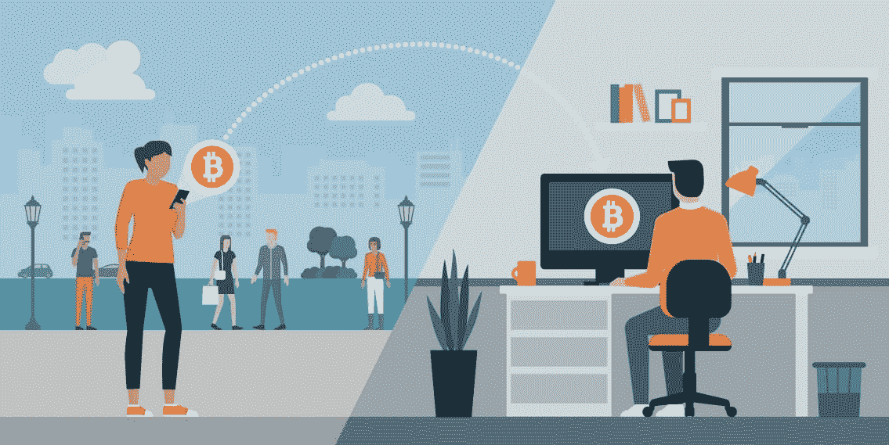
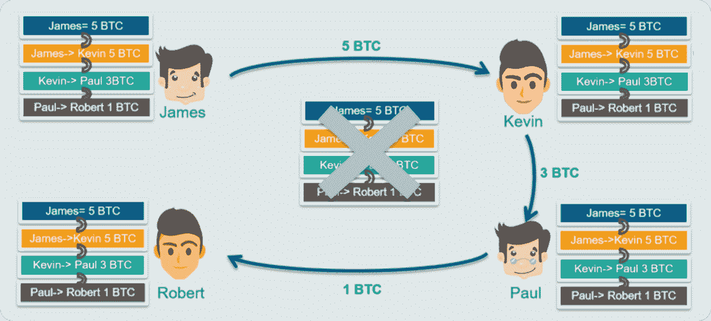
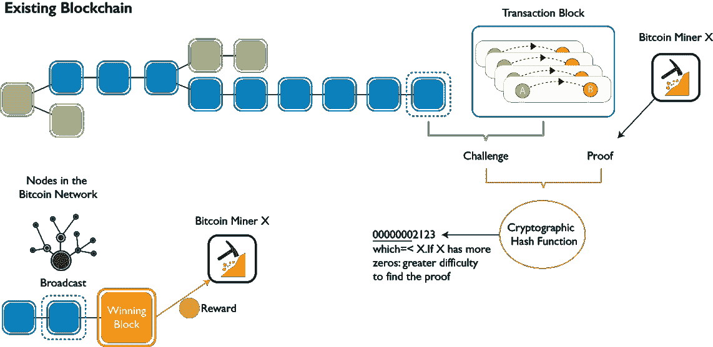
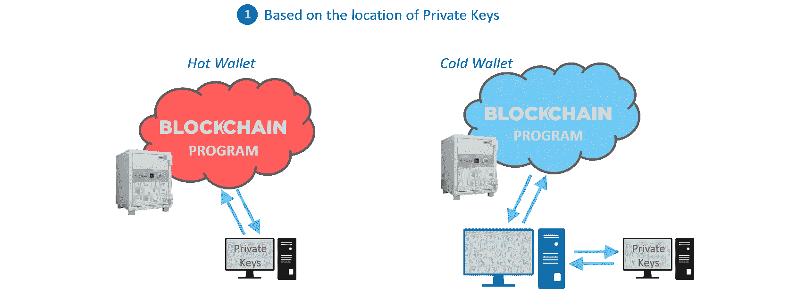
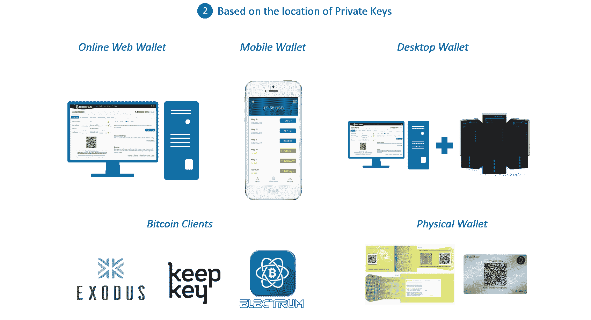
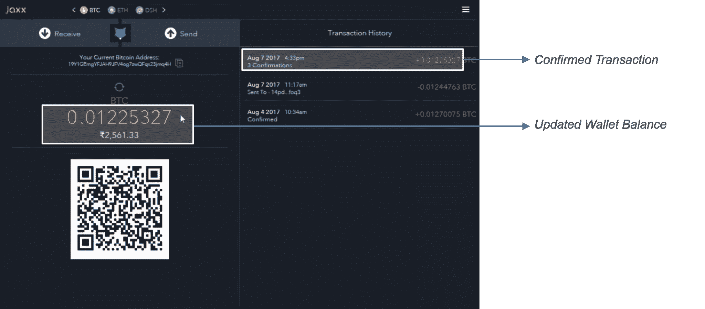

# 比特币区块链讲解:了解比特币和区块链

> 原文：<https://www.edureka.co/blog/bitcoin-blockchain-explained/>

比特币区块链无疑是当今业界的热门话题。通过这篇博客，我将尽力向你介绍加密货币比特币的概念，以及它如何创造了这种我们称之为区块链的革命性技术。在继续之前，请浏览一下我们关于什么是区块链&比特币的动画短片。

*这个问题经常引起困惑。这里有一个快速的解释，可以让你清醒一下头脑！*

## **什么是区块链|什么是比特币| edu reka**

[//www.youtube.com/embed/9qfxLo1rt1Q?rel=0&showinfo=0](//www.youtube.com/embed/9qfxLo1rt1Q?rel=0&showinfo=0)

以下是我们比特币区块链博客的故事情节:

1.  [比特币是什么？](#What_Is_Bitcoin)
2.  [什么是区块链？](#What_Is_Blockchain)
3.  [比特币如何实现区块链？](#How_Bitcoin_Implements_Blockchain) [3.1 分发公共总账](#Distributed_Public_Ledger) [3.2 哈希加密](#Hash_Encryption) [3.3 工作证明](#Proof_Of_Work) [3.4 奖励验证](#Incentives_For_Validation)
4.  [比特币挖掘](#Bitcoin_Mining)
5.  [区块链钱包](#Blockchain_Wallets)
6.  [演示:在钱包间转移比特币](#Demo_Transferring_Bitcoins_Between_Wallets)

## **什么是比特币？**

在我们继续之前，让我简单介绍一下货币交易的历史。

## **货币交易史**

当涉及到交易金钱或任何有价值的东西时，人们一直依赖银行和其他可信任的第三方，如银行和政府，以确保信任和确定性。

现在，这些可信方在促进数字交易中扮演着重要的角色。这就产生了所谓的*双重支出问题*。

但是，如果有一种方法可以让数字资产的流动去中介化呢？现在有一种技术可以让这成为可能。

2009 年，中本聪设计了一个名为比特币的点对点电子现金系统，使在线支付能够直接转账，无需中介。

## **什么是区块链？**

*   区块链是一种简单的数据结构，其中每个区块都按照带有时间戳的时间顺序链接到另一个区块
*   它是数字交易的不可变公共记录的分布式数字分类账
*   每个新记录在存储到块中之前都要通过分布式网络进行验证
*   所有存储在分类帐中的信息都是可验证和可审计的，但不可编辑的
*   每个块由其加密签名识别
*   区块链的第一块被称为**创世纪块**

## **比特币区块链讲解|爱德华卡**

[//www.youtube.com/embed/y3TpJ_vzbiM?rel=0&showinfo=0](//www.youtube.com/embed/y3TpJ_vzbiM?rel=0&showinfo=0)

## **比特币如何实现区块链？**

区块链是比特币的底层技术，克服了传统银行的所有问题。让我们来看一下这些细节。

### **1。**分布式总账

网络上的每个人都有一本账本。没有单一集中的原件。这里的分类账是指曾经发生过的所有交易的副本。

区块链是一个分布式数据库，存储了比特币历史上曾经发生过的所有比特币交易。 这确保了任何人都不能更改分类账，因为其他人会立即将其标记为损坏。

### **2。哈希加密**

存储在区块链上的一切都被*加密*。这样，每个人都可以看到所有的交易，但同时，没有人会知道这些帐户中的哪一个是属于你的。

这不正是我们所期望的银行体系吗？

### **3。工作证明**

*工作证明*是比特币区块链中发明的一个概念，其中矿工(比特币的特殊用户)将通过解决一个叫做工作证明的**复杂数学难题**来验证交易。

技术上，在时间之前有一个散列目标值被指定给每个块。 矿工俱乐部将一组未经验证的比特币交易(约 250 个)集中到一个区块，计算其哈希，然后开始寻找一组特定的字符，称为**随机数**。

从前一个块的散列、事务数据和**随机数**中获得的总散列必须与最终预分配的目标散列值相匹配。正是这个**随机数**是**计算量大的**。只有拥有巨大计算能力和电力的人才能在平均10 分钟内解决。

### **4。奖励验证**

比特币最有趣的部分是*比特币挖矿*。在这个概念中，某些用户做了一件工作，并获得每块 12.5 T4(BTC)比特币的奖励。每个区块平均需要 10 分钟来开采。

这种激励是为了奖励在计算方面的努力，并支付实现计算所需的电力和基础设施成本。目前，大型资金池控制着大约 10-20%的全球开采权，通常只有这些资金池才能成功开采比特币。

## **比特币挖矿**

比特币挖矿是将交易验证到一个新的区块中，并将这个区块添加到现有区块链中的过程。成功挖掘比特币的人会获得固定数量的新比特币，这些新比特币被挖掘到比特币经济中。目前，每个成功的矿工都可以获得 12.5 BTC ( *每 4 年或通过比特币社区决定*改变一次)，作为成功向区块链添加交易区块的奖励。

比特币钱包一般用于跨不同账户转移比特币。这些就像一个超集，包含比特币和所有其他加密货币的钱包，如以太坊、莱特币、Dash、Ripple 和 Auroracoin 等。

比特币网络上的所有交易都是通过各种比特币钱包中的一种进行的。一些受欢迎的比特币钱包包括 Jaxx、Zebpay、Blockchain.info、Electrum、Keep Eye、Exodus 和菌丝体。

## **区块链钱包种类**

我们将根据私钥、设备和客户端的位置来探索最流行的区块链钱包类型

  **图:** *比特币区块链讲解——冷热钱包*

1.  ### **热钱包**

    *热门钱包*最容易用来转移加密货币。没有必要下载整个区块链，所有私钥都在线存储，以便快速传输。与冰冷的钱包相比，它们不太可靠。

2.  ### **冷钱包**

    *冷钱包*是那些将整个区块链下载到系统上，然后离线签署每笔交易，然后在线发布的钱包。它们是进行在线加密货币转账的最安全方式。

      **图:** *比特币区块链讲解——基于私钥位置的钱包*

3.  ### **在线网络钱包**

    *在线网络钱包*是一个热门的钱包，其中区块链在线存在，用户使用他们的私钥和接收者的公共地址进行转账。

4.  ### **手机钱包**

    *手机钱包*类似于在线网络钱包，只是它们是专门为手机使用而设计的。一般来说，手机钱包也有自己的在线网络版本。

5.  ### **桌面钱包**

    *桌面钱包*是冷钱包，比特币和以太坊等区块链账户的私钥存储在冷服务器上，有一个单独的客户端机器充当互联网和服务器之间的中介。

6.  ### **实体钱包**

    实体钱包是指那些以物理方式打印了比特币(或其他加密货币)详细信息(如私钥、公共地址和二维码)以供长期使用的钱包。

7.  ### **比特币客户端**

    *比特币客户端*是专门用于比特币转账的钱包。这些客户端通过收取少量费用来帮助用户处理比特币交易。一些最受欢迎的比特币客户端是 *Keep Eye* 、 *Electrum* 、 *Exodus* 和*菌丝体*。

8.  ### **五金钱包**

    *硬件钱包*可以在连接互联网的情况下，将比特币(加密货币)从硬件直接转移到另一个比特币(加密货币)账户。最常见的情况是，钱包本身包含一个界面，用于输入收款人的详细信息和要转移的金额。

## **演示——在钱包间转移比特币**

现在让我们看看如何使用区块链钱包在多个比特币账户之间转移比特币。我们将使用流行的钱包 **Jaxx** 进行演示。

**第一步**:从 Jaxx.io 下载 Jaxx 钱包

 **图:** *比特币区块链讲解——下载 Jaxx 钱包* 

**第二步**:在 Blockchain.info 上创建你的比特币钱包账户

 **图:** *比特币区块链讲解——注册一个比特币钱包* 

**第三步**:填写 Jaxx 钱包的详细信息。 ***到*** 的地址可以从 Jaxx 钱包的 ***你当前的比特币地址*** 字段下获得。填写剩余的详细信息，如比特币金额和可选描述。

 **图:** *比特币区块链讲解——从 Blockchain.info 钱包发送比特币* 

**第四步**:确认填写的所有细节是否正确，点击发送比特币按钮确认交易。

**第五步**:现在可以刷新 Jaxx 钱包，查看更新后的比特币余额。大约需要 30 分钟交易才能得到 3 块确认。

  **图:** *比特币区块链讲解——在 Jaxx * 确认交易

我希望我已经能够通过这篇博客让你对比特币和区块链略知一二。推荐大家去看看我们的 **[区块链教程](https://www.edureka.co/blog/blockchain-tutorial/)** 和 [**区块链技术**](https://www.edureka.co/blog/blockchain-technology/) 博客，深入了解区块链、比特币、加密货币、以太坊、超账本和智能合约。

*有问题吗？请在评论区提到它，我们会给你回复。*

*如果您希望学习区块链并在区块链技术领域建立职业生涯，那么请查看我们的 [**区块链认证**](https://www.edureka.co/blockchain-training) 课程，该课程带有讲师指导的现场培训和真实项目体验。该培训将帮助您深入了解区块链，并帮助您掌握该主题。*