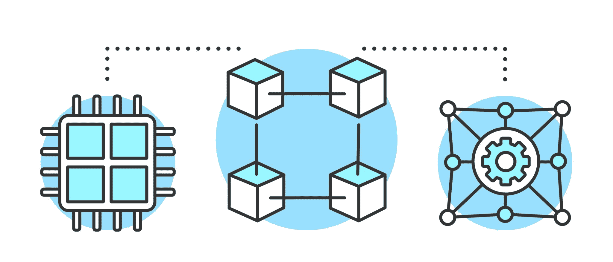
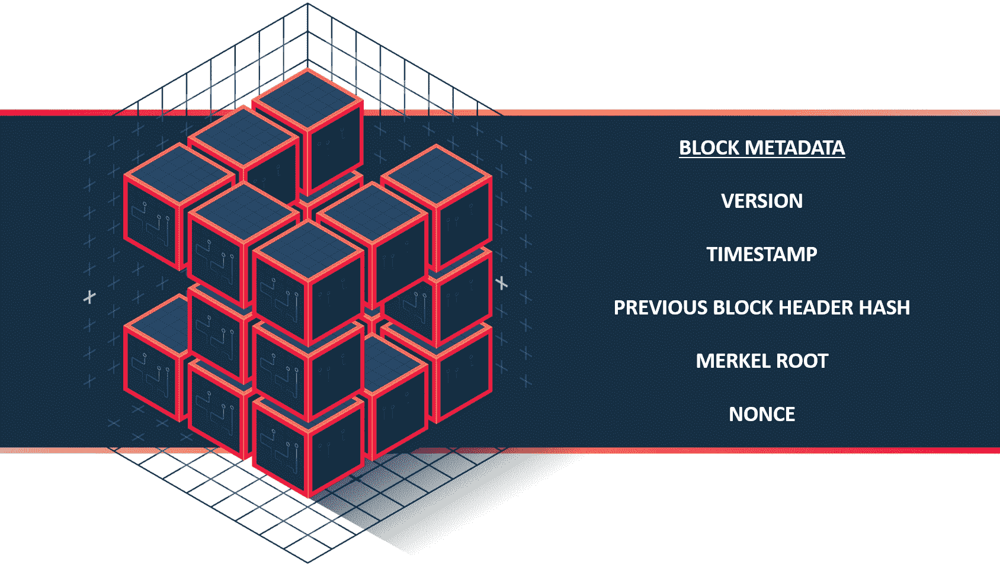
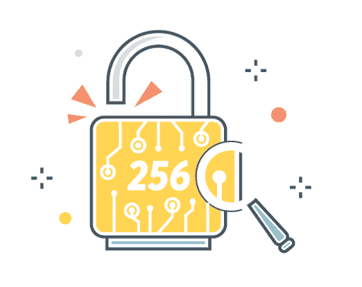
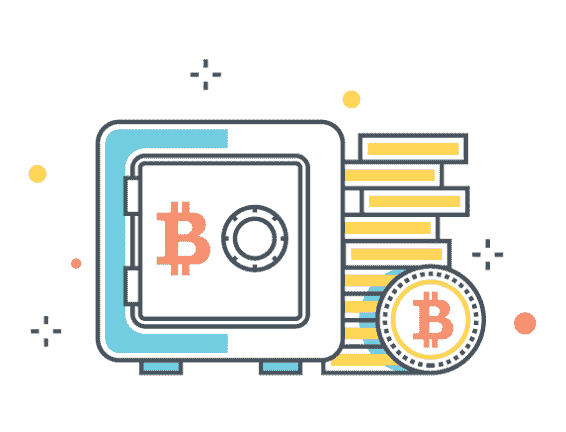

# 关于区块链架构你需要知道的一切

> 原文：<https://www.edureka.co/blog/blockchain-architecture/>

*为什么叫[区块链](https://www.edureka.co/blog/how-blockchain-works/)？*–这是因为它将交易数据存储在块中，这些块连接在一起形成一个链。随着交易数量的增长，区块链的规模也在增长。为了更清楚地了解这个辉煌的发明，让我们来讨论它的架构。T 他的架构组件被各种公司一般化然后修改，导致了不同的区块链项目，如比特币、[以太坊](https://www.edureka.co/blog/what-is-ethereum/)、 [Hyperledger](https://www.edureka.co/blog/what-is-hyperledger/) 等。 在这篇博客中，为了简单起见，我们将讨论比特币区块链架构。

下面是体系结构组件的列表:

*   [交易](#transaction)
*   [块](#block)
*   [P2P 网络](#p2p)
*   [共识算法](#consensus)

在讨论架构之前，让我们先弄清楚一些事情:

*   区块链不是比特币；区块链是比特币 T2 背后的技术。
*   比特币是数字代币或[加密货币](https://www.edureka.co/blog/top-5-cryptocurrencies/)，而区块链是记录这些数字代币交易的账本。
*   没有区块链的比特币是不可能的，但是你可以拥有没有比特币的区块链。

## **交易**

事务 是区块链系统的最小组成部分。 它们通常由收件人地址、发件人地址和值组成。它类似于标准的信用卡对账单。 拥有者通过对前一次交易和接收方公钥相加产生的散列进行数字签名来转移价值。

事务然后被公开地向网络宣布，并且所有的节点独立地持有它们自己的区块链的副本，并且当前已知的“状态”是通过按照出现在区块链中的顺序处理每个事务来计算的。 事务被捆绑，以块的形式交付给各个节点。当新的事务分布在整个网络中时，它们由每个节点 独立地验证和“处理” 。 每笔交易都有时间戳，集中在一个块中。

## **块**

块 包含了作为块头和交易的信息。块是数据结构，其目的是捆绑事务集，并被复制到网络中的所有节点。区块链的街区是由 矿工 创造的。 挖掘 是创建将被网络其余部分接受的有效块的过程。 节点获取未决事务，验证它们在密码上是准确的，并将它们打包成块存储在区块链上。 块头 是帮助验证块的 有效性的元数据。块元数据的内容如下图所示

块的其余部分包含事务。它可以是捆绑在一个块中的任意数量的事务，这取决于矿工的选择。

### **块的类型**

1.  大多数区块只是扩展了当前的主区块链，这也是网络中最长的链。这些块被称为**“主支块”**。
2.  一些块引用了不在最长区块链的父块。这些块被称为**“侧支块”**。
3.  一些块引用了一个父块，该父块对于处理该块的节点来说是未知的。这些被称为**【孤儿区块】**。

分支块目前可能不是主分支的一部分，但是如果挖掘出更多的引用它们作为父分支的块，特定的分支可能会被 重组 到主分支中。这就带来了 分叉 的概念。

## **P2P 网络**

区块链是一个对等(P2P)网络，工作在 IP 协议上。P2P 网络是没有集中节点的平面拓扑。所有节点在通过一致算法协作的同时平等地提供和消费服务。 对等点贡献网络维护所需的计算能力和存储。P2P 网络通常更安全，因为它们不像集中式网络那样具有单点攻击或故障。 区块链网络可以是基于许可的网络，也可以是无许可的网络。一个 无许可 网络也被称为公共区块链，因为任何人都可以加入该网络，而一个基于许可的区块链被称为区块链财团。基于 许可的 区块链或私人区块链需要网络内的参与者的预先验证，并且这些参与者通常彼此认识。在典型的区块链体系结构中，网络中的每个节点都维护着区块链的本地副本。区块链架构的去中心化是它所基于的 P2P 网络的唯一优点。

## **共识算法**

单个分类账的所有这些副本同步的方式是由于共识算法 。共识机制确保无论每个个体方具有什么本地副本，它们都是彼此一致的并且是最新的副本。每个单独节点具有的拷贝彼此相同或相似。可以说共识算法构成了每一个区块链架构的核心。 下面讨论一些共识算法:

### **工作证明(POW)**

它涉及解决一个具有计算挑战性的难题，以便在区块链网络中创建新的块。它基本上包括猜测产生 256 位散列的字符串，该散列由流行的散列算法 SHA256 产生。散列算法是不可逆的这一事实是这种达成共识的方法的基本支柱。因为有人必须通过一百万次猜测来验证散列，所以这个过程被称为“工作证明”。

### **股权证明(POS)**

在此，节点被称为验证器。他们验证交易以赚取交易费。随机选择节点来验证块，并且这种随机选择的概率取决于特定节点拥有的赌注的数量。

### **简化的拜占庭容错(SBFT)**

这里的基本思想包括一个单一的验证器，它捆绑提议的交易并形成一个新的块。这里的验证者是已知的一方，因为分类帐具有基于许可的性质。作为网络中最小数量的其他节点校正新块的结果，达成了共识。

*这就把我们带到了这篇“区块链架构”博客的结尾。如果您希望学习区块链并在区块链技术方面建立职业生涯，那么请查看我们的 [**区块链** **培训**](https://www.edureka.co/blockchain-training) ，它带有讲师指导的现场培训和真实项目经验。该培训将帮助您深入了解区块链，并帮助您掌握该主题。*

<article class="maincontentblog">

*对我们有疑问吗？请在这个“区块链架构”博客* *的评论区提及，我们会尽快回复您。*

</article>