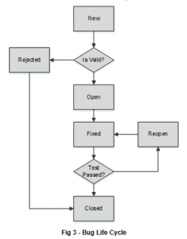
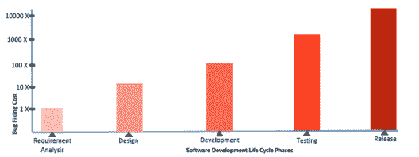

# 软件测试中的错误——什么、哪里和如何

> 原文：<https://www.edureka.co/blog/bugs-in-software-testing/>

不可能构建一个 100%没有错误的 web 应用程序。您可以将计算机程序或系统中导致产生错误或意外结果的错误、缺陷、失败或故障最小化。本文将按以下顺序为您提供关于[软件测试](https://www.edureka.co/blog/what-is-software-testing/)中的错误的深入知识:

*   [软件测试中的 bug 介绍](#softwaretestingbugs)
*   [bug 及其来源](#bugsource)
*   [Bug 及其影响](#bugimpact)
*   [Bug 生命周期](#buglifecycle)
*   [bug 和修复成本](#bugcost)

## **软件测试中的 bug 介绍**

在当今世界，随着技术在各行各业取得更大的进步，软件开发需要精确、快速并以最佳质量交付。在软件世界中，一个会破坏交易的东西是发布的软件中的“bug”。

“Bug”是软件开发过程中最不受欢迎的词。bug 表示正在构建的软件/系统中产生意外结果的故障、错误或失败。需要跟踪和修复已识别的 bug，以确保正在开发的软件/系统的最佳质量。

下面解释了代码中的任何错误被识别为 Bug 的过程

## ****

## **bug 及其来源**

bug 实际上是在软件开发生命周期的适当过程中引入的错误。下面详细介绍了最常见的错误来源

*   不明确的需求——不明确的需求是引入 bug 的来源。这可以通过强大的静态测试技术、审查、演练等来避免。
*   编程错误——不正确的编码标准是一个源头，通过适当的代码审查和[单元测试](https://www.edureka.co/blog/what-is-unit-testing) 可以将其最小化
*   无法实现的最后期限——严格的时间表通常会导致错误，如果进行适当的规划以确保时间表是基于估计值驱动的，这些错误是可以避免的

每一个 bug 不仅破坏了它出现的功能，而且有可能在应用程序的其他领域引起连锁反应。修复任何 bug 时，都需要评估这种连锁反应。缺乏对这些问题的预见会导致严重的问题和 bug 数量的增加。

## **软件测试中的 bug 及其影响**

根据严重性和优先级来衡量缺陷的影响。对业务的影响用严重性来衡量，而对业务执行的影响用优先级来衡量。

下表是整个软件行业对严重性的标准定义。

| **严重性** | **定义** |
| **危急** | 严重缺陷会对业务运营造成重大破坏。一个严重的应用程序问题，会导致相当长的停机时间、经济损失或失去客户的信任。 |
| **高** | 重大缺陷会导致业务功能的丧失，并且需要在生产中采用变通方法。 |
| **中等** | 对业务功能有中等影响，但可以立即管理或解决的缺陷。 |
| **低** | 不会对业务或用户产生影响的表面缺陷 |

优先级决定了业务执行的影响，以及随后需要多快修复缺陷，以确保项目计划按计划进行。

下表是整个软件行业对优先级的标准定义

| **优先级** | **定义** |
| **立即** | 任何导致企业停止使用软件的问题，也就是说，在没有解决方法的情况下，在该问题得到纠正、测试和重新迁移之前，不能执行任何其他操作**。** |
| **高** | 主要功能或特性被禁用或不正确，导致服务质量严重下降。解决方法是可行的，但是额外的问题/故障可能导致严重故障。**** |
| **中等** | 一个问题，它表示多个测试流(除了关键路径)中的一个被停止，但是其他的处理流仍然可以继续。 |
| **低** | 业务仍然可以采用变通方法，并且可以单独应用该修复 |

## **Bug 生命周期**

每个报告的 bug 都有一个生命周期，直到关闭。bug 生命周期说明了 bug 从创建到修复和关闭的过程。一般的 bug 生命周期解释如下:

对上述生命周期中每个状态的描述如下

| **状态** | **定义** |
| **新增** | 当一个缺陷被发布时，默认状态是‘新的’。**** |
| **打开** | 当缺陷被开发人员接受时，它被转移到“开放”状态。**** |
| **拒绝了** | 当缺陷被开发人员拒绝时，它被转移到“拒绝”状态。**** |
| **固定** | 当缺陷被开发人员修复后，它被转移到“已修复”状态。测试人员将挑选所有处于“已修复”状态的缺陷进行测试。 |
| **重开** | 如果测试失败了，缺陷被转移到“重新打开”状态。**** |
| **关闭** | 如果测试已经通过，缺陷被转移到“关闭”状态。 |

## **软件测试中的错误和修复成本**

没有固定的成本可以归因于软件缺陷。然而，一个 bug 的成本随着这个 bug 在软件开发生命周期中被发现的程度而上升。在生产中发现的任何错误代码都需要回到 SDLC 的开始，在那里开发周期可以重新开始。

下图说明了根据确定的 SDLC 阶段修复 bug 的成本:

至此，我们已经结束了软件测试中的 Bug 一文。我希望你明白什么是 bug，它的来源和影响。

*既然你已经了解了软件测试中的 bug，那就来看看 Edureka 的 [**软件测试基础课程**](https://www.edureka.co/software-testing-fundamentals-training) 。本课程旨在向您介绍完整的软件测试生命周期。您将学习不同级别的测试、测试环境设置、测试用例设计技术、测试数据创建、测试执行、错误报告、DevOps 中的 CI/CD 管道以及软件测试的其他基本概念。*

有问题要问我们吗？请在“软件测试中的错误”的评论部分提到它，我们会给你回复。