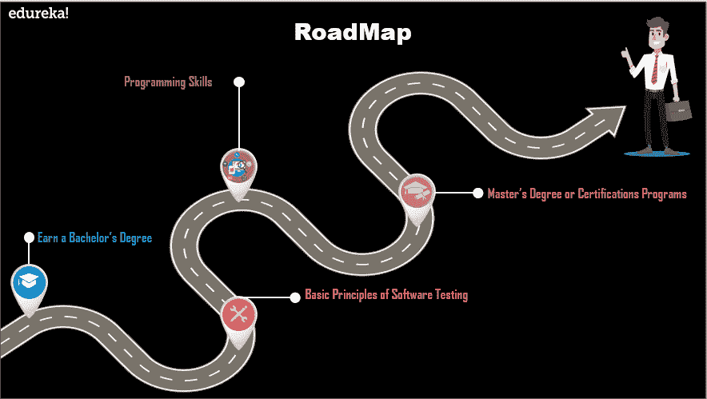
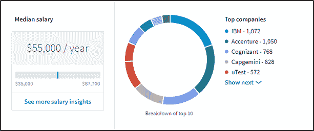

# 如何在软件测试领域成就一番事业？

> 原文：<https://www.edureka.co/blog/career-in-software-testing/>

[软件测试](https://www.edureka.co/blog/software-testing-tutorial/)背后的基本思想是致力于软件质量的保证。测试人员的大部分时间都投入到了测试中，这涉及到各种各样的人:用户、开发人员、测试人员等等。测试人员必须确保最终用户对他的最终产品满意。这里有一个完整的指导方针来建立你的软件测试职业生涯:

*   [成为软件测试员的重要方面](#Importantaspectsforbecomingasoftwaretester)
    *   [软件测试工具](#Softwaretestingtools)
    *   [软件测试技术](#Softwaretestingtechniques)
    *   [域](#Domain)
*   [资格](#Qualification)
*   [技能](#Skillrequirement) [要求](#Skillrequirement)
    *   [技术技能](#Technicalskill)
    *   [非技术技能](#Non-technicalskill)
*   [成为软件测试工程师的路线图](#roadmap)
*   [软件测试工程师的工资待遇](#salary)
*   软件测试人员面临的挑战

我们开始吧！

## **成为软件测试员的重要方面**

我们将要讨论软件测试的三个重要方面。

### **软件测试工具**:

一个人应该学会使用几个[软件测试工具](https://www.edureka.co/blog/software-testing-tools/)用于不同的目的，例如，测试管理、[测试自动化](https://www.edureka.co/blog/test-automation-strategy/)、[性能测试](https://www.edureka.co/blog/performance-testing-tutorial/)、安全测试等等。测试人员应该能够处理不同领域的多种工具，因为我们有一个技术不断变化的时代，但是这些不同工具的基本原理仍然保持不变。测试人员应该能够编写代码来实现这些工具。软件测试需要深刻的技术思维框架来识别和提供软件缺陷的解决方案。

继续成为软件测试员的下一个方面

### 软件测试技术:

理解软件测试的基本[技术](https://www.edureka.co/blog/software-testing-methodologies-and-techniques/)并精通这些技术是软件测试所需要的。人们可以通过像 ISTQB(国际软件测试资格委员会)或 CSTE(认证软件测试员)这样的认证来学习软件测试的基础知识。测试人员需要执行白盒测试，这意味着审查代码以了解软件的工作流程，甚至在整个系统构建之前就识别出缺陷。测试人员确实执行[黑盒测试](https://www.edureka.co/blog/videos/implementing-blackbox-testing/)，它与软件一起识别缺陷。

## ****

继续成为软件测试员的下一个方面

### **域**:

您还需要了解领域。域有两种类型:

**垂直领域:**银行、保险、制造业，或 **水平领域:**跨多个行业使用，如客户关系管理、供应链管理等。

例如，您需要了解银行流程来测试银行软件。

因此，你应该很熟悉这两个因素。

进入下一个环节。让我们讨论一下成为一名软件测试人员所需要的资格。

## **资格**

为了获得成为软件测试员的资格，你应该拥有计算机科学的学术背景。

技术/工程学士，MCA，BCA，计算机学士，会帮助你找到工作。

不要担心，如果你没有这些学位，总会有另一种方法的！您可以获得像 [ISTQB](https://www.guru99.com/istqb.html) 和 [CSTE](https://www.guru99.com/qai-cste-guide-exam-pattern.html) 这样的软件测试认证，这将有助于您学习软件开发/测试生命周期和其他与软件测试相关的方法。

掌握了所需的资格后，下一个主题是了解所需的技能。

## **技能要求**

这个因素分为两类:

继续第一类

### **技术技能**:

*   **测试管理工具知识:**测试管理是软件测试的一个重要方面。测试管理技术很重要，这样软件才不会失败。测试管理管理你的测试相关的工件。

*   **Linux 命令的基本知识:**你会看到几乎所有的软件应用程序、数据库都在 Linux 机器上运行。因此，你需要很好地掌握 [Linux 命令](https://www.edureka.co/blog/linux-commands/)。

*   任何缺陷跟踪工具的知识- 缺陷跟踪和缺陷生命周期是软件测试的关键方面。缺陷跟踪变得很重要，因为整个团队都应该知道缺陷，包括经理、开发人员和测试人员。有几种工具可以用来锁定缺陷，包括质量控制、吉拉等。

*   **自动化工具知识:**如果你想成为一名从事[手工测试](https://www.edureka.co/blog/what-is-manual-testing/)的“自动化测试人员”，那么你必须掌握一种工具，并获得深入的、实际的自动化工具知识。

*   能够分析不同软件的需求

*   文档技能

*   工程生命周期

继续第二类

### **非技术技能**

*   **沟通**:书面沟通、客户沟通都是必要的。

*   领导素质:评估不同的情况并处理它们

*   分析技能:一个好的软件测试人员应该拥有敏锐的分析技能。这将有助于将一个复杂的软件系统分解成更小的单元，以获得更好的理解。

*   时间管理:一个软件测试人员必须有效地管理工作量，应该有高生产率，应该展示出最佳的时间管理和组织技能。

现在让我们更进一步，看看成为软件测试工程师的路线图。

## **成为软件测试工程师的路线图**

1.  为了成为一名[软件测试员](https://www.edureka.co/blog/software-testing-strategies/)，你需要有学士学位。 你可能需要获得与你想工作的领域相关的工程学学士学位。例如，如果你想成为一名软件测试工程师，你将需要一个软件工程的学士学位。

2.  要成为一名测试工程师，你应该确定这项工作是否适合你的技能、特质、抱负和想要的生活方式(比如工作生活平衡、日程安排等)。).

3.  在数学和科学方面有天赋，喜欢与计算机和电子设备打交道的人通常非常适合这一工作。要在这一领域工作，你必须能够自如地与其他专业人士(如设计工程师和经理)密切合作，并与他们分享你的观点。

4.  接下来，我们需要了解软件测试的基本原则，比如发现任何类型的缺陷，如何在没有详尽测试的情况下确定风险，早期测试，缺陷聚类，以及如何使产品满足业务需求而不出错。

5.  如果你是测试行业的新手，你需要了解这些编程语言:

与此同时，如果你拥有计算机科学机器学习统计学硕士学位或任何与软件测试相关的认证，这只是一个额外的优势。

*   对于软件测试工程师来说，一些最好的认证是**CAST-软件测试认证助理**

*   **CSTE 认证软件测试工程师等。**

软件测试作为一种职业，不是关注短期，而是关注提高软件用户和开发者的满意度和安全性的长期目标。记住每一个因素后，现在你可以更好地判断你是否想从事软件测试职业！

## **软件测试工程师的工资待遇**

每份工作简介中最有趣的部分是它的薪水。平均而言，软件测试工程师的年薪约为 55，000 美元。

上面的快照描述了顶级公司和软件测试人员的薪水情况。

从事软件测试会遇到一些挑战。下面一一列举。

## 软件测试人员面临的挑战

*   处理时间压力

*   与最终用户打交道

*   适应新技术

*   把握终端用户的需求

至此，我的博客已经接近尾声。我希望这些内容对你的软件测试知识有所帮助。敬请期待！

现在你已经了解了什么是软件测试职业，去看看 Edureka 的[软件测试基础课程](https://www.edureka.co/software-testing-fundamentals-training)。本课程旨在向您介绍完整的软件测试生命周期。您将学习不同级别的测试、测试环境设置、测试用例设计技术、测试数据创建、测试执行、错误报告、DevOps 中的 CI/CD 管道以及软件测试的其他基本概念。有问题吗？请在“什么是软件测试”的评论部分提到它，我们会给你回复。

有问题要问我们吗？请在这个“软件测试职业”博客的评论部分提到它，我们会尽快回复你。