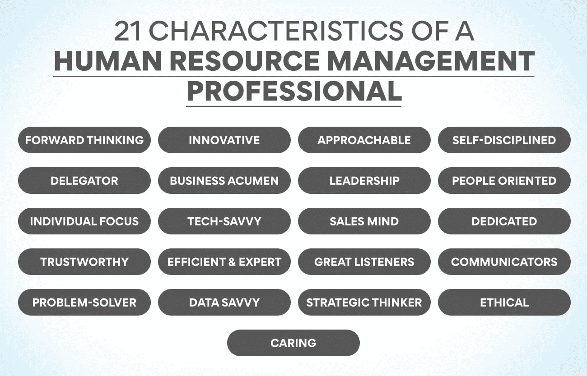

# 人力资源管理专业人员的 21 大特征

> 原文：<https://www.edureka.co/blog/characteristics-of-human-resource-management/>

人力资源管理专业特点: [人力资源管理](https://www.edureka.co/blog/role-of-human-resource-management-in-an-organization/) (HRM)是对组织中的人进行管理。它负责吸引、选择、培训、评估和奖励员工，同时监督组织领导和文化，并确保遵守劳动和就业法律。要在人力资源管理中取得成功，一个人必须拥有一套特定的技能和特征。如果你拥有所有或大部分这些品质，那么人力资源管理的职业生涯可能适合你！这篇博文将讨论人力资源管理专业人员的所有基本特征。

查看我们的人力资源管理研究生证书，这将为你在人力资源管理领域的职业生涯做好准备。

## **21 人力资源管理专业的特点**

## **人力资源管理专业的特点:前瞻性思维**

随着企业工作文化的不断发展，管理其最重要资产——人力资源的人的技能和能力也必须不断发展。为了保持领先，人力资源专业人员必须在管理人员和制定工作场所战略方面具有前瞻性思维。

## **创新**

创新的人力资源管理专业人士总是寻找新的方法来改善他们的部门和公司。他们乐于接受新思想，并准备承担风险。这使他们能够找到创造性的问题解决方案，并实施变革以提高效率和有效性。

创新的人力资源管理专业人士也紧跟该领域的潮流。他们知道哪些新技术或实践是可用的，以及它们如何能使他们的组织受益。这使他们能够保持领先，并确保他们的公司使用最好的方法。

## **平易近人**

人力资源管理专家应该平易近人。这意味着他们应该易于交谈，并乐于倾听员工可能存在的任何顾虑或问题。他们还应该能够与员工建立关系，创造一个让每个人都感到交流舒适的环境。

## **自律**

要在人力资源管理方面取得成功，自律是必不可少的。这意味着控制自己，设定个人界限，即使面对干扰或诱惑也要坚持工作。这也意味着要积极主动，有条理，并跟上所有必要的阅读和研究，以了解最新的人力资源趋势。最后，自律还包括在与员工互动时保持积极的态度并展现领导素质。

## **人力资源管理专业人员特征:** **委托人**

委派者是人力资源管理专业人士，他们知道自己的工作是将任务和责任委派给他人。授权者知道他们的时间最好花在高层次的任务和计划上，而不是陷入细节中。他们不害怕放弃控制权，并相信他们的团队能够处理这项工作。

**也读作:[分解人力资源管理的范围](https://www.edureka.co/blog/scope-of-human-resource-management/)**

## **商业头脑**

随着人力资源管理的不断发展，人力资源专业人员所需的技能和素质也在不断提高。尽管沟通和人际交往技能等软技能仍至关重要，但商业敏锐性越来越受到重视——即在一个组织更广泛的商业背景下理解和工作的能力。

在当今复杂的商业环境中，组织寻求能够在传统人力资源职能之外增加价值的人力资源专业人士。他们希望人力资源部门的员工能够进行战略性思考，看到全局，并为组织的整体成功做出贡献。因此，对任何在人力资源部门工作或渴望在人力资源部门工作的人来说，商业头脑是一项基本技能

要在人力资源管理领域开始职业生涯，或者已经在这个领域工作，发展你的商业理解应该是首要任务。检查我们的人力资源管理研究生证书，以建立该领域的专业知识。

## **领导力**

人力资源管理专家是他们所在领域的领导者。他们拥有激励周围人的能力。他们是优秀的沟通者，有很强的人际交往能力。此外，他们可以战略性地思考问题，并开发创造性的解决方案。他们组织有序，更注重细节。人力资源专业人士擅长在压力下高效工作，并在最后期限前完成任务。

## **人力资源管理专业的特点:以人为本**

人力资源管理专家是以人为本的人。他们喜欢和人们一起工作，帮助他们发展技能。这些专业人士很有耐心，明白沟通的重要性。他们可以与团队成员建立关系，帮助他们信任组织。

## **个人焦点**

谈到人力资源管理，专业人士能做的最重要的事情之一就是关注个人。这意味着将每个员工理解为拥有独特技能、需求和目标的个体。这也意味着创造一个员工感到被重视和被支持的工作环境。

专注于个人的人力资源专业人员将能够创建一个强大的员工团队，他们都朝着共同的目标努力。这个团队将会更有生产力和效率，并且他们将会长期坚持下去。

关注个人也能让人力资源专业人员更好地解决任何可能出现的问题。通过了解每个员工，他们将能够尽早发现潜在的问题，并在问题变得更严重之前采取措施加以解决。

关注个人对于任何想要在工作中取得成功的人力资源专业人士来说都是至关重要的。通过花时间了解每个员工并创造一个支持性的工作环境，他们将建立一个强大的团队，能够取得伟大的成就。

## **精通技术的人**

随着商业世界的竞争日益激烈，对有效的人力资源管理的需求比以往任何时候都大。人力资源专业人员必须能够紧跟最新趋势和技术，并适应和利用它们来保持领先地位。

最成功的人力资源专业人士总是在寻找新的方法来改进他们的方法和流程。他们不断研究新的软件和技术，以帮助他们的工作更轻松，公司更高效。他们知道如何使用社交媒体和其他在线工具与员工和候选人联系，并且总是在探索新的方式来利用这些工具。

要成为一名高效成功的人力资源专业人士，你必须紧跟所有最新的趋势和技术。只有这样，你才能有效地管理公司的人力资源，并在竞争中保持领先。

## **人力资源管理专业人员的特点:销售头脑**

人力资源管理专业人员负责员工招聘、选拔和培训。他们还处理[员工关系](https://www.edureka.co/blog/better-employee-relation-can-lead-to/)，福利，以及[薪酬](https://www.edureka.co/blog/compensation-in-hrm)。要想在这个职位上取得成功，人力资源管理专家必须具备销售头脑。

人力资源管理专业人员必须能够向潜在员工推销公司。他们必须能够让员工相信，公司是一个很好的工作场所，他们在那里会很开心。

人力资源管理专业人员还必须能够向员工推销公司的产品和服务。他们必须能够让他们相信公司的产品和服务是市场上最好的。

## **专用**

人力资源管理专业人士对他们的工作很投入，也很认真。他们对与他们一起工作的人负责，确保他们受到公平对待，并被允许取得成功。他们还紧跟人力资源的最新趋势，并知道如何将这些趋势应用到工作场所。

## **值得信赖**

人力资源管理专家是你可以信任的人，他会管理你最宝贵的资产——你的员工。他们将帮助你为你的组织寻找、发展和留住最优秀的人才。他们明白与员工建立良好关系的重要性，并会始终以你的最佳利益为重。

## **人力资源管理专业的特点:高效&专家**

一个高效而专业的人力资源管理专家可以从他们的团队中获得最大收益。他们可以通过仔细设定目标，然后相应地委派任务来做到这一点。他们还确保为他们的团队提供足够的支持和资源，以便他们能够成功。此外，这些专业人员不断寻找提高团队效率的方法，并不断寻求反馈，以便他们能够做出必要的改变。

**也读作:[人力资源管理的关键目标](https://www.edureka.co/blog/objectives-of-human-resource-management/)**

## **伟大的听众**

要成为一名成功的人力资源管理专家，成为一名出色的倾听者是必不可少的。这意味着倾听员工的心声，理解他们的需求和担忧。这也意味着与组织中不同层次的员工进行有效的沟通。

出色的倾听技巧对于与员工建立信任和融洽关系至关重要。良好的沟通对于管理冲突和解决问题也至关重要。当员工感到自己被倾听和理解时，他们更有可能信任和尊重他们的经理。

善于倾听的人力资源管理专业人士将更有能力建立一种积极的工作文化，让员工受到重视和激励。

## **传播者**

人力资源管理专业人员必须能够与各种人有效沟通，包括组织内其他部门的人。他们应该有出色的写作技巧，清晰地表达自己的想法。此外，他们应该能够自如地向团队展示信息，并能够在必要时进行困难的对话。

## **人力资源管理职业特点:问题解决者**

对于一个组织来说，一个成功的人力资源管理专家的基本特征之一就是解决问题的能力。毕竟，这么多不同的人一起工作，必然会有冲突和问题出现。一个好的人力资源经理将能够倾听问题的双方，并提出一个公平的解决方案，使公司整体受益。

除了解决问题，人力资源管理专家还应该是一个优秀的沟通者。他们还应该有很强的人际交往能力，能够与员工建立信任和融洽的关系。这对于有效管理员工和维持健康的工作关系至关重要。

## **数据悟性**

随着商业格局的不断发展，人力资源管理人员的技能也必须不断提高。对于任何人力资源专业人员来说，最重要的技能之一就是处理数据的能力。

在当今数据驱动的世界，人力资源专业人员必须理解并在决策中使用数据。这意味着能够收集、解释和分析各种来源的数据。这也意味着能够自如地使用不同类型的软件和技术。

精通数据的人力资源专业人士可以做出提高组织绩效的决策。他们使用数据来识别趋势和模式，然后制定策略来解决这些问题。他们还使用数据来评估项目和政策的有效性。最后，他们利用数据向组织中的其他人传达他们的发现。

## **战略思想家**

A [人力资源管理专业人士是战略思想家](https://www.edureka.co/blog/strategic-human-resource-management)。他们能够看到全局，并制定长期计划来实现组织的目标。人力资源管理专业人员可以创造性地思考，开发新的想法，以提高效率。他们也能够进行批判性思考和分析，以解决所有问题。

## **人力资源管理职业的特征:伦理**

人力资源管理专业人员必须考虑几个道德因素:

1.  他们必须确保自己的行为符合组织和员工的最大利益。
2.  他们必须尊重与员工相关的信息和数据的机密性。
3.  他们只能将信息用于预期目的，而不能用于个人利益。
4.  他们应该始终表现得专业并维护组织的标准。

## **关怀**

人力资源管理专业人员的特点之一是关心他人。人力资源管理专业人员应该真正关心人和他们的发展。他们应该热衷于创造积极的工作环境，帮助员工发挥他们的潜力。他们还应该能够在信任和尊重的基础上与员工建立牢固的关系。

## **结论**

要进入人力资源管理领域，你必须具备成功所需的能力和特质。虽然人力资源管理专业人员可能来自各种背景，但人力资源管理专业人员有一些共同的特征。从优秀的沟通者到强大的组织能力，最好的人力资源经理是那些对人和业务都有深刻理解的人。有了正确的心态和技能，你就能在人力资源管理的职业生涯中获得回报。

别忘了看看我们[的人力资源管理研究生证书](https://www.edureka.co/highered/human-resourse-management-course-iim-shillong)。

## **更多信息:**

[目标&人力资源管理的本质](https://www.edureka.co/blog/nature-of-human-resource-management/)

[人力资源管理的演变:过去和未来](https://www.edureka.co/blog/evolution-of-human-resource-management)

[人力资源管理的关键基础](https://www.edureka.co/blog/fundamentals-of-human-resource-management/)

[什么是人力资源管理系统？](https://www.edureka.co/blog/human-resource-management-system/)