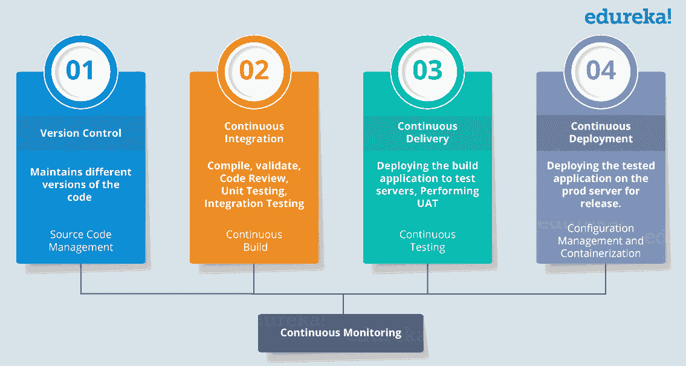
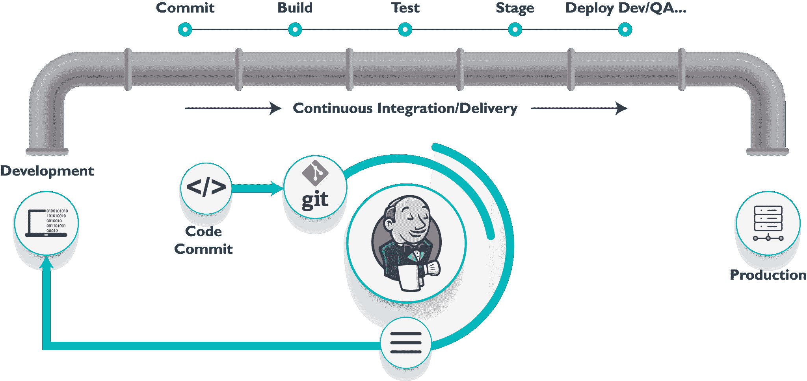
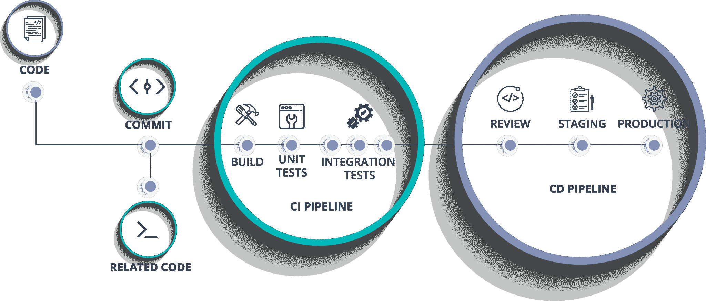

# CI/CD 管道–了解如何从头开始设置 CI/CD 管道

> 原文：<https://www.edureka.co/blog/ci-cd-pipeline/>

CI CD 管道实施或持续集成/持续部署软件是现代 DevOps 环境的支柱。可以在数据工程师、云架构师、数据科学家等各种工作角色中找到 ***[持续集成&持续部署技能](https://www.edureka.co/devops)*** 的要求。CI/CD 通过自动化应用程序的构建、测试和部署，在开发和运营团队之间架起了一座桥梁。在这篇博客中，我们将了解什么是 CI CD 管道以及它是如何工作的。

在讨论 CI CD 管道的工作之前，让我们先来了解一下 DevOps。

## **[什么是 DevOps？](https://www.edureka.co/blog/what-is-devops/)**

DevOps 是一种软件开发方法，涉及软件在其整个开发生命周期中的持续开发、持续测试、持续集成、持续部署和持续监控。这正是所有顶级公司开发高质量软件和缩短开发生命周期所采用的流程，从而提高客户满意度，这是每个公司都希望的。

## **DevOps 阶段**

如果不了解 DevOps 的生命周期，你对它的理解是不完整的。现在让我们看看 DevOps 生命周期，并探索它们与软件开发阶段的关系。

****

## **CI CD 管道使用 Jenkins | DevOps 教程**

[//www.youtube.com/embed/m0a2CzgLNsc?rel=0&showinfo=0](//www.youtube.com/embed/m0a2CzgLNsc?rel=0&showinfo=0)

*该 CI-CD 管道视频解释了持续集成、持续交付&部署的概念、其优势及其工具。*

## **什么是 CI CD 管道？**

CI 代表持续集成，CD 代表持续交付和持续部署。你可以把它看作是一个类似于 的过程，一个软件开发生命周期。现在让我们看看它是如何工作的。

上面的管道是一个软件在交付给客户或投入生产之前，如何在生命周期的各个阶段进行的逻辑演示。

让我们以 CI CD 管道为例。假设您要构建一个 web 应用程序，它将部署在实时 web 服务器上。你将拥有一组开发人员，他们负责编写代码，这些代码将进一步用于构建 web 应用程序。现在，当这个代码被开发团队提交到一个版本控制系统(比如 git，svn)中时。接下来，它通过**构建阶段**，这是流水线的第一阶段，在这里开发人员放入他们的代码，然后代码再次进入具有适当版本标签的版本控制系统。

假设我们有一段 Java 代码，需要在执行前编译。因此，通过版本控制阶段，它再次进入编译阶段。您从存储库的不同分支获得该代码的所有特性，存储库将它们合并，并最终使用编译器对其进行编译。这整个过程被称为**构建阶段**。

### **测试阶段:**

一旦构建阶段结束，你就进入到**测试阶段**。在这个阶段，我们有各种各样的测试，其中之一是*单元测试*(在这里你测试软件的块/单元或者测试它的健全性)。

### **部署阶段:**

当测试完成后，您继续进行到**部署阶段**，在那里您将它部署到一个临时或测试服务器中。在这里，您可以查看代码，也可以在模拟器中查看应用程序。

### **汽车测试阶段:**

一旦代码部署成功，您就可以运行另一组健全性测试。如果一切都被接受，那么就可以部署到生产中了。

### **部署生产:**

与此同时，在每一步中，如果有错误，你可以给开发团队发一封邮件，让他们修改。然后，他们会将它推入版本控制系统，并返回到管道中。

如果在测试期间报告了任何错误，再次反馈给开发团队，他们在那里修复错误，如果需要的话，流程会重复。

### **测量+验证:**

因此，这个生命周期一直持续到我们得到一个代码或一个产品，它可以被部署到生产服务器中，在那里我们测量和验证代码。

我们已经了解了 CI CD Pipeline 及其工作原理，现在我们将继续了解 Jenkins 是什么，以及我们如何使用 Jenkins 部署演示的代码并自动化整个流程。

## [**詹金斯**](https://www.edureka.co/blog/what-is-jenkins/)**——终极 CI 工具及其在 CI CD 管道中的重要性**

我们的任务是自动化整个过程，从开发团队给我们代码并提交到我们投入生产的时间。

我们的任务是自动化流水线，以使整个软件开发生命周期处于开发-运营模式/自动化模式。为此，他们需要自动化工具。

 ***詹金斯*** 为我们提供了各种接口和工具，以便自动化整个过程。

那么接下来会发生什么，我们有一个 git 存储库，开发团队将在那里提交代码。然后 Jenkins 从那里接管，这是一个前端工具，您可以在其中定义您的整个工作或任务。我们的工作是确保特定工具或特定应用的持续集成和交付过程。

从 Git 中，Jenkins 提取代码，然后将其移动到**提交阶段**，在这里代码从每个分支提交。然后詹金斯把它移到**构建阶段**，在那里我们编译代码。如果是 Java 代码，我们使用 Jenkins 中的 maven 等工具，然后编译这些代码，我们可以部署这些代码来运行一系列测试。这些 测试用例再次由詹金斯监督。

然后，它使用 **docker** 转移到临时服务器进行部署。在一系列的单元测试或健全性测试之后，它转移到生产中。

这就是交付阶段如何被一个叫做 **Jenkins，**的工具处理的，它自动化了一切。现在，为了部署它，我们需要一个复制生产环境的环境，即 **Docker** 。

## [**码头工人**](https://www.edureka.co/blog/docker-tutorial)

[***Docker***](https://www.edureka.co/blog/docker-tutorial)就像一个虚拟的环境，我们可以在其中创建一个服务器。创建一个完整的服务器并部署我们想要测试的 工件需要几秒钟的时间。但是问题来了，

*我们为什么要用 docker？*

如前所述，您可以在几秒钟内运行整个集群。我们有图像存储注册表，您可以在其中构建您的图像并永久存储。你可以在任何可以自我复制的环境中随时使用它。

#### 订阅我们的 youtube 频道获取新的更新...