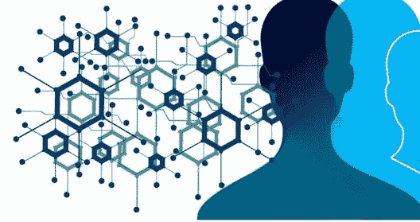
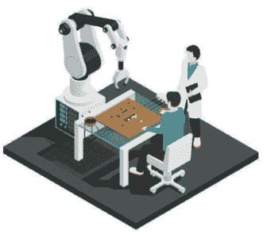
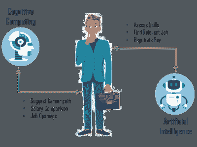

# 什么是认知 AI？是未来吗？

> 原文：<https://www.edureka.co/blog/cognitive-ai/>

认知计算机或系统大规模学习，有目的地推理，并自然地与人类互动。这些系统不是被明确编程，而是从它们与人类的交互以及它们对环境的体验中学习和推理。认知计算与[人工智能](https://www.edureka.co/ai-deep-learning-with-tensorflow)重叠，并涉及类似的技术来推动认知应用。在本文中，我们将按以下顺序了解更多关于认知人工智能的知识:

*   [什么是认知计算？](#cognitive)
*   [认知计算如何工作？](#working)
*   [认知计算 vs 人工智能](#ccvsai)
*   [认知人工智能:用例](#usecase)
*   [认知人工智能的应用](#applications)

## **什么是认知计算？**

**认知计算**是指执行特定任务以促进**人类智能**的个别技术。基本上，这些都是智能决策支持系统，从互联网繁荣开始，我们就一直在使用它们。随着最近技术的突破，这些支持系统简单地使用更好的数据，更好的[算法](https://www.edureka.co/blog/artificial-intelligence-algorithms/)，以便更好地分析大量的信息。

此外，您可以将认知计算称为:

*   **理解和模拟推理**

*   **理解和模拟人类行为**

使用认知计算系统有助于在工作中做出更好的人类决策。认知计算的一些应用包括[语音识别](https://www.edureka.co/blog/speech-recognition-python/)、[情感分析](https://www.edureka.co/blog/spark-streaming/)、[人脸检测](https://www.edureka.co/blog/tensorflow-object-detection-tutorial/)、风险评估和欺诈检测。

现在你知道什么是认知计算，让我们继续，看看认知 AI 是如何工作的。

## **认知计算如何工作？**

认知计算系统综合来自各种信息源的数据，同时权衡上下文和冲突证据，以提出合适的答案。为了实现这一点，认知系统包括使用数据挖掘、[模式识别](https://www.edureka.co/blog/pattern-recognition/)和自然语言处理(NLP)的自学技术，以了解人类大脑的工作方式。

使用计算机系统来解决本应由人类完成的问题需要大量结构化和非结构化数据。随着时间的推移，认知系统学会完善它们识别模式的方式和处理数据的方式，从而能够预测新问题并模拟可能的解决方案。

为了实现这些功能，认知计算系统必须具备一些关键属性。

### **关键属性**

*   **适应性:**认知系统必须足够灵活，能够理解信息的变化。此外，系统必须能够实时消化动态数据，并随着数据和环境的变化做出调整。

*   交互:人机交互(HCI)是认知系统中的一个重要组成部分。用户必须能够与认知机器互动，并在需求变化时定义他们的需求。这些技术还必须能够与其他处理器、设备和云平台进行交互。

*   **迭代的和有状态的:**此外，这些系统必须能够通过提出问题或者在问题不完整的情况下引入额外的数据来识别问题。系统通过维护关于先前已经发生的类似情况的信息来做到这一点。

*   **上下文:**认知系统必须理解、识别和挖掘上下文数据，如语法、时间、位置、领域、需求、特定用户的简档、任务或目标。他们可以利用多种信息来源，包括结构化和非结构化数据以及视觉、听觉或传感器数据。

认知计算是人工智能的一个子集。两者有各种相同点和不同点。所以让我们继续我们的认知 AI 文章，了解两者之间的区别。

## **认知计算 vs 人工智能**

认知计算背后的技术类似于人工智能背后的技术。其中包括机器学习、深度学习、NLP、神经网络等。但是它们也有各种不同之处。

| **认知计算** | **人工智能** |
| 认知计算专注于**模仿人类行为**和推理来解决复杂问题。 | AI **增强人类思维**解决复杂问题。它专注于提供准确的结果。 |
| 它**模拟**人类寻找复杂问题解决方案的思维过程。 | AI **发现模式**学习或揭示隐藏的信息并找到解决方案。 |
| 它们只是为人类做决定补充信息。 | AI 负责**自己做决定**最小化人类的作用。 |
| 它主要用于客户服务、医疗保健、工业等领域。 | 主要用于**金融、安全、医疗、零售、制造**等。 |

这就是两者之间的一些不同之处。现在让我们继续，用例子来理解认知 AI 的概念。

## **认知人工智能:用例**

认知计算和 AI 是依靠数据做出决策的技术。但这两个术语之间存在细微差别，这可以在它们的目的和应用中找到。

让我们想象一个场景，一个人正在决定**转行**。一个 **AI 助理**会自动评估求职者的**技能**，找到一个**技能与职位匹配的相关工作**，**协商薪资**和福利。并且在结束阶段，它将通知该人已经代表他做出了决定。

然而，认知助理向求职者建议**潜在的职业道路**，此外还向求职者提供重要的细节，如额外的**教育要求、薪资对比数据**和空缺职位。但是，在这种情况下，最终的决定必须仍然由求职者做出。

因此，我们可以说，认知计算帮助我们利用自己的机器做出更明智的决策。然而，人工智能植根于这样一种理念，即机器可以代表我们做出更好的决定。

## **认知人工智能的应用**

*   **智能物联网:**这包括连接和优化设备、数据和物联网。但假设我们有更多的传感器和设备，真正的关键是什么将连接它们。

*   **人工智能支持的网络安全:**我们可以通过使用数据安全加密和人工智能支持的增强态势感知来抗击网络攻击。这将使用由 AI 密钥保护的智能分布式数据来提供文档、数据和网络锁定。

*   **内容人工智能:**由认知智能驱动的解决方案不断学习和推理，并可以同时整合位置、时间、用户习惯、语义强度、意图、情感、社交媒体、上下文感知和其他个人属性

*   **医疗保健中的认知分析:**该技术实现了类似人类的推理软件功能，为生命科学应用执行演绎、归纳和溯因分析。

*   **基于意图的自然语言处理:**认知智能可以帮助企业在管理和决策方面变得更具分析性。这将是机器学习的下一步，人工智能的未来应用将倾向于使用它来进行逻辑推理和分析。

这些是认知人工智能的一些应用，以及它将如何改变技术世界。到此，我们已经到了这篇认知 AI 文章的结尾。我希望你明白认知计算系统是人工智能的一个子集。

*要获得深入的知识，请查看我们的互动在线直播* Edureka *[**Python 数据科学认证培训**](https://www.edureka.co/data-science-python-certification-course) 在这里，我们提供 24*7 全天候支持，在整个学习期间为您提供指导。*

*有问题吗？请在这篇“认知人工智能”文章的评论部分提到它，我们会尽快回复您。*