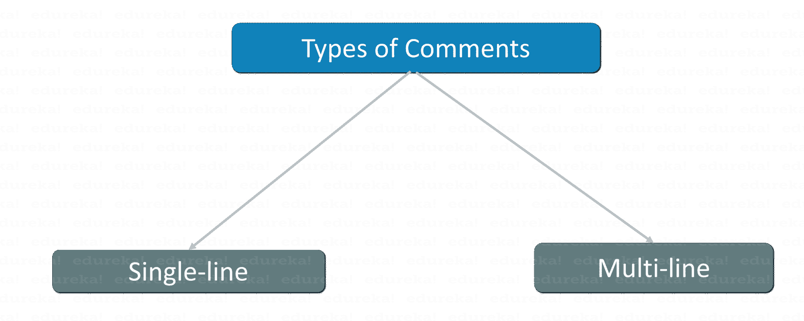

# Python 中的注释是什么，如何使用？

> 原文：<https://www.edureka.co/blog/comments-in-python/>

你曾经要求任何一个程序员解释他一年前写的代码吗？或者你曾经尝试过阅读你自己以前写的代码吗？如果你不得不从头开始重新分析每一个代码块，那将会变得非常耗时和累人！最好的办法是，加一个 **评论** 。注释不仅仅是增加代码的行数，而是让代码有意义的最好方法。这里有一个完整的指南来帮助你理解所有关于 Python 中的注释。

在继续之前，让我们快速浏览一下 这篇文章中提到的所有话题—

*   [什么是评论？](#whatarecomments)
*   [如何利用评论？](#howtouse)
*   [Python 如何解读注释？](#interpretation)
*   [评论类型:](#types)
    1.  [单线](#singleline)
    2.  [多线](#multiline)
*   [Docstrings 评论](#docstrings)

## **什么是评论？**

一个评论，一般来说，就是一个人想法的表达。在编程中，注释是程序员一致的语句，描述了一段代码的含义。当你在编写大型代码时，它们变得非常有用。当你有一个一百页左右的程序时，记住每个变量的名字实际上是不人道的。因此，利用注释将使您或其他人阅读和修改代码变得非常容易。

评论非常重要，但你需要知道如何利用它们，这正是我们将在下一个话题中讨论的。

## **如何利用评论？**

注释可以包含在任何地方，也就是内联。最佳实践是在编写代码时以及如何编写相关的注释。

这里有一些要点可以帮助你注释你的代码:

*   意见需要简短且相关
*   它们特定于包含在中的代码块
*   确保使用得体的语言，因为使用粗话是不道德的
*   不评论自明的台词

现在你知道了注释的重要性，让我们继续，看看如何用 Python 写注释。

## **如何用 Python 写评论？**

Python 中的注释以#字符开头。然而，有时也可以使用文档字符串(用三重引号括起来的字符串)进行注释，这将在本文中进一步描述。

**例如:**

```
#Comments in Python start like this
print("Comments in Python start with a #")

```

**输出:**Python 中的注释以# 开头

正如您在上面的输出中所看到的，打印语句被执行，而注释语句没有出现在输出中。

如果你有一个以上的注释行，所有的注释行都需要以#为前缀。

**例如:**

```
#Comments in Python
#start with this character
print("Comments in Python")

```

**输出:**Python 中的注释

上面的输出显示，所有以#字符为前缀的行都不会在输出中返回。

接下来，让我们看看注释是如何被解释的，以及为什么它们从不出现在输出中。

**Python 如何解读注释？**

当解释器在任何地方遇到#符号时，(除了在字符串内，因为字符串内的#只是表示#)，它会忽略其后的所有内容，直到该行结束。#标签实际上告诉解释器停止读取它后面的任何内容。

## **评论类型**

[](/blog/content/ver.1556012641/uploads/2019/04/Types-of-Comments-Comments-in-Python-Edureka-2.png) 评论可以是

*   单线或
*   多行

### **单行注释:**

它们可以出现在单独的一行中，也可以与其他代码一起出现。

```
Example: 
```

```
#multiplying two variables          (this line starts with a #, hence will be ignored till line ends)
a=1
b=2
c=a*b
print(c)     # printing result      (inline comment, whatever is present after # will be ignored)

```

```
**Output:** 2
```

### **多行评论:**

多行注释出现在多行中。所有要注释的行都要加上前缀#。如果不这样做，就会遇到错误。

**例如:**

```
#adding 2 variables
#pinting the result in a new variable
a=2
b=3
c=a+b
print(c)

```

**输出:** 5 上面的输出显示前缀为#字符的前两个程序行被省略，程序的其余部分被执行并返回各自的输出。

你也可以一个很好的快捷方法**来注释多行**。你所需要做的就是按住 **ctrl** 键和**左键点击**在任何你想要包含#字符的地方输入一次#字符。这将注释您引入光标的所有行。

如果你想删除多行中的#字符，你可以做同样的事情，只需使用一次退格键，所有选中的#字符将被删除。

然而，当你对文档进行注释时，这些多行注释看起来非常令人不快。下面的主题将向您介绍这一问题的解决方案。

## **Docstring 注释:**

docstring 实际上并不是注释，而是 ***文档字符串*** 。这些文档字符串在三重引号内。它们不赋给任何变量，因此，有时也可以用作注释。

当你需要加入一些与类或函数相关的文档时，尤其需要用到它们。

**例如:**

```
"""
Using docstring as a comment.
This code divides 2 numbers
"""
x=8
y=4
z=x/y
print(z)

```

**输出:** 2.0

正如您所看到的，输出不包含 docstring，因此，它在代码开始之前就已经被忽略了。

但是如果你执行的只是一个没有下面代码的 docstring，如上图所示，t 他输出的将是字符串本身。

**举例:**

```
"""
Using docstring as a comment.
This code divides 2 numbers
"""

```

**输出:** ' 使用 docstring 作为注释。此码分两个数 '

在上面的输出中，docstring 被打印出来，因为它后面没有任何代码。

现在，如果它在代码编写后出现，docstring 仍将在结果后打印。

**例如:**

```
x=8
y=4
z=x/y
print(z)
"""
Using docstring as a comment.
This code divides 2 numbers
"""

```

**输出:**

```
2.0 '
Using docstring as a comment.
This code divides 2 numbers
'
```

正如你所看到的，docstring 已经在输出后打印出来了。因此，如上所述，根据 docstring 在代码中出现的位置，它在不同的位置会有不同的行为。这就把我们带到了本文的结尾。我希望您喜欢学习 Python 中的注释。 ***确保你尽可能多地练习，恢复你的经验。***

*有问题吗？请在这个“Python 中的评论”博客的评论部分提及它，我们* *将* *尽快回复您。*

*要深入了解 Python 及其各种应用，您可以注册参加现场 **[Python 在线培训](https://www.edureka.co/python)** ，该培训提供全天候支持和终身访问。*