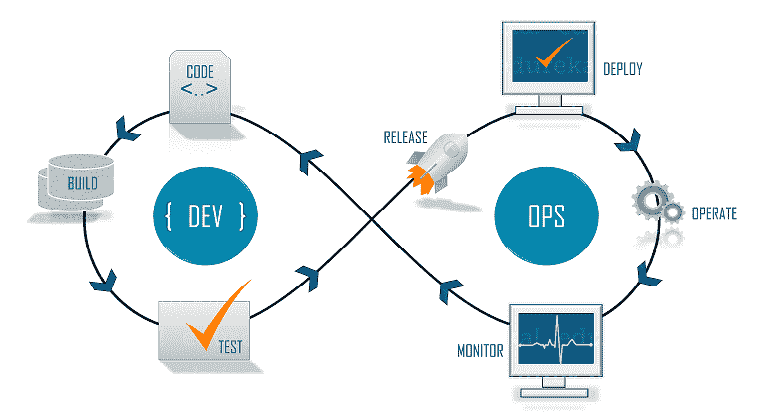
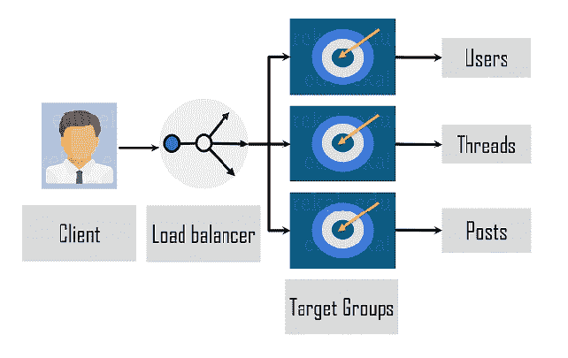
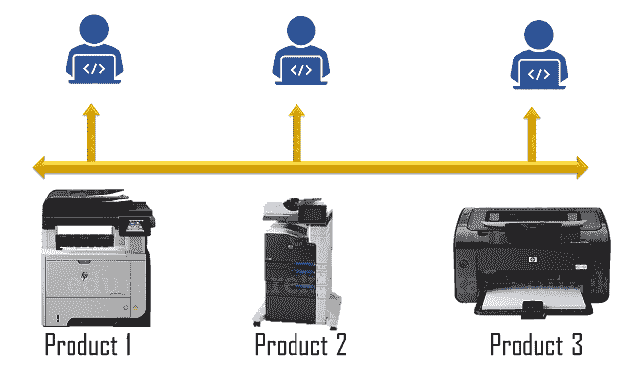
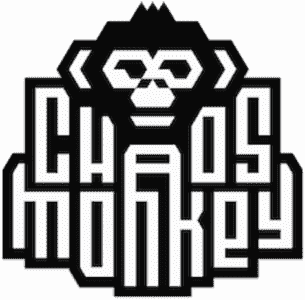

# 2023 年使用 DevOps 的五大公司–您需要知道的一切！

> 原文：<https://www.edureka.co/blog/companies-using-devops/>

使用 DevOps 的公司正在经历一场严重的文化转变。但是在了解背后的原因之前，我们先来看看什么是 [DevOps](https://www.edureka.co/blog/devops-tutorial) ？ DevOps 是一种将“ **Dev** ”和“ **Ops** ”团队结合在一起的方法。这种实践旨在通过使用不同的自动化工具以更快的速度交付产品。DevOps 帮助那些热衷于提高团队灵活性和敏捷性的企业。 在本文中，我们将关注一些快速发展的跨国公司和已经实施 DevOps 的初创公司。

下面这些使用 DevOps 的公司已经看到了胜利:

*   [亚马逊](#amazon)
*   [HP](#hp)
*   [Etsy](#etsy)
*   网飞
*   [土坯](#adobe)

## **1**T2。亚马逊

### ******

### ***问题***

*   你一定知道亚马逊是世界上最大的电子商务公司之一。但是回到 2001 年，他们的网站沿袭了一种 **传统的单体架构** 。在这里，所有的流程都耦合在一起，作为单一服务运行
*   随着时间的推移，随着源文件的增长，在物理服务器上**扩展，维护和升级应用程序变得**困难

### ***解***

为了解决单体架构的问题，亚马逊从物理服务器转移到基于云的 [**亚马逊网络服务(AWS)**](https://www.edureka.co/blog/what-is-aws/) 。

目前，AWS 遵循一个 [**微服务**](https://www.edureka.co/blog/what-is-microservices/) 架构如下图**所示。**在这个架构中，客户端首先发出请求。这里，负载平衡器检查客户端请求，并将其分配给正确的微服务。反过来，微服务有一个跟踪实例和端口的目标组。在 Amazon 中，它们是三种类型的微服务，即用户、线程和帖子。

### ***功能和工具*** 

现在我们知道了微服务是如何工作的，让我们看看 Amazon 为采用 DevOps 实践而实现的一些工具和特性。

开发人员通过版本控制工具，如 **[Git](https://www.edureka.co/blog/what-is-git/)** 和 **[GitHub](https://www.edureka.co/blog/how-to-use-github/) ，对他们的代码进行频繁而微小的修改。**像**代码部署**这样的实践有助于修复错误和添加新功能，以改进底层软件应用。[AWS code deploy](https://www.edureka.co/blog/aws-codedeploy/)就是这样一种服务，它跟踪部署并简化软件发布流程。

*亚马逊还使用了 **【阿波罗】*** *简单的一键内部部署工具。* Apollo 的工作是在一组主机上部署一套特定的软件。它还提供了版本化的工件和测试回滚。

另一方面，像**配置管理**和 **[基础设施即代码](https://www.edureka.co/blog/infrastructure-as-code/)** 这样的实践有助于监控和修改软件。它跟踪系统的性能和开发人员使用的资源。 通过这种方式，测试团队可以提前发现问题，并立即修复它们 。

***这些 DevOps 实践和实现帮助亚马逊节省了数百万美元！***

## **2021 年使用 DevOps 的前 5 家公司| DevOps 最佳实践| DevOps 培训| Edureka**

[//www.youtube.com/embed/i8WE34lSHn0?rel=0&showinfo=0](//www.youtube.com/embed/i8WE34lSHn0?rel=0&showinfo=0)This Edureka video on “Top 5 Companies Using DevOps” will take you through the five Hyper-growth companies that implement DevOps and it’s practices to build applications within their organization.

接下来，我将讨论本文的第二个案例。

## **2**T2。惠普

2006 年，惠普的 LaserJet 固件部门打造了不同的产品(打印机、扫描仪等。).整个项目由 LaserJet 固件总监 Gary 领导。

他分析说，开发人员花了大约 5%的时间开发和支持新功能，而其余的时间则用于规划、集成和测试。

### ***问题***

*   Gary 的团队由分布在美国、巴西和印度等国家的大约 400 多名开发人员组成，但每年只发布两个软件版本！这是因为 LaserJet 型号具有单独的代码库，这导致了可枚举的低效
*   在编写代码 6 周后，通过手工测试发现了软件缺陷。修复一个几周前在代码中出现的错误是 劳动密集型的，并且让开发人员很累
*   这是团队需要新方法来消除瓶颈的地方

### ***解***

惠普团队采用了 [持续集成 / 持续部署(CI/CD)](https://www.edureka.co/blog/ci-cd-pipeline/) 流水线和测试自动化。

从下图中可以看出，他们的第一步是创建一个通用平台来支持所有产品和型号。这被称为基于主干的开发或 [**持续集成**](https://www.edureka.co/blog/continuous-integration/) ，它消除了集成不同代码分支所带来的辛劳。

他们还构建了一套针对主干运行的自动化单元测试，这减少了 6 周的手动测试时间，从而提高了产品质量并诱导了更快的反馈。

*在这些自动化测试中，惠普使用了一种叫做***的工具来阻止代码行** *，当代码破坏了任何单元测试或构建时，该工具会向开发人员发出警报。*

这些 DevOps 实践在一天之内导致了大约 100 到 150 次代码提交和 75，000 到 1，000，000 行代码变更！

在本文的下一部分，我将讨论一个创业公司如何实现 DevOps 的实践。

## **3。ETSY**

 Etsy 是最早使用 DevOps 的公司之一。它是一家专注于销售手工和复古用品的美国电子商务网站。

### ***问题***

*   最初，Etsy 努力发展他们的组织，因为他们采用了整体架构
*   他们的部署率大约是一周两次，这导致了部门之间的隔离。 Etsy 不得不从这种传统体制中寻找出路

### ***解***

新任首席技术官(CTO)引入了一个团队来采用 DevOps 实践。如下图所示，CI/CD 管道每天帮助部署大约 50 到 100 次服务。

代码的第一次发布是面向组织内随机的一组用户。经过测试和反馈后，它将被推向整个 Etsy 社区。

### ******

*在代码部署中，Etsy 使用了 **Deployinator** 一个提供一键部署的工具。* 每天帮助部署代码约 40 次。

他们还使用**亚马逊网络服务(AWS)** 来执行他们的 DevOps 操作。

在一个非常著名的叫做 Jenkins 的持续集成工具的帮助下，整个测试阶段可以自动化。 它有助于 CI/CD 管道的顺利运行。 [**詹金斯**](https://www.edureka.co/blog/what-is-jenkins/) 现在每天执行超过 14000 个测试套件。

Etsy 开发了 Kale 来检测数据中的异常值。Kale 有助于监控执行的每个部署，以确保应用程序是用户友好的和稳定的。

***在 Etsy，员工要勇于承担风险，提前为失败做好准备！***

在文章的下一部分，我将讨论使用 DevOps 的公司的最著名的案例研究，

## **4。网飞**

网飞以 DVD 租赁业务起家，但现在他们是最大的媒体服务提供商。他们在全球拥有大约 1.82 亿流媒体用户。

### ***问题***

*   就像任何其他组织一样，网飞也采用了整体架构
*   为了应对用户带来的巨大规模和流量，网飞缺少商业工具

### ***解***

他们开始从单一架构转向基于 AWS 云的[微服务架构。](https://www.edureka.co/blog/microservices-tutorial-with-example)

网飞使用大约 700 个微服务来控制整个服务的每个部分。

微服务架构将工程团队相互分离&让他们构建、测试和部署他们的服务。这种灵活性使他们能够加快步伐。

### ***准备*** ***准备失败***

准备是处理意外失败的最好方法。网飞构建了一个名为“ **【混沌】** **猴子** ”的工具，这有助于测试其应用程序的稳定性。因此，混沌猴通过在开发人员工作时随机终止服务器来故意造成故障。

这是“**网飞猿人军**的一部分”组织努力为他们意想不到的问题寻找解决方案。

这种实践是 DevOps 的最佳实践，因为在开发过程中，在不利的环境中做出改变会产生顶级的、高弹性的应用程序。

### ***集装化***

网飞还开发了一种容器管理工具，称为 **【泰特斯】** 。它运行现有的应用程序，而不需要在容器中做任何改变，因此，消除了伸缩问题。它处理资源共享能力，并与亚马逊网络服务集成。Titus 在流媒体、推荐和内容系统方面帮助网飞。

最后但同样重要的是，我将讨论本文的最后一个案例研究。

## **5 号。adobe【**

 Adobe Creative cloud 由一组服务组成，让用户能够在不同的软件应用程序上工作。你必须知道其中的一些他们是 Photoshop，Lightroom，Illustrator 等。

### ***问题***

*   最初，Adobe 服务之间的通信是点对点的，因为它们采用了整体架构
*   但是随着这些应用程序的负载快速增长，集成变成了一项不可能完成的任务

### ***解***

在这次开发运维转型之旅中，Adobe 采用的关键工具和实践是微服务、容器和 CI/CD。

下图所示的“**Adobe Experience Platform Pipeline**”是一个分布式的、[基于 Apache Kafka](https://www.edureka.co/blog/kafka-streams/) 的消息总线，用于跨 Adobe 解决方案的通信。它的目标是打破 Adobe 的内部孤岛，并通过减少手动步骤的数量来简化服务之间的通信。

管道收到的消息在 AWS、Azure 和 Adobe 数据中心的 13 个数据中心之间复制。

### ***工具***

您现在一定知道部署自动化有助于节省时间。这里我将讨论一些在管道中使用的自动化工具:

*   **Git** 是进行代码配置的版本控制工具
*   为集装化过程
*   **詹金斯**是一个持续整合的工具
*   **[Kubernetes](https://www.edureka.co/blog/kubernetes-tutorial/)** 以及用于集装箱部署的 Spinnaker 和一个多云连续交付平台

***Adobe Experience Platform 是降低资源成本、改善基础设施管理以及使跨不同云和平台的服务移动变得容易的最佳选择。***

现在我们已经到了这篇博客的结尾，我希望你已经了解了使用 DevOps 的公司是如何通过实施它的实践而获得好处的。 DevOps 提升生产力、透明度，并防止沟通孤岛和瓶颈问题。 要成为这种意识形态的一部分，你不必成为一个价值百万美元的 IT 组织。 任何态度正确的团队都可以转型成功！

*如果您喜欢阅读文章**公司使用 DevOps** ，请查看 Edureka 的* ***[DevOps 培训](https://www.edureka.co/devops-certification-training)** ，edu reka 是一家值得信赖的在线学习公司，拥有遍布全球的 250，000 多名满意的学习者。Edureka [DevOps 专业证书课程](https://www.edureka.co/executive-programs/purdue-devops)帮助学员了解什么是 DevOps，并获得各种 DevOps 流程和工具方面的专业知识。你也可以看看我们的 [DevOps 工程师课程](https://www.edureka.co/masters-program/devops-engineer-training)。它将帮助您获得 DevOps 工具方面的专业知识。*

*有问题吗？请在评论区提到它，我们会给你回复。*