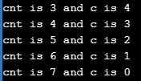

# 什么是 C++中的存储类及其类型？

> 原文：<https://www.edureka.co/blog/cpp-storage-classes/>

[C++](https://www.edureka.co/blog/object-oriented-programming-in-cpp/) 中的存储类定义了变量/函数的生存期&可见性。生存期是变量保持活动的持续时间&可见性是变量在程序的不同模块中的可访问性。这个 有助于在程序运行时跟踪特定变量的存在。在这个存储类博客中，我们将看看 C++中使用的各种存储类。

*   [c++中的存储类是什么？](#whatisstorageclass)
*   [存储类的类型](#types)
    *   [自动](#auto)
    *   [寄存器](#register)
    *   [静态](#static)
    *   [外接](#extern)
    *   [可变的](#mutable)

让我们开始吧。

## **c++中的存储类是什么？**

C++中的每个变量都有数据类型和存储类。数据类型指定可以存储在变量中的数据类型，如 int、float、char 等。存储类控制变量的两个不同属性:生存期和范围。

您可能已经看到每个变量都有一个数据类型，但是到目前为止，您可能还没有看到任何附加到变量上的存储类。实际上，如果没有定义存储类，编译器会自动为它分配一个默认的存储类。变量的存储类给出了变量在内存中的存储位置、缺省初始值、变量的作用域及其生存期的信息。

## **存储类的类型**

一个 C++程序中有五个存储类:

*   自动
*   寄存器
*   静态
*   外接
*   可变的

让我们详细讨论一下每一个存储类别。

### **自动存储类**

自动(auto)存储类是所有局部变量的默认存储类，这些变量在函数或块中声明。在编写一个 [C++程序](https://www.edureka.co/blog/object-oriented-programming-in-cpp/)时，很少使用 auto 关键字。

自动变量的作用域在声明它们的函数或块内&它不能在函数或块外被访问。也可以在声明 auto 变量的父块/函数的嵌套块中访问它。

你可以使用指针变量访问自动变量作用域之外的变量。您需要指向变量所在的同一个内存位置。

它的生存期与函数的生存期相同。一旦函数执行完毕，变量就被销毁。

缺省情况下，垃圾值是在声明时赋给它们的。

**语法:**

```
datatype var_name1 [= value];
```

**或**

```
auto datatype var_name1 [= value];

```

在上面的例子中，用相同的存储类定义了两个变量。Auto 只能用于定义局部变量，即函数内部的变量。

### **寄存器存储类**

顾名思义，寄存器存储类用于声明寄存器变量。寄存器变量的所有功能都与 auto 变量相同，只是如果有空闲寄存器可用，编译器会尝试将这些变量存储在微处理器的寄存器中。如果没有可用的空闲寄存器，则这些寄存器只存储在存储器中。

因此，在程序运行期间，对寄存器变量的操作比存储在内存中的其他变量快得多。

一般来说，程序中需要频繁访问的变量很少在寄存器存储类中声明，以提高程序的运行时间。使用指针无法获得寄存器变量的地址。

变量的最大大小等于寄存器的大小(即大约一个字)。它不能应用一元的“&”运算符，因为它没有内存位置。

**语法:**

```
register datatype var_name1 [= value];
```

**举例:**

```
{
   register int  pi;
}

```

定义“寄存器”并不意味着变量将被存储在寄存器中。取决于硬件和实现限制，它可能被存储在寄存器中。

让我们看一个注册&自动存储类的例子。

**举例:**

```
#include <stdio.h> 
using namespace std;

// declaring the variable which is to be made extern 
// an intial value can also be initialized to x 
int x; 

void autoStorageClass() 
{ 

    printf("nDemonstrating auto classnn"); 

    // declaring an auto variable (simply 
    // writing "int a=32;" works as well) 
    int num = 32; 

    // printing the auto variable 'a' 
    printf("Value of the variable 'num'"
           " declared as auto: %dn", 
           num); 

    printf("--------------------------------"); 
} 

void registerStorageClass() 
{ 

    printf("nDemonstrating register classnn"); 

    // declaring a register variable 
    register char c = 'G'; 

    // printing the register variable 'b' 
    printf("Value of the variable 'c'"
           " declared as register: %dn", 
           c); 

    printf("--------------------------------"); 
} 

int main() 
{ 

    // To demonstrate auto Storage Class 
    autoStorageClass(); 

    // To demonstrate register Storage Class 
    registerStorageClass(); 

    return 0; 
}

```

**输出:**

### **静态存储类**

静态存储类用于声明[静态变量](https://www.edureka.co/blog/what-is-static-member-function-in-cpp)。静态变量保留它们的值(即最后一个值)，即使它们超出了它们的作用域。静态变量只被初始化一次& 存在直到程序终止。

内存只分配给静态变量&一次，没有新的内存被分配，因为它们没有被重新声明。在程序中的任何地方都可以访问全局静态变量。默认情况下，编译器给它们赋值 0。

在 C++中，当在一个类数据成员上使用 static 时，它只会导致该成员的一个副本被该类的所有对象共享。

**语法:**

```
static datatype var_name1 [= value];
```

**举例:**

```
#include <iostream>

void function(void);

static int c = 5; // Global static variable

main() {
   while(c--) {
      function();
   }

   return 0;
}

void function( void ) {
   static int cnt = 2; 
   cnt++;
   std::cout << "cnt is " << cnt ;
   std::cout << " and c is " << c << std::endl;
}

```

**输出:**

### **走读存储类**

当变量需要跨多个文件共享时，需要 extern 存储类。外部变量具有全局作用域，这些变量在声明它们的文件之外是可见的。extern 变量对所有程序都是可见的。如果两个或多个文件共享同一个变量或函数，就使用它。

外部变量的生命周期与声明它的程序终止的时间一样长。通过在任何函数/块中的声明/定义前放置“extern”关键字，普通全局变量也可以成为 extern。

当使用‘extern’时，变量不能被初始化，因为它所做的只是将变量名指向一个先前已定义的存储位置。

**语法**

```
extern datatype var_name1;
```

**例子**

```
#include <iostream>
int cnt;
extern void write_extern();
main() {
   cnt = 5;
   write_extern();
}

```

***第二档:support . CPP***

```
#include <iostream>
extern int cnt;

void write_extern(void) {
   std::cout << "Count is " << cnt << std::endl;
}

```

在这里，extern 关键字被用来在另一个文件中声明 cnt。现在编译这两个文件，如下所示

$ g++ main . CPP support . CPP-o write

这将产生写入可执行程序，尝试执行写入并检查结果，如下所示

$。/写

5

继续讨论 C++中的存储类，让我们看看最后一个，即可变存储类。

### **可变存储类**

可变说明符只适用于类对象，它允许一个对象的成员覆盖常量成员函数。也就是说，可变成员可以被常量成员函数修改。

最后，我们来看一下对比表，了解不同存储类之间的区别。

| **存储类** | **关键词** | **寿命** | **能见度** | **初始值** |
| 自动 | 自动 | 功能块 | 本地 | 垃圾 |
| 外部 | 外接 | 整个程序 | 全局 | 零点 |
| 静态 | 静态 | 整个程序 | 本地 | 零点 |
| 寄存器 | 寄存器 | 功能块 | 本地 | 垃圾 |
| 可变的 | 可变的 | 类 | 本地 | 垃圾 |

现在，在浏览了上面的 C++程序之后，你应该已经理解了 C++ &中不同的存储类是什么，以及如何实现它们。我希望这篇博客能给你带来信息和附加值。

这样，我们就结束了这篇关于“C++中的存储类”的文章。

如果你想了解更多，请查看由 Edureka(一家值得信赖的在线学习公司)提供的  [Java 培训](https://www.edureka.co/java-j2ee-soa-training)。Edureka 的 Java J2EE 和 SOA 培训和认证课程旨在培训您掌握核心和高级 Java 概念以及各种 Java 框架，如 Hibernate & Spring。

有问题要问我们吗？请在这个博客的评论部分提到它，我们会尽快回复你。