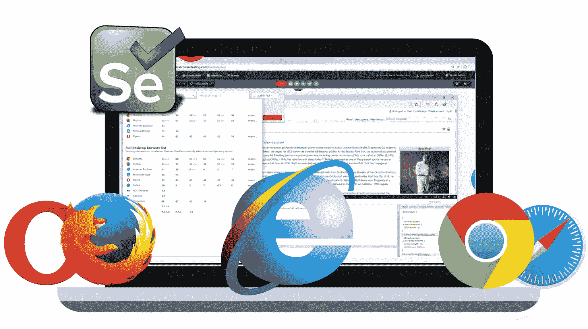

# 了解如何使用 Selenium 执行跨浏览器测试

> 原文：<https://www.edureka.co/blog/cross-browser-testing-using-selenium/>

随着自动化测试需求的增加， [Selenium](https://www.edureka.co/blog/selenium-tutorial) 就是这样一个工具，非常适合网站的跨浏览器测试。检查网站在不同浏览器和操作系统上的兼容性和性能是非常必要的。因此，这篇关于使用 Selenium 进行跨浏览器测试的文章将帮助您深入理解这些概念。更多详情可以参考[硒课程](https://www.edureka.co/selenium-certification-training)。

下面是本文涉及的主题:

*   [什么是跨浏览器测试？](#WhatisCrossBrowserTesting?)
*   [为什么需要跨浏览器测试？](#WhydoyouneedCrossBrowsertesting?)
*   [如何进行跨浏览器测试？](#HowtoperformCrossBrowsertesting?)
*   [演示使用硒](#DemousingSelenium)

## **什么是跨浏览器测试？**

跨浏览器测试就是在 IE、Chrome、Firefox 等多种浏览器中测试应用程序，以便我们能够有效地测试我们的应用程序。跨浏览器兼容性是指网站或 web 应用程序跨不同浏览器和操作系统运行的能力。

 **例如**——假设您有 20 个测试用例要手动执行。你可以在一两天内完成这项任务。但是，如果相同的测试用例必须在五种浏览器中执行，那么你可能需要一周的时间来完成。然而，如果您自动化这 20 个测试用例并运行它们，那么根据测试用例的复杂性，它不会花费超过一两个小时。这就是跨浏览器测试的用武之地。

现在，让我们进一步看看为什么需要在 Selenium 中进行跨浏览器测试。

**为什么需要跨浏览器测试？**

每个网站都由三大技术组成，即 HTML5、CSS3 和 [JavaScript](https://www.edureka.co/blog/what-is-javascript/) 。但是后端有 n 多种技术可以使用，比如 [Python](https://www.edureka.co/blog/python-programming-language) 、 [Ruby](https://www.edureka.co/blog/ruby-on-rails-tutorial/) 等。但是，在前端和渲染中，只使用了这三种技术。

另外，每个浏览器使用完全不同的渲染引擎来计算这三项技术。例如，Chrome 使用 Blink，Firefox 使用 Gecko，IE 使用 edge HTML 和 Chakra，因此，相同的网站在所有这些不同的浏览器中会呈现完全不同的效果。这也正是你需要跨浏览器测试的原因。这意味着该网站在所有不同的浏览器版本和不同的操作系统中都应该运行良好。因此，为了确保它正常工作，需要进行跨浏览器测试。

除此之外，我还列出了一些描述跨浏览器测试需求的理由。

*   浏览器与不同操作系统的兼容性。
*   图像方向。
*   每个浏览器都有不同的 Javascript 取向，这有时会导致问题。
*   字体大小不匹配或未正确呈现。
*   与新网络框架的兼容性。

现在让我们进一步了解如何执行跨浏览器测试。

## **如何进行跨浏览器测试？**

跨浏览器测试基本上就是在不同的浏览器上多次运行同一套测试用例。这种重复的任务最适合自动化。因此，通过使用工具来执行这个测试更节省成本和时间。现在让我们看看如何使用 selenium web driver 来执行它。

**第一步**:如果我们正在使用 Selenium WebDriver，我们可以使用 Internet Explorer、FireFox、Chrome、Safari 浏览器来自动化测试用例。

**第二步:**为了在同一台机器上同时执行不同浏览器的测试用例，我们可以将 [TestNG 框架与 Selenium WebDriver 集成。](https://www.edureka.co/blog/selenium-webdriver-tutorial)

**第三步:**最后，你可以编写测试用例，执行代码。

现在，让我们看看如何在三种不同的浏览器上对 Edureka 网站进行跨浏览器测试

## **演示使用 Selenium WebDriver**

```
package co.edureka.pages;

import java.util.concurrent.TimeUnit;
import org.openqa.selenium.By;
import org.openqa.selenium.WebDriver;
import org.openqa.selenium.WebElement;
import org.openqa.selenium.chrome.ChromeDriver;
import org.openqa.selenium.edge.EdgeDriver;
import org.openqa.selenium.firefox.FirefoxDriver;
import org.testng.annotations.BeforeTest;
import org.testng.annotations.Parameters;
import org.testng.annotations.Test;

public class CrossBrowserScript {

WebDriver driver;

/**
* This function will execute before each Test tag in testng.xml
* @param browser
* @throws Exception
*/
@BeforeTest
@Parameters("browser")
public void setup(String browser) throws Exception{
//Check if parameter passed from TestNG is 'firefox'
if(browser.equalsIgnoreCase("firefox")){
//create firefox instance
System.setProperty("webdriver.gecko.driver", "C:geckodriver-v0.23.0-win64geckodriver.exe");
driver = new FirefoxDriver();
}

//Check if parameter passed as 'chrome'
else if(browser.equalsIgnoreCase("chrome")){
//set path to chromedriver.exe
System.setProperty("webdriver.chrome.driver", "C:Selenium-java-edurekaNew folderchromedriver.exe");
driver = new ChromeDriver();

}
else if(browser.equalsIgnoreCase("Edge")){
//set path to Edge.exe
System.setProperty("webdriver.edge.driver","C:Selenium-java-edurekaMicrosoftWebDriver.exe");;span style="font-family: verdana, geneva, sans-serif; font-size: 14px;"&amp;gt;//create Edge instance&amp;lt;/span&amp;gt;
driver = new EdgeDriver();
}
else{
//If no browser passed throw exception
throw new Exception("Browser is not correct");
}
driver.manage().timeouts().implicitlyWait(10, TimeUnit.SECONDS);
}

@Test
public void testParameterWithXML() throws InterruptedException{
driver.get("https://www.edureka.co/");
WebElement Login = driver.findElement(By.linkText("Log In"));
//Hit login button
Login.click();
Thread.sleep(4000);
WebElement userName = driver.findElement(By.id("si_popup_email"));
//Fill user name
userName.sendKeys("your email id");
Thread.sleep(4000);
//Find password'WebElement password = driver.findElement(By.id("si_popup_passwd"));
//Fill password
password.sendKeys("your password");
Thread.sleep(6000);

WebElement Next = driver.findElement(By.xpath("//button[@class='clik_btn_log btn-block']"));
//Hit search button
Next.click();
Thread.sleep(4000);
WebElement search = driver.findElement(By.cssSelector("#search-inp"));
//Fill search box
search.sendKeys("Selenium");
Thread.sleep(4000);
//Hit search button

WebElement searchbtn = driver.findElement(By.xpath("//span[@class='typeahead__button']"));
searchbtn.click();
}
}
```

在上面的代码中，我在 [Edureka](https://www.edureka.co) 网站上执行操作，比如登录网站和搜索 Selenium 课程。但是，我想在三种不同的浏览器上检查跨浏览器兼容性，即谷歌 Chrome、Mozilla Firefox 和微软 Edge。这就是为什么我在代码中设置了所有 3 个浏览器的系统属性。之后，我使用定位器在网站上执行动作。这就是我的班级档案。现在，为了执行程序，您需要一个 TestNG XML 文件，它包含上述类文件的依赖项。下面的代码描述了 TestNG 文件。

```

<?xml version="1.0" encoding="UTF-8"?>
<!DOCTYPE suite SYSTEM "http://testng.org/testng-1.0.dtd">
<suite name="TestSuite" thread-count="2" parallel="tests" >
<test name="ChromeTest">
<parameter name="browser" value="Chrome"/>
<classes>
<class name="co.edureka.pages.CrossBrowserScript">
</class>
</classes>
</test>
<test name="FirefoxTest">
<parameter name="browser" value="Firefox" />
<classes>
<class name="co.edureka.pages.CrossBrowserScript">
</class>
</classes>
</test>
<test name="EdgeTest">
<parameter name="browser" value="Edge" />
<classes>
<class name="co.edureka.pages.CrossBrowserScript">
</class>
</classes>
</test>
</suite>

```

在上面的 XML 文件中，我为驱动器指定了不同的类，这样它将帮助我们实例化浏览器来执行网站上的测试用例。事情就是这样的。

至此，我们结束这篇关于使用[Selenium web driver](https://www.edureka.co/blog/what-is-selenium/)进行跨浏览器测试的文章。我希望你理解了这些概念，并且它增加了你知识的价值。

*如果您希望学习 Selenium 并在测试领域建立自己的事业，那么请在此处查看我们的交互式在线直播 **[Selenium 认证培训](https://www.edureka.co/selenium-certification-training)** ，它提供 24*7 支持，在整个学习期间为您提供指导。*

*有问题吗？请在使用 Selenium 文章进行跨浏览器测试的评论部分提到它，我们将会回复您。*