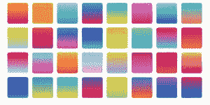

# CSS 和 CSS3 有什么区别？

> 原文：<https://www.edureka.co/blog/css-and-css3/>

级联样式表的主要功能非常重要。其中 CSS 与 HTML 一起工作，并提供基本的样式和外观，这将让我们知道 HTML 元素将出现在网页上。其中 CSS3 是 CSS 的最新版本。让我们按照以下顺序来理解 CSS 和 CSS3 之间的各种差异:

*   [CSS 与 CSS3的兼容性](#compatibility)
*   [圆角和坡度](#gradient)
*   [文字效果和动画](#animation)
*   [伪类](#pseudo)
*   [CSS 和 CSS3 中的列表](#list)

CSS3 提供了像 JavaScript 这样的功能，还提供了移动开发功能，以及过渡、渐变等附加功能。所以，我们就这些参数来对比一下 CSS 和 CSS3。

## **CSS 和 CSS3 的兼容性**

CSS 与 CSS3 不兼容，因为它的主要目的是提供不同的格式特性。它们是对文本和对象定位能力的补充。但是这些功能已经更新到了最新版本 CSS3。

CSS3 是与 CSS 兼容的反向代码。这不会使任何用 CSS 编写的代码无效。CSS3 使网页看起来更有吸引力，更好。它们加载速度非常快，构建页面所需的时间也更少。

## **圆角和坡度**

当 CSS3 发布的时候，开发人员设计的图像看起来像不同结构和背景渐变的圆角。这个过程包括开发人员设计特定的边界，并通过服务器上传设计。他们需要把图片放在网页上，最后，CSS 必须正确定位这个边框。

在 CSS3 中，开发者只需要编写类似圆形**边框** `{border-radius: 20px}`的代码。完成后，他们不需要通过任何服务器发送和执行任何类型的的其他活动。甚至可以通过使用代码**gradBG**来设置渐变

## **文字效果和动画**

CSS 中的动画是用 JavaScript 和 JQuery 编写的。它没有设计层的特性，甚至页面元素也没有任何特殊效果，比如隐藏文本、文本选择等等。

在 CSS3 中，开发者可以添加文本阴影以使其更容易阅读。他们还可以添加视觉效果来换行和添加更长的单词，这样它们就可以很容易地放入列中。它还包括文本大小和颜色的连续变化，甚至变化的时间也可以设置。

## **伪类**

这些用于专门定义 CSS 中元素的状态。语法:`selector: pseudo-classes{ property: value;}`。这还提供了各种属性，如 hover on()，简单的工具提示 hover()。

在 CSS3 中，这些伪类与 CSS 非常相似，但是它们没有什么额外的特性来区分这两者。这些包括根目标，即文档的根元素。使用(n)中的数值作为目标。

## **CSS 和 CSS3 中的列表**

**CSS:**

*   CSS 允许用户为有序列表和无序列表设置不同的列表。

*   用户还可以为列表项标记设置图像。

*   向列表和列表项添加背景色。

*   它们可以是圆形、方形、圆盘形、列表式。

**CSS3**

*   在这种情况下，要使用 CSS 中的列表，display 属性中应该定义列表项。

*   它不支持编号系统。

*   它使图像能够根据列表项标记进行设置。

*   它还有一个列表样式位置，可以指定标记框的位置。

至此，我们已经讨论了 CSS 和 CSS3 之间的区别。C *查看 Edureka 的 **[Web 开发认证培训](https://www.edureka.co/complete-web-developer)** 。* *Web 开发认证培训将帮助您学习如何使用 HTML5、CSS3、Twitter Bootstrap 3、jQuery 和 Google APIs 创建令人印象深刻的网站，并将其部署到亚马逊简单存储服务(S3)。*

*有问题吗？请在这篇文章的评论部分提到它，我们会给你回复。*