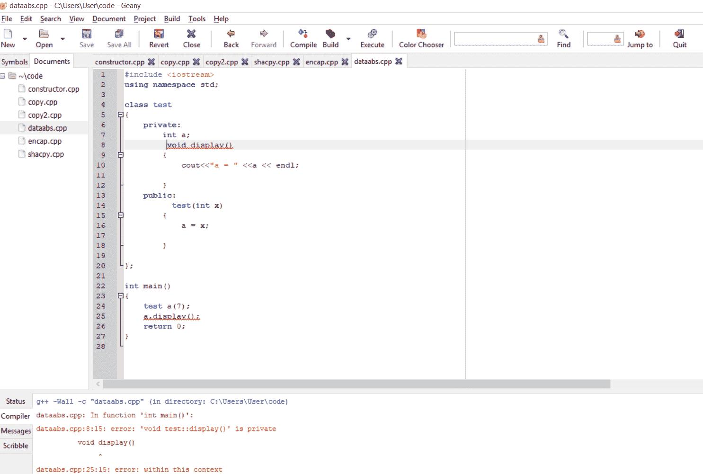

# 如何在 C++中实现数据抽象

> 原文：<https://www.edureka.co/blog/data-abstraction-in-cpp/>

[***数据抽象***](https://www.edureka.co/blog/java-abstraction/) 向用户展示重要信息，但隐藏后台细节。在本文中，我们将理解 C++中的数据抽象。本文将涉及以下内容，

*   [使用说明符的抽象](#AbstractionUsingSpecifiers)
*   [抽象的类型](#TypesOfAbstraction)
*   [样本代码](#SampleCode)

让我们从这篇文章开始吧，

**c++中的抽象**

考虑一个例子

一个人使用移动电话，除非他是 IT 或 ECE 出身，他除了按什么键之外什么都不知道。这是数据抽象的一个典型例子。

在 C++中有两种实现数据抽象的方法:

**使用类的抽象**

在类中，我们使用访问说明符来实现数据抽象。

**使用头文件进行抽象**

我们使用不同头文件中的不同函数，但我们不知道任何实现细节。

让我们继续 C++文章中的抽象

**使用说明符的抽象**

通过使用访问说明符，我们可以实现 ***抽象*** 。它们让程序员控制哪些数据或功能对用户是可见的，哪些是保密的。有三个主要的访问说明符，

**私有:C++中的抽象:**

当数据成员或成员函数被设为 *私有* 时，只能在类内部访问，类外的任何人都不能访问。

**Public:c++中的抽象:**

当数据成员或成员函数成为公共时，每个人都可以访问。

**受保护:C++中的抽象:**

受保护的访问说明符是一种特殊的访问说明符。当数据成员或成员函数被设为 *保护* 时，它的工作方式类似于 private，类的成员可以访问它。

让我们继续 C++文章中的抽象

**抽象的类型**

有两种类型的抽象，

**数据抽象**

隐藏数据的细节被称为数据抽象。

**控制抽象**

隐藏实现的细节被称为控制抽象。

**抽象的优点**

*   只有您可以更改您的数据或功能，其他任何人都不能。

*   通过禁止任何人查看背景细节来确保应用程序的安全。

*   增加代码的可重用性。

*   避免代码重复。

让我们继续 C++文章中的抽象

**样本代码**

```

#include<iostream>
using namespace std;
class test
{
private:
int x;
public:
test(int a)
{
x =a;
}
int get()
{
return x;
}
};
int main()
{
test a(7);
cout<<"The Number is: "<<a.get();
return 0;
}

```

**输出**

****

**解释**

在上面的程序中，我们展示了概念。我们有一个私有成员 x，它不能从 main 函数中访问。访问它的唯一方法是创建一个类 test 的对象。 有一个参数化的构造函数，它把我们从 main 得到的值赋给 x。我们有一个 get 方法，它返回 x 的值

在 main 函数中，我们创建了一个 test 类的对象，并赋了一个参数。此时参数化构造函数被调用，它将参数值赋给 x.

我们有一个 count 语句，它调用 get 函数并显示数字。 这是抽象的基本概念。我们不能在 main 函数中直接使用私有数据成员。 如果我们决定将显示函数设为私有并试图访问它，我们会得到一个错误。封装和抽象是面向对象编程的主要特征。



至此，我们结束了这篇关于“C++中的抽象”的文章。我希望你发现这是有益的，请继续关注更多类似主题的教程。您也可以查看我们的培训计划 t 以深入了解 jQuery 及其各种应用程序，您可以 [**在此**](https://www.edureka.co/masters-program/full-stack-developer-training) 注册在线实时培训，24/7 全天候支持，终身访问。

有问题要问我们吗？在这篇文章的评论部分提到它们，我们会给你回复。