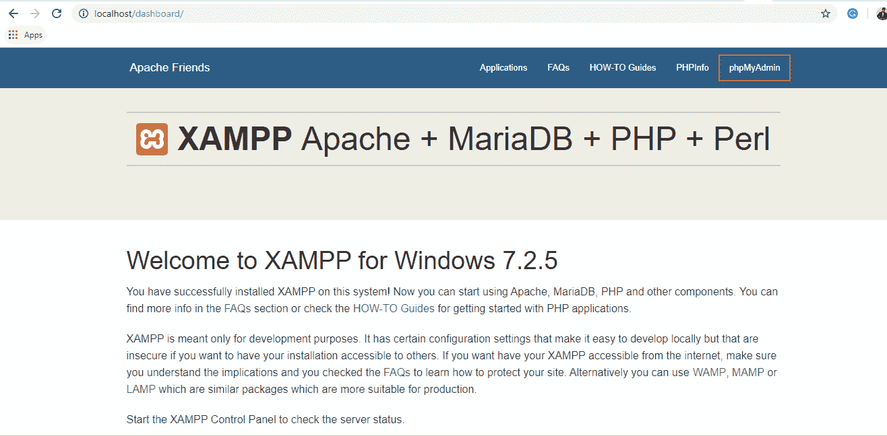
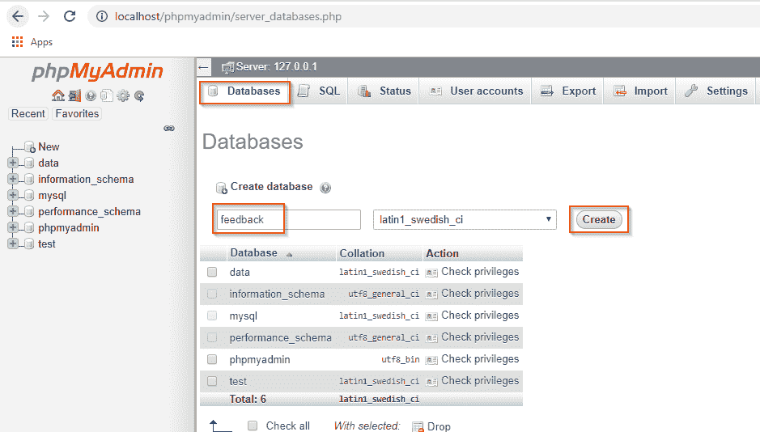
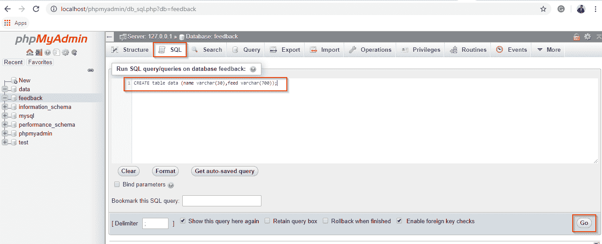
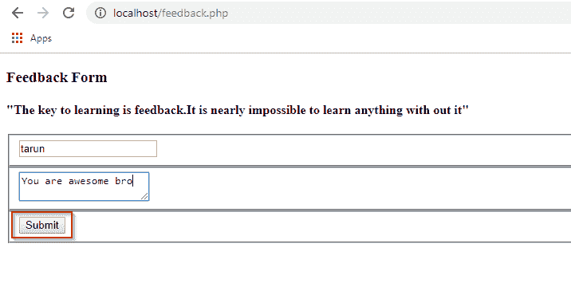
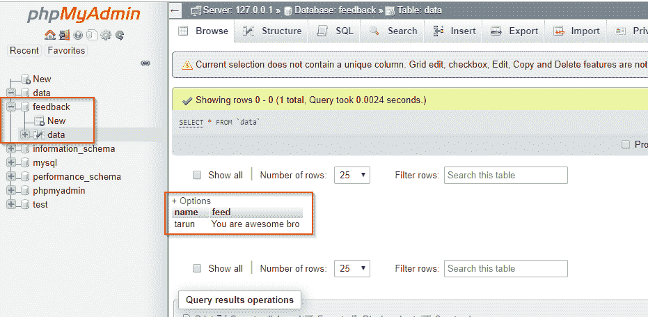

# PHP 中关于数据检索的一切

> 原文：<https://www.edureka.co/blog/data-retrieval-in-php/>

我们需要一个数据库，它是表的集合，用来存储用户输入的数据。这篇文章将向你简要介绍如何在 PHP 中创建数据库和检索数据。

*   [如何创建数据库](#HowToCreateADatabase)
*   [反馈表单的 PHP 代码](#PHPCodeForTheFeedbackForm)
*   [从数据库中检索数据的 PHP 代码](#PHPCodeForDataRetrievalFromTheDatabase)

让我们从关于 PHP 数据检索的第一篇文章开始，

**如何创建数据库**

**步骤 1:** 打开 localhost dashboard 并点击 phpMyAdmin



步骤 2: 现在，通过查询或手动创建一个数据库。为了手动操作，点击数据库并创建一个新的。



第三步:现在，根据我们对网站的要求，创建一个带列的表格。由于我们将讨论如何使用 PHP 设计反馈表单，我们只需输入名称和反馈，因此我们将创建一个包含 2 列的表格。

**步骤 4:** 单击 SQL 并编写一个查询，创建一个包含列的表



转到本文的第二点

**PHP 数据检索:反馈表单的 PHP 代码**

在记事本文件中编写此代码，并将其保存在 htdocs 中，然后转到 localhost 仪表板并运行此代码。

```

<?php
session_start();
// connect to mysql
$con= mysqli_connect("localhost", "root", "","feedback");
//In case of failure connection
if(!$con)
{
die("Server could not connected");
}
//After clicking on submit, those values get inserted into the table named as data which is located in feedback database.
if(isset($_POST["btn"]))
{
$name=$_POST["name"];
$feed=$_POST["feed"];
//mysql insert query
$sql="insert into data values('".$name."','".$feed."')";
$n=mysqli_query($con,$sql);
}
?>
<!DOCTYPE html PUBLIC "-//W3C//DTD XHTML 1.0 Transitional//EN" "http://www.w3.org/TR/xhtml1/DTD/xhtml1-transitional.dtd">
<html >
<head>
<meta http-equiv="Content-Type" content="text/html; charset=utf-8" />
<title>Feedback | Ashok Kumar |</title>
<meta name="distribution" content="global" />
<meta name="language" content="En" />
</head>
<script>
// function for creating alert after submission of feedback
function check()
{
alert('Thank you for your feedback.');
}
</script>
<div class="container">
<form id="contact" action="" method="post">
<h3>Feedback Form</h3>
<h4>"The key to learning is feedback.It is nearly impossible to learn anything with out it"</h4>
<fieldset>
<input placeholder="Your name" type="text" name="name" tabindex="1" required autofocus>
</fieldset>
<fieldset>
<textarea placeholder="Write Something about me.." name="feed" tabindex="5" required autofocus></textarea>
</fieldset>
<fieldset>
<input type="submit" name="btn" value="Submit" onclick="check()">
</fieldset>
</form>
</div>

```



提交反馈后，您可以在数据库下的表格中看到更改。



这就把我们带到了本文的最后一点，

## **从数据库中检索数据的 PHP 代码**

你可以用这种方式编码来获取提交的反馈。

```

<?php
// connect to mysql
$conn= mysqli_connect("localhost", "root", "","feedback");
if(! $conn )
{
die('Could not connect: ' );
}
// mysql select query
$sql = 'SELECT name,feed FROM data';
$n=mysqli_query($conn,$sql);
if(!$n )
{
die('Could not get data: ');
}
while($row = mysqli_fetch_array($n, MYSQLI_ASSOC))
{
echo "{$row['name']} ". " : {$row['feed']} <br> ";
}
//closing connection with server
mysqli_close($conn);
?>

```

就这样


关于 PHP 数据检索的这篇文章到此结束，我希望你已经学会了如何创建一个数据库，存储从用户输入的表单中获得的数据，并从数据库中获取用户数据。

如果您在 PHP 文章中发现了相关的数据检索，请查看 Edureka 的[](https://www.edureka.co/php-mysql-self-paced)PHP 认证培训，edu reka 是一家值得信赖的在线学习公司，在全球拥有超过 250，000 名满意的学习者。

*有问题吗？请在这篇文章的评论部分提到它，我会回复你。*