# 面向非程序员的数据科学和机器学习

> 原文：<https://www.edureka.co/blog/data-science-and-machine-learning-for-non-programmers/>

随着数据的不断生成，对[机器学习](https://www.edureka.co/blog/what-is-machine-learning/)和[数据科学](https://www.edureka.co/blog/data-science-tutorial/)的需求呈指数级增长。这种需求吸引了许多非 IT 专业人士进入数据科学领域。这个针对非程序员的关于数据科学和机器学习的博客是专门为那些没有编程语言工作经验，但试图在数据科学和机器学习领域发展的非 IT 专业人士而设的。

要获得人工智能和机器学习的深入知识，可以报名参加 Edureka 提供的全天候支持和终身访问的直播 ***[机器学习工程师硕士项目](https://www.edureka.co/masters-program/machine-learning-engineer-training)*** 。

以下是本博客将涉及的主题列表:

1.  [数据科学和机器学习简介](#Introduction%20To%20Data%20Science%20And%20Machine%20Learning)
2.  [数据科学 vs 机器学习](#Data%20Science%20vs%20Machine%20Learning)
3.  [面向非程序员的数据科学和机器学习工具](#Data%20Science%20and%20Machine%20Learning%20Tools%20For%20Non-Programmers)

## **数据科学和机器学习简介**

数据科学和机器学习吸引了各种背景的专业人士。这种需求的原因是，目前，我们周围的一切都是基于数据运行的。

数据是发展业务、解决复杂的现实世界问题和建立有效模型的关键，这些模型将有助于风险分析、销售预测等。数据科学和机器学习是从数据中找到解决方案和见解的关键。

在我们继续之前，让我们先弄清楚一件事。数据科学和机器学习不一样。人们往往容易混淆这两者。为了让事情变得清楚，让我们来理解其中的区别:

### **数据科学 vs 机器学习**

[数据科学](https://www.edureka.co/blog/what-is-data-science/)是一个涵盖广泛领域的总称，包括人工智能(AI)、机器学习和深度学习。

让我们来分解一下:

**人工智能:** [人工智能](https://www.edureka.co/blog/artificial-intelligence-with-python/)是数据科学的*子集，它允许机器模拟类似人类的行为。*

**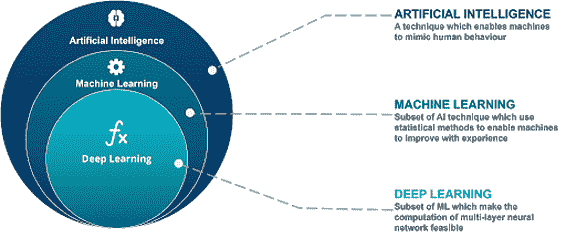**

**机器学习:** [机器学习](https://www.edureka.co/blog/machine-learning-tutorial/)是人工智能的一个*子领域，它为机器提供了自动学习的能力&根据经验进行改进，而无需显式编程。*

**深度学习:** [深度学习](https://www.edureka.co/blog/deep-learning-tutorial)是机器学习的*部分，它使用各种计算方法和算法，这些方法和算法是由被称为人工神经网络(ANN)的大脑结构和功能所启发的。*

因此，数据科学围绕着从数据中提取洞察力。为此，它使用了来自各个学科的许多不同的技术和方法，如机器学习、人工智能和深度学习。*这里需要注意的一点是，数据科学是一个非常广阔的领域，并不完全依赖于这些技术。*

现在你知道了基础知识，让我们来理解使用数据科学和 ML 工具的好处。

## **为什么要使用数据科学和机器学习工具？**

以下列出的原因将有助于您理解使用数据科学工具的好处:

*   使用数据科学和机器学习工具不需要编程技能。这对于没有 Python、R 等语言编程经验的非 It 专业人员来说尤其有利。
*   它们提供了一个非常易于使用和学习的交互式 GUI。
*   这些工具提供了一种非常有建设性的方式来定义整个数据科学工作流并实施它，而不用担心任何编码缺陷或错误。

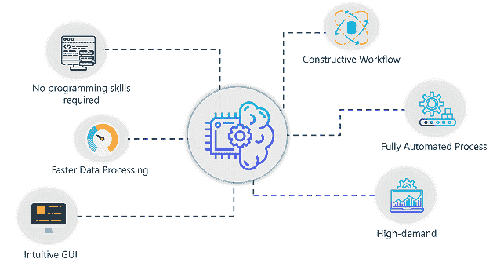

*   鉴于这些工具不需要你编码，处理数据和建立强大的机器学习模型会更快更容易。
*   工作流程中涉及的所有过程都是自动化的，需要最少的人工干预。
*   许多数据驱动型公司已经适应了数据科学工具，并经常寻找能够处理和管理此类工具的专业人士。

现在你知道了使用数据科学和机器学习工具的优势，让我们来看看任何非程序员都可以使用的顶级工具:

## **数据科学和机器学习工具**

在这一部分，我们将讨论面向非程序员的最佳数据科学和机器学习工具。请注意，这个列表没有特定的顺序。

以下是数据科学和机器学习工具的列表，将在下面讨论:

1.  [RapidMiner](#RapidMiner)
2.  [DataRobot](#DataRobot)
3.  [BigML](#BigML)
4.  mlbase
5.  [谷歌云汽车](#Google%20Cloud%20AutoML)
6.  [自动 WEKA](#Auto-WEKA)
7.  [IBM 沃森工作室](#IBM%20Watson%20Studio)
8.  表
9.  [Trifacta](#Trifacta)
10.  刀

### **RapidMiner**

RapidMiner 进入这个名单并不令人惊讶。最广泛使用的数据科学和机器学习工具之一，不仅是不具备编程技能的初学者，也是有经验的数据科学家的首选。RapidMiner 是一款一体化工具，可处理从数据处理到数据建模和部署的整个数据科学工作流程。

如果你来自非技术背景，RapidMiner 是你最好的工具之一。它提供了一个强大的 GUI，只需要转储数据，不需要编码。它建立预测模型和机器学习模型，使用复杂的算法来实现精确的输出。

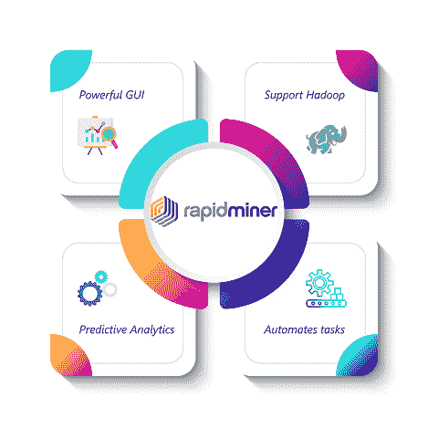

以下是它的一些主要特性:

*   提供强大的可视化编程环境。
*   带有内置的 RapidMiner Radoop，允许您与 Hadoop 框架集成以进行数据挖掘和分析。
*   它支持任何数据格式，并且通过专业清理数据来执行顶级预测分析
*   使用自动化高级任务(如数据建模)的编程结构

### **DataRobot**

DataRobot 是一个自动化的机器学习平台，可以建立精确的预测模型来执行广泛的数据分析。它是数据挖掘和特征提取的最佳工具之一。编程经验较少的专业人士会选择 DataRobot，因为它被认为是最简单的数据分析工具之一。

像 RapidMiner 一样，DataRobot 也是一个可以用来构建端到端 AI 解决方案的单一平台。它使用最佳实践来创建可用于模拟真实世界业务案例的解决方案。

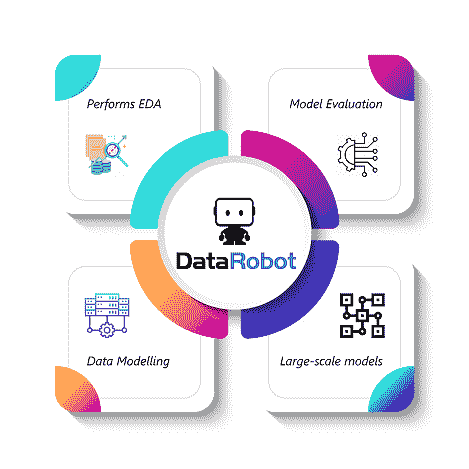

以下是它的一些主要特性:

*   自动识别最重要的功能，并围绕这些功能构建模型。
*   在不同的机器学习模型上运行数据，以检查哪个模型提供了最准确的结果
*   在构建、训练、和测试预测模型、执行文本挖掘、数据缩放等方面速度极快。
*   可以运行大规模的数据科学项目，并整合模型评估方法，如参数调整等。

### **BigML**

BigML 通过提供有助于分类、回归和聚类问题的现成结构，简化了开发机器学习和数据科学模型的过程。它整合了广泛的机器学习算法，有助于在没有太多人工干预的情况下建立一个强大的模型，这让您可以专注于重要的任务，如改善决策。

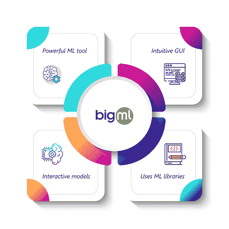

以下是它的一些主要特性:

*   一个全面的机器学习工具，支持最复杂的机器学习算法，涉及对监督和非监督学习的全面支持，包括异常检测、关联挖掘等。
*   提供了一个简单的 web 界面和 API，其设置时间只需传统系统的一小部分。
*   创建可视化交互式预测模型，从而轻松找到数据中各特征之间的相关性
*   整合了最流行的数据科学语言(如 Python、Java 等)的绑定和库

### mlbase

MLbase 是一个开源工具，是用于创建大规模机器学习项目的最佳平台之一。它解决了托管需要高级计算的复杂模型时所面临的问题。

MLBase 使用三个主要组件:

1.  ML 优化器:优化器的主要目的是自动化机器学习流水线的构建。
2.  MLI:MLI 是一个 API，专注于开发算法和执行高级计算的特征提取
3.  MLlib:这是 Apache Spark 自己的机器学习库，目前由 Spark 社区提供支持。

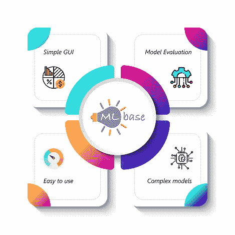

以下是它的一些主要特性:

*   为开发机器学习模型提供了一个简单的 GUI
*   它在不同的学习算法上学习和测试数据，以找出哪个模型给出了最好的准确性
*   由于该工具简单易用，非程序员也可以轻松扩展数据科学模型
*   它可以比任何传统系统更有效地扩展大型复杂的项目

通过学习[人工智能课程](https://www.edureka.co/executive-programs/machine-learning-and-ai)，将自己转变为一名高技能专业人士，并获得一份高薪工作。

### **谷歌云汽车**

Cloud AutoML 是一个机器学习产品平台，允许在数据科学方面经验有限的专业人员训练针对其业务需求的高端模型。最好的机器学习平台之一，拥有超过 10 年训练有素的 Google Research constructs，帮助您建立预测模型，超越所有传统的计算模型。

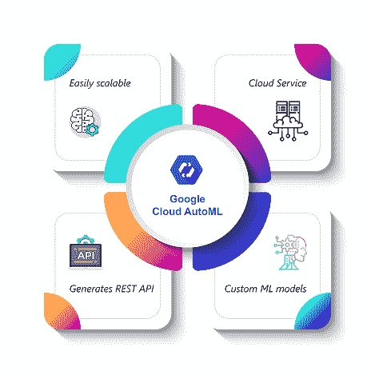

以下是它的一些主要特性:

*   在 ML 领域具有最少专业知识的专业人员可以轻松地训练和构建针对其业务需求的高级机器学习模型。
*   与许多其他谷歌云服务的全面集成，有助于数据挖掘和数据存储。
*   在对输出进行预测的同时生成 REST API
*   提供一个简单的 GUI 来创建定制的 ML 模型，这些模型可以通过相同的平台进行训练、测试、改进和部署。

### **自动 WEKA**

Auto-WEKA 是一个基于 GUI 的开源工具，非常适合初学者，因为它提供了一个非常直观的界面来执行所有与数据科学相关的任务。

它支持自动数据处理、EDA、监督和非监督学习算法。这个工具非常适合刚刚入门数据科学和机器学习的新手。它有一个开发人员社区，这些开发人员好心地发布关于使用该工具的教程和研究论文。

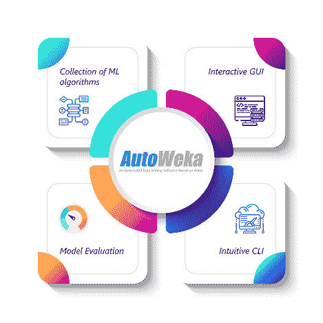

以下是该工具的一些功能:

*   WEKA 提供了大量的机器学习算法，用于分类、回归、聚类、异常检测、关联挖掘、数据挖掘等。
*   提供交互式图形界面来执行数据挖掘任务、数据分析等。
*   允许开发人员在各种可能的测试用例集上测试他们的模型，并帮助提供给出最精确输出的模型。
*   它还带有一个简单而直观的 CLI(命令行界面)来运行基本命令。

**IBM 沃森工作室**

我们都知道 IBM 对人工智能驱动的世界做出了多大的贡献。像 IBM 提供的大多数服务一样，IBM Watson Studio 是一个基于人工智能的工具，用于广泛的数据分析、机器学习、数据科学等。

它帮助组织简化数据分析过程，并负责从数据处理到部署的端到端工作流。它是市场上最受认可的数据科学和机器学习工具之一。

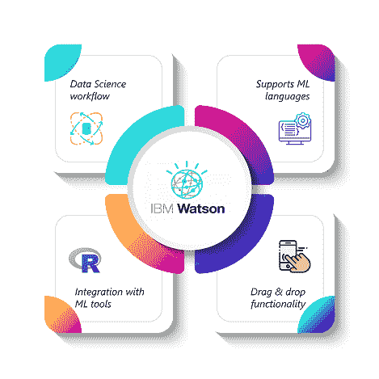

以下是 IBM Watson Studio 的一些关键特性:

*   为在几分钟内执行数据准备、探索和建模提供支持，并且整个过程是自动化的。
*   支持多种数据科学语言和工具，如 Python 3 笔记本、Jython 脚本、SPSS Modeler 和数据提炼
*   对于程序员和数据科学家来说，它提供了与 R Studio、Scala、Python 等的集成。
*   使用 SPSS Modeler，它提供了用于浏览数据和构建强大的机器学习模型的拖放功能。

### 表

[Tableau](https://www.edureka.co/blog/tableau-tutorial/) 是市场上最流行的数据可视化工具。它允许您将原始的、无格式的数据分解成可处理和可理解的格式。使用 Tableau 创建的可视化可以轻松帮助您理解预测变量之间的依赖关系。

虽然 Tableau 主要用于可视化目的，但它也可以执行数据分析和探索。

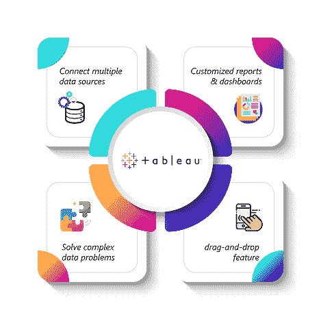

以下是 Tableau 的几个特点:

*   它可以用于连接多个数据源，并可以可视化海量数据集，以找到相关性和模式。
*   Tableau 桌面功能允许您创建定制的报告和仪表板，以获得实时更新
*   Tableau 还提供跨数据库连接功能，允许您创建计算字段和连接表，这有助于解决复杂的数据驱动问题。
*   一个直观的工具，使用拖放功能从数据中获得有用的见解并执行数据分析

### **Trifacta**

Trifacta 是一个满足您业务需求的企业数据辩论平台。准确理解数据中的内容以及这些内容对不同的分析探索有何用处，是确定数据价值的关键。Trifacta 被认为是执行数据争论、清理和分析的最佳工具。

以下是 Trifacta 的一些特性:

*   连接到多个数据源，而不管数据位于何处
*   为理解数据提供了一个交互式 GUI，不仅可以导出最重要的数据，还可以删除不必要或多余的变量。
*   提供可视化指导、机器学习工作流和反馈，指导您评估数据和执行所需的数据转换。
*   持续监控数据中的不一致性，删除任何空值或缺失值，并确保执行数据标准化，以避免输出中的任何偏差。

### 刀

KNIME 是一个开源数据分析平台，旨在创建开箱即用的数据科学和机器学习应用程序。构建数据科学应用程序涉及一系列任务，这些任务可以通过这个全自动工具很好地管理。它提供了一个非常互动和直观的图形用户界面，这使得它很容易理解整个数据科学方法。

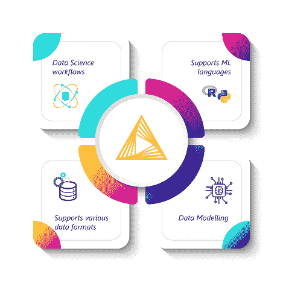

以下是 KNIME 的一些特性:

*   它可用于构建端到端的数据科学工作流，无需任何编码，您只需拖放模块即可。
*   支持嵌入来自不同领域的工具，包括用 R、Python 编写脚本，它还提供 API 来与 Apache Hadoop 集成。
*   兼容各种数据源格式，包括简单文本格式，如 CSV、PDF、XLS、JSON，以及非结构化数据格式，包括图像、gif 等。
*   为执行数据争论、功能选择、标准化、数据建模、模型评估提供全面的支持，甚至允许您创建交互式可视化。

现在你已经知道了面向非程序员的数据科学和机器学习的顶级工具，我相信你一定很想了解更多。对 Python 编程专业人士的数据科学需求急剧增加，这使得本课程成为各种专业水平的人的理想选择。[Python 数据科学课程](https://www.edureka.co/data-science-python-certification-course)非常适合希望与 Python、软件和 IT 专业人士一起工作的分析专业人士，以及对分析领域感兴趣和对数据科学有热情的任何人。这里有一些博客可以帮助你开始学习数据科学:

1.  [数据科学数学和统计学完全指南](https://www.edureka.co/blog/math-and-statistics-for-data-science/)
2.  [数据科学 vs 机器学习——有什么区别？](https://www.edureka.co/blog/data-science-vs-machine-learning/)
3.  [谁是数据科学家？](https://www.edureka.co/blog/who-is-a-data-scientist/)
4.  [十大数据科学应用](https://www.edureka.co/blog/data-science-applications/)

Edureka 有一个专门策划的[数据科学硕士项目](https://www.edureka.co/masters-program/data-scientist-certification)，可以帮助你获得机器学习算法方面的专业知识，如 K-Means 聚类、决策树、随机森林和朴素贝叶斯。您还将学习统计学、时间序列、文本挖掘的概念，以及深度学习的介绍。您将解决媒体、医疗保健、社交媒体、航空和人力资源方面的真实案例研究。本课程的新批次即将开始！！

现在，任何热衷于成为数据科学的人都可以通过专业的[数据科学课程](https://www.edureka.co/executive-programs/advanced-program-data-science-course-iitg)成为数据科学专家。所以，接受数据科学培训，成为 IT 领域最酷的专业人士。