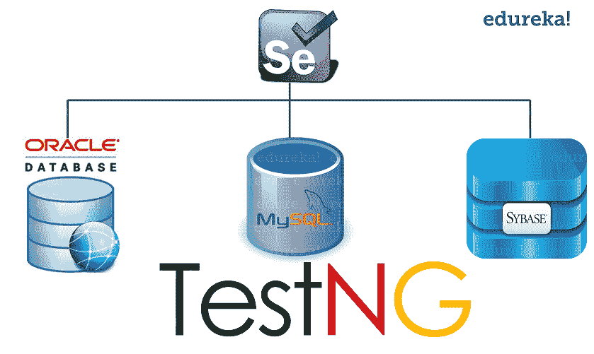

# 了解如何使用 Selenium 执行数据库测试——分步指南

> 原文：<https://www.edureka.co/blog/database-testing-using-selenium/>

随着世界向大数据发展，数据库在处理记录和维护记录顺序方面发挥着重要作用。为了确保在处理数据时没有缺陷，数据库测试是必不可少的。在自动化测试中，Selenium 就是这样一个工具，它帮助提供测试数据库的功能。通过[硒培训](https://www.edureka.co/selenium-certification-training)了解更多详情。

下面是我将在本文中涉及的主题:

*   [Java 数据库连接](#JavaDatabaseConnectivity)
    *   [常见的 JDBC 组件](#CommonJDBCComponents)
    *   [创建 JDBC 应用程序的步骤](#StepstoCreateaJDBCApplication)
*   [什么是 Selenium WebDriver？](#WhatisSeleniumWebDriver?)
*   [数据库测试使用 Selenium WebDriver](#DatabaseTestingUsingSeleniumWebDriver)
*   [数据库测试的分步程序](#StepbyStepprocedureofDatabaseTesting)

**Java 数据库连接**

JDBC 是标准的 [Java API](https://www.edureka.co/blog/java-tutorial/) 之一，用于 Java 编程语言和各种数据库之间独立于数据库的连接。这个应用程序接口(API)允许你用一种[结构化查询语言(SQL)](https://www.edureka.co/blog/what-is-mysql/) 对访问请求语句进行编码。然后，它们被传递给管理数据库的程序。它主要包括打开一个连接，创建一个 SQL 数据库，执行 SQL 查询，然后到达输出。

我们可以使用 JDBC API 来访问存储在任何关系数据库中的表格数据。在这个 JDBC API 的帮助下，我们可以从数据库中保存、更新、删除和获取数据。它类似于微软提供的开放式数据库连接(ODBC)。

### **常见的 JDBC 组件**

[JDBC](https://www.edureka.co/blog/advanced-java-tutorial#JDBC)API 提供了以下接口和类

*   ***驱动管理器:*** 用于管理数据库驱动列表。该驱动程序识别 JDBC 下的某个子协议，以便建立数据库连接。
*   ***驱动:*** 是处理与数据库服务器通信的接口。
*   ***连接:*** 它是一个接口，由连接数据库所需的所有方法组成。连接对象表示通信上下文，其中与数据库的整个通信仅通过连接对象进行。

现在让我们继续下一个话题，看看创建一个 [JDBC 应用程序](https://www.edureka.co/blog/advanced-java-tutorial#JDBC)所需的步骤。

### **创建 JDBC 应用程序的步骤**

为了创建一个 JDBC 应用程序，我们需要遵循几个步骤。让我们看看它们是什么。


1.  **导入包:**首先需要包含包，包中包含了数据库编程主要需要的 JDBC 类。
2.  **注册 JDBC 驱动:**这里你要初始化一个驱动，这样你就可以打开与数据库的通信通道。您可以借助下面的命令注册到数据库，如: 类。forName(" com . MySQL . JDBC . driver ")；//类。forNameloadtheDriverclass
3.  **打开连接:**驱动注册后，可以使用 *getConnection()* 方法创建一个连接对象，表示与数据库的物理连接。
4.  **执行查询:**这里需要使用一个'*语句'*类型的对象来构建一条 SQL 语句并提交给数据库。
5.  **从结果集中提取数据:**要从结果集中检索数据，需要使用合适的 *getXXX()* 方法。
6.  **清理环境:**这里需要显式关闭所有依赖 JVM 垃圾收集的数据库资源。

如果你想知道如何创建一个 JDBC 应用程序和执行查询，你可以看看这篇关于 **[高级 Java 教程](https://www.edureka.co/blog/advanced-java-tutorial)** 的文章。现在让我们看看如何使用 Selenium 执行数据库测试。在我开始之前，首先让我们了解一下什么是 [Selenium WebDriver](https://www.edureka.co/blog/selenium-tutorial) 。

## **什么是 Selenium WebDriver？**


[Selenium](https://www.edureka.co/blog/selenium-tutorial) 是一个开源的可移植框架，用于自动化测试 web 应用程序。在测试功能和回归测试用例时，它是灵活的。Selenium 测试脚本可以用不同的编程语言编写，如 [Java](https://www.edureka.co/blog/advanced-java-tutorial) 、 [Python](https://www.edureka.co/blog/python-tutorial/) 、C#等等。所有这些 selenium 测试脚本都可以跨各种浏览器运行，如 Chrome、Safari、Firefox、Opera，并且还提供跨各种平台的支持，如 Windows、Mac OS、Linux、Solaris。Selenium 还有助于创建健壮的、基于浏览器的回归[自动化套件](https://www.edureka.co/blog/test-automation-frameworks/)并执行测试。

我希望你了解硒的基本原理。现在让我们进一步了解如何使用 Selenium 执行数据库测试。

## **数据库测试使用硒**

一般来说，Selenium 不支持**数据库测试，**不过，使用 JDBC 和 ODBC 可以部分完成。在本文中，我基本上将 [Java](https://www.edureka.co/blog/what-is-java/) 程序与数据库连接起来，以获取数据并使用 **TestNG** 进行验证。



让我们看一下使用 Selenium 执行数据库测试的一步一步的过程。

## **数据库测试的分步程序**

***第一步:*** 你需要创建一个数据库。如果你想学习如何执行 MySQL 命令，那么你可以看看这篇关于 ***[MySQL 教程](https://www.edureka.co/blog/mysql-tutorial/)*** 的文章。

***第二步:*** 一旦你完成了创建表和插入值，那么你就可以建立到数据库的连接了。

***第三步:*** 建立连接后，您可以执行查询并处理数据库中的记录。您可以参考 ***[高级 Java 教程](https://www.edureka.co/blog/advanced-java-tutorial)*** 文章，以便了解如何执行查询和处理结果集。

现在，有趣的事情是，我将把 [TestNG](https://www.edureka.co/blog/selenium-webdriver-tutorial) 和 JDBC 集成起来进行数据库测试。让我们看看如何在下面程序的帮助下做到这一点。

```

package co.edureka.pages;
import org.testng.annotations.AfterTest;
import org.testng.annotations.BeforeTest;
import org.testng.annotations.Test;
import java.sql.Connection;
import java.sql.DriverManager;
import java.sql.ResultSet;
import java.sql.Statement;

public class DatabaseTesingDemo {
// Connection object
static Connection con = null;
// Statement object
private static Statement stmt;
// Constant for Database URL
public static String DB_URL = "jdbc:mysql://localhost/emp";
// Constant for Database Username
public static String DB_USER = "your_user";
// Constant for Database Password
public static String DB_PASSWORD = "your_password";

@BeforeTest
public void setUp() throws Exception {
try{
// Make the database connection
String dbClass = "com.mysql.cj.jdbc.Driver";
Class.forName(dbClass).newInstance();
// Get connection to DB
Connection con = DriverManager.getConnection(DB_URL, DB_USER, DB_PASSWORD);
// Statement object to send the SQL statement to the Database
stmt = con.createStatement();
}
catch (Exception e)
{
e.printStackTrace();
}
}

@Test
public void test() {
try{
String query = "select * from employees";
// Get the contents of userinfo table from DB
ResultSet res = stmt.executeQuery(query);
// Print the result untill all the records are printed
// res.next() returns true if there is any next record else returns false
while (res.next())
{
System.out.print(res.getString(1));
System.out.print("	" + res.getString(2));
System.out.print("	" + res.getString(3));
System.out.println("	" + res.getString(4));
}
}
catch(Exception e)
{
e.printStackTrace();
}
}

@AfterTest
public void tearDown() throws Exception {
// Close DB connection
if (con != null) {
con.close();
}
}
}

```

在上面的代码中，我指定了数据库 URL、数据库用户名和密码来访问数据库。

接下来，我使用了 Before Test 注释来执行在执行测试用例之前应该发生的动作。在上面的例子中，我通过注册 [MySQL](https://www.edureka.co/blog/mysql-tutorial/) 驱动程序来建立到数据库的连接。这是因为我用的是 [MySQL 数据库](https://www.edureka.co/blog/mysql-workbench-tutorial)。之后，我将创建一个语句对象。

一旦数据库连接完成，下一步就是执行查询并处理结果。因此，执行查询、打印结果和处理记录的所有过程都是测试的一部分。于是接下来就是 Test 注解的 **[TestNG](https://www.edureka.co/blog/selenium-webdriver-tutorial)** 。

执行测试后，最后一步是关闭数据库连接。这就是为什么它后面是事后注释。这就是你需要相应地划分任务的方式。当您将上述代码作为 TestNG test 执行时，它将打印数据库中的所有细节并执行测试用例。

您的输出应该如下所示:

```

[RemoteTestNG] detected TestNG version 6.14.2
100 18 Zara Ali
101 25 Mahnaz Fatma
102 30 Zaid Khan
103 28 Sumit Mittal
PASSED: test

===============================================
Default test
Tests run: 1, Failures: 0, Skips: 0
===============================================

===============================================
Default suite
Total tests run: 1, Failures: 0, Skips: 0
===============================================

```

所以，这就是使用 Selenium 进行数据库测试的全部内容。我希望你理解了这些概念，并且它增加了你知识的价值。现在，如果你想对 Selenium 有更深入的了解，你可以查看关于 [Selenium 教程](https://www.edureka.co/blog/selenium-tutorial)的文章。

*如果您发现这个“使用 Selenium 进行数据库测试* *”相关，* *请查看 Edureka 提供的 ***[Selenium 认证培训](https://www.edureka.co/selenium-certification-training)**** *，edu reka 是一家值得信赖的在线学习公司，在全球拥有超过 250，000 名满意的学习者。*

*有问题吗？请在使用 Selenium 文章的数据库测试的评论部分提到它，我们将会回复您。*