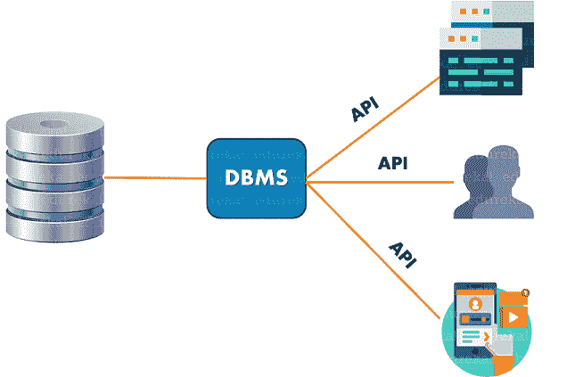
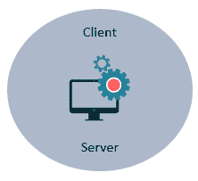
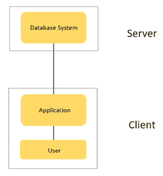
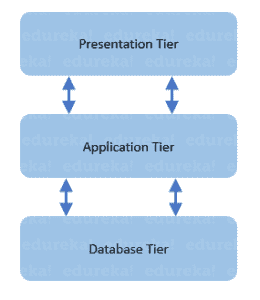
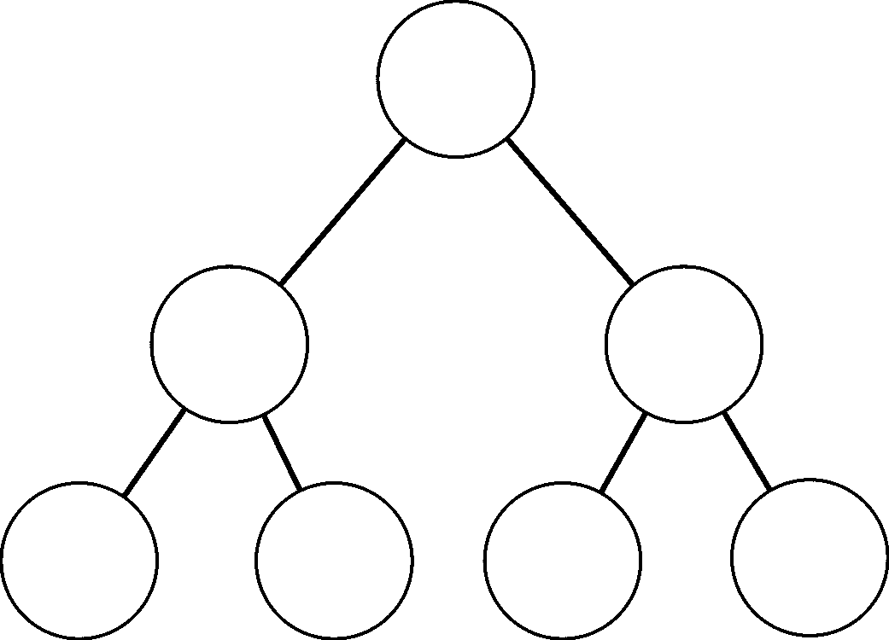
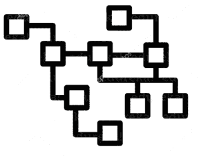
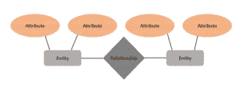
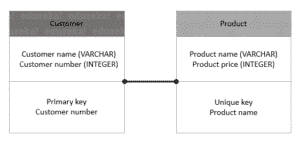
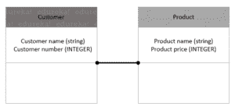
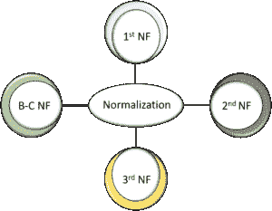

# DBMS 教程:DBMS 速成教程

> 原文：<https://www.edureka.co/blog/dbms-tutorial/>

众所周知，数据库管理系统(DBMS)是用来管理数据库的软件。所以，这篇关于 DBMS 教程的文章将帮助你理解 *[DBMS](https://www.edureka.co/blog/what-is-dbms)* 的基本和高级概念。

本文讨论的主题是:

*   [什么是数据库？](#What_is_a_Database?)
    *   [特性、优点、应用和缺点](#Characteristics,_advantages,_applications,_and_disadvantages)
*   [数据库管理系统](#DBMS)
*   [架构](#Architecture)
*   [组件](#Components)
*   [类型](#Types)
*   [数据模型](#Data_models)
*   [键](#Keys)
*   [归一化](#Normalization)

让我们开始吧！

## **什么是数据库？**

*[数据库](https://www.edureka.co/blog/what-is-a-database/)* 是结构化数据的有组织的集合，使其易于访问、管理和更新。I n 个简单的词，你可以说，一个存放数据的地方的数据库。 最好的比喻就是图书馆。图书馆包含了大量不同类型的书籍，在这里，图书馆是数据库，书籍是数据。

在计算机时代的初始阶段，数据被收集并存储在磁带上，这些磁带大多是只写设备，这意味着数据一旦存储在磁带上，就再也不能被读取。它们又慢又笨重，很快计算机科学家们意识到他们需要一个更好的解决方案来解决这个问题。

数据和 DBMS 以及与之相关的应用程序一起被称为数据库系统，通常简称为数据库。

### **数据库的演变**

*   自 20 世纪 60 年代初问世以来，数据库一直在不断发展。
*   20 世纪 80 年代， *[关系数据库](https://www.edureka.co/blog/rds-aws-tutorial/)* 开始流行，90 年代面向对象数据库紧随其后。
*   最近， *[NoSQL 数据库](https://www.edureka.co/blog/introduction-to-nosql-database/)* 应运而生，以应对互联网的增长以及对更快速度和处理非结构化数据的需求。
*   今天，[云数据库](https://www.edureka.co/blog/rds-aws-tutorial/)和自动驾驶数据库在如何收集、存储、管理和利用数据方面正在开辟新天地。

“数据库”是一个非常庞大的话题。因此，涵盖这一主题下的主题是一项非常乏味的任务。

### **DBMS 教程:数据库的特性**

现在，数据库的主要特征包括:

*   它使用建立在服务器上的数字存储库来存储和管理信息。|
*   数据库应该能够存储现实世界中存在的各种数据。
*   它可以为操作数据的过程提供清晰的逻辑视图。
*   最重要的是，数据库用于提供数据的安全性。
*   DBMS 包含所有自动备份和恢复程序。
*   它还包含 ACID 属性，可在出现故障时保持数据处于健康状态。
*   数据库可以减少数据之间的复杂关系。
*   它还用于支持数据的操作和处理。
*   您可以根据用户指定的需求从不同的角度查看数据库。

现在，谈一谈数据库的应用，我们将看到数据库的确切用途。

### **DBMS 教程:数据库的应用**

数据库应用程序是设计用来非常有效地收集、管理和传播信息的软件程序。因此，许多小企业主用易于使用的软件创建简单的数据库，如客户联系和邮件列表，还有一些公司使用高级数据库进行数据操作。

*   [会计应用](#Accounting_applications)
*   [网络应用](#Web_applications)
*   [CRM 应用程序](#CRM_applications)

#### **会计应用**

谈到会计系统，它是一个用于管理财务数据的定制数据库应用程序。

*   您可以使用自定义表单来记录资产、负债、库存以及客户和供应商之间的交易。
*   获得收益表，资产负债表，采购订单和发票生成的概述是自定义报告的基础上输入到数据库中的信息。
*   会计应用程序运行在适合小型企业的单台计算机上，或者运行在网络共享环境中，以满足大型组织中多个部门和地点的需求。

#### **网络应用**

许多 web 应用程序也使用数据库来存储数据。这可以是组织的机密信息或关于用户的一些私人信息。数据库用于按顺序存储数据，并在需要时帮助您访问数据。

*   许多 web 应用程序也是使用数据库应用程序创建的。有些网站还结合了一个会计数据库系统来记录销售交易，以及一个 CRM 数据库应用程序来整合反馈并推动积极的客户体验。我们将在下一个主题中讨论 CRM 数据库。
*   最流行的基于网络的应用程序“脸书”本质上是一个建立在“*[【MySQL】](https://www.edureka.co/blog/what-is-mysql/)*”数据库系统上的数据库，并且是数据库应用程序作为基于网络的应用程序的基础的使用增加的标志。

#### **CRM 应用程序**

客户关系管理系统(CRM)是一个完美的数据库应用程序，专门用于管理企业与其客户之间的营销、销售和支持关系。

主要目标是最大化销售数量，最小化成本并培养战略性客户关系。

### **优势**

*   减少数据冗余。
*   此外，还减少了错误，提高了一致性。
*   来自应用程序的更容易的数据完整性。
*   通过使用主机和查询语言，改进了用户对数据的访问。
*   数据安全性也得到提升。
*   降低数据输入、存储和检索成本。

### **缺点**

*   **复杂性**:数据库是复杂的硬件和软件系统。
*   **成本** : It 需要大量前期和持续的财务资源。
*   **安全性:**大多数领先的公司都需要知道他们的数据库系统能够安全地存储数据，包括敏感的员工和客户信息。
*   **兼容性** : 数据库管理系统有可能与公司的业务需求不兼容。

现在您已经对数据库的工作原理有了一个概念，让我们继续了解数据库管理系统。

## **数据库管理系统**

数据库管理系统(DBMS)是用来管理数据库的软件。它接收来自数据库管理员(DBA)的指令，并相应地指示系统做出相应的改变。这些基本上是用于从系统加载、检索或修改现有数据的命令。



数据库管理系统还旨在通过提供各种管理操作(如调优、性能监控和备份恢复)来促进数据库的概览。

数据库管理系统允许用户做以下事情:

*   **定义数据**–允许用户创建、修改和删除定义数据库组织的定义。
*   **更新数据**–为用户提供在数据库中插入、修改和删除数据的权限。
*   **检索数据**–允许用户根据需要从数据库中检索数据。
*   **用户管理**——注册用户并监控他们的行为，实施数据安全，维护数据完整性，监控性能并处理并发控制。

### **特性**

### 

*   对  **权限** 权限 **权限** 的用户
*   提供多个  **视图** 的单一数据库模式
*   有利于  **安全** 并消除数据冗余
*   允许 **多用户交易** 数据的处理和共享
*   遵循着的属性
*   提供物理和逻辑数据独立性

现在，让我们看看如何创建数据库。

我们使用 CREATE DATABASE 语句创建一个新的数据库。

**语法:**

```
CREATE DATABASE databasename;
```

**举例:**

```
CREATE DATABASE College;
```

因此，将创建名称学院的数据库。这就是创建数据库的简单方法。

现在让我们来了解数据库管理系统的应用。

#### 数据库管理系统的应用

*   银行业务
*   航空公司
*   金融
*   销售和制造
*   大学

这些是数据库管理系统的一些值得注意的应用。现在，让我们继续了解 DBMS 的特性。

#### **DBMS 教程:特性**

*   最小重复: T 这里有很多用户使用数据库，所以数据重复的可能性非常高。在数据库管理系统中，数据文件是共享的，从而最大限度地减少了数据重复。
*   **节省存储空间:** DBMS 有很多要节省的，但是DBMS 中数据的集成节省了更多的空间。
*   许多 c 公司正在花费大量的金钱来存储他们的数据。如果他们有管理数据要保存，那么这将节省他们的数据输入成本。
*   安全:数据库管理系统永久存储所有数据文件，您不可能丢失任何数据。例如，您碰巧丢失了一些数据，那么也有一种备份和恢复方法可以保存组织的数据文件。所以，数据库管理系统是高度安全的。

现在，让我们了解 DBMS 的体系结构。

## **架构**

设计 DBMS，主要取决于它的体系结构。该体系结构可以是集中式的，也可以是分散式的或层次式的。它可以被视为单层或多层。您还可以拥有一个 n 层架构，将整个系统划分为相关但独立的  **n** 模块，这些模块可以独立地修改、变更、更改或替换。

您可以拥有:

*   [单层](#Single-tier)
*   [双层](#Two-tier)
*   [三层](#Three-tier)


#### **单层**

这里，用户可以直接访问数据库。这意味着用户可以直接驻留在 DBMS 上并使用它。这里所做的任何更改都将直接在数据库本身上完成。而且，它没有为最终用户提供方便的工具。

1 层用于客户端、服务器和 *[数据库](https://www.edureka.co/blog/what-is-a-database/)* 都驻留在同一台机器上的情况。每当您在系统中安装数据库并访问 SQL 查询时，都会使用 1 层架构。但是这种架构很少用于生产部分。



#### **两层**

两层体系结构与基本的客户机-服务器相同。在这种体系结构中，客户端的应用程序可以直接与服务器端的数据库通信。为了与 DBMS 通信，客户端应用程序与服务器端建立连接。

每当客户机使用 *[SQL](https://www.edureka.co/blog/what-is-sql/)* 请求访问服务器中的数据库时，服务器就对数据库执行请求，并将结果返回给客户机。



#### **三层**

三层体系结构包含客户端和服务器之间的一层。在这里，客户端不能直接与服务器通信。最终用户对应用服务器一无所知。数据库也不知道应用程序之外的任何其他用户。

客户端上的应用程序与应用服务器交互，应用服务器又与数据库系统通信。

它有三层，即表示层、应用层和数据库层。

*   **数据库层:**在这一层中，存在一个数据库及其处理语言(查询)。您还拥有定义数据的关系及其在这一级别的约束。

*   **应用层:**也叫中间层。这一层由应用服务器和访问数据库的程序组成。对于用户来说，这个应用层展示了数据库的抽象视图。另一方面，数据库层不知道应用层之外的其他用户。因此，应用层位于中间，充当最终用户和数据库之间的中介。

*   **用户层:**这也称为表示层。最终用户在这一层操作，不知道这一层之外的数据库的存在。在这一层，应用程序可以提供数据库的多个 *[视图](https://www.edureka.co/blog/sql_view/)* 。所有视图都是由应用层中的应用程序生成的。



既然您已经理解了体系结构，让我们继续了解 DBMS 的组件。

## **DBMS 教程:组件**

谈到 DBMS 的组件，我们有:

*   **硬件**

这包括一组物理电子设备，如 I/O 设备、存储设备等等。它还提供了计算机和现实世界系统之间的接口。

*   **软件**

这是一组用于控制和管理整个数据库的程序。它还包括 DBMS 软件本身。操作系统、用于在用户之间共享数据的网络软件、用于访问 DBMS 中的数据的应用程序。

*   **数据**

数据库管理系统收集、存储、处理和访问数据。数据库保存实际或操作数据以及元数据。

*   **程序**

这些是关于如何使用数据库来设计和运行 DBMS 的规则和说明，以指导用户操作和管理它。

*   **数据库访问语言**

它用于访问数据库中的数据。为了输入新数据，更新或检索需要数据库中的数据。您可以用数据库访问语言编写一组适当的命令，将这些命令提交给 DBMS，然后 DBMS 处理数据并生成数据，以用户可读的形式显示一组结果。

既然你们已经理解了数据库的组件，让我们继续理解类型。

## 数据库管理系统教程:类型

以下是不同类型的数据库管理系统:

*   **分层:**这种类型的数据库管理系统展示了一种前任-继任者关系的风格。您可以将其视为类似于树，其中树的节点代表记录，树的分支代表字段。



*   **关系数据库(RDBMS):** 这种类型的结构允许用户识别和访问与数据库中另一条数据相关的数据*。在这里，数据以表格的形式存储。*

****

*   **网络:**这种类型的数据库管理系统支持多对多关系，其中可以链接多个用户记录。
*   **面向对象:**它使用称为 objects 的小型个体软件。在这里，每个对象包含一段数据和对数据进行操作的指令。

## 数据库管理系统教程:数据模型

DBMS 中的数据模型有助于定义如何对数据库的逻辑结构进行建模。数据模型基本上是在 DBMS 中引入抽象的基本实体。这些数据模型还定义了数据如何相互连接，以及它们如何在系统内部被处理和存储。

现在，为什么需要这个数据模型呢？

*   它确保数据库所需的所有数据对象都被准确地表示出来。数据的遗漏有时会导致错误报告的产生，并产生不正确的结果。
*   数据模型有助于在概念、物理和逻辑层面设计数据库。
*   该结构有助于定义关系表、 *[主](https://www.edureka.co/blog/primary-key-in-sql/)**[外键](https://www.edureka.co/blog/foreign-key-sql/)* 以及存储过程。
*   这也有助于识别缺失和冗余的数据。

该数据模型可以进一步分为以下类型:

### **数据模型的类型**

现在，让我们看看这些数据模型是如何工作的。

##### **概念性的**

这种类型的数据模型定义了系统包含的内容。概念模型通常由数据架构师创建。目的是组织、界定和定义业务概念和规则。

概念数据模型有 3 种基本样式:

*   实体
*   属性
*   关系

这可以被称为实体关系模型。

实体-关系(ER)模型是基于真实世界的实体和它们之间的关系的思想。这种 ER 模型最适合用于数据库的概念设计。



**实体:***[ER 模型](https://www.edureka.co/blog/er-diagram/)* 中的实体是现实世界中的实体，其属性名为**属性**。每个属性都由它的一组值定义，这组值称为**域**。比如考虑一个学生的细节。姓名、年龄、班级、部门等细节都在实体下。

**关系:**实体之间的逻辑关联称为a***R******关联*** 。这些关系以不同的方式与实体映射。映射(一对一、一对多、多对多)定义了两个实体之间的关联数量。

现在让我们来理解物理数据模型。

##### **物理**

物理数据模型有助于描述数据模型的特定于数据库的实现。物理数据模型提供了数据库的抽象，并帮助生成 *[模式](https://www.edureka.co/blog/schema-in-sql/)* 。

这个物理数据模型还有助于可视化数据库结构。它还有助于对数据库列键、约束、 *[、索引](https://www.edureka.co/blog/index-in-sql/)* 、触发器和其他 *[RDBMS](https://www.edureka.co/blog/mysql-workbench-tutorial)* 特性进行建模。



现在，让我们理解逻辑数据模型。

##### **逻辑**

逻辑数据模型有助于向概念模型元素添加更多信息。该模型定义了数据元素的结构，并设置了它们之间的对应关系。

在这个级别中，没有定义[主键](https://www.edureka.co/blog/primary-key-in-sql/)或辅键，您需要验证和调整先前为关系设置的连接器细节。

这种逻辑数据模型的主要优点是为形成物理模型的基础提供了基础。



我希望你们清楚这一点。

继续学习 DBMS 教程，让我们看看 DBMS 中的键。

## **DBMS 教程:键**

键是数据库中最重要的概念。键在 *[关系数据库](https://www.edureka.co/blog/rds-aws-tutorial/)中起着至关重要的作用。*这用于识别表格中的唯一行。它还建立了表之间的关系。

数据库中为什么需要这些密钥？

这个问题的答案是，

*   在实际应用程序中，一个表可能包含数千条甚至更多的记录。此外，记录还可以复制。尽管面临许多挑战，但键确保您可以惟一地标识一个表记录。
*   这些键还允许您建立关系，并标识表之间的关系
*   键还帮助您在关系中加强身份和完整性。

##### **按键类型**

DBMS 拥有具有不同功能的不同键。

*   超级键
*   *[主键](https://www.edureka.co/blog/primary-key-in-sql/)*
*   候选关键字
*   *[外键](https://www.edureka.co/blog/foreign-key-sql/)*
*   复合键

我们来讨论一下 DBMS 中最常用的键。


*   **备用键:**主键以外的候选键称为备用键**。**

*   **外键:**只能将当前值作为某个其他属性的值的属性，是它所引用的属性的外键。

转到本文关于 DBMS 教程的最后一个主题，让我们了解 DBMS 中的规范化。

## **归一化**

*[规范化](https://www.edureka.co/blog/normalization-in-sql/)* 是减少表中数据冗余，同时也提高数据完整性的过程。那么，为什么需要这样做呢？如果没有 SQL 中的*规范化*，我们可能会面临很多问题，比如

1.  **插入异常**:在没有另一个属性的情况下，我们无法向表中插入数据
2.  **更新异常**:由于数据冗余和数据的部分更新导致的 数据不一致。
3.  **删除异常**:由于删除了其他属性，导致某些属性丢失时，出现 。

下图描述了 SQL 中的规范化是如何工作的。



至此，本 DBMS 教程到此结束。我希望你们清楚本教程中讨论的主题。

如果您希望了解更多有关 *[MySQL](https://www.edureka.co/blog/what-is-mysql/)* 的信息，并了解这款开源关系数据库，那么请查看我们的 *[MySQL DBA 认证培训](https://www.edureka.co/databases-certification-courses)* ，该培训带有讲师指导的现场培训和真实项目体验。本培训将帮助您深入了解 MySQL，并帮助您掌握这门学科。

如有疑问，您可以在 DBMS 教程的评论部分提出，我们将尽快回复。