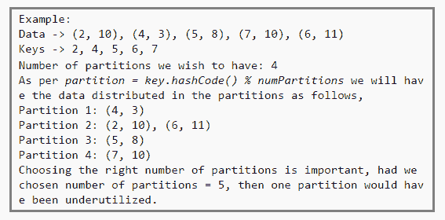

# 揭开 Spark 中分区的神秘面纱

> 原文：<https://www.edureka.co/blog/demystifying-partitioning-in-spark>

*供稿:Prithviraj Bose*

Spark 的**弹性分布式数据集**(编程抽象)被延迟评估，转换被存储为有向无环图(DAG)。所以 RDD 上的每个动作都会让 Spark 重新计算 DAG。这就是 Spark 实现弹性的方式，因为如果任何工作节点失败，那么 DAG 只需重新计算。

另外，**还必须缓存 RDD 的**(以适当的存储级别保存)，以便 RDD 上的频繁操作不会迫使 Spark 重新计算 DAG。本博客中的主题是 Apache Spark 和 Scala 认证的基本要求。本博客所涉及的主题基本上是 ***[Apache Spark 和 Scala 认证](https://www.edureka.co/apache-spark-scala-training)*** 所必需的。

## 为什么要使用分割器？

在集群计算中，核心挑战是最小化网络流量。当数据面向键值时，分区变得必不可少，因为对于 RDD 上的后续转换，网络上有大量的数据洗牌。如果相似的关键字或关键字范围存储在同一分区中，则混洗被最小化，并且处理变得相当快。

需要在工作节点之间转移数据的转换从分区中受益匪浅。这样的转换有 *cogroup、groupWith、join、leftOuterJoin、rightOuterJoin、groupByKey、reduceByKey、combineByKey* 和 *lookup* 。

Partitions are configurable provided the RDD is key-value based.

## 分区属性

1.  同一个分区中的元组保证在同一台机器上。
2.  群集中的每个节点可以包含多个分区。
3.  分区的总数是可配置的，默认情况下，它被设置为所有执行器节点上的核心总数。

## 火花中的分区类型

Spark 支持两种类型的分区，

*   **哈希分区**:使用 Java 的 *Object.hashCode* 方法确定分区为*partition = key . hashcode()% n partitions。*

*   **范围划分**:使用一个范围将属于一个范围内的键分配给各个分区。这种方法适用于键有自然顺序并且键是非负数的情况。下面的代码片段显示了范围分割器的用法。

## 代码示例

让我们看一个关于如何跨工作节点划分数据的例子。完整的 Scala 代码可以在 [这里](https://github.com/prithvirajbose/spark-dev/blob/master/src/main/scala/examples/TestPartition.scala) 找到。

下面是一些 12 坐标的测试数据(作为元组)，

创建一个大小为 2 的*org . Apache . spark . hash partitioner*，其中键将基于键的哈希代码跨这两个分区进行分区。

然后，我们可以检查这些对，并进行各种基于键的转换，如 *foldByKey* 和 *reduceByKey。*

总之，分区极大地提高了基于键的转换的执行速度。

有问题要问我们吗？请在评论区提到它，我们会给你回复。

**相关帖子:**

[Apache Spark 和 Scala](https://www.edureka.co/apache-spark-scala-training "Get started with Apache Spark and Scala")

[为什么掌握 Hadoop 后还要学习 Spark](https://www.edureka.co/blog/why-you-should-learn-spark-after-mastering-hadoop "Why learn Spark after Hadoop")

[你的星火指南](https://www.edureka.co/blog/how-to-become-a-spark-developer "Career opportunities in Spark")

[Apache Spark Vs Hadoop MapReduce](https://www.edureka.co/blog/apache-spark-vs-hadoop-mapreduce "Apache Spark Vs Hadoop MapReduce")