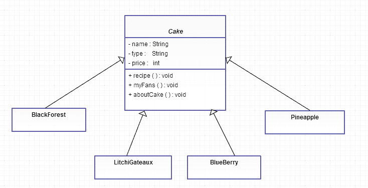

# 公开的设计模式:工厂模式

> 原文：<https://www.edureka.co/blog/design-pattern-exposed-factory-pattern/>

欢迎来到设计模式暴露系列的第二篇文章。在这篇文章中，我们将揭示工厂模式。工厂模式属于创新模式范畴。

什么是创造模式？

创造模式与软件设计过程中面临的对象创造问题有关。很多时候，对象创建会导致设计问题，创建模式通过控制对象创建来解决这个问题。

让我们先了解问题，然后我们将使用工厂模式解决问题。

考虑下面的 UML 图，其中我们有 cake 抽象类和具体子类 BlackForest、LitchiGateaux、蓝莓、菠萝。

[](https://cdn.edureka.co/blog/wp-content/uploads/2015/01/Class_Diagram.png)

让我们看看这些类里面有什么。Cake 是抽象类，所有不同的 cake 类都继承自这个类。蛋糕类有三个属性；蛋糕的名称，蛋糕的类型(蛋糕是含鸡蛋还是无鸡蛋)，最后一个是价格。

## Cake.Java

```
package co.edureka;

public abstract class Cake {

	String name;
	String type;
	int price;

	public String getName(){
		return name;
	}
	public String getType(){
		return type;
	}
	public int getPrice(){
		return price;
	}
	public void setName(String name){
		this.name=name;
	}
	public void setPrice(int price){
		this.price=price;
	}
	public void setType(String type){
		this.type=type;
	}

	public abstract void recipe();
	public abstract void myFans();
	public void aboutCake(){
		System.out.println("I am "+name+" Cake");
		System.out.print("My Fans  : ");
		myFans();
		System.out.println("You can get a "+name+" Cake at "+price);
	}
}
```

让我们看看蛋糕的一些子类

## BlackForest.Java

```
package co.edureka;

public class BlackForest extends Cake {

	public BlackForest(){
		setName("Black Forest");
		setType("Eggless");
		setPrice(800);
	}

	public void recipe() {
	    System.out.println("---BlackForest Recipe---");
	    System.out.println("Sieve together Maida and Cocoa powder");
	    System.out.println("Add Milk and Vanilla essence");
	    System.out.println("Top with Whipped Cream and Cherries");
	    System.out.println("Chill and Serve");

	}

	public void myFans() {
		System.out.println("Both adults and Kids love me");

	}

}
```

## BlueBerry.Java

```
package co.edureka;

public class BlueBerry extends Cake {

	BlueBerry(){
		setName("Blue Berry");
		setType("Egg");
		setPrice(700);
	}

	public void recipe() {
	System.out.println("---BlueBerry Recipe---");
	System.out.println("First prepare Flour and Baking powder mixture");
	System.out.println("Add Milk and Egg yolks");
	System.out.println("Coat Berries");
	System.out.println("Bake for 50 minutes");

	}

	public void myFans() {
		 System.out.println("Moms love me");

	}

}
```

## LitchiGateaux.Java

```
package co.edureka;

public class LitchiGateaux extends Cake {

	LitchiGateaux(){
		setName("Litchi Gateaux");
		setType("Eggless");
		setPrice(750);
	}

	public void recipe() {
		System.out.println("---LitchiGateaux Recipe---");
		System.out.println("Take some fresh Litchies");
		System.out.println("Wash them and Grind for 5 minutes");
		System.out.println("Put some groundnuts and bake for 45 minutes");
	}

	public void myFans() {
       System.out.println("Litchi lovers love me");
	}

}
```

现在我们已经准备好制作不同类型的蛋糕了。

## cakettest . Java

```
package co.edureka;

import java.util.Scanner;

public class CakeTest {

	public static void main(String args[]) {

		Cake cake = null;

		System.out.println("Which Cake you would like to eat ");
		Scanner scanner = new Scanner(System.in);
		String choice = scanner.nextLine();
		scanner.close();

		if (choice.equals("BlackForest")) {
			cake = new BlackForest();
		} 
		else if (choice.equals("BlueBerry")) {
			cake = new BlueBerry();
		} 
		else if (choice.equals("LitchiGateaux")) {
			cake = new LitchiGateaux();
		} 
		else if(choice.equals("Pineapple")){
			cake=new Pineapple();
		}

		cake.aboutCake();

	}

}
```

请注意 CakeTest 类中的代码，我们已经实例化了几个具体的类 BlackForest、BlueBerry、LitchiGateaux、菠萝，并且在运行时根据用户的选择决定实例化哪个类。

当您看到类似上面的代码，并且需要修改或扩展时，您将不得不重新打开代码，并检查需要添加或删除的内容。假设我不想提供凤梨酥，我必须重新打开代码，删除一些代码。类似地，如果以后我决定添加 10 种新的蛋糕类型，我必须重新打开代码，再键入 10 个“else if”语句。这意味着您的代码不是“封闭的修改”。

**注意**:你的设计应该总是“**开放扩展**，但“**关闭修改**”。

**分离变化的代码**

当我们决定删除一些蛋糕类型或添加新的蛋糕类型时，CakeTest 中的代码肯定会发生变化。

```
                if (choice.equals("BlackForest")) {
			cake = new BlackForest();
		} 
		else if (choice.equals("BlueBerry")) {
			cake = new BlueBerry();
		} 
		else if (choice.equals("LitchiGateaux")) {
			cake = new LitchiGateaux();
		} 
		else if(choice.equals("Pineapple")){
			cake=new Pineapple();
		}
```

我们目前的设计有三大问题

*   CakeTest 类与 cake 子类紧密耦合，因为在 main 方法中，我们根据用户的选择实例化了一个具体的 cake 类。这意味着 CakeTest 类知道 cake 的所有子类，这是不好的。

*   如果我们添加或删除一些蛋糕类型，我们必须修改 main 方法中的代码。

*   如果其他一些类也需要特定的蛋糕(取决于某些条件),那么代码就没有可重用性。我们必须复制代码，这很糟糕。如果我们将蛋糕创建代码分离到一个单独的工厂类中，岂不是很棒？

因此，任何需要蛋糕对象的人都可以直接调用工厂类。

现在我们已经理解了设计中的问题，让我们分离出不同的代码。

**封装对象创建**

我们将定义一个工厂接口和一个实现工厂接口的具体工厂类(CakeFactory ),工厂接口将封装不同类型蛋糕的对象创建代码。

## Factory.Java

```
package co.edureka;

public interface Factory {

	Cake createCake(String cakeName);

}
```

## CakeFactory.Java

```
package co.edureka;

public class CakeFactory implements Factory{

	public Cake createCake(String cakeName){

		Cake cake=null;

		if (cakeName.equals("BlackForest")) {
			cake = new BlackForest();
		} 
		else if (cakeName.equals("BlueBerry")) {
			cake = new BlueBerry();
		} 
		else if (cakeName.equals("LitchiGateaux")) {
			cake = new LitchiGateaux();
		} 
		else if(cakeName.equals("Pineapple")){
			cake=new Pineapple();
		}
		return cake;
	}

}
```

现在，让我们看看我们的 CakeTest 类将如何变化。

## cakettest . Java

```
package co.edureka;

import java.util.Scanner;

public class CakeTest {

	public static void main(String args[]) {

		Cake cake = null;

		System.out.println("Which Cake you would like to eat BlackForest/BlueBerry/LitchiGateaux/Pineapple : ");
		Scanner scanner = new Scanner(System.in);
		String choice = scanner.nextLine();
		scanner.close();

		CakeFactory cakeFactory=new CakeFactory();
		cake=cakeFactory.createCake(choice);

		cake.aboutCake();

	}

}
```

通过在单独的工厂类中分离蛋糕创建代码，我们获得了以下好处:

*   我们的对象创建代码在一个地方，任何需要特定蛋糕类型的类都可以使用工厂类。我们不需要在所有地方复制对象创建代码。
*   需要特定蛋糕对象的类不需要了解所有蛋糕类型。他们需要做的就是调用工厂类中的方法并传递参数。
*   现在，我们的代码是动态的，因为我们可以换入和换出不同的工厂实现。让我们看看如何做到这一点。

考虑这个场景，有一个 CakeStore 从蛋糕工厂获得蛋糕。使用工厂模式，我们可以动态地改变 CakeStore 获取蛋糕的工厂。

所以让我们开始吧。

## CakeStore.Java

```
package co.edureka;

public class CakeStore {
	Factory factory;

	CakeStore(Factory factory){
		this.factory=factory;
	}

	public Cake newCakeOrder(String cakeName,String customerName){
		Cake cake;

		cake=factory.createCake(cakeName);

		cake.decorate(customerName);
		cake.packCake();

		return cake;
	}

}
```

让我们创建一个专门制作圣诞蛋糕的蛋糕工厂。

## ChristmasCakeFactory.Java

```
package co.edureka;

public class ChristmasCakeFactory implements Factory {

	public Cake createCake(String cakeName){

		Cake cake=null;

		if(cakeName.equals("Christmas Special Cake")){
			cake =new ChristmasSpecialCake();
		}
		else if(cakeName.equals("Santa Cake")){
			cake =new SantaCake();
		}
		else if(cakeName.equals("Christmas Ice Cake")){
			cake =new ChristmasIceCake();
		}
		else if(cakeName.equals("Merry Christmas Cake")){
			cake =new MerryChristmasCake();
		}

		return cake;
	}

}
```

现在是时候测试我们的代码了:

```
ChristmasCakeFactory christmasCakeFactory=new ChristmasCakeFactory();

CakeStore cakeStore=new CakeStore(christmasCakeFactory);

Cake cake=cakeStore.newCakeOrder("Special Christmas Cake", "Alex");
```

请注意，在上面的代码中，我们已经为 CakeStore 类设置了 ChristmasCakeFactory。

我们可以动态地选择我们想要得到蛋糕的工厂。你可以创建许多不同的工厂，如生日蛋糕工厂，结婚蛋糕工厂，纸杯工厂等。

## 在哪里可以看到工厂模式的实现？

工厂模式在 Java API 中使用了一百多次。一个例子是 javax.swing.BorderFactory 类，它有许多方法根据您传递的参数返回特定的边框。

AbstractBorder 是一个抽象类，有具体的类，如 LineBorder、StrokeBorder、TitledBorder、EmptyBorder、CompoundBorder、BevelBorder、EtchedBorder 等。

现在，每当我需要获得一个特定类型的边框时，我只需调用 BorderFactory 类中可用的几个方法之一。比方说，我想得到一个 TitledBorder 对象。

有两种方法可以获得 TitledBorder，一种方法是直接实例化 TitledBorder 类，另一种方法是使用 BorderFactory 类。

```
Border border=new TitledBorder("This is the Border Title");
```

**或**

```
Border border=BorderFactory.createTitledBorder("This is the Border Title");
```

这类似于我们的 CakeFactory 示例。比方说如果我想得到 BlackForestCake，我可以用两种方法。

```
Cake cake=new BlackForest();
```

**或**

```
Cake cake=CakeFactory.createCake("BlackForest");
```

我希望您理解了工厂模式以及何时以及如何使用它。

像往常一样，你可以下载代码并使用它，以确保你真的在头脑中巩固了工厂模式。在下一篇文章中，我们将揭示工厂方法模式，这也是一种工厂模式，但提供了更多的灵活性。

如果您对工厂模式或任何其他模式有任何疑问，请在下面留下您的评论。

有问题要问我们吗？在评论区提到它们，我们会给你回复。

**相关帖子:**

[设计模式入门](https://www.edureka.co/design-patterns-self-paced)

[设计模式暴露:策略模式](https://www.edureka.co/blog/design-pattern-exposed-strategy-pattern/)