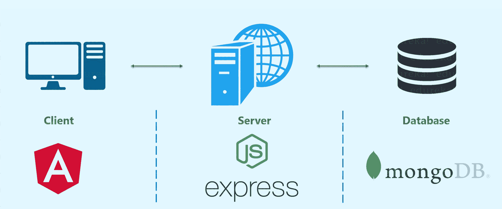
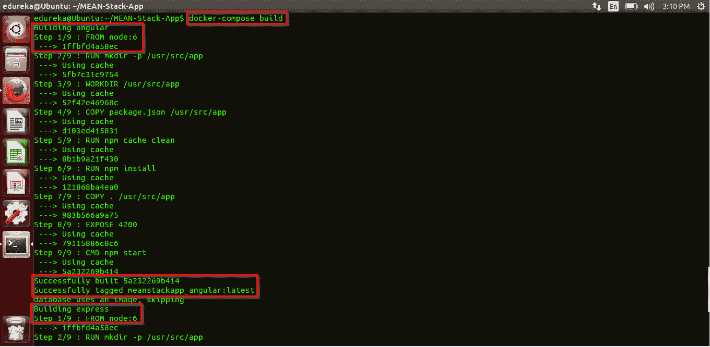
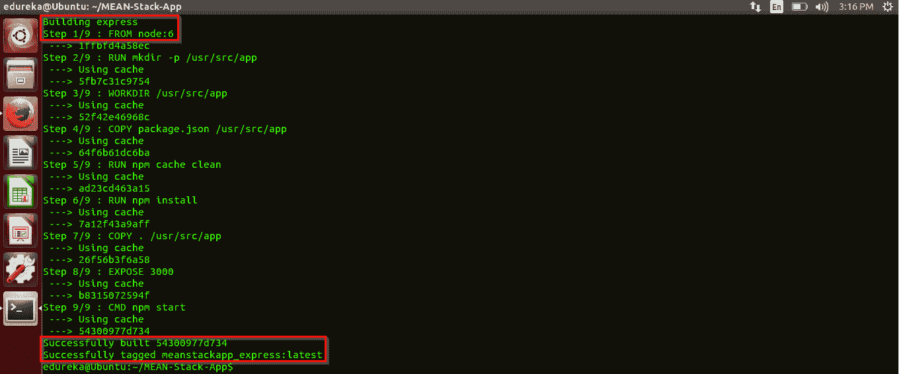

# 用于集装箱化平均堆栈应用 Docker 组合器

> 原文：<https://www.edureka.co/blog/docker-compose-containerizing-mean-stack-application/>

在之前关于 Docker 的博客中，你可能已经了解了什么是 Docker 图像、Docker 容器以及对它们的需求。如果你还没有读过它们，那么我请求你在继续撰写 Docker 上的这篇博客之前，先读一读 ***[什么是 Docker](https://www.edureka.co/blog/what-is-docker-container)*** 。

在探索了 Docker 带来的可能性之后，了解更多当然是非常令人兴奋的。不是吗？至少当我遇到挑战时是这样。

## **码头工人简介**

对我来说，封装一个服务应用程序很容易。但是，当我必须将多种服务封装到不同的容器中时，我遇到了障碍。我的要求是容器化和托管一个普通的堆栈应用程序。

是的，你没看错。全栈应用。最初，我认为这是不可能的。但是在我听说 Docker Compose 之后，我知道我所有的问题都会得到解决。

Docker Compose 可用于为一个平均堆栈应用程序中的每个堆栈创建单独的容器(并托管它们)。MEAN 是 MongoDB Express Angular&NodeJs 的缩写。我将在这个博客中展示的演示也是关于同一主题的。

通过使用 Docker Compose，我们可以在同一台主机上的不同容器中托管这些技术，并让它们相互通信。每个容器将暴露一个用于与其他容器通信的端口。

这些容器的通信和正常运行时间将由 Docker Compose 维护。

你可能会问，如何设置整个基础设施？那么，让我给你更详细的解释。

通过在线 [Docker 课程](https://www.edureka.co/docker-training)了解更多关于 Docker Compose 的信息。

## **docker file**

类似于我们如何通过编写 dockerfile 来旋转任何单个应用程序容器，我们将不得不为构建每个单个容器应用程序编写单独的 dockerfile。此外，我们还必须编写一个 Docker Compose 文件来完成实际工作。Docker 合成文件将执行不同的 docker 文件来创建不同的容器，并让它们彼此交互。

在我们的例子中，我们有一个完整的堆栈应用程序，由 MongoDB、ExpressJS、Angular 和 NodeJS 组成。MongoDB 负责后端数据库，NodeJS 和 ExpressJS 负责服务器端渲染，Angular 负责前端。



由于有三个组件，我们必须为每个组件旋转容器。我们必须按照以下方式旋转容器:

1.  容器 1–角度
2.  容器 2–NodeJS 和 ExpressJS
3.  容器 3–MongoDB

## **创建 Docker 容器**

作为对 mean 应用程序进行 dockerize 化的第一步，让我们从 Angular 的容器开始，为构建每个组件编写 dockerfile。这个 docker 文件必须与“package.json”文件一起存在于项目目录中。“package.json”包含关于“NPM”需要使用哪个版本的依赖项来构建 angular 应用程序的详细信息。

### **1。前端 docker file**

```
FROM node:6
RUN mkdir -p /usr/src/app
WORKDIR /usr/src/app
COPY package.json /usr/src/app
RUN npm cache clean
RUN npm install
COPY . /usr/src/app
EXPOSE 4200
CMD ["npm","start"]

```

与往常一样，我们的第一个命令是拉一个基本映像，我们正在拉一个基本的“节点:6”映像。

接下来的两个命令是关于在 Docker 容器内创建一个新目录'/usr/src/app '，用于存储角度代码，并使其成为容器内的工作目录。

然后，我们将‘package . JSON’文件从我们的项目目录复制到容器内部。

然后，我们运行“npm 缓存清理”命令来清理 npm 缓存。

之后，我们运行“npm install”命令，开始下载托管 Angular 应用程序所需的锅炉板。它开始根据“package.json”中指定的依赖项版本下载锅炉板。

下一个“RUN”命令将把项目目录中的所有代码和文件夹复制到容器中。

上面的命令要求容器公开端口号 4200，用于与后端服务器通信，以发送用户通过 Web UI 访问前端客户端时发出的请求。

最后最后一个命令是，‘运行’命令启动‘NPM’。这将开始执行构建 Angular 应用程序的代码。

Angular 应用程序现已准备就绪，但它将无法正常托管，因为它依赖于后端服务器和数据库。所以让我们更进一步，编写一个 dockerfile 来封装后端服务器。

### **2。后端的 docker file**

甚至这个 dockerfile 文件也会出现在项目目录中。该目录还将包含“package.json”文件，用于定义 Express 服务器的依赖性和 NodeJS 的其他要求。但最重要的是，它包含了支持后端服务器的项目代码。

```
FROM node:6
RUN mkdir -p /usr/src/app
WORKDIR /usr/src/app
COPY package.json /usr/src/app
RUN npm cache clean
RUN npm install
COPY . /usr/src/app
EXPOSE 3000
CMD ["npm","start"]

```

如你所见，这两个 docker 文件有很多相似之处。我们使用相同的“node:6”作为基础映像层，在容器内创建一个新目录，使其成为工作目录，并运行“npm install”命令等。但是唯一的区别是用于通信的端口号。在这种情况下，定义了端口号 3000。这是服务器将被托管的地方，并且将寻找来自客户端的请求。

### **3。数据库**

你可能想知道为什么我没有在标题中提到“数据库的 dockerfile”。原因是，我们实际上不需要进行定制。我们可以直接提取一个“MongoDB”基础映像来存储我们的数据，只需公开可以访问它的端口号。

现在你脑海中的问题是，我该在哪里做呢？我们可以在 Docker 编写文件中完成。

## **码头工复合档案**

Docker 合成文件是一个 YAML 文件，包含设置 Docker 应用程序的服务、网络和卷的详细信息。

运行下面的命令找到你的 Docker 引擎的版本。

```
docker -v

```

执行该命令将返回在您的主机上运行的版本。根据您主机上的 Docker 引擎版本，下载适当版本的 Docker Compose。你可以从 *[Docker 的官方文档](https://docs.docker.com/compose/compose-file/compose-versioning/)* 中寻找合适的版本下载。


由于我运行的是 Docker 引擎版本 17.05.0-ce，所以我使用了 Docker Compose 版本 3。

## **安装坞站复合**

要下载 Compose，运行下面的命令集。

```
sudo curl -L https://github.com/docker/compose/releases/download/1.16.1/docker-compose-`uname -s`-`uname -m` -o /usr/local/bin/docker-compose
sudo chmod +x /usr/local/bin/docker-compose

```

注意，命令中的版本号将根据您运行的 Docker 引擎版本而变化。

下面是我的 Docker 编写文件中的命令。

```
version: '3.0' # specify docker-compose version

# Define the services/ containers to be run
services:
 angular: # name of the first service
  build: angular-app # specify the directory of the Dockerfile
  ports:
  - "4200:4200" # specify port mapping

 express: # name of the second service
  build: express-server # specify the directory of the Dockerfile
  ports:
  - "3000:3000" #specify ports mapping
  links:
  - database # link this service to the database service

 database: # name of the third service
  image: mongo # specify image to build container from
  ports:
  - "27017:27017" # specify port forwarding

```

我很确定上面文件中的命令对你来说毫无意义。所以，让我们来解决这个问题。

在第一行代码中，我已经定义了我正在使用的 Docker Compose 的版本。如果希望 Compose 正常工作而不抛出任何错误，这是非常重要的一步。确保根据您的 Docker 引擎版本下载 Docker Compose 版本。

之后，我使用关键字“服务”定义了三个容器。这些服务指的是我的堆栈的三个组件，前端、后端和数据库。因此，在这种情况下，我的容器的名称将是我的服务的名称，即' angular '，' express '和' database '。

关键字‘build’用于指示用于旋转该容器的 docker 文件存在于该目录中。等等，你怎么糊涂了？

很简单。需要在“build:”后指定路径。在我们的例子中，“angular-app”和“express-server”是两个目录的路径，可以从 Docker 合成文件所在的目录访问这两个目录。对于我们的数据库容器，我只是说使用一个基本的‘image:mongo’来代替 dockerfile 的路径。

对于这些服务中的每一个，我还指定了可以用来接收/发送来自其他容器(服务)的请求的端口号。angular 的 4200，express 的 3000，mongo 的 27017。

另外，express 容器有一个“链接:”到数据库容器，表明在服务器端接收到的任何数据都将被发送到数据库并存储在那里。

现在，我们终于完成了构建。要启动 Docker Compose 并旋转包含三个服务的三个容器，我们只需从 Docker Compose 文件(YAML 文件)所在的目录中执行以下两个命令:

```
docker-compose build 
docker-compose up 

```

“docker-compose build”命令用于构建/重建服务，而“docker-compose up”命令用于创建/启动容器。去吧！你自己试试。

下面是正在构建并正在执行的 Docker 映像的截图。您可以注意到，角度图像正在建立，然后用名称标记为“angular:latest”。



此外，Express 的图像使用名称和标签“express:latest”构建。



现在映像已经构建好了，让我们试着运行它，并在这个过程中旋转一个容器。下面是那个截图。


下面是显示“webpack:编译成功”的屏幕截图，这意味着 Docker 成功地将这三个服务容器化。


现在容器已经托管，您可以看到服务在它们各自的端口上是活动的。在您的网络浏览器中键入以下端口号，与 MEAN 应用程序的 GUI 进行交互。

localhost:4200—*Angular App(前端)*localhost:3000—*Express Server&NodeJS(后端/服务器端)*localhost:27017—MongoDB(数据库)

印象深刻了吗？等等，因为 Docker 还没做好！我们可以使用“docker-compose scale='x '”命令来轻松地增加/减少部署的数量。换句话说，我们可以为一个服务创建那么多容器。以下是将特定服务扩展到“5”个容器的完整命令:

```
docker-compose scale=5

```

Docker 是最好的部署工具之一，也是我个人的最爱。

如果你对这个概念仍有疑问，那么你可以看下面的视频，我在视频中解释了相同的概念，并实际操作了如何设置 Docker Compose。

## **Docker 作曲|集装化意思栈应用| DevOps 教程**

[https://www.youtube.com/embed/WZa7GsqyS3w?rel=0&showinfo=0](https://www.youtube.com/embed/WZa7GsqyS3w?rel=0&showinfo=0)

既然您已经了解了 Docker，请查看 Edureka 提供的Docker 培训，edu reka 是一家值得信赖的在线学习公司，在全球拥有超过 250，000 名满意的学习者。这个 Edureka Docker 认证培训课程帮助学习者获得实现 Docker 和掌握它的专业知识。

*有问题吗？请在评论区提到它，我们会给你回复。*