# ELK Stack 教程–高效地发现、分析和可视化您的数据

> 原文：<https://www.edureka.co/blog/elk-stack-tutorial/>

随着越来越多的 IT 基础设施转向云，对公共云安全工具和日志分析平台的需求也在快速增长。无论组织的规模如何，每天都会产生大量数据。这些数据中有相当一部分是由公司的 web 服务器日志组成的。日志是最重要但经常被忽视的信息来源之一。每个日志文件都包含非常有价值的信息，这些信息大多是非结构化的，毫无意义。如果没有对这些日志数据进行仔细而详细的分析，组织可能会对其周围的机会和威胁视而不见。这就是日志分析工具派上用场的地方。ELK Stack 或 Elastic Stack 是一个完整的日志分析解决方案，帮助深度 ***搜索******分析******可视化*** 不同机器生成的日志。通过这个关于 ELK Stack 教程的博客，我会给你一些关于它的见解。

但是在我开始之前，让我列出我将要讨论的话题:

*   [麋鹿栈是什么？](#1)
*   [麋栈架构](#2)
*   [麋栈安装](#3)
*   [弹力搜索教程](#4)
*   [Logstash 教程](#5)
*   [基巴纳教程](#6)

*您可以浏览本麋鹿教程记录，我们的[](https://www.edureka.co/elk-stack-training-sp)麋鹿训练专家已经用例子详细解释了这些主题，这将有助于您更好地理解这个概念。*

## **麋鹿教程|爱德华卡**


[//www.youtube.com/embed/MRMgd6E9AXE?rel=0&showinfo=0](//www.youtube.com/embed/MRMgd6E9AXE?rel=0&showinfo=0)

这个关于什么是 ELK Stack 的 Edureka 教程将帮助你理解 Elasticsearch、Logstash 和 Kibana 的基本原理，并帮助你在 ELK Stack 中建立一个强大的基础。

因此，让我们快速开始这篇 ELK Stack 教程博客，首先了解什么是 ELK Stack。

## **麋鹿栈是什么？–麋鹿栈教程**

## **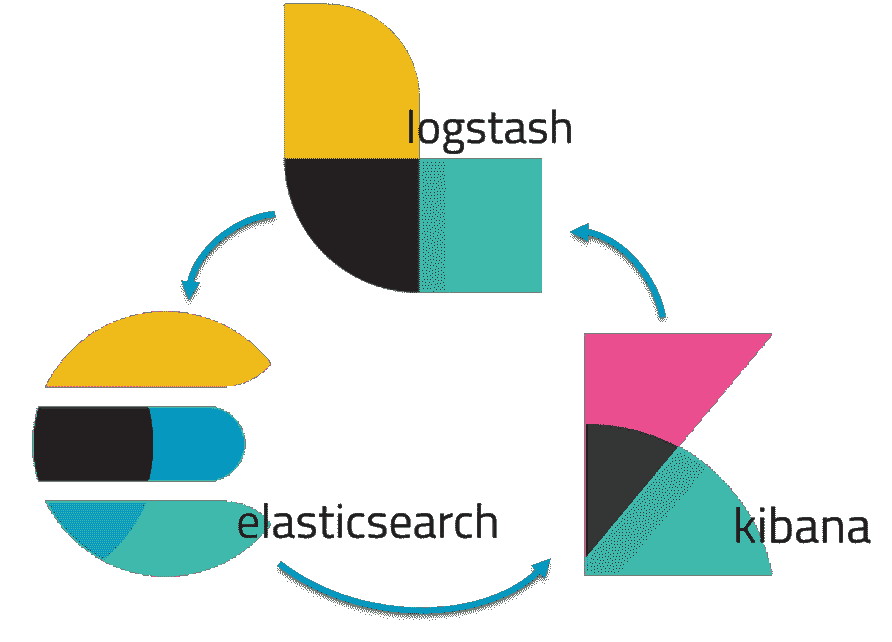**

俗称 ELK Stack，最近更名为 Elastic Stack。它是三个开源工具的强大集合:Elasticsearch、Logstash 和 Kibana。

在不同的 IT 环境中，这三种不同的产品通常一起用于日志分析。使用 ELK Stack，您可以执行集中式日志记录，这有助于识别 web 服务器或应用程序的问题。它允许您在一个位置搜索所有日志，并通过关联特定时间范围内的日志来识别跨多个服务器的问题。

Lets now discuss each of these tools in detail.

### ****

**【日志率】**

Logstash 是数据收集管道工具。它是 ELK Stack 的第一个组件，收集数据输入并将其提供给 Elasticsearch。它从不同的来源一次性收集各种类型的数据，并使其立即可供进一步使用。

### ****

Elasticsearch 是一个基于 Lucene 搜索引擎的 NoSQL 数据库，使用 RESTful APIs 构建。这是一个高度灵活的分布式搜索和分析引擎。此外，它还通过横向可伸缩性提供了简单的部署、最大的可靠性和易管理性。它提供高级查询以执行详细的分析，并集中存储所有数据以快速搜索文档。

### ****

### **基巴纳**

Kibana 是一个数据可视化工具。它用于可视化 Elasticsearch 文档，并帮助开发人员立即了解它。Kibana dashboard 提供各种交互式图表、地理空间数据、时间线和图形，以可视化使用 Elasticsearch 完成的复杂查询。使用 Kibana，您可以根据自己的具体需求创建和保存自定义图表。

本 ELK Stack 教程博客的下一部分将讨论 ELK Stack 架构以及数据如何在其中流动。

## **麋栈架构——麋栈教程**

以下是 ELK 堆栈的架构，显示了 ELK 中日志流的正确顺序。在这里，Logstash 根据提供的过滤标准收集和处理从各种来源生成的日志。Logstash 然后将这些日志传输到 Elasticsearch，后者随后分析和搜索这些数据。最后，使用 Kibana，根据需求可视化和管理日志。

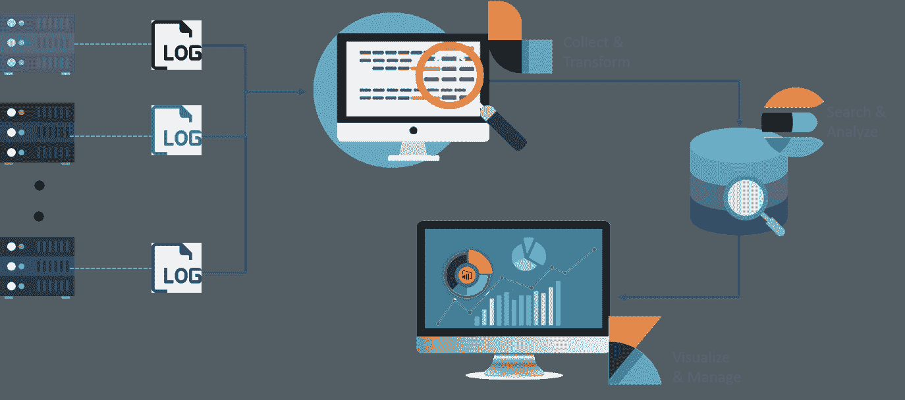

## **麋鹿栈安装——麋鹿栈教程**

**第一步:**转到[https://www.elastic.co/downloads.](https://www.elastic.co/downloads)

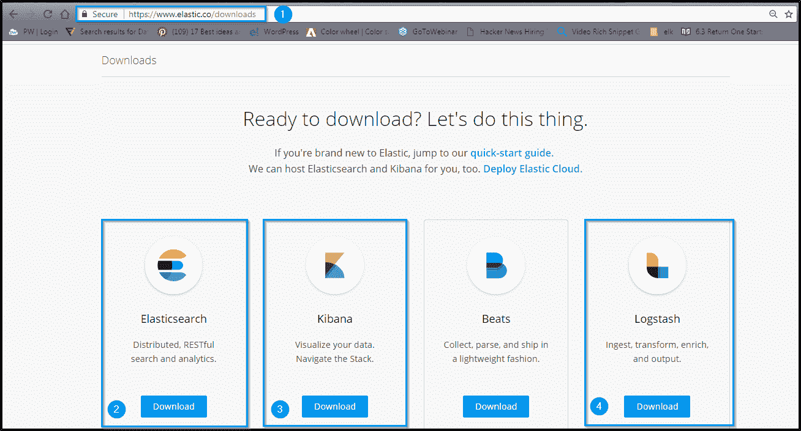 **第二步:** 选择并下载 Elasticsearch。

**第三步:**选择并下载基巴纳。

**第四步:**选择并下载 Logstash。

**第五步:**将三个文件全部解压，得到各自文件夹下的文件。

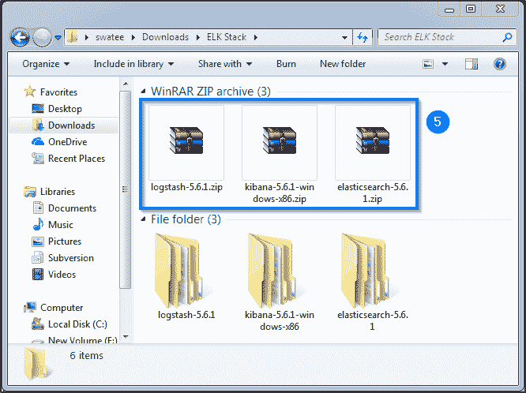

### **安装橡皮筋搜索**

**第六步:**现在打开 *elasticsearch 文件夹*，进入其 *bin 文件夹*。

**第七步:**双击 elasticsearch.bat 文件启动 elasticsearch 服务器。 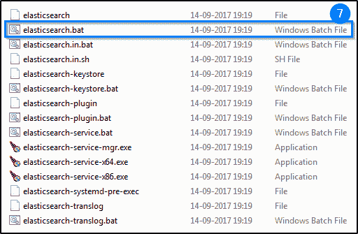

**第八步:**等待 elasticsearch 服务器启动。

**第九步:**检查服务器是否已经启动，进入浏览器，输入 **localhost:9200** 。 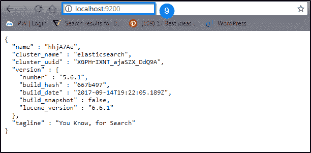

### **安装基巴纳**

**第 X 步:**现在打开*基巴纳文件夹*，转到它的 *bin 文件夹*。

**步骤 XI:** 双击 kibana.bat 文件启动 elasticsearch 服务器。


**步骤 XII:** 等待 kibana 服务器启动。

**步骤十三:**检查服务器是否已经启动，进入浏览器，输入 **localhost:5601** 。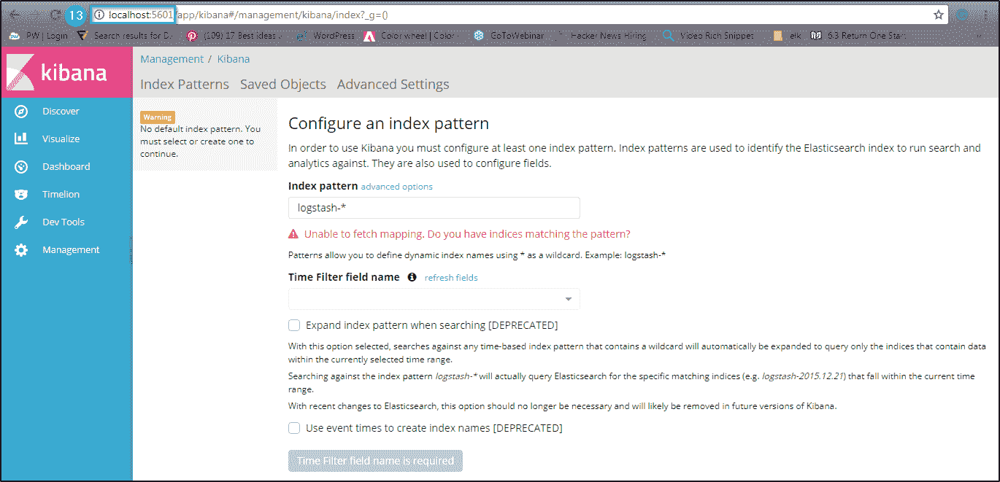

### **安装 Logstash**

**第十四步:**现在打开 *logstash 文件夹。*

**第十五步:**要测试您的 logstash 安装，打开命令提示符并转到您的 logstash 文件夹。现在输入:

```
binlogstash -e 'input { stdin { } } output { stdout {} }'
```

**第十六步:**等到命令行出现“管道总管启动”。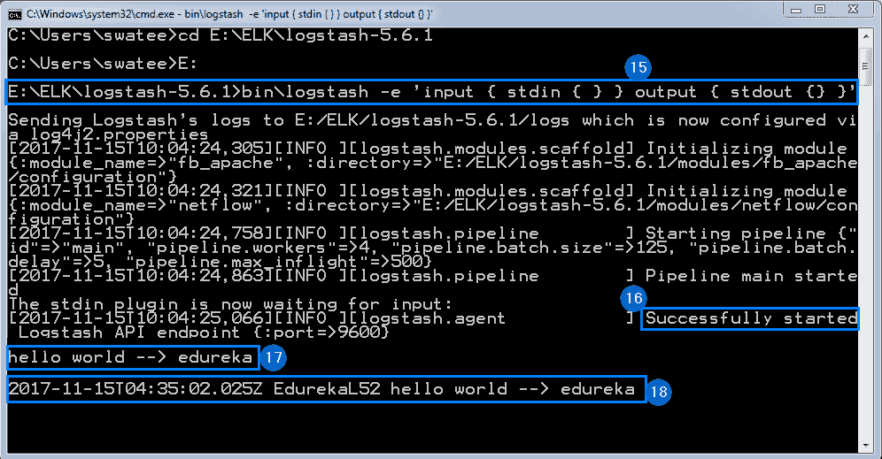

**第十七步:**现在在命令提示符下输入一条消息并点击回车键。

**步骤 XVIII:** Logstash 将时间戳和 IP 地址信息附加到消息中，并显示在命令提示符上。

既然我们已经完成了安装，现在让我们更深入地了解这些工具。先说 Elasticsearch。

## **elastic search–麋鹿栈教程**

如前所述，Elasticsearch 是一个高度可扩展的搜索引擎，运行在基于 Java 的 Lucene 引擎之上。 它基本上是一个 NoSQL 数据库；这意味着它以非结构化格式存储数据，并且不能对任何类型的事务执行 SQL 查询。换句话说，它将数据存储在文档中，而不是表和模式中。为了更好地了解情况，请查看下表，该表显示了 Elasticsearch 与数据库的对比情况。

现在让我们熟悉一下 Elasticsearch 的基本概念。

使用 Elasticsearch 时，您需要遵循三个主要步骤:

1.  索引
2.  映射
3.  搜索

下面就来详细说说，一个一个来。

**标引**

索引是添加数据弹性搜索的过程。它被称为“索引”,因为当数据被输入到 Elasticsearch 中时，它会被放入 Apache Lucene 索引中。然后，Elasticsearch 使用这些 Lucene 索引来存储和检索数据。索引类似于 CRUD 操作的创建和更新过程。

索引方案由 **名称/类型/id、** 组成，其中名称和类型为必填字段。如果您没有提供任何 id，Elasticsearch 会自动提供一个 ID。然后，这个完整的查询被附加到一个 HTTP PUT 请求，最终的 URL 看起来像这样: `**PUT name/type/id**` 连同 HTTP 有效负载，一个包含字段和值的 JSON 文档也被发送。以下是创建一个美国客户文档的示例，其详细信息在字段中。

```
PUT /customer/US/1
{
 "ID" : 101,
 "FName" : "James",
 "LName" : "Butt",
 "Email" : "jbutt@gmail.com",
 "City" : "New Orleans",
 "Type" : "VIP"
}
```

它将给出以下输出:

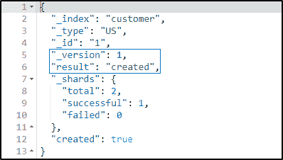

这里显示文档已经创建并添加到索引中。

现在，如果您试图在不更改 id 的情况下更改字段详细信息，Elasticsearch 将使用当前详细信息覆盖您现有的文档。

```
PUT /customer/US/1
{
 "ID" : 101,
 "FName" : "James",
 "LName" : "Butt",
 "Email" : "jbutt@yahoo.com",
 "City" : "Los Angeles",
 "Type" : "VVIP"
}
```

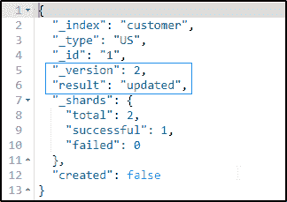

此处显示文档已经更新了索引的新细节。

### **映射**

映射是设置索引模式的过程。通过映射，您告诉 Elasticsearch 您的模式中存在的属性的数据类型。如果在索引前时间没有完成特定的映射，Elasticsearch 会动态地将一个通用类型添加到该字段中。但是这些通用类型是非常基本的，并且大多数时候不能满足查询期望。

现在让我们尝试映射我们的查询。

```
PUT /customer/
{
 "mappings":{
 "US":{
 "properties":{
 "ID":{
 "type": "long"
 },
 "FName" : {
 "type" : "text"
 },
 "LName" : {
 "type" : "text"
 },
 "Email" : {
 "type" : "text"
 },
 "City" : {
 "type" : "text"
 },
 "Type" : {
 "type" : "text"
 }
 }

 }
 }
}
```


当您执行查询时，您将得到这种类型的输出。

### **搜索**

具有特定索引和类型的一般搜索查询将类似于: `**POST index/type/_search**`

现在，让我们尝试搜索“客户”索引中所有客户的详细信息。

```
POST /customer/US/_search
```

当您执行该查询时，将会生成以下结果:

但是当你想搜索特定的结果时，Elasticsearch 提供了三种方法来执行:

*   #### **使用查询**

    使用查询，您可以搜索一些特定的文档或条目。例如，让我们对属于“VVIP”类别的客户执行搜索查询。

    ```
    POST /customer/US/_search
    {
     "query": {
     "match": {
     "Type": "VVIP"
     }
     }
    }
    ```

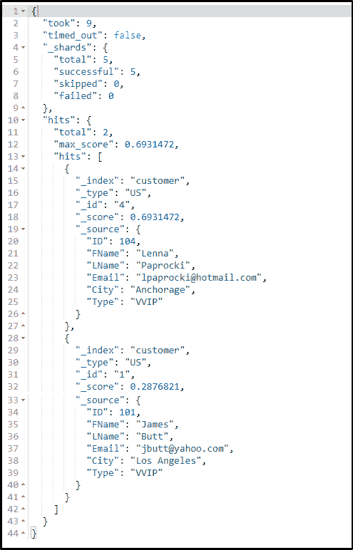

*   #### **使用滤镜**

    使用过滤器，你可以进一步缩小搜索范围。以下是搜索 ID 为“101”的 VVIP 客户的示例:

```
POST /customer/_search
{
 "query": {
 "match": {
 "Type": "VVIP"
 }
 },
 "post_filter": {
 "match" : {
 "ID" : 101
 }
 }
}
```

如果你执行这个查询，你会得到下面的结果: 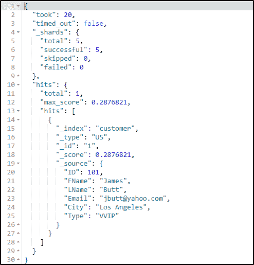

*   #### **利用聚合**

    聚合是一个帮助通过搜索查询聚合数据的框架。可以将小的聚合连接在一起，以构建所提供数据的复杂摘要。让我们执行一个简单的聚合来检查我们的索引中有多少类型的客户:

```
POST /customer/_search
{
 "size": 0, 
 "aggs" : {
 "Cust_Types" : {
 "terms" : { "field" : "Type.keyword" }
 }
 }
}
```

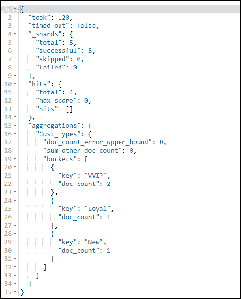

现在让我们看看如何从索引中检索一个数据集。

### **数据**

要检查索引中的文档列表，只需发送以下格式的 HTTP GET 请求: `**GET index/type/id **`

让我们尝试检索“id”等于 2 的客户的详细信息:

```
GET /customer/US/2
```

成功执行后，它将给出以下类型的结果。

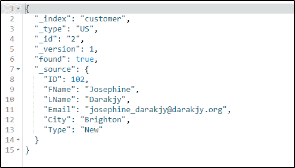

使用 Elasticsearch，您不仅可以浏览数据，还可以删除文档。

### **删除数据**

使用删除约定，您可以轻松地从索引中删除不需要的数据并释放内存空间。要删除任何文档，您需要发送以下格式的 HTTP 删除请求:`DELETE index/type/id.`

现在让我们试着删除一个 id 为 2 的客户的详细信息。

```
DELETE /customer/US/2
```

在执行这个查询时，您将得到以下类型的结果。

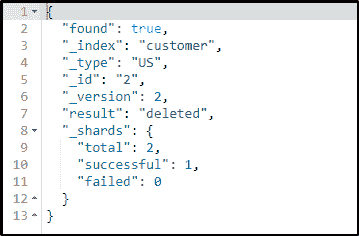 所以，使用 Elasticsearch 的 CRUD 操作的基础到此结束。了解这些基本操作将有助于您执行不同类型的搜索，并且您足够好地继续学习 ELK 教程。但是如果你想深入学习 Elasticsearch，可以参考我在 [Elasticsearch 教程](https://www.edureka.co/blog/elasticsearch-tutorial/)上的博客。

现在让我们从 ELK Stack 的下一个工具 Logstash 开始。

## **Logstash-****麋鹿栈教程**

正如我已经讨论过的，Logstash 是一个管道工具，通常用于收集和转发日志或事件。它是一个开源的数据收集引擎，可以动态地整合来自不同来源的数据，并将其标准化到指定的目的地。

Logstash 使用许多输入、过滤和输出插件，可以轻松转换各种事件。至少，Logstash 需要在其配置文件中指定一个输入和一个输出插件来执行转换。以下是 Logstash 配置文件的结构:

```
input {
 ...
}

filter {
 ...
}

output {
 ...
}
```

如你所见，整个配置文件被分成三个部分，每个部分包含一个或多个插件的配置选项。这三个部分是:

1.  输入
2.  过滤器
3.  输出

您也可以在配置文件中应用多个过滤器。在这种情况下，它们的应用顺序将与配置文件中规范的顺序相同。

现在让我们尝试配置 CSV 文件格式的美国客户数据集文件。

```
input{ 
          file{ 
          path => "E:/ELK/data/US_Customer_List.csv" 
          start_position => "beginning" 
          sincedb_path => "/dev/null" 
        }
}
filter{ 
     csv{ 
     separator => ","
     columns =>["Cust_ID","Cust_Fname","Cust_Lname","Cust_Email","Cust_City","Cust_Type"] 
     }
     mutate{convert => ["Cust_ID","integer"]}
}
output{ 
     elasticsearch{ 
     hosts => "localhost" 
     index => "customers" 
     document_type => "US_Based_Cust" 
     } 
     stdout{}
}
```

要将 CSV 文件数据插入 elasticsearch，您必须通知 Logstash 服务器。

对于以下步骤:

1.  打开命令提示符
2.  转到 Logstash 的 bin 目录
3.  类型:**log stash–****f X****:/foldername/config _ filename . config**然后回车。一旦你的 logstash 服务器启动并运行，它将开始把你的数据从文件传输到 Elasticsearch。

如果你想检查你的数据是否成功插入，进入 sense 插件，输入: `**GET /customers/**`

它会显示已创建的文档数量。

现在，如果你想可视化这些数据，你必须使用 ELK Stack 的最后一个工具，即 Kibana。因此，在 ELK Stack 教程的下一部分，我将讨论 Kibana 以及使用它来可视化数据的方法。

## **基巴纳-麋栈教程**

如前所述，Kibana 是一个开源的可视化和分析工具。它有助于可视化由 Logstash 传递并存储到 Elasticsearch 中的数据。您可以使用 Kibana 来搜索、查看和交互这些存储的数据，然后在各种图表、表格和地图中可视化这些数据。Kibana 基于浏览器的界面简化了大量的数据，并反映了弹性搜索查询中的实时变化。此外，您还可以轻松创建、定制、保存和共享您的仪表盘。

一旦你学会了如何使用 Elasticsearch 和 Logstash，学习 Kibana 就没什么大不了的了。在 ELK 教程博客的这一部分，我将向您介绍对数据执行分析所需的不同函数。

*   ### **管理页面**

    这是您必须执行 Kibana 运行时配置的地方。在这个页面中，您需要为您的搜索指定一些内容。参见下面的例子，在这个例子中，我已经为我的“客户”索引配置了条目。  在这里你可以看到，在‘索引模式’字段你需要指定你想要使用的索引。在“时间过滤器字段名称”中，确保选择它作为 **@timestamp。**然后，您可以点击 Create 来创建索引。如果您的索引创建成功，您将会看到以下类型的页面:   在这里您可以根据自己的要求从下拉列表中选择不同的过滤器。此外，为了释放内存，您还可以删除特定的索引。

*   ### **发现页面**

    通过 Discover 页面，您可以访问呈现每个索引的每个文档，这些索引与选定的索引模式相匹配。您可以轻松地交互和浏览 Kibana 服务器上的每一点数据。此外，您可以查看文档中的数据，并对其执行搜索查询。 下面你可以看到，我正在搜索来自“洛杉机”的“VIP”客户。  如你所见，我们只有一位来自洛杉矶的 VIP 客户。

*   ### **可视化页面**

    *可视化* 页面使您能够以图表、条形图、饼图等形式可视化您的弹性搜索指数中的数据。在这里，您甚至可以构建仪表板，显示基于 Elasticsearch 查询的相关可视化。通常，一系列弹性搜索聚合查询用于提取和处理数据。当您转到可视化页面并搜索您保存的可视化，或者您可以创建一个新的。

    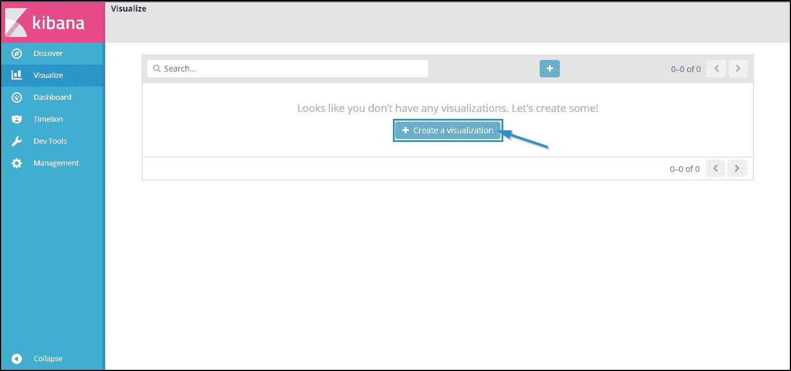

    您可以以任何形式汇总您的数据。为了方便用户，提供了不同类型的可视化选项。 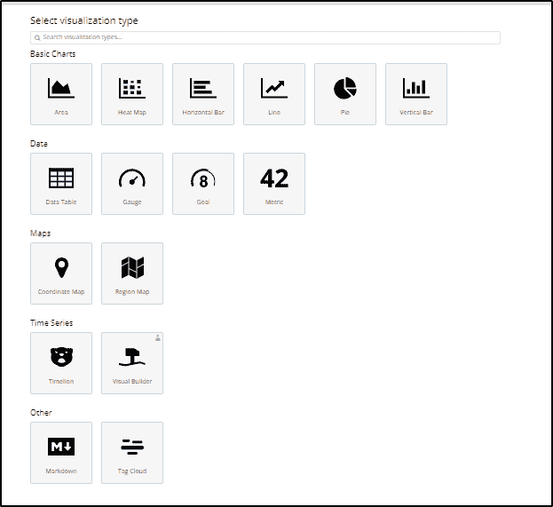 让我向您展示如何根据用户类型可视化美国客户数据。  要执行可视化，遵循以下步骤:

    1.  选择可视化类型。【这里我用的是馅饼】
    2.  在汇总字段中，从下拉列表中选择“期限”。
    3.  在“字段”中，选择您要执行搜索的字段类型。
    4.  您还可以指定可视化效果的顺序和大小。
    5.  现在点击执行按钮生成饼图。
*   ### **仪表盘页面**

    仪表板页面显示一组已保存的可视化效果。在这里，您可以添加新的可视化效果，也可以使用任何已保存的可视化效果。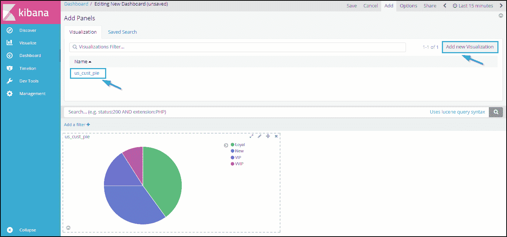

*   ### **Timelion 页面**

    Timelion 是一个时间序列数据可视化工具，它将完全独立的数据源整合到一个界面中。它由一行表达式语言驱动，用于检索时间序列数据、执行计算以简化复杂问题并可视化结果。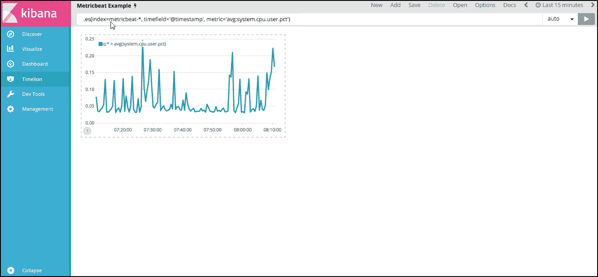

*   ### **开发工具页面**

    Kibana 的开发工具页面包含开发工具，如“Beta Sense”插件，用于与 Elasticsearch 中的数据进行交互。它通常被称为基巴纳的控制台。下面是一个例子，我使用 Kibana 的 sense 插件来搜索我的“客户”索引，类型为“美国客户”: 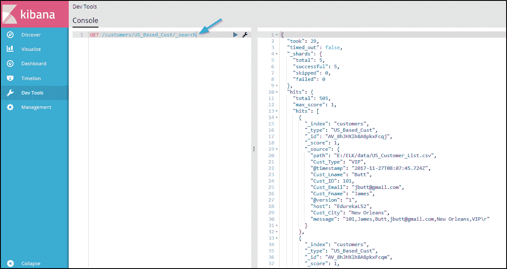

关于 ELK Stack 教程的博客到此结束。现在，您可以使用 Logstash、Elasticsearch 和 Kibana 对任何数据进行各种搜索和分析了。

*If you found this **ELK Stack Tutorial**** blog, relevant, **check out the [**ELK Stack Training**](https://www.edureka.co/elk-stack-training-sp)**by Edureka, a trusted online learning company with a network of more than 250,000 satisfied learners spread across the globe. The Edureka ELK Stack Training and Certification course help learners to run and operate their own search cluster using Elasticsearch, Logstash, and Kibana.*

<article class="maincontentblog">*Got a question for us? Please mention it in the comments section of this ELK Stack Tutorial blog and we will get back to you as soon as possible.*</article>