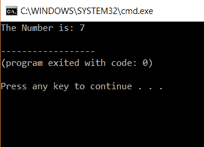

# 如何用 C++实现封装？

> 原文：<https://www.edureka.co/blog/encapsulation-in-cpp/>

C++是一种非常通用的编程语言，它具有各种面向对象编程的特性。在这篇文章中，我们将学习如何在 C++中实现封装。本文将涉及以下几点:

*   [c++中的封装](#EncapsulationInC++)
*   [什么是封装？](#WhatIsEncapsulation?)
*   [访问说明符](#AccessSpecifiers)
*   [封装类型](#TypesOfEncapsulation)
*   [样本程序](#SampleProgram)

让我们开始吧，

## **c++中的封装**

当所有的数据成员和成员函数被组合在一个叫做类的单元中时，这个过程叫做 ***封装*** 。换句话说，就是将数据和操作它们的函数包装在一起。

**例子**

在一个公司中，两个软件项目正在由两个不同的团队进行。一个团队需要另一个团队的数据。但是这个团队不能访问另一个团队的数据，因为他们没有适当的权限。这就是 ***封装*** 。

封装还会导致数据隐藏或抽象。

继续 C++文章中的封装，

## **访问说明符**

我们可以通过使用访问说明符来实现封装。它们让程序员控制哪些数据或功能对用户是可见的，哪些是保密的。有三种主要的访问说明符，

*   私人的
*   公共
*   保护

这些访问说明符中的每一个都用于实现封装。默认情况下，所有数据成员和成员函数都被编译器设为私有。

**私有访问说明符**

当数据成员或成员函数被设为私有时，它只能在类内部被访问，类外的任何人都不能访问。当它被类外的任何对象访问时，就会产生错误。

在继承过程中，不能在派生类中直接访问所有私有成员。

**公共访问说明符**

当数据成员或成员函数被公开时，每个人都可以访问它。甚至其他类也可以访问公共数据成员或成员函数

**受保护的访问说明符**

受保护的访问说明符是一种特殊的访问说明符。当数据成员或成员函数被设为 *protected* 时，它以类似于 private 的方式工作，并且它可以被该类的成员访问。也可以从该类的任何子类中访问它。

继续 C++文章中的封装，

## **封装类型**

有三种封装类型:

**成员变量封装**

在这种类型的封装中，所有的数据成员都被声明为私有。

**功能封装**

在这种类型的封装中，一些成员函数被声明为私有的。构造函数是公共的。

**类封装**

在这种类型的封装中，所有的类都被声明为私有。这主要是在嵌套类中完成的。

继续这篇 C++封装的文章，我们将看到一个封装演示。

## **样本程序**

```
#include<iostream>
using namespace std;
class test
{
private:
int x;
public:
test(int a)
{
x =a;
}
int get()
{
return x;
}
};
int main()
{
test a(7);
cout<<"The Number is: "<<a.get();
return 0;
}

```

**输出**



**解释**

在上面的程序中，我们展示了封装的概念。我们有一个私有成员 x，它不能从 main 函数中访问。访问它的唯一方法是创建一个类 test 的对象。

有一个参数化的构造函数，它将我们从 main 得到的值赋给 x。我们有一个 get 方法，它返回 x 的值。在 main 函数中，我们创建一个 test 类的对象并赋一个参数。此时参数化构造函数被调用，它将参数值赋给 x。

我们有一个 cout 语句，它调用 get 函数并显示数字。

这是封装的基本概念。

至此，我们结束了这篇关于“C++中的封装”的博客。我希望你发现这是有益的，请继续关注更多类似主题的教程。您也可以查看我们的培训计划 t 以深入了解 jQuery 及其各种应用程序，您可以 [**在此**](https://www.edureka.co/masters-program/full-stack-developer-training) 注册在线实时培训，24/7 全天候支持，终身访问。

有问题要问我们吗？在这篇文章的评论部分提到它们，我们会给你回复。