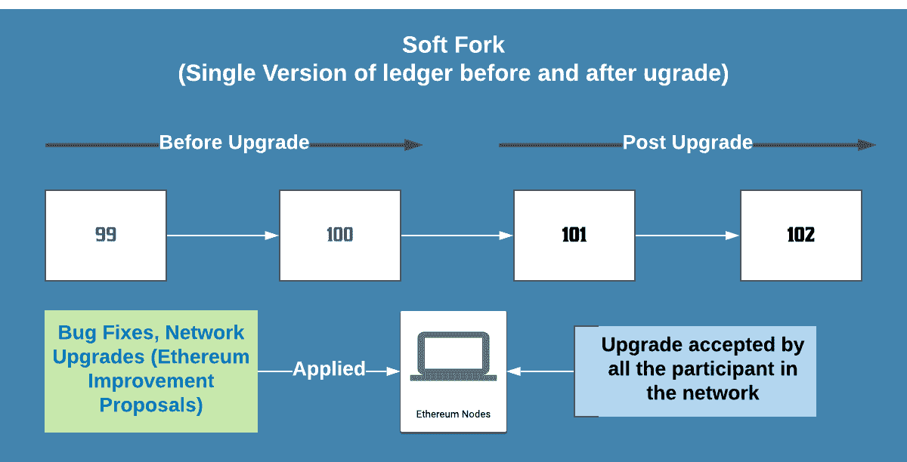
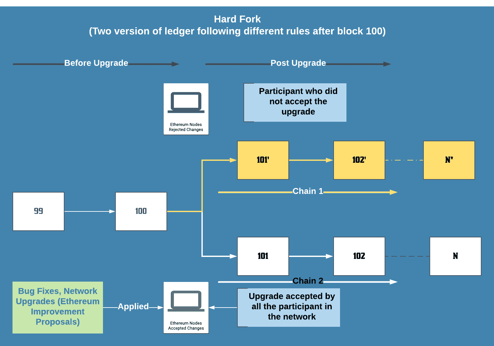
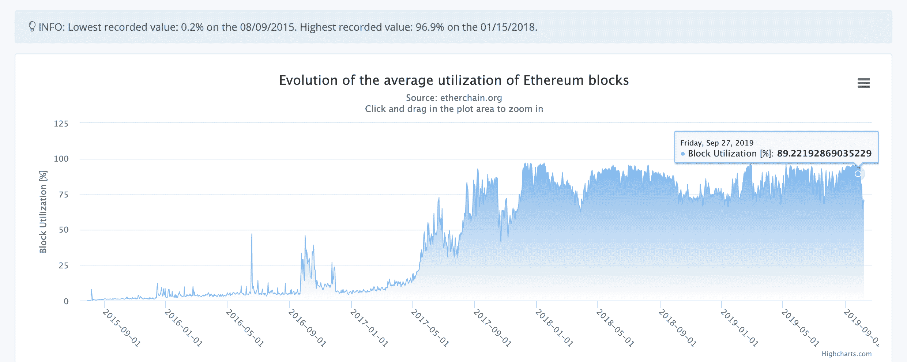
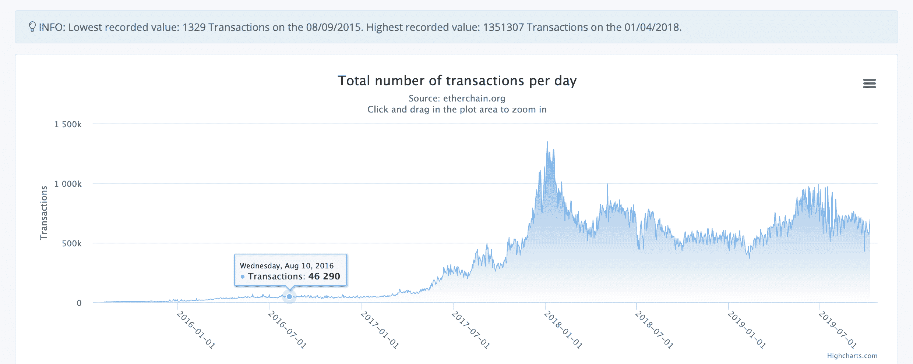

# 以太坊升级:关于以太坊的伊斯坦布尔，你需要知道的一切

> 原文：<https://www.edureka.co/blog/ethereum-istanbul-upgrades/>

*Change is inevitable*

**这一直是基石声明，并且在软件世界中更加明显。还没有一个系统，没有经历过 bug 修复和升级的进化周期。对于一个集中式系统来说，推出一个改变或者一个新特性是很容易的，因为我们知道我们需要更新的服务器和系统。随着系统规模的增长，推出新的升级软件的挑战变得更加复杂。这就引出了我们今天讨论的话题。像[以太坊](https://www.edureka.co/blog/ethereum-tutorial-with-smart-contracts/)这样的去中心化系统是如何更新的？**

## **我们今天要做什么？**

***   理解以太世界中“分叉”的含义。*   以太坊升级简史。*   升级的机制和细微差别。**

## ****外卖会是什么？****

***   了解升级的工作方式和过程。*   升级的影响。**

**这些是我们将要在这个博客中讨论的话题:**

***   [什么是叉子？](#what-is-a-fork)*   为什么它们被称为“叉子”而不仅仅是“以太坊升级版”？
    *   [软分叉(网络升级)](#soft-fork)
    *   [硬叉](#hard-fork)
    *   什么是 EIP？
    *   [EIP 类型](#EIP-types)
    *   [以太坊升级周期](#ethereum-upgrades-cycle)
    *   [以太坊升级历史](#upgrade-history)
    *   [驱动因素](#driving-factors)
    *   [伊斯坦布尔以太坊升级](#ethereum-istanbul-upgrade)**

## ****什么是叉子？****

***   本质上，对以太坊网络的规则和协议所做的任何改变都被称为分叉。*   简而言之，这些是应用于分布式网络的错误修复和更新(主要/次要)。*   从本质上来说，这些都是网络更新，改变了网络工作原理。**

## **为什么它们被称为“分叉”，而不仅仅是“网络升级”？**

**这些网络升级或协议变更是在一个[分散的](https://www.edureka.co/blog/blockchain-security/)网络上进行的，这导致了一些独特的挑战。让我们看看它们。**

### ****软分叉(网络升级)****

***   在一个简单的场景中，如果提议的所有更改或升级都是向后兼容的，并且支持新旧规则。*   在上面提到的场景中，所有的参与者都同意变更并升级软件。*   这就是我们所说的软分叉，向后兼容，所有参与者都同意，并且只有一个版本的软件在所有参与者上运行。*   软分叉更多的是一个误导性的术语，这更多的是一个网络升级，我们最终只有一个版本的软件。*   由于这是一个分散的系统，所以所有参与者达成的共识对网络的未来状态起着重要作用。**

### ****硬叉****

***   在这种情况下，对网络提出的更改或升级并没有得到网络中所有参与者的同意。*   请记住，提议的更改和升级不是向后兼容的。*   如果让我们说 x%的参与者同意改变，他们继续升级他们的软件。*   现在，我们得到的是软件的两个独立版本。*   第一，x%的参与者已经升级以包含新的变化。*   第二，其中(100-x)%的参与者没有升级。*   在这种情况下，这两个组将具有相同版本的分类帐，直到 x%接受升级，假设该点是块号 100。*   直到块号 100，所有的参与者将有相同版本的分类账，或者简单地说，在他们的区块链中有相同的数据。*   发布区块编号 100，x%的参与者将拥有自己的分类帐副本，该副本将遵循每次升级的新规则，而(100-x)%的参与者将拥有一个单独的副本，该副本仍遵循旧规则。*   总之，这种类型的升级被称为分叉。因为这会导致一个区块链分裂成两个独立的版本。*   比如硬叉*(道 Hack Block# 1920000)* ，由此产生了两个版本*以太坊*和*以太坊经典*。**

### **什么是 EIP？**

**EIP 是以太坊(EIPs)的缩写。以太坊协议、网络的任何变更或更新，或任何必须以 EIP 形式建立的变更。一个 EIP 包括**

***   EIP 将要解决的问题。*   定义新功能或变更的技术规范。*   设计和设计决策背后的基本原理。*   如果这种变化带来任何不相容性，应清楚地列出。**

### ****EIP 类型****

**下面列出了 EIP 的分类。**

***   **标准轨道**:影响大部分或全部以太坊实现。例如网络协议的改变、块或交易有效性规则的改变。*   **[核心](https://eips.ethereum.org/core)** :可能与*核心*开发讨论相关的变更。例如，挖掘器/节点策略变化*   **[组网](https://eips.ethereum.org/networking)** :对 whisper 和 swarm 的网络协议规范的改进。例如通过 DNS 的节点发现*   **[接口](https://eips.ethereum.org/interface)** : API/RPC 标准和规范变更。例如，为 JSON-RPC 创建“eth_chainId”方法*   :应用层面的标准和规范。例如令牌标准、库和包格式。*   **[【Meta】](https://eips.ethereum.org/meta)**:流程规范和流程变更。例如程序、指南、决策过程的变更以及以太坊开发中使用的工具或环境的变更。 *EIP 233《硬叉子的正式流程》**   :以太坊社区的设计问题和通用指南。例如*EIP 1470–智能合同缺陷分类(SWC)。***

### ****以太坊升级周期****

**最近，以太坊社区已经成熟，以太坊的升级也已经计划好了。**

***   早期的分叉或升级时间由引入的 EIP 决定，升级周期没有计划。*   现在，分叉和升级已经计划好了，并且随着 EIP 的成熟，还会添加 EIP。这更符合传统的软件升级和发布。**

### ****以太坊升级历史****

****

| 升级号 | 批号 | 日期 | 名字 |
| Zero | one | 2015-07-30 | 边界 |
| one | Two hundred thousand | 2015-09-07 | 边境解冻 |
| Two | One million one hundred and fifty thousand | 2016-04-14 | 农场 |
| 3(硬叉) | One million nine hundred and twenty thousand | 2016-07-20 | 刀叉 |
| four | Two million four hundred and sixty-three thousand | 2016-10-18 | 橘子哨子 |
| five | Two million six hundred and seventy-five thousand | 2016-11-22 | 伪龙 |
| six | Four million three hundred and seventy thousand | 2017-10-16 | 拜占庭 |
| seven | Seven million two hundred and eighty thousand | 2019-02-28 | 君士坦丁堡 |
| eight | TBD | 2019 年底 | 伊斯坦布尔 |

### ****驱动因素****

**以太坊升级背后的两个驱动因素是**

***   共识性能提升，证明工作一点效率都没有。以太坊整个路线图就是从 PoW(工作证明)走向 PoS(利益证明)。*   可伸缩性，如后面所讨论的，以太坊网络要大规模采用就必须进行伸缩。在过去几年中，以太坊的主要关注领域是提高可伸缩性。**

### ****伊斯坦布尔以太坊升级****

***The biggest problem which has been plaguing the Ethereum network has been scalability. The Ethereum network is running at full capacity.***

*****   以太坊块的平均利用率约为 90%。简单地说，如果这是一台计算机，这意味着我们使用了其 90%的容量。 *   我们目前平均每天进行 70 万笔以太坊交易。 ****

*****来源:[https://www.etherchain.org/charts](https://www.etherchain.org/charts)*****

****为了扩大以太坊的规模并迎合大众的接受，建议对网络进行升级和更改。伊斯坦布尔，期待已久的升级，预计将于今年年底完成，这是朝着 2020 年目标的最终 *PoS(利益证明)* Serenity 迈出的一步。*【伊斯坦堡】*网络升级将分两个阶段完成****

*****   **第一阶段(2019 年底)**:包含以下 EIP(以太坊改善提案)152、1108、1344、1884、2028、2200。这些 EIP 旨在实现以下目标。
    *   降低和优化天然气成本。
    *   使以太坊和 Zcash 能够互操作
    *   为应用可伸缩性更改奠定基础。*   **第二阶段(2020 年初)**:挖掘算法改变，EIP 1057 将把挖掘算法从 PoW(工作证明)改为 ProgPoW(工作程序化证明)。
    *   首先，这减少了 ASIC(专用集成电路)卡在采矿中的不适当的优势
    *   其次，减少开采的集中化。在加密采矿中。****

****最后，升级一个分散的系统带来了它自己的挑战和细微差别。今天，我们了解了以太坊的升级过程。我们也观察了以太坊升级过程变得成熟的方式。了解升级背后的更大目标和关键驱动因素，有助于我们了解以太坊的发展方向。伊斯坦布尔的升级正在 TestNet [Rinkeby](https://www.rinkeby.io/#explorer) 中进行测试，根据我写这篇博客时的信息，将会在今年年底推向 MainNet。敬请关注更多内容。****

****如果您希望学习区块链并在区块链技术方面建立职业生涯，那么请查看我们的 *[**区块链** **认证**](https://www.edureka.co/blockchain-training)* 计划，该计划带有讲师指导的现场培训和真实项目经验。该培训将帮助您深入了解区块链，并帮助您掌握该主题。****

*****有问题吗？请在* *评论栏中提及，我们会尽快回复您。*****