# Excel 图表:使用 MS Excel 的高级数据可视化

> 原文：<https://www.edureka.co/blog/excel-charts-advanced-data-visualization/>

在我的 [***以前的博客***](https://www.edureka.co/blog/data-visualization-using-excel/)***中对使用 MS Excel 的数据可视化技巧*** 进行了探讨。这些局限于单一属性中数据的可视化。在本系列的这一期中，我们将更多地讨论数据可视化的高级方面—***Excel 图表*** 。 然而在很多现实场景中，数据可视化需要对多个属性进行分析，这是任何 [***MS Excel 培训项目***](https://www.edureka.co/excel-vba-training-course) 必不可少的一部分。

假设一家冰淇淋公司想要分析其各种冰淇淋的销售收入。如此详细的分析，你将不得不分析各种参数对冰淇淋销售的影响。例如，温度如何影响销售？有些地方比其他地方更适合卖冰淇淋吗？ 通过分发更多的小册子，销售会增加吗？

所以为了回答这样的问题，你得分析多个属性之间的关系。在这篇博客中，我们将讨论这一点。

下面是我们将在博客中讨论的 Excel 图表。

*   [**折线图**](#linechart)
*   [**柱状图**](#columnchart)
*   [**直方图**](#histogram)
*   [**散点图**](#scatterplot)

## **折线图**

折线图非常有助于在均匀刻度轴上描绘连续数据。 这些 Excel 图表是以相等的时间间隔显示数据趋势的好选择，比如几天、几个月或几年。

让我们从分析收入如何随时间变化开始。

*   选择要绘制在折线图中的两列的值(例如和 ***总收入*** )。选择数值后，点击 ***插入*** 菜单然后点击第二个图标中的 ***图表*** 选项。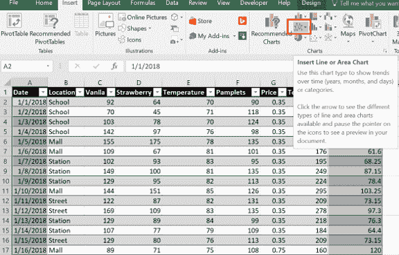

*   点击图标，折线图会出现各种选项。对于这个例子，点击二维线段下的第一个选项，就会出现 下的 图。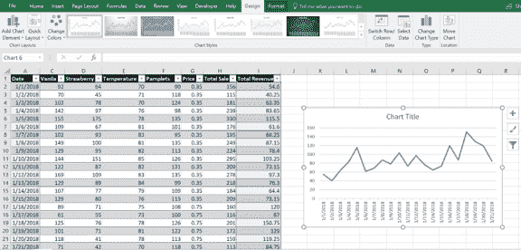

*   这张图表显示了收入如何随着时间的推移而增加或者 减少 。 然而，这个图表并不是那么容易读懂的。因此，让我们试着让它看起来更直观，信息量更大。

*   在 截图上面的 ，下面的 ***设计*** 部分， 选择想要的设计风格。

*   双击文本框，其中显示 ***图表标题***，并将其重命名为 ***收入 vs 时间。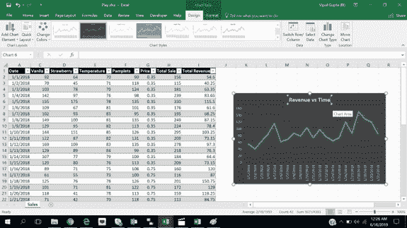*** 

*   再次点击图表，然后点击图表右上角的加号(+)。它将打开多个选项。点击选项 ***轴标题*** 和 ***图例*** *。* 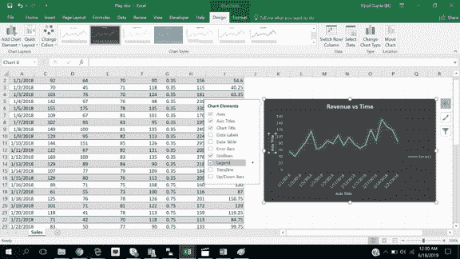

*   为了更好地说明，请将图表拖到页面中间。现在，注意图表上有两个文本框，一个在 X 轴上，一个在 Y 轴上。两者内容相同 ***轴标题*** 。

*   点击每个文本框，根据数据重命名每个轴。 选择 一个合适的字体，然后图表看起来 如下图 。 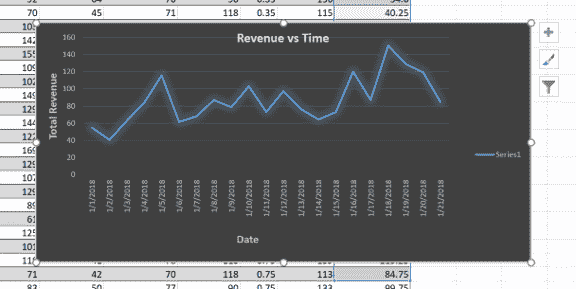

*   现在，这个传说需要被修正。在 上方的 快照中，图例标注为 系列 1，其中 明显有误。

*   右击图表，点击 ***选择数据*** *。* 它将打开一个新窗口，如下图所示。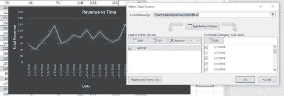

*   在上面的快照中，你可以看到文本 ***系列 1*** 。这才是需要纠正的。点击 ***编辑*** 并在 ***系列名称*** 中输入 ***收入*** 并按 ***确定*** 。

*   从上面的快照可以看出，总收入随着时间的推移在波动。为了更好地理解这一点，您必须分析影响收入的其他参数。

我们来试着了解一下收益和温度之间有没有关联。为了分析这个，我们在同一个图表里再加一个属性: **温度** 。

*   点击菜单栏上的图标然后点击 ***选择数据*** 选项(在菜单栏的右侧)。将会打开以下窗口。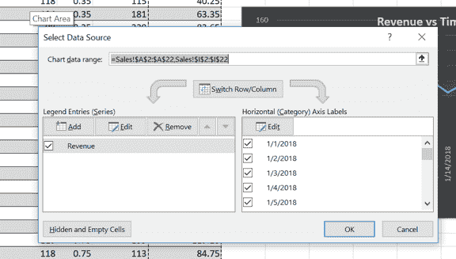

*   点击添加 按钮。一个名为***编辑系列***的新窗口将被打开。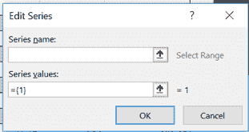

*   在 ***系列名称*** ，输入 ***温度*** ，并在 ***系列数值*** 中，选择温度列中的所有数值。按下 ***确定*** 后，现在收益和温度都出现在图表上。 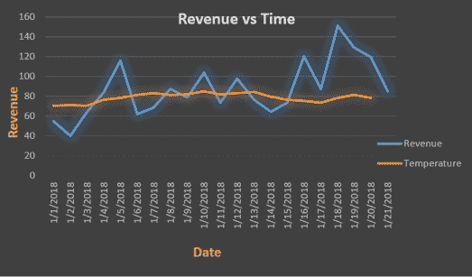

## **柱形图**

柱形图用于直观地比较多个类别的数值。

*   让我们试着比较一下各种口味冰淇淋的销售情况，以了解哪种更受欢迎。

*   选择要绘制在柱形图中的列的值(例如 ***日期、香草、草莓*** )。选择数值后，点击 ***插入*** 菜单，然后点击 ***图表中的第一个图标*** 选项。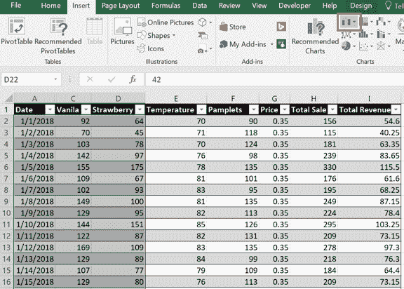

*   点击图标后，柱形图会出现各种选项。在这个例子中，点击二维柱状图下的第一个选项，就会出现 下的 图。

*   使用与折线图相同的步骤选择所需的设计，重命名图表并重命名图例。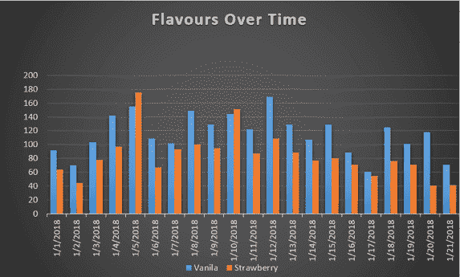

*   如 上图 所示，香草冰淇淋的销售额几乎总是高于草莓冰淇淋的销售额。

让我们来探索这个图表的另一个有用的变体， ***堆积柱*** 。

*   点击菜单栏上的图标然后点击 ***改变图表类型*** *。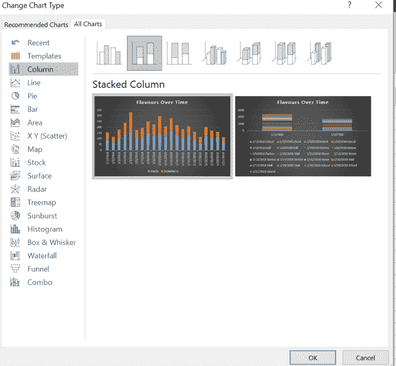* 

*   选择 ***的选项，堆叠列*** 。

*   按下 ***OK*** 后，图表看起来像下面的快照。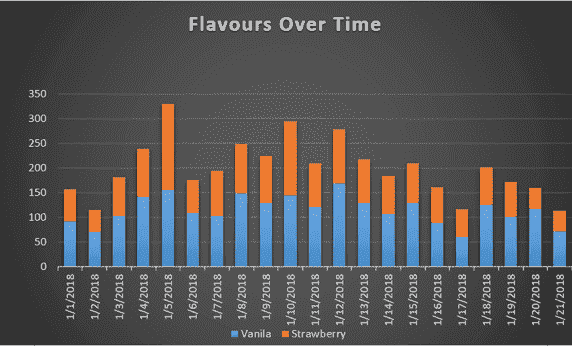

*   此图表有多种变体。例如，在第一步中，如果选择了 3D 图表，而不是选择 2D 图表，那么图表 将看起来像 下面的快照。 

## **直方图**

直方图是显示数据分布中频率的 Excel 图表。数据的分布被分组到频率仓中，频率仓可以被改变以更好地分析数据。

*   我们来试着分析一下小册子的分布。

*   选择要绘制在柱状图中的列的值(例如，】)。选择数值后，点击 ***插入*** 菜单，然后点击中间图标中的 ***图表*** 选项。

*   点击第一个图表下的 ***直方图*** 并按 ***确定。*** 会出现下图。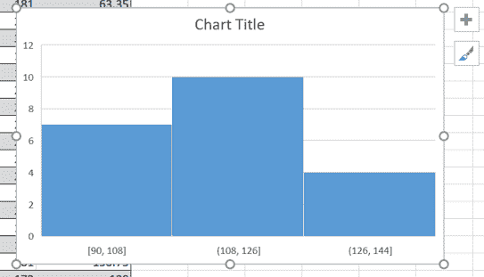

*   此图表将小册子栏的值分为 3 类(箱):90-108、108-126 和 126-144。从直方图可以明显看出，第三个箱子中的小册子数量比前两个箱子中的小册子数量少。

*   应用前面步骤中讨论的相同技术选择所需的设计并重命名图表。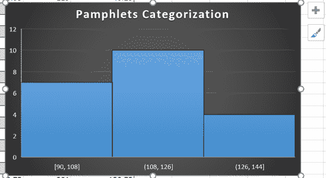

*   为了更仔细地查看这些数据，让我们尝试增加容器的数量。右击 X 轴，点击 ***格式化轴*** 选项。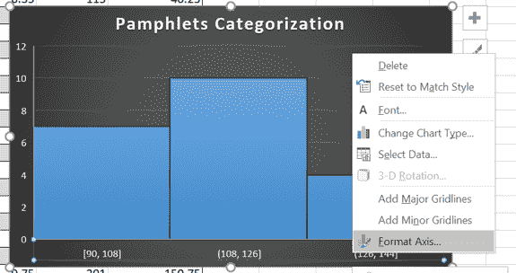

*   右边会打开一个新窗口，命名为 ***格式轴*** *。* 在此窗口中，将 ***箱数*** 选项改为 10。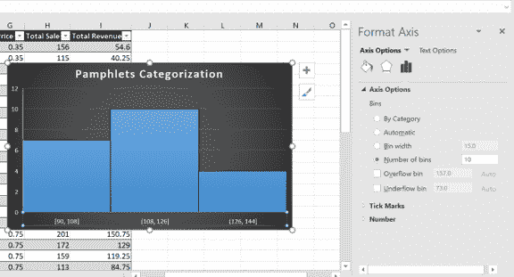

*   选择箱数为 10 后，关闭窗口。直方图现在将发生变化，如下图所示。 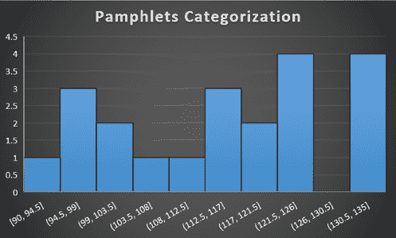

*   这张直方图现在显示了小册子更详细的分类。例如，可以得出 126–130.5 范围内的小册子从未发行的结论。

## **散点图**

散点图有两个数值轴:水平轴(X)和垂直轴(Y)。它将 x 和 y 值组合成单个数据点，并以不规则的间隔或聚类显示它们。

让我们试着分析一下总销售额和分发的小册子数量是否有关系。

*   选择散点图中要绘制的列值(例如 ***小册子、总销售额*** )。选择数值后，点击 ***插入*** 菜单然后点击 ***散点图*** 图标中的 ***图表*** 选项。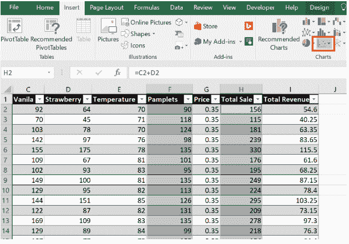

*   点击第一张图表下的，按 ***确定*** 。将出现下图。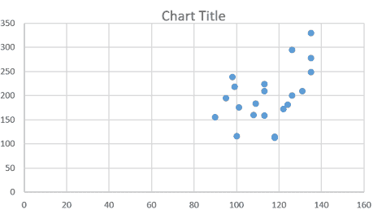

*   应用与前面 步骤中讨论的 相同的技术选择所需的设计并重命名图表。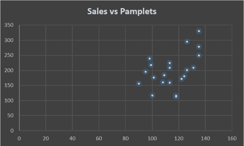

*   正如你从下面的快照中所看到的，随着小册子分发数量的增加，冰淇淋的销量也在增加。

正如在这篇博客中所展示的，MS Excel 拥有各种强大且易于使用的可视化工具，比如我们上面讨论过的各种 Excel 图表。这些工具有助于发现各种数据元素之间的相关性，并在数据中导出有用的模式。

每个可视化工具都有多种变体和大量选项，我想鼓励您探索所有选项，以便下次当您获得数据集进行分析时，您将有足够的弹药来攻击数据。

***微软 Excel** 是一款简单却功能强大的软件应用。Edureka 的 **[高级 Excel 培训](https://www.edureka.co/excel-vba-training-course)计划帮助**您学习定量分析，使用 MS Excel 的直观界面进行数据操作的统计分析。MS Excel 的使用及其图表跨越不同的领域和专业要求，因此，没有比现在更好的时间开始您的旅程！*