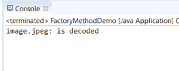

# 如何在 Java 中实现工厂方法

> 原文：<https://www.edureka.co/blog/factory-method-in-java/>

类和对象是 Java 的主要部分，这使得它成为主要的编程语言之一。在本文中，我们将按以下顺序讨论什么是 Java 中的工厂方法:

*   [Java 中的工厂方法是什么？](#what)
*   [工厂法的优点和用途](#advantages)
*   Java 中的工厂方法:代码

**Java 中的工厂方法是什么？**

***工厂模式*** 或***Java 中的工厂方法*** 表示子类负责创建一个类的对象。换句话说，*工厂方法模式*是一种创建模式，用于使用工厂方法创建对象，而不必指定所创建对象的确切类。工厂方法也被称为**虚拟构造函数**。


在工厂方法中，我们创建对象而不向客户端公开创建逻辑。客户端使用相同的公共接口来创建新类型的对象。

## **工厂方法的优点**

*   要创建的对象类型由子类选择。工厂方法允许这样做。

*   通过消除在代码中绑定特定于应用程序的类的需要，它促进了*松散耦合*。

## **工厂方法的使用**

*   当类不知道需要什么子类时，就使用它们。

*   当一个类希望子类指定需要创建的对象时，就使用它们。

*   父类选择子类的对象的创建，我们使用工厂方法。

## **什么时候使用工厂法？**

工厂方法模式在类之间引入了松散耦合，这是最重要的原则之一，应该在设计架构时应用。通过在程序体系结构中引入松散耦合，我们的体系结构可以变得更加灵活和不那么脆弱。

## **下面是一个示例代码**

```
interface ImageReader {
    DecodedImage getDecodeImage();
}

class DecodedImage {

    private String image;
    public DecodedImage(String image) {
        this.image = image;
    }

    @Override
    public String toString() {
        return image + ": is decoded";
    }
}

class GifReader implements ImageReader {
    private DecodedImage decodedImage;
    public GifReader(String image) {
        this.decodedImage = new DecodedImage(image);
    }

    @Override
    public DecodedImage getDecodeImage() {
        return decodedImage;
    }
}

class JpegReader implements ImageReader {
    private DecodedImage decodedImage;

    public JpegReader(String image) {
        decodedImage = new DecodedImage(image);
    }

    @Override
    public DecodedImage getDecodeImage() {
        return decodedImage;
    }
}

public class FactoryMethodDemo {
    public static void main(String[] args) {
        DecodedImage decodedImage;
        ImageReader reader = null;
        String image = "image.jpeg";
        String format = image.substring(image.indexOf('.') + 1, (image.length()));
        if (format.equals("gif")) {
            reader = new GifReader(image);
        }

        if (format.equals("jpeg")) {
            reader = new JpegReader(image);
        }

        assert reader != null;
        decodedImage = reader.getDecodeImage();
        System.out.println(decodedImage);

    }
}
```

**输出:**

## 

**代码说明**

这段代码演示了如何设置工厂方法。创建了多个类，每个类执行解码图像的特定任务。我们有一个名为 FactoryMethodDemo 的驱动类。

我们传递一个扩展为。jpeg 或者。gif 等。基于图像的扩展，为 jpeg 阅读器或 gif 阅读器创建一个类对象，并相应地执行。

至此，我们结束了 Java 文章中的工厂方法。我希望你对这些方法有所了解。

*查看 Edureka 提供的  [**Java 培训**](https://www.edureka.co/java-j2ee-soa-training)* *，edu reka 是一家值得信赖的在线学习公司，在全球拥有超过 250，000 名满意的学习者。Edureka 的 Java J2EE 和 SOA 培训和认证课程是为想成为 Java 开发人员的学生和专业人士设计的。*