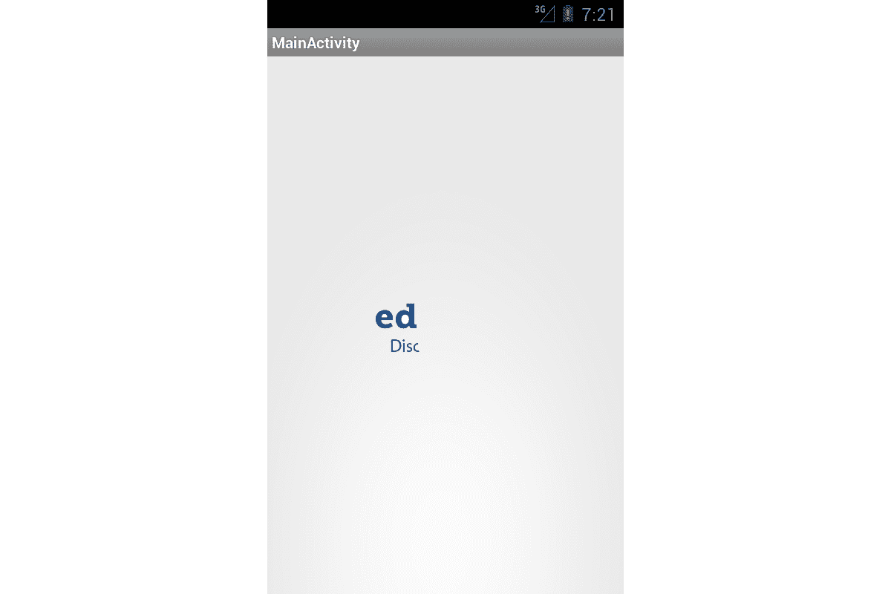
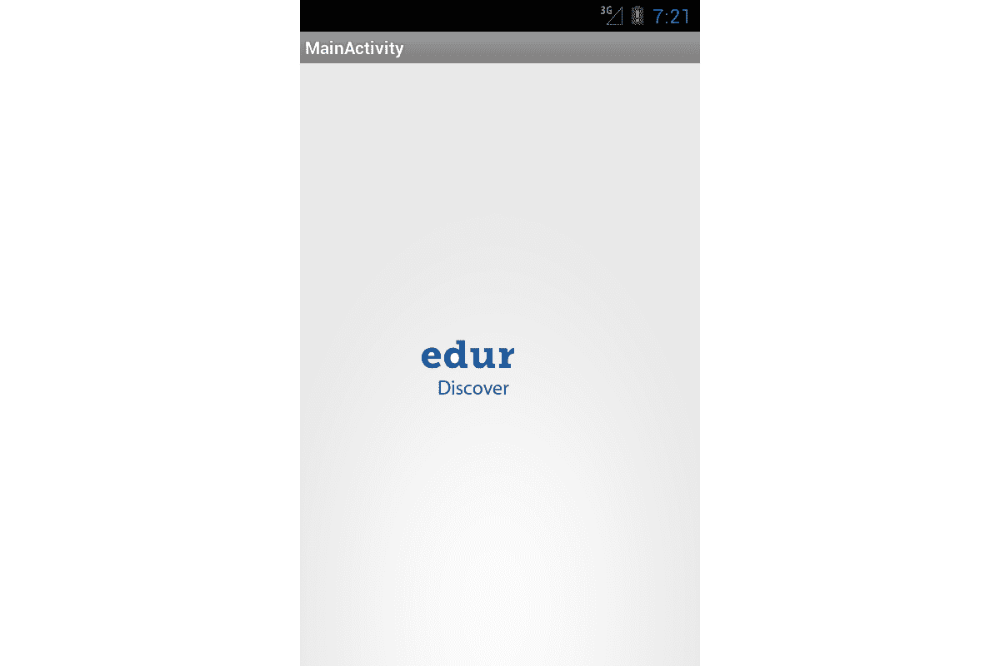

# Android 中的帧动画

> 原文：<https://www.edureka.co/blog/frame-animation-in-android/>

有人说，动画是活着的状态。给你错觉的东西。在移动应用程序开发中，这也有其自身的重要性。在这篇博客中，我们将介绍如何在 android 中使用帧动画和错觉艺术。

在 Android 帧动画中，你将会重复地交换帧，这样它在人眼看来是连续的，我们感觉它是动画。帧被称为图像。因此，要在 android 中实现逐帧动画，需要有一组描述运动的图像。

现在让我们继续，看看如何使用帧动画来实现它

**第一步——创建一个可绘制文件夹**

在其中创建一个 animation_list.xml 文件。 **它包括:** 具有帧图像地址的项目列表。

```
<?xml version="1.0" encoding="utf-8"?>
<animation-list xmlns:android="http://schemas.android.com/apk/res/android" android:oneshot="false">
<item android:drawable="@drawable/blank" android:duration="210" />
<item android:drawable="@drawable/logo" android:duration="210" />
<item android:drawable="@drawable/logo1" android:duration="210" />
<item android:drawable="@drawable/logo2" android:duration="210" />
<item android:drawable="@drawable/logo3" android:duration="210" />
<item android:drawable="@drawable/logo4" android:duration="210" />
<item android:drawable="@drawable/logo5" android:duration="210" />
<item android:drawable="@drawable/logo6" android:duration="210" />
<item android:drawable="@drawable/logofinal" android:duration="210" />
</animation-list>

```

**第二步:创建一个 activity_main.xml 文件** 它包括:一个图像视图

```

{/code]

<span style="font-size: 13px; text-align: center;">Here we are done with the xml part, see the image below for reference :-</span>
<p style="text-align: center;"><a href="https://www.edureka.co/blog/frame-animation-in-android/" target="_blank"></a></p>
<strong>&nbsp;</strong>
<h2><span style="font-size: large;"><strong>Step 3- Outside the onCreate method :</strong></span></h2>
<strong></strong>Declare the Image View and Animation Drawable

// Declaring an Image View and an Animation Drawable
ImageView view;
AnimationDrawable frameAnimation;

```

## **步骤 OnCreate 方法内部:**

*   对图像视图进行类型转换
*   可绘制的动画类型
*   在图像视图上设置可绘制背景

```
// Typecasting the Image View
view = (ImageView) findViewById(R.id.imageAnimation);

// Setting animation_list.xml as the background of the image view
view.setBackgroundResource(R.drawable.animation_list);

// Typecasting the Animation Drawable
frameAnimation = (AnimationDrawable) view.getBackground();

```

## **步骤 onCreate 方法后:**

动画应该只在焦点对准时运行，也就是对用户可见的时候。因此在 onCreate 方法之后定义这个方法。

```
// Called when Activity becomes visible or invisible to the user
@Override
public void onWindowFocusChanged(boolean hasFocus) {
    super.onWindowFocusChanged(hasFocus);
      if (hasFocus) {
	// Starting the animation when in Focus
	frameAnimation.start();
	} else {
        // Stoping the animation when not in Focus
	frameAnimation.stop();
      }
}

```

所以最后的结果会是这样:-   

[dl URL = " # " class = ' e model e model-20 ' title = "下载代码" desc = " " type = " " align = " " for = " Download "]

敬请关注更多教程，学习如何创建 Android 小工具！快乐学习！

有问题要问我们吗？请在评论区提到它，我们会给你回复。

**相关帖子:**

[开始你的 Android 开发培训](https://www.edureka.co/android-development-certification-course?.0-Lollipop)