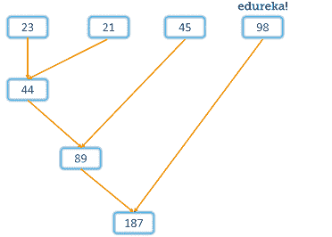

# Python 中的映射、过滤和归约函数:您需要知道的一切

> 原文：<https://www.edureka.co/blog/function-map-filter-reduce/>

Python 提供了许多预定义的内置函数，最终用户只需调用它们就可以使用。这些功能不仅减轻了程序员的工作，还创建了一个标准的编码环境。在本文中，您将了解到三个令人印象深刻的函数，即 [Python](https://www.edureka.co/blog/python-tutorial/) 中的 map()、filter 和 reduce()。

在继续之前，让我们看一下内容:

*   [Python 中的 map、filter、reduce 函数是什么？](#introduction)
*   [在:](#functions)中使用用户定义函数和 lambda 函数
    *   [map()函数](#map)
    *   [filter()函数](#filter)
    *   [reduce()函数](#reduce)
*   [同时使用 map()、filter()和 reduce()函数](#usingtogether)
    *   [在地图()内过滤()](#filterinmap)
    *   [在过滤器()内映射()](#mapinfilter)
    *   [贴图()和滤镜()用](#filtermapinreduce)中的[减少()](#filtermapinreduce)

那么让我们开始吧。:)

## **Python 中的 map()、filter()和 reduce()函数是什么？**

如前所述，map()、filter()和 reduce()是 Python 内置的[函数](https://www.edureka.co/blog/python-functions)。这些函数启用了 [Python](https://www.edureka.co/blog/python-programming-language) 的函数式编程方面。在函数式编程中，传递的参数是决定输出的唯一因素。这些函数可以将任何其他函数作为参数，也可以作为参数提供给其他函数。现在让我们更深入地了解一下这些功能。

## **map()函数:**

map()函数是一种高阶函数。如前所述，这个函数将另一个函数作为参数以及一系列可迭代对象，并在将该函数应用于序列中的每个可迭代对象后返回一个输出。其语法如下:

**语法:**

*映射(函数，iterables)*

这里，该函数定义了一个表达式，该表达式反过来应用于 iterables。map 函数可以将用户定义的函数以及λ函数作为参数。

## **在:**中使用用户定义函数和 Lambda 函数

### **map()内的用户自定义函数:**

map()函数可以将用户定义的函数作为参数。这些功能的参数由用户或程序员专门设置。例如:

**举例:**

```
def newfunc(a):
    return a*a
x = map(newfunc, (1,2,3,4))  #x is the map object
print(x)
print(set(x))
```

**输出:**

<map object="" at=""></map>

{16, 1, 4, 9}

如你所见，x 是一个地图对象。下一部分输出显示了以 newfunc()为参数的 map 函数，然后它将 a*a 应用于所有的 iterables。因此，所有 iterables 的值都将自身相乘并返回。

**注意:**输出没有按照 iterables 的值的顺序，因为我使用了 set()函数。还可以使用 list()或 tuple()函数，例如:

**举例:**

```
def newfunc(a):
    return a*a
x = map(newfunc, (1,2,3,4))  #x is the map object
print(x)
print(list(x))
```

**输出:**

<map object="" at=""></map>

[1, 4, 9, 16]

您也可以传递多个参数列表。例如:

**举例:**

```
def func(a, b):
    return a + b

a = map(func, [2, 4, 5], [1,2,3])
print(a)
print(tuple(a))
```

**输出:**

<map object="" at=""></map>

(3, 6, 8)

现在让我们看看如何在 map()函数中使用 [lambda 函数](https://www.edureka.co/blog/python-lambda/)。

### **map()内的 Lambda 函数:**

Lambda 函数是没有任何名称的函数。这些函数通常作为参数提供给其他函数。现在让我们尝试在 map()函数中嵌入 lambda 函数。考虑下面的例子:

**例如:**

```
tup= (5, 7, 22, 97, 54, 62, 77, 23, 73, 61)
newtuple = tuple(map(lambda x: x+3 , tup)) 
print(newtuple)
```

**输出:**

(8, 10, 25, 100, 57, 65, 80, 26, 76, 64)

上面的输出是将 lambda 表达式(x+3)应用于元组中的每个项目的结果。

## **filter()函数:**

filter()函数用于创建一个输出列表，其中包含该函数返回 true 的值。它的语法如下:

**语法:**

*过滤器(函数，iterables)*

就像 map()一样，这个函数也可以使用用户定义的函数以及 lambda 函数作为参数。

**举例:**

```
def func(x):
    if x>=3:
        return x
y = filter(func, (1,2,3,4))  
print(y)
print(list(y))
```

**输出:**

[3, 4]

如您所见，y 是过滤器对象，列表是符合条件(x>=3)的值列表。

### **在过滤器中使用 lambda():**

用作参数的 lambda 函数实际上定义了要检查的条件。例如:

**举例:**

```
y = filter(lambda x: (x>=3), (1,2,3,4))
print(list(y))
```

**输出:** [3，4]

上面的代码产生与前面的函数相同的输出。

### **reduce()函数:**

顾名思义，reduce()函数将给定的函数应用于 iterables 并返回一个值。



该函数的语法如下:

**语法:**

*归约(函数，可迭代)*

这里的函数定义了需要对 iterables 应用什么表达式。该功能需要从 functools [模块](https://www.edureka.co/blog/python-modules/)导入。例如:

**例如:**

```
from functools import reduce
reduce(lambda a,b: a+b,[23,21,45,98])
```

**输出:** 187

在上面的例子中，reduce 函数将列表中出现的每个 iterable 连续相加，并返回一个输出。

Python 中的 map()、filter()和 reduce()函数可以一起使用。

## **同时使用 map()、filter()和 reduce()函数:**

当您这样做时，内部函数首先被求解，然后外部函数对内部函数的输出进行操作。

让我们首先尝试将 filter()函数作为参数传递给 map()函数。

### **在 map()中使用过滤器():**

下面给出的代码首先检查 iterables 的条件(x>=3)是否成立。然后，使用 map()函数映射输出。

**例如:**

```
c = map(lambda x:x+x,filter(lambda x: (x>=3), (1,2,3,4)))
print(list(c))
```

**输出:** [6，8]

如果从给定的元组中过滤掉大于或等于 3 的整数，结果将是[3，4]。然后如果你用(x+x)条件映射这个，你会得到[6，8]，这就是输出。

### **在过滤器()中使用 map():**

当您在 filter()函数中使用 map()函数时，iterables 首先被 map 函数操作，然后 filter()的条件被应用于它们。

**举例:**

```
c = filter(lambda x: (x>=3),map(lambda x:x+x, (1,2,3,4)))  #lambda x: (x>=3)
print(list(c))
```

**输出:** [4，6，8]

### **在 reduce()中使用 map()和 filter():**

内部函数的输出根据提供给 reduce()函数的条件而减少。

**举例:**

```
d = reduce(lambda x,y: x+y,map(lambda x:x+x,filter(lambda x: (x>=3), (1,2,3,4)))) 
print(d)
```

**输出:** 14

输出是[6，8]的结果，它是内部 map()和 filter()函数的结果。

至此，关于 Python 中的 map()、filter()和 reduce 函数，我们已经到了本文的结尾。我希望你已经明白了一切。确保你尽可能多地练习，恢复你的经验。

*有问题吗？请在这篇“Python 中的 map()、filter()和 reduce()函数”博客的评论部分提到它，我们会尽快回复您。*

*要深入了解 Python 及其各种应用，您可以注册参加实时 **[Python 在线培训](https://www.edureka.co/data-science-python-certification-course)** ，该培训提供全天候支持和终身访问。*