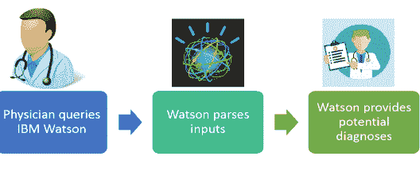
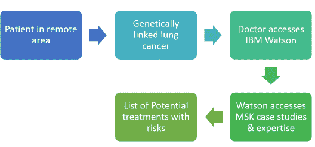

# 医疗保健中的大数据:Hadoop 如何革新医疗保健分析

> 原文：<https://www.edureka.co/blog/hadoop-big-data-in-healthcare>

*“80% of all healthcare information is unstructured data which is so large and complex that there is dire need for a specialized tool and methods to handle it and derive insights from the data.”*

**医疗保健数据是当今世界上产生的最复杂、最庞大的数据之一。躺在这一大堆医疗保健数据中的是宝贵的见解，可以直接影响和改善人类生活的质量。虽然直到十年前我们还缺乏分析这些数据的手段，但大数据分析的进步已经使医疗保健分析成为今天的独特现实！**

**在这篇博文中，让我们来看看大数据分析可以在医疗保健领域解决的问题。让我们再来看几个医疗保健领域大数据分析应用的案例研究以及所使用的工具。在开始阅读本文之前，请从 [Hadoop 认证](https://www.edureka.co/big-data-hadoop-training-certification)中了解所有关于大数据的信息**

## **为什么要在医疗保健领域进行大数据分析？**

**在医疗保健领域应用大数据分析的最大好处是:**

***   流行病的早期发现和检查*   准确检测和治愈治疗成功率低的疾病*   基于基因组学和患者特征分析的新疗法的发现*   保险和医疗索赔欺诈的预防*   提高医疗机构的盈利能力**

**可穿戴设备的出现使得医疗数据的收集比以往任何时候都更容易。从跟踪健身数据到老年护理和重症监护，可穿戴技术彻底改变了医疗保健领域的数据收集。事实上,《2016-2020 年全球互联健康市场报告》预测，在 2016-2020 年期间，全球互联健康市场将以 26.54%的 CAGR 增长！**

**这样收集的数据可以使用 Hadoop 存储，并使用 MapReduce 和 Spark 进行分析。**

## **医疗保健领域的大数据——使用案例**

**近年来，医疗保健领域最著名的大数据实施之一是 IBM Watson，这是一个用于医疗保健分析的强大认知计算平台。它配备了自然语言功能、假设生成和基于证据的学习，以支持医疗专业人员做出决策。你甚至可以通过 [数据工程课程](https://www.edureka.co/microsoft-azure-data-engineering-certification-course) 了解大数据的细节。**

**这就是医生如何使用 Watson 来帮助诊断和治疗患者:**

****

****步骤 1** **:** 医生提出询问，描述患者的症状和相关因素。**

****步骤 2:** Watson 通过挖掘可用的患者数据来分析输入的相关因素，如家族病史、药物治疗、测试报告等。并且还考虑医生笔记、临床研究、研究文章和其他类似的数据。**

****步骤 3:** Watson 列出一个诊断列表，并给出相应的分数，表明每个假设的置信度。这有助于医生和患者做出更加明智和准确的决定。**

### **循证诊断-实施:**

**IBM Watson 的一个众所周知的应用是 IBM 与纽约州纪念斯隆-凯特琳癌症中心(MSK)合作开发的用于肿瘤学的'**Watson**'应用。**

***   前提:应用程序构建的基本前提是——MSK 肿瘤学家是某些类型癌症的知名专家。如果 IBM Watson 可以被训练成具有他们的专业知识，那么世界任何角落的任何医生都可以获得这些知识。**

***   **计划:**Watson for Oncology 应用程序是一个一站式的精英癌症护理应用程序，可以在 iPad 或其他平板电脑上运行。**

***   **应用:**让我们假设一个病例，一个住在亚洲偏远角落的病人患有一种罕见的与基因有关的肺癌。患者接受治疗的医院的医生可能没有必要的专业知识来治疗这种特殊的肺癌，但肿瘤学沃森在 MSK 癌症中心数据的帮助下做到了。**

****

**该应用程序的意义深远，因为世界任何地方的任何医生都可以通过获得该程序的许可证来访问该应用程序，并为他们的患者提供世界级的癌症治疗。这就是医疗保健分析的魔力，源于对医疗保健大数据的访问！你甚至可以在浦那 用 [数据工程认证查看大数据的细节。](https://www.edureka.co/microsoft-azure-data-engineering-certification-course-pune)**

**您可以在这里 找到更多与预测分析和循证治疗相关的用例 [。](http://www.ibm.com/analytics/us/en/case-studies.html)**

## **Hadoop 在医疗保健分析中的作用**

**Hadoop 是许多医疗保健分析平台中使用的底层技术。这是因为，Apache Hadoop 非常适合处理庞大而复杂的医疗保健数据，并有效应对困扰医疗保健行业的挑战。使用 Hadoop 处理医疗保健领域的大数据的几个理由是:**

***   **<u>Hadoop 让数据存储成本更低，可用性更高:</u>****

**目前，80%的医疗保健信息是非结构化数据。这包括医生笔记、医疗报告、实验室结果、x 光、核磁共振成像、生命体征和财务数据等。Hadoop 为医生和研究人员提供了从以前不可能处理的数据集中发现见解的机会。**

***   **<u>存储容量和处理:</u>****

**大多数医疗保健组织只能为每位患者存储不超过三天的数据，这限制了对生成的数据进行分析的机会。Hadoop 可以存储和处理海量数据，这使得它成为这项工作的理想候选。**

***   **<u>Hadoop 可以作为数据组织者，也可以作为分析工具:</u>****

**Hadoop 帮助研究人员在具有许多变量的数据集中找到相关性，这对人类来说是一项艰巨的任务。这就是为什么它是处理医疗保健数据的正确框架。**

**这是大数据分析在医疗保健领域的应用演示。这个 MapReduce 演示程序将帮助你编写一个程序，可以从一个拥有 1 亿张图像的数据库中删除重复的 CT 扫描图像。一步一步的程序、方法和解决方案可以在这个视频教程中找到。**

**[https://www.youtube.com/embed/slUxFcdWTpw](https://www.youtube.com/embed/slUxFcdWTpw)

这只是大数据分析帮助解决重大医疗保健问题并有助于有效检测和预防疾病的众多实例之一。Hadoop 在分析海量数据集以预防和及时治疗慢性疾病方面极其重要。在医疗保健中使用大数据分析存在巨大的未开发机会，现在正是 Hadoop 专业人员挺身而出迎接挑战的时候！

*Edureka 有一个关于大数据& Hadoop 的现场指导课程，由行业从业者共同创建。从钦奈的[大数据培训中了解更多信息。](https://www.edureka.co/big-data-hadoop-training-certification-chennai)*

有问题要问我们吗？请在评论区提到它，我们会给你回复。

**相关帖子:**

[2016 年十大热门科技技能掌握](https://www.edureka.co/blog/10-hottest-tech-skills-in-2016/)

[大数据助力 2016 里约奥运会](https://www.edureka.co/blog/big-data-powers-rio-olympics-2016/)**