# 使用 Sqoop 从 Oracle 到 HDFS

> 原文：<https://www.edureka.co/blog/hdfs-using-sqoop/>

1.从以下链接下载 Oracle Expresss 版本，并将其解压缩。

https://docs.google.com/a/edureka.in/file/d/0B2-rlCGKD40NNW5BcHZMTkdtcmc/edit

2.解压缩后，您会发现一个 Oracle XE Edition 的可执行文件，如下图所示。

[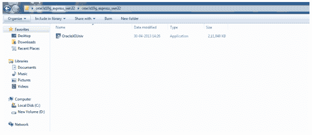](https://cdn.edureka.co/blog/wp-content/uploads/2014/03/621.png)

3.双击 OracleXEUniv 在您的系统上安装 Oracle 数据库，然后单击 Run。

[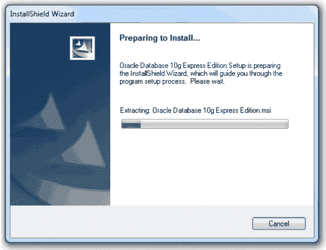](https://cdn.edureka.co/blog/wp-content/uploads/2014/03/631.png)

4.点击下一步

[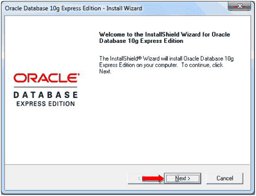](https://cdn.edureka.co/blog/wp-content/uploads/2014/03/641.png)

5.接受许可协议，然后单击下一步。

6.默认情况下，oracle 将 system 作为数据库名称。让我们输入密码

对于这个数据库。

输入密码–>系统

确认密码–>系统

单击下一步:

[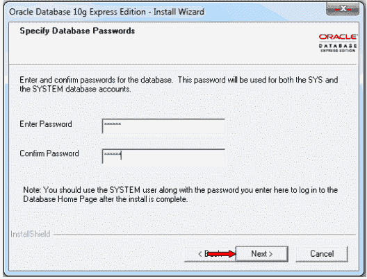](https://cdn.edureka.co/blog/wp-content/uploads/2014/03/661.png)

7.点击安装

 

8.点击完成

[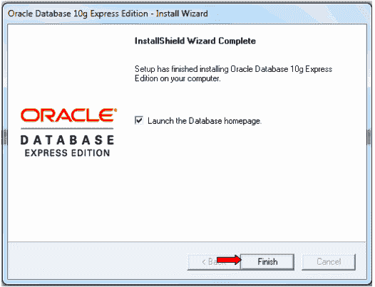](https://cdn.edureka.co/blog/wp-content/uploads/2014/03/691.png)

9.让我们编辑文件夹中的 sqlnet.ora 文件

c:Oracle xepporacleproduct . 2.0 server network admin

当你打开它，你会发现下面的内容。

编辑它，如下图所示

10.让我们启动 Oracle 的 SQL 命令行。

转到开始菜单->所有程序-> Oracle 数据库 10g 快捷版->

运行 SQL 命令行并双击它。

11.您将获得 Oracle 数据库的命令行界面。

[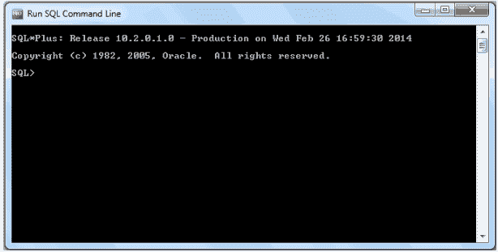](https://cdn.edureka.co/blog/wp-content/uploads/2014/03/731.png)

12.让我们连接到 Oracle 数据库。

用户名:系统

密码:系统

您将收到成功连接的消息。

13.让我们创建一个简单的表。

命令:

创建表 emp (id 号)；

[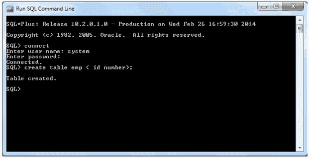](https://cdn.edureka.co/blog/wp-content/uploads/2014/03/751.png)

14.让我们使用 insert 命令在其中插入一些值。

命令:

插入 emp 值(2)；

[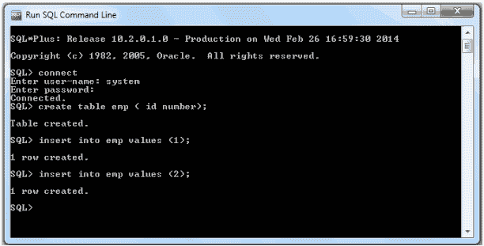](https://cdn.edureka.co/blog/wp-content/uploads/2014/03/761.png)

15.让我们使用 Select 命令检查数据是否被插入到表中。

命令:

select * from emp

[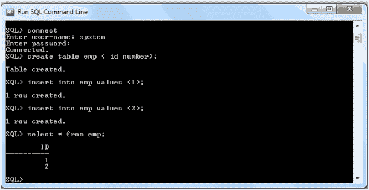](https://cdn.edureka.co/blog/wp-content/uploads/2014/03/771.png)

16.让我们提交数据。

命令:

提交；

17.为了将数据从 Oracle 数据库导入到 Sqoop，我们需要添加

Oracle 连接器(ojdbc6_g.jar)。

你可以从下面的链接下载这个 jar。

https://docs.google.com/a/edureka.in/file/d/0B2-rlCGKD40Nekw3ZXBRWUU5Y1E/edit

18.打开 Cloudera cdh3，使用 FileZilla 将 Oracle connector 迁移到 Cloudera cdh3(到桌面)。

使用以下链接了解如何将文件从 Windows 移动到 cloudera cdh3 vm。

https://www.edureka.co/blog/transfer-files-windows-cloudera-demo-vm/

19.一旦 Oracle 连接器出现在 Cloudera Cdh3 桌面上，就将其移动到

通过执行以下命令来执行 sqoop:

命令:

sudo CP/home/cloudera/Desktop/OJ DBC 6 _ g . jar/usr/lib/sq OOP/lib/

20.通过执行以下命令，将目录更改为 Sqoop:

命令:

cd /usr/lib/sqoop/

21.在 Windows 上打开命令提示符(CMD)并检查 **IPv4 地址**

通过执行

以下命令:

命令:

用于查看本机的 IP 信息

[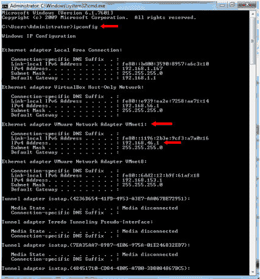](https://cdn.edureka.co/blog/wp-content/uploads/2014/03/811.png)

22.通过执行以下命令，将 Oracle 数据库中的表 emp 的数据导入 hdfs

命令:

命令所需的项目:

IPv4 地址–您的 IPv4 地址。我的情况是 192.168.46.1

数据库名称–系统

表名–EMP

用户名-系统

密码-系统

输出目录–可以是任何目录。我用过 sqoopoutput1

命令:

sudo bin/sqoop 导入–连接 jdbc:oracle:thin:system/

系统@192.168.46.1:1521:xe

–用户名 system-P–表 system . EMP–列“ID”–目标目录/

sqoopoutput1 -m 1

[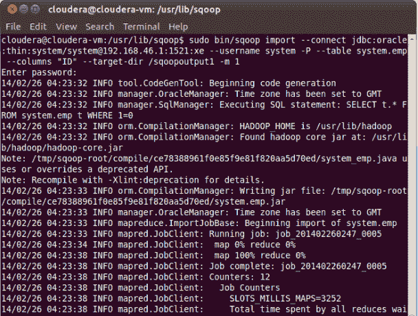](https://cdn.edureka.co/blog/wp-content/uploads/2014/03/831.png)

23.当命令成功执行时，您将收到消息

检索的记录如下图所示。

[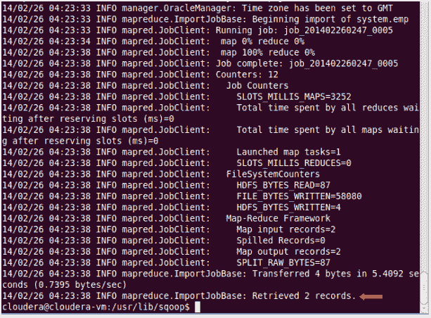](https://cdn.edureka.co/blog/wp-content/uploads/2014/03/841.png)

24.打开浏览器并转到以下 URL:

URL:http://localhost:50070/DFS health . JSP

点击浏览文件系统

[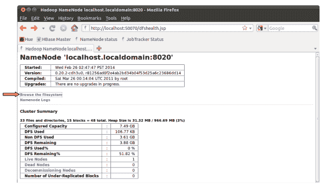](https://cdn.edureka.co/blog/wp-content/uploads/2014/03/861.png)

25.点击 sqoopoutput1 目录

[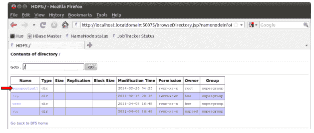](https://cdn.edureka.co/blog/wp-content/uploads/2014/03/871.png)

26.点击零件-m-00000 文件:

27.下面是从 Oracle 数据库导入的数据:

恭喜你！您已成功从 Oracle 数据库导入数据

使用 Sqoop 到 HDFS..！