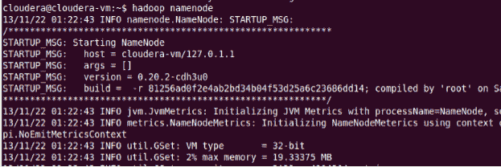

# 有用的 Hadoop Shell 命令

> 原文：<https://www.edureka.co/blog/helpful-hadoop-shell-commands-2/>

HDFS 代表“**H**adoop**D**distributed**F**ile**S**system”。HDFS 是 Apache Hadoop 项目的一个子项目。这个 Apache Software Foundation 项目旨在提供一个容错文件系统，该系统设计用于在商用硬件上运行。HDFS 是通过一组 shell 命令访问的，这将在本文中讨论。

*开始之前的简短说明:所有 Hadoop Shell 命令都是由 bin/hadoop 脚本调用的。*

## **用户命令:**

*   **运行 DFS 文件系统:**

用法:Hadoop fsck –/

*   Hadoop 的 C **heck 版本**:

用法:Hadoop 版本

## **FS Shell 命令:**

Hadoop fs 命令运行与 MapR 文件系统(MapR-FS)交互的通用文件系统用户客户端。

*   **查看文件列表:**

用法:hadoop fs -ls hdfs :/

*   **检查内存状态:**

用法:hadoop fs -df hdfs :/

*   **指定路径和文件模式下的目录、文件和字节数:**

用法:hadoop fs -count hdfs :/

*   **将文件从一个位置移动到另一个位置:**

用法:-mv

*   **将文件从源复制到目的地**:

用法:-cp

*   **删除文件:**

用法:-RM〔t0〕

*   **将文件从本地文件系统放入 Hadoop 分布式文件系统:**

用法:-put <localsrc>…</localsrc>

*   **将文件从本地复制到 HDFS:**

用法:-copyFromLocal <localsrc>…</localsrc>

*   **在 Hadoop 分布式文件系统中查看文件**:

用法:-cat

## **管理命令:**

*   **格式化 namenode** :

用法:Hadoop NameNode-格式

*   **启动辅助命名节点:**

用法:hadoop secondrynamenode

*   **运行 namenode** :

用法:hadoop namenode

*   **运行** **数据节点**:

用法:hadoop datanode

*   **集群平衡**:

用法:hadoop 平衡器

*   **运行 MapReduce 作业跟踪器节点:**

用法:hadoop jobtracker

*   **运行 MapReduce 任务跟踪器节点:**

用法:hadoop tasktracker

有问题要问我们吗？请在评论区提及它们，我们将会回复您。

**相关帖子:**

[大数据和 Hadoop 入门](https://www.edureka.co/big-data-and-hadoop)

[Hadoop 集群配置文件](https://www.edureka.co/blog/hadoop-cluster-configuration-files/)

[阿帕奇猪](https://www.edureka.co/blog/operators-in-apache-pig/)