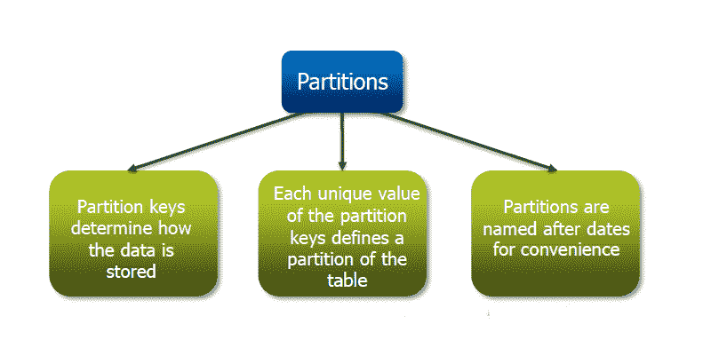

# Hive 数据模型

> 原文：<https://www.edureka.co/blog/hive-data-models/>

[//www.youtube.com/embed/r_k4zkT7Z5o](//www.youtube.com/embed/r_k4zkT7Z5o)

Hive 是一个用于 Hadoop 的数据仓库系统，它可以简化数据汇总、即席查询以及存储在 Hadoop 兼容文件系统中的大型数据集的分析。Hive 将数据组织成众所周知的数据库概念，如表、行、列和分区。它支持整数、浮点、双精度和字符串等基本类型。Hive 还支持关联数组、列表、结构，并使用序列化和反序列化 API 将数据移入和移出表。

*我们来详细看看 Hive 数据模型；*

## **蜂巢数据模型:**

配置单元数据模型包含以下组件:

*   数据库
*   表格
*   分区
*   桶或簇

## **分区:**

分区意味着根据分区列(如“数据”)的值将表划分为粗粒度的部分。这使得对数据切片进行查询变得更快

那么，隔断的作用是什么呢？分区键决定了数据的存储方式。这里，分区键的每个唯一值定义了表的一个分区。为了方便起见，分区以日期命名。这类似于 HDFS 的“块分割”。

## **水桶:**

存储桶为数据提供了额外的结构，可用于高效的查询。在相同列(包括联接列)上分桶的两个表的联接可以实现为映射端联接。按已用 ID 分桶意味着我们可以通过在整个用户集的随机样本上运行基于用户的查询来快速评估它。

有问题要问我们吗？请在评论区提及它们，我们将会回复您。

**相关帖子:**

[大数据和 Hadoop 培训](https://www.edureka.co/big-data-and-hadoop)

[义气蜂巢](https://www.edureka.co/blog/hive-commands-with-examples "HIVE COMMANDS")

[创建你的第一个蜂巢脚本。](https://www.edureka.co/blog/apache-hadoop-hive-script/ "Apache Hadoop : Create your First HIVE Script")