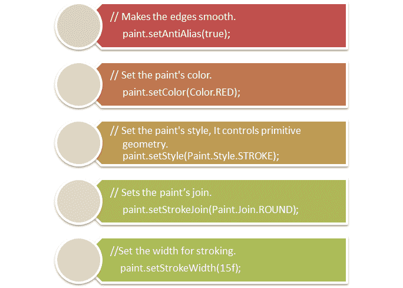
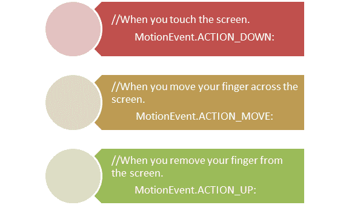

# 如何用 5 个简单的步骤创建 Android 应用程序！

> 原文：<https://www.edureka.co/blog/how-to-create-android-apps/>

### 适用于 Android 的画笔应用程序

所以，你听说了 [Android 开发技能将有助于拓宽你的工作前景](https://edureka.co/blog/reasons-to-learn-android-development/ "Reasons to learn Android Development")，并且想知道从哪里开始。下面是一个分步指南，帮助你使用 Eclipse IDE 创建 Android 应用程序(基本的画刷应用程序)。

观看以下视频，预览在教程中创建的画笔应用程序:

[https://www.youtube.com/embed/enjvfg2BA6A?version=3&rel=1&fs=1&autohide=2&showsearch=0&showinfo=1&iv_load_policy=1&wmode=transparent](https://www.youtube.com/embed/enjvfg2BA6A?version=3&rel=1&fs=1&autohide=2&showsearch=0&showinfo=1&iv_load_policy=1&wmode=transparent)

#### **1。明白自己要创造什么！**

上面的视频可能已经解决了这个问题！:)这个应用类似于 windows 中的[画图工具，除了更高级的功能。它是这样工作的:](http://windows.microsoft.com/en-US/windows-vista/Paint-tools "Windows Paint")

*   通过触摸在屏幕上画任何东西。
*   按下“清空屏幕”按钮清空屏幕。

看起来很简单，对吧！我们开始吧。

#### **2)获取 Android 开发工具！**

#### 

#### 

#### 创建 Android 应用程序需要什么？

Java 的基础知识

2) Eclipse IDE *(多亏了 Eclipse IDE，创建 Android 应用程序不再像以前那么麻烦了。节省了开发者大量的时间)*。

该应用程序将运行在 Android 2 . 3 . 3(姜饼)或更高版本。

#### **我没有月食，怎么办？**

[下载 Edureka 提供的免费 Android 安装指南](# "Android Installation Guide")来安装 Eclipse 和其他 Android 开发工具。

#### **3)了解应用程序结构！**

好了，现在我们已经看到了应用程序的用户界面，让我们继续看看幕后发生了什么。

#### **绘画类**

我们使用了 Paint 类，它保存了关于如何绘制几何图形、文本和位图的样式和颜色信息。

*   #### **绘制对象**

    Paint 对象在这里表示“画笔”。

*   #### **本体事件**

    安卓设备非常重要的输入法。触摸事件提供了解释触摸屏上手指活动的能力。

*   #### **运动事件**

    它用于报告移动，因此是触摸事件的基类。

*   #### **getX()和 getY()**

    用于获取当前位置。

*   #### **onDraw()**

    你得到一个 Canvas 对象，它允许你在上面执行绘图操作，例如画直线、圆、文本和位图。

#### 要创建 Android 应用程序，要知道让它们工作的代码！

终于到了把手弄脏的时候了！[下面是画笔应用程序](# "Code for Drawing brush application")的代码:

#### **5)了解您将用于创建 Android 应用的操作:**

#### 如何运行这个应用程序？

**第一步:** [**点击此处下载**代码。](https://docs.google.com/file/d/0B6eq-6G8feRId2E3aC1lbF9KSlE/edit?pli=1 "Drawing Brush application for Android")

第二步: **使用 *WinRAR* 或类似工具提取**它。

第三步:如果你有一部安卓手机，只需**安装**即可。您可以在 drawing brush _ Circle _ clearscreen button 中找到的 apk 文件

**第四步:** **要将其导入 Eclipse** ，只需将文件夹复制到您的 Eclipse 工作区。

1)选择文件->导入

2)展开常规文件夹。

3)选择工作空间中的现有项目

4)点击“下一步”,浏览您的工作空间，询问“选择根目录”。

5)单击完成。

所有设置，你现在可以在你的模拟器中运行它。

快走吧。:)如果你还没有创建 Android 应用程序，现在是时候了。如果您需要更多帮助，[立即注册参加免费的 Android 开发基础课程](https://www.edureka.co/android-development-certification-course "Android Development Tutorials")。

快乐学习！

#### **你可能也会喜欢这些相关的帖子:**

*   [安卓项目:Droid Remote](https://www.edureka.co/blog/android-tutorials-intent-component/ "Android Tutorials for Beginners-2: Android Intent")
*   [Android 初学者指南:Android 架构](https://www.edureka.co/blog/beginners-guide-android-architecture/ "The Beginner’s Guide to Android: Android Architecture")
*   应对软件公司第一次校园面试的 12 个技巧
*   如何创建 Android Widgets:Android 中的 RatingBar