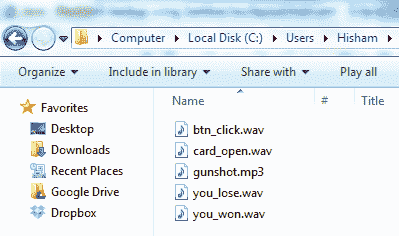
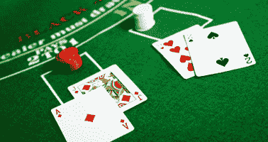
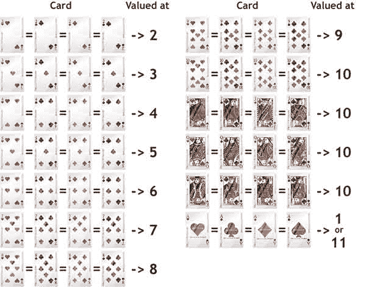
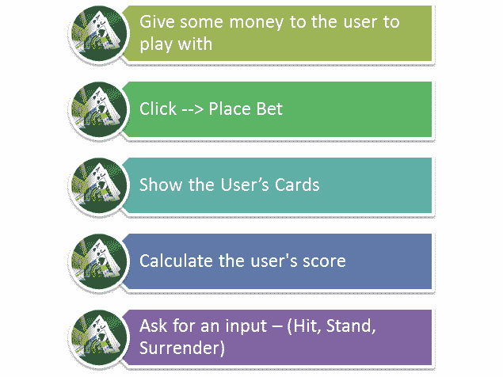

# 如何创建 Android 游戏:21 点应用程序

> 原文：<https://www.edureka.co/blog/how-to-create-android-games-blackjack/>

我们希望你在上周使用 Edureka 的教程构建了 [画刷 Android 应用](https://edureka.co/blog/how-to-create-android-apps/ "Drawing Brush Android app tutorial") 后玩得开心！所以，你现在想创作安卓游戏，是吗？很好，这里有一个教程可以帮助你创建 Android 游戏(具体来说是 21 点)。由于对 ***[Android 认证开发者](https://www.edureka.co/android-development-certification-course)*** 的需求正在飞速上升，开发一款 Android 游戏应该是 Android 开发的一个不错且有趣的开始。

要创建 Android 游戏，你必须了解它们是如何运行的。此视频将帮助您了解我的 21 点应用程序是如何运行的:

[https://www.youtube.com/embed/PK0ABLwjTJc](https://www.youtube.com/embed/PK0ABLwjTJc)

### 如何创建 Android 游戏:先决条件

#### **1。技能**

以下是创建 Android 游戏所需的技巧:

*   Java 的基础知识
*   良好的 Android 编程知识
*   一个程序员的心思！

#### **2。资源:**

**i) Eclipse IDE:** 如果你还没有 Eclipse， [下载这个免费指南帮你设置。](#)

[contact-form-7 id=”773″ title=”FREE Android Installation Guide Download”]

#### **ii)纸牌的图像**

**iii)声音片段**喜欢–咔哒声、洗牌声、赢输时播放的片段。

下面是我用的声音片段截图。:)

好了，现在你已经拥有了创建一个基本的 21 点游戏所需要的一切，让我们开始吧！

#### 第一步:熟悉游戏

在开发任何应用程序之前，程序员需要了解他想要构建什么。所以，

*   玩几次这个游戏
*   确保你知道游戏规则

[这个维基百科链接会帮助你熟悉游戏](http://en.wikipedia.org/wiki/Blackjack "Black Jack Game rules") 。

对于那些急着投入并创建 Android 游戏的人，这里有一个快速概述:

#### **1。游戏的基本前提:**

*   这是一个玩家和庄家之间的比较纸牌游戏

*   你想要一手比庄家更接近 21 的**牌。但是，请记住，**你不希望你的手牌值超过 21** 。**

#### **2。卡的值:**

#### I)a 点的值:

*   Ace 的值可以是“1”或“11”。
*   其默认值为 11。
*   如果:总*、【手牌值】*超过 21 *或*(如果你手里有两张 a*(当然，这种情况下手牌值也会超过 21)*，则计为 1。

示例:

**情况 1:** (A，7)的手牌值为 18

**案例二:** (A，7，8)手牌值 16。

在案例 1 中，Ace 的值为*‘11’*，而在案例 2 中，Ace 的值为*‘1’*。

**ii)卡片“2”到“9”:**卡片 2 到 9 按其面值标记。

**iii) 10，杰克，皇后，国王**都是以‘10’估值。

#### **3。手牌价值/一手牌的价值**

一手牌的价值仅仅是手中每张牌点数的总和。例如，包含(5、7 和 8)的手牌的值为 20。

#### **4。玩家移动(这些是点击按钮时的动作)**

*   **击**——表示你想抽另一张牌。
*   **停止**–表示您停止在当前总数。
*   **投降**–你将输掉手中赌注的一半。

很好，你已经很了解外行的部分了。不算太寒酸，嗯！

现在让我们来谈技术问题，好吗？

#### 第二步:游戏的算法！

既然你将(希望)一直创作 Android 游戏，你需要把逻辑搞对。因此，最重要(尽管令人沮丧)的步骤是编写算法。相信我；最初我很难创建这个算法。如果一开始看起来有点棘手，不要灰心丧气。当你掌握了窍门，它会变得更好。

我在编码的时候写了算法的一些基本步骤。我希望这能让你的任务轻松一点。

#### **1。构建用户界面**

在这里，您可以:

*   向用户展示卡片
*   在布局中放置按钮和文本视图
*   命名这些控件按钮的 id 和文本(稍后您将需要它们)

下面是我的应用程序的用户界面截图。

#### **2。游戏是这样运行的:**

#### **3。电脑会怎么下他的棋？**

这里所有的游戏爱好者都会同意，这部分通常定义了任何游戏的质量。

创建伟大的 Android 游戏的关键是保持逻辑简单: ***计算机会一直抽牌，直到它的分数小于 17 或者小于‘或者’等于用户的分数。***

#### 第三步:开始编码

拉紧你的安全带，因为这将是一次艰难的旅程！:)

*   资源:将项目中的所有资源放在手边:
    *   卡片图像
    *   声音剪辑

*   **用户界面:**创建类似上图 UI 截图的基本布局。
*   **做小模块:**在编码的时候总是做小的可复用模块。
*   **实现一个模块:**运行它——检查它是否有错误。
*   纠正你的错误:你解决的错误越多，你就离目标越近。

#### **使用的 Java 类:**

**抽卡逻辑:**

**1)Java 的随机类:**游戏中的卡是随机抽取的。为此，我使用了 Java 的随机类**。**

2)用数字绑定卡片:这个随机的 Java 类处理数字，所以我们需要用数字绑定卡片的图像。例如:

0-梅花 a

1-梅花国王

2-梅花皇后

3-梅花 j

梅花 4-10，依此类推。

你最终会得到 52 张卡片图像和 52 个数字。

这是我用过的。您没有必要按照这种严格的顺序来绑定图像。你总是可以用你自己的逻辑。

Random _ Random = new Random()；

_ random . nextint(52)；**会给你一个 0 到 51 之间的随机数。**

**3)运行逻辑:**向用户展示与该号码相关的图像。例如，(根据我使用的顺序)如果随机数是 2，用户得到一个梅花皇后。

4)创建一个所有号码的列表:创建一个所有号码的列表，以确保没有卡出现两次。*(如果用户两次拿到同一张卡，你所有的努力都是徒劳的)。*

#### **评分逻辑**

**1。用于计分的独立模块:**为了计分，你需要一个独立的模块，它将根据你通过 _random.nextInt(52)得到的卡返回一个 1 到 11 之间的数字；

例如:如果这张牌是皇后，返回一个数字 10

**2。创建一个单独的列表**来存储这些分数。

我使用了两个不同的数组来存储分数:

//庄家和玩家得分计数

int[]_ dealerScoreCount = new int[]{ 0，0，0，0，0 }；

int[]_ playerScoreCount = new int[]{ 0，0，0，0，0 }；

#### **3。一手后清空列表:**

完成一手后:

*   清空你所有的列表
*   将您的卡片图像重置为原始图像
*   重置分数(用户和电脑的)

为了避免变得复杂:

*   制作 emptyLists()、resetImages()、resetScore()等函数，在一手完成后调用它们。

记得我早些时候建议你们制作更小的模块。你现在会感受到搬家的好处。

那么，你们觉得现在可以自己创作 Android 游戏了吗？如果你有丝毫的怀疑， [在这里报名参加我们的免费课吧！](https://edureka.co/courses/description/android-for-beginners "Demo class for Android development")

如果您希望我们通过电子邮件向您发送更多 Android 编程技巧，请在此免费注册。请继续关注如何创建 Android 游戏的更多内容！:)

快乐学习！

***资源:** [维基](http://www.wikipedia.org/ "Wikipedia") ，[【abccounter.com】](http://www.abccounter.com/ "Blackjack Game rules")。*

**你可能也喜欢这些相关的帖子:**

*   [如何创建 Android Widgets:自定义吐司](https://www.edureka.co/blog/android-tutorial-custom-toast/ "How to create Android Widgets:Custom Toast")
*   [Android 初学者教程第一部分:活动组件](https://www.edureka.co/blog/android-tutorials-for-beginners-activity-component/ "Android Tutorials for Beginners Part-1: Activity component")
*   [【Android 初学者指南:Android 架构](https://www.edureka.co/blog/beginners-guide-android-architecture/ "The Beginner’s Guide to Android: Android Architecture")