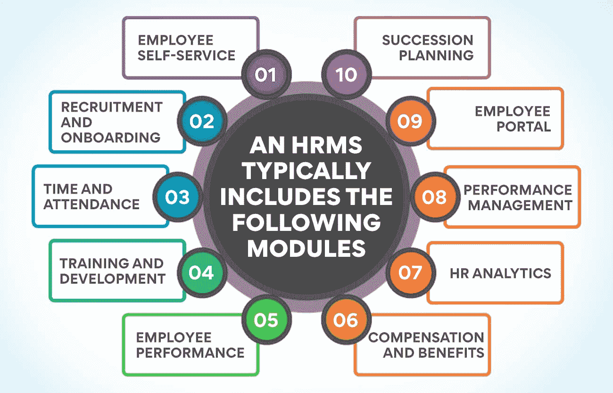
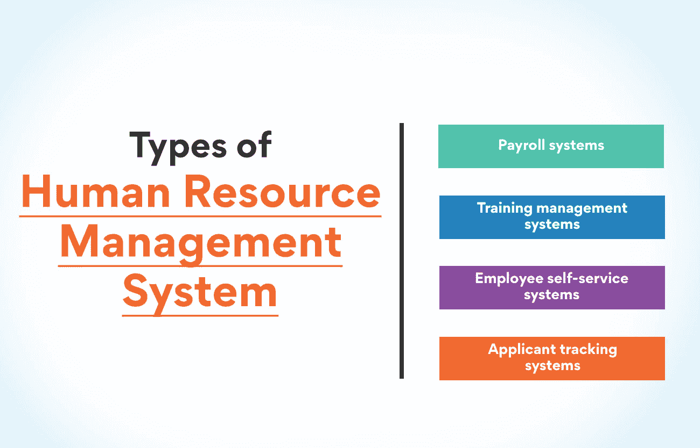

# 什么是人力资源管理系统？

> 原文：<https://www.edureka.co/blog/human-resource-management-system/>

如果你在经营一家企业，你知道人力资源是你成功的关键。有效地管理你的员工是至关重要的，这就是人力资源管理系统派上用场的地方。这是一个软件应用程序，旨在帮助企业管理员工信息。它可以包括薪资处理、福利管理、招聘和培训模块等功能。

本博客将讨论人力资源管理系统的基础知识，以及它们如何帮助你的企业更高效地运营！

## **人力资源管理系统(HRMS):概述**

HRMS ( 人力资源管理系统)是一个帮助组织管理员工数据的系统解决方案。HRMS 系统简化并自动化了各种人力资源流程，包括入职、行政管理、绩效管理等。

HRMS 的众多优势之一是它可以帮助组织在一个中心位置跟踪员工数据。它可以使经理更容易地访问员工信息和运行报告。此外，HRMS 可以自动执行许多耗时的任务，如计算工资税和生成收益表。

如果您的组织正在考虑实施 HRMS，那么选择一个符合您特定需求的系统至关重要。市场上有各种各样的 HRMS 系统，因此您必须进行研究并选择一个适合您组织的系统。

**HRMS 的历史:沿着记忆的小路**

HRMS 是一个软件应用程序，管理一个组织的人力资源部门的行政职能。HRMS 早期的先驱者旨在帮助组织跟踪员工信息，管理工资和福利。今天，各种规模的组织都在使用 HRMS 系统来管理他们的人力资源。

人力资源管理系统 (HRMS)已经以这样或那样的形式存在了几个世纪。HRMS 的历史可以追溯到人力资源第一次成为组织中的正式职能的时代。HRMS 早期的安排旨在帮助组织跟踪员工信息，管理工资和福利。在 20 世纪 70 年代和 80 年代，HRMS 系统发展到包括员工自助服务和绩效管理功能。如今，各种规模的组织都在使用 HRMS 系统来管理人力资源。

最早的 HRMS 系统开发于 20 世纪 70 年代末，当时企业开始使用计算机存储员工数据。这些早期的系统主要用于记录和跟踪员工信息，如地址、电话号码和出生日期。

在 20 世纪 80 年代，HRMS 系统发展成为帮助组织更有效地管理员工的工具。这些系统包括员工自助服务门户和在线福利登记等功能。

如今，HRMS 系统更加复杂，提供各种特性和功能来帮助组织更有效地管理人力资源。一些最受欢迎的 HRMS 功能包括申请人跟踪、员工自助服务、时间和出勤跟踪以及绩效管理。

你知道吗，了解 HRMS 对你的人力资源职业生涯会很有帮助。要想成为一名熟练且负责任的人力资源，你必须详细了解 HRMS。我们提供详细的 PG 证书课程，将带您了解人力资源管理的每个重要方面。想分一杯羹专业？查看我们的[人力资源管理研究生证书](https://www.edureka.co/highered/human-resourse-management-course-iim-shillong)。快点，我们马上就要关闭 11 月份的批次了！

**为什么人力资源管理系统至关重要？**

人力资源管理对任何企业或组织来说都是必不可少的。这有助于确保劳动力得到适当的管理和利用。此外，人力资源管理有助于改善公司内部的沟通和协调。通过建立有效的人力资源管理系统，企业可以节省时间和金钱，同时提高员工士气。

人力资源管理系统可以帮助企业跟踪员工信息、绩效和出勤情况。此外，人力资源管理系统可以帮助自动化许多与人力资源管理相关的任务，如工资和福利管理。通过使用人力资源管理系统，企业可以更有效地管理人力资源，提高整体效率。

**也读作:[人力资源管理的关键目标](https://www.edureka.co/blog/objectives-of-human-resource-management/)**

**跟踪员工信息**

HRMS 的一个重要好处是，它允许经理在一个中央系统中跟踪员工信息。它包括员工联系信息、职位和描述、绩效评估和出勤记录。这些数据在做出晋升、加薪和纪律处分等决策时非常宝贵。

**改善沟通和协作**

通过为员工信息提供一个中央存储库，HRMS 可以改善组织的沟通和协作。它将包括联系信息、工作描述、绩效评估等等。让所有员工都能访问这些信息有助于促进更好的沟通和协作。

**降低成本和降低效率**

HRMS 可以帮助您的组织跟踪员工绩效和对公司政策的遵守情况。通过减少文书工作量，您还可以节省存储和管理成本。此外，HRMS 可以帮助您自动执行时间跟踪、工资单和福利管理等任务。

**自动化许多人力资源流程**

人力资源管理系统是一个管理组织人力资源的技术解决方案。通过自动化许多人力资源流程，HRMS 可以为您的组织节省时间和金钱。HRMS 可以帮助您管理员工数据、招聘新员工、跟踪员工绩效等。这些流程的自动化将最终提高人力资源部门的效率和生产力。

**遵守雇佣法律法规**

人力资源管理系统可以自动化许多与合规性相关的流程和任务。例如，HRMS 可以提醒经理何时员工绩效考核到期或何时必须完成安全培训。HRMS 可以帮助确保您的组织遵守就业法律和法规。

**节省时间和金钱**

该系统是管理员工数据的综合解决方案。它可以帮助您跟踪员工角色和职责、联系信息、工资单和福利。HRMS 可以自动执行许多与人力资源相关的任务，让您有时间专注于更具战略性的计划。它还可以帮助您降低与人力资源管理相关的成本。

**改善经理和员工之间的沟通**

HRMS 通过为员工信息提供一个中央存储库，可以改善经理和员工之间的沟通。它将使经理更容易找到联系信息、查看员工记录和跟踪员工绩效。HRMS 还可以通过发送关于重要截止日期或更新的自动提醒或通知，帮助实现经理和员工之间的自动化沟通。

HRMS 是一个存储员工数据和信息的中央系统。HRMS 的主要目的是简化和自动化人力资源流程，包括招聘、入职、绩效管理和福利管理。有了这些好处，人力资源专业人员可以优化他们的资源。

HRMS 是如何工作的？

HRMS 涵盖了人力资源管理的所有方面，使其无缝衔接。它自动化并简化了人力资源流程，使其更加高效和有效。该系统还提供了管理员工数据、跟踪员工绩效以及改善员工和经理之间沟通的工具。

HRMS 通常包括以下模块:

****

*   **员工自助:** 允许员工更新个人信息，查看和打印工资单，以及申请休假。
*   **招聘和入职:** 自动化招聘流程，从职位发布到聘书生成。
*   **时间和出勤:** 跟踪员工出勤和假期余额。
*   **培训和发展:** 跟踪员工培训记录和认证。
*   **员工绩效:** 管理员工绩效考核和目标设定。
*   **报酬和福利:** 跟踪员工报酬和福利数据。
*   **人力资源分析:** 生成人力资源指标报告，如员工流动率和敬业度。
*   **绩效管理:** 管理员工绩效考核和目标设定。
*   **员工门户:** 为员工提供一个访问所有人力资源信息和工具的中心位置。
*   **继任计划:** 识别高潜力员工并制定发展计划，为他们担任领导角色做准备。

**人力资源管理系统的类型**

人力资源管理系统有各种各样的形式和规模。有许多不同的人力资源管理系统，每一个都有优点和缺点。看看人力资源管理系统的类型:

工资系统: 这些系统帮助企业跟踪员工的工资、假期和其他重要的工资信息。选择一个与你公司的会计软件兼容的工资系统是很重要的。该 HRMS 有助于确保员工按时领取工资，并有效管理他们的工资单信息。

**培训管理系统:** 这些系统帮助企业跟踪员工培训记录，确保所有员工都了解最新的公司程序和政策。培训管理系统还可以帮助企业规划和预算未来的培训需求。

**员工自助服务系统:** 人力资源管理系统帮助员工更新个人信息、查看工资单和请假。这些系统通常通过门户网站访问。

申请人跟踪系统: 这些系统帮助企业跟踪求职者并管理招聘流程。申请人跟踪系统可用于发布职位空缺、跟踪简历和进行面试。

**HRMS Vs HRIS**

如前所述，人力资源管理系统是一个软件应用程序，涵盖了一个组织的[人力资源](https://www.edureka.co/blog/strategic-human-resource-management)的所有方面，从招聘和入职到时间和出勤跟踪。

另一方面，人力资源信息系统(HRIS)是 HRMS 的一个子集，只包含数据和信息管理部分。HRIS 跟踪员工数据，如联系信息、职称、薪资历史记录和绩效考核。

虽然这两个词都可以替换，但 HRMS 和 HRIS 还是有区别的。HRMS 是一个涵盖人力资源所有方面的综合系统，而 HRIS 仅限于员工数据和信息管理。

如果你正在考虑在你的组织中实施人力资源管理系统，了解 HRMS 和 HRIS 之间的区别是很重要的。这样做将有助于您根据自己的需求选择合适的系统。

**也可理解为:[人力资源管理在组织中的作用](https://www.edureka.co/blog/role-of-human-resource-management-in-an-organization/)**

如何确保 HRMS 的严格安全？

HRMS 数据的安全性至关重要。毕竟，它包含了你的员工的敏感信息。为了确保这些数据的安全，您需要选择具有强大安全措施的 HRMS。

关于安全性，HRMS 有几个关键因素需要考虑。首先，您需要确保系统托管在一个安全的服务器上。防火墙和其他安全措施应该可以保护服务器。

另一个需要考虑的重要因素是 HRMS 如何处理数据备份。你需要选择一个能定期自动备份数据的系统。这样，如果系统出现问题，您可以放心，您的数据是安全和健全的。

最后，你需要选择一个 HRMS 来控制谁可以访问你的数据。这意味着您应该能够设置权限并限制对某些系统区域的访问。

考虑到这些因素，您可以确保选择具有可靠安全措施的 HRMS。

**结论**

通俗地说，人力资源管理系统或 HRMS 就是帮助企业管理员工数据的软件。它可用于跟踪员工角色和职责、绩效和技能。一个人力资源管理系统也可以帮助公司自动化工资和福利流程。通过自动化这些流程，企业可以提高效率和节省时间。

HRMS 已经成为各种规模企业的当务之急。它可以增强核心人力资源功能，帮助企业更有效地管理员工数据。企业在选择 HRMS 系统时，应考虑其具体需求和预算。

无论是专业人士还是人力资源管理初学者，都希望自己的职业生涯更上一层楼；大家应该对人力资源管理系统 (HRMS)了如指掌。为了详细了解 HRMS，我们有一个 PG 证书课程可以帮助你。

用[人力资源管理研究生证书](https://www.edureka.co/highered/human-resourse-management-course-iim-shillong)让你的人力资源事业腾飞。今天就来看看课程吧！

**更多信息:**

[分解人力资源管理的范围](https://www.edureka.co/blog/scope-of-human-resource-management/)

[人力资源管理的性质和目标](https://www.edureka.co/blog/nature-and-objectives-of-human-resource-management/)

[人力资源管理的演变:过去和未来](https://www.edureka.co/blog/evolution-of-human-resource-management)

[人事管理人员必备的 11 项技能](https://www.edureka.co/blog/people-management-skills/)

[了解人才管理及其重要性](https://www.edureka.co/blog/talent-management-and-its-importance/)